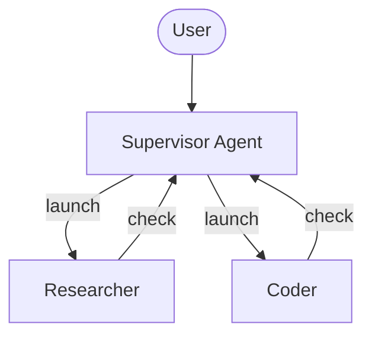
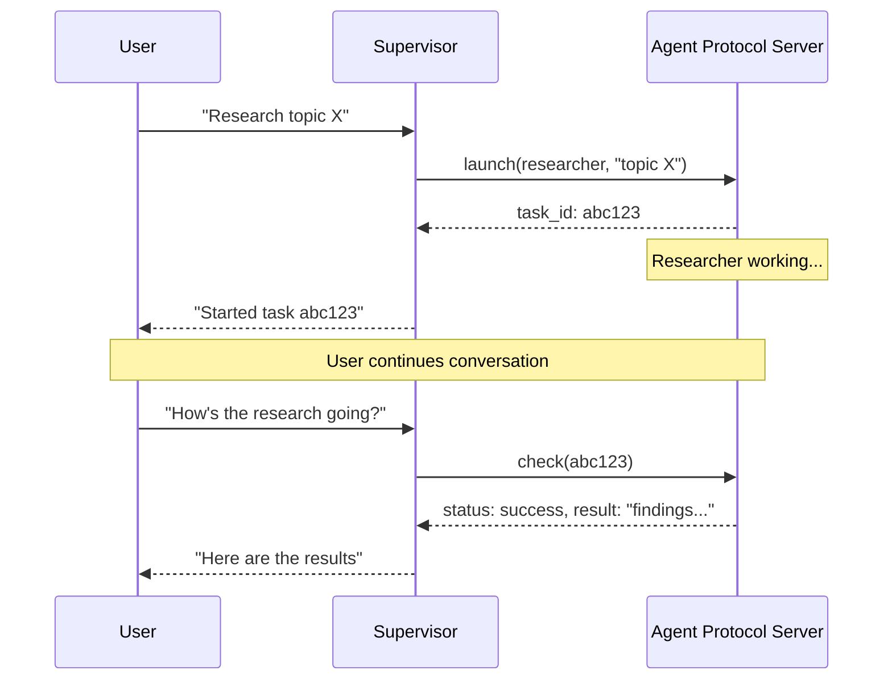

# 异步子智能体


> 启动后台子智能体，在主管继续与用户交互的同时运行


异步子智能体允许主管代理启动立即返回的后台任务，因此主管可以在子智能体同时工作时继续与用户交互。主管可以随时检查进度、发送后续指令或取消任务。


这建立在[子智能体](subagents.md)的基础上，它同步运行并阻止主管直到完成。当任务长时间运行、可并行或需要中途引导时，请使用异步子智能体。


异步子智能体是 `deepagents` 0.5.0 中提供的预览功能。预览功能正在积极开发中，API 可能会发生变化。





 异步子智能体与任何实现[代理协议](https://github.com/langchain-ai/agent-protocol)的服务器进行通信。您可以使用 [LangSmith 部署](https://docs.langchain.com/langsmith/deployment)，或自行托管任何与代理协议兼容的服务器。每个子智能体独立于主管运行，主管通过 SDK 控制子智能体的启动、检查、更新和取消。


## 何时使用异步子智能体


|方面|同步子智能体|异步子智能体|
| -------------------- | --------------------------------------------------------------- | ----------------------------------------------------------------- |
|**执行模型**|主管阻塞直到子智能体完成|立即返回作业ID；主管继续|
|**并发**|并行但阻塞|并行且非阻塞|
|**任务中期更新**|不可能|通过`update_async_task`发送后续指令|
|**消除**|不可能|通过`cancel_async_task`取消正在运行的任务|
|**状态性**|无状态——调用之间没有持久状态|有状态——在交互过程中在自己的线程上维护状态|
|**最适合**|代理在继续之前应等待结果的任务|在聊天中以交互方式管理长时间运行的复杂任务|


## 配置异步子智能体


将异步子智能体定义为 [`AsyncSubAgent`](https://reference.langchain.com/python/deepagents/middleware/async_subagents/AsyncSubAgent) 规范列表，每个规范都指向一个代理协议服务器：


```python
from deepagents import AsyncSubAgent, create_deep_agent

async_subagents = [
    AsyncSubAgent(
        name="researcher",
        description="Research agent for information gathering and synthesis",
        graph_id="researcher",
        # No url → ASGI transport (co-deployed in the same deployment)
    ),
    AsyncSubAgent(
        name="coder",
        description="Coding agent for code generation and review",
        graph_id="coder",
        # url="https://coder-deployment.langsmith.dev"  # Optional: HTTP transport for remote
    ),
]

agent = create_deep_agent(
    model="google_genai:gemini-3.6-flash",
    subagents=async_subagents,
)
```


|场地|类型|描述|
| ------------- | ---------------- | --------------------------------------------------------------------------------------------------------------------------------------------------------------- |
|`name`|`str`|必需的。唯一标识符。主管在启动任务时使用它。|
|`description`|`str`|必需的。该子智能体的作用。主管用它来决定委托给哪个代理。|
|`graph_id`|`str`|必需的。代理协议服务器上的图形 ID（或助理 ID）。对于基于 LangGraph 的部署，这必须与 `langgraph.json` 中注册的图匹配。|
|`url`|`str`|选修的。省略时，使用 ASGI 传输（进程内）。设置后，使用 HTTP 传输到远程代理协议服务器。|
|`headers`|`dict[str, str]`|选修的。用于向远程服务器发出请求的附加标头。用于使用自托管代理协议服务器进行自定义身份验证。|


对于基于 LangGraph 的部署，请在同一 `langgraph.json` 中注册所有图以进行共同部署设置：


```json
{
  "graphs": {
    "supervisor": "./src/supervisor.py:graph",
    "researcher": "./src/researcher.py:graph",
    "coder": "./src/coder.py:graph"
  }
}
```


## 使用异步子智能体工具


配置异步子智能体时，[`AsyncSubAgentMiddleware`](https://reference.langchain.com/python/deepagents/middleware/async_subagents/AsyncSubAgentMiddleware) 包含在 [深度智能体堆栈](customization.md#deep-agents-stack) 中，它为 Supervisor 提供了五个工具：


|工具|目的|退货|
| ------------------- | ----------------------------------------- | ----------------------------- |
|`start_async_task`|启动新的后台任务|任务 ID（立即）|
|`check_async_task`|获取任务的当前状态和结果|状态+结果（如果完成）|
|`update_async_task`|向正在运行的任务发送新指令|确认+更新状态|
|`cancel_async_task`|停止正在运行的任务|确认|
|`list_async_tasks`|列出所有跟踪的任务及其实时状态|所有任务摘要|


主管的法学硕士将这些工具称为任何其他工具。中间件自动处理线程创建、运行管理和状态持久性。


### 了解生命周期


典型的交互遵循以下顺序：





* **Launch** 在服务器上创建一个新线程，以任务描述作为输入启动运行，并返回线程 ID 作为任务 ID。主管将此 ID 报告给用户，并且不会轮询是否完成。
* **检查**获取当前运行状态。如果运行成功，它将检索线程状态以提取子智能体的最终输出。如果仍在运行，它会向用户报告该情况。
* **更新**使用中断多任务策略在同一线程上创建新的运行。先前的运行被中断，子智能体将使用完整的对话历史记录和新指令重新启动。任务 ID 保持不变。
* **取消** 在服务器上调用 `runs.cancel()` 并将任务标记为 `"cancelled"`。
* **List** 迭代所有跟踪的任务。对于非终端任务，它并行从服务器获取实时状态。终端状态（`success`、`error`、`cancelled`）从缓存返回。


## 了解状态管理


任务元数据存储在主管图表上的专用状态通道 (`async_tasks`) 中，与消息历史记录分开。这很重要，因为当上下文窗口填满时，深度智能体会[压缩其消息历史记录](context-engineering.md#summarization)。如果任务 ID 仅存在于工具消息中，则它们会在压缩过程中丢失。专用通道确保主管始终可以通过 `list_async_tasks` 回忆其任务，即使经过多轮汇总也是如此。


每个跟踪的任务都会记录任务 ID、代理名称、线程 ID、运行 ID、状态和时间戳（`created_at`、`last_checked_at`、`last_updated_at`）。


## 选择交通工具


### ASGI运输（共同部署）


当子智能体规范省略 `url` 字段时，LangGraph SDK 使用 ASGI 传输 - SDK 调用通过进程内函数调用而不是 HTTP 进行路由。对于基于 LangGraph 的部署，这要求两个图都注册在同一个 `langgraph.json` 中。


ASGI 传输消除了网络延迟，并且不需要额外的身份验证配置。子智能体仍然作为具有自己状态的单独线程运行。这是推荐的默认值。


### HTTP 传输（远程）


添加 `url` 字段以切换到 HTTP 传输，其中 SDK 调用通过网络传输到远程代理协议服务器：


```python
from deepagents import AsyncSubAgent

AsyncSubAgent(
    name="researcher",
    description="Research agent",
    graph_id="researcher",
    url="https://my-research-deployment.langsmith.dev",
)
```


 对于 LangGraph 部署，身份验证由 LangGraph SDK 使用环境变量中的 `LANGSMITH_API_KEY`（或 `LANGGRAPH_API_KEY`）进行处理。自承载代理协议服务器可能使用不同的身份验证机制。


当子智能体需要独立扩展、不同的资源配置文件或由不同的团队维护时，请使用 HTTP 传输。


## 选择部署拓扑


### 单一部署


单一部署意味着所有代理都使用 ASGI 传输共同部署在同一台服务器上。对于基于 LangGraph 的部署，将所有图注册在一个 `langgraph.json` 中。这是推荐的起点——管理一台服务器，代理之间的网络延迟为零。


### 分体部署


一台服务器上的主管，另一台服务器上的子智能体通过 HTTP 传输。当子智能体需要不同的计算配置文件或独立扩展时使用。


### 杂交种


在混合部署中，一些子智能体通过 ASGI 共同部署，其他子智能体通过 HTTP 远程部署：


```python
from deepagents import AsyncSubAgent

async_subagents = [
    AsyncSubAgent(
        name="researcher",
        description="Research agent",
        graph_id="researcher",
        # No url → ASGI (co-deployed)
    ),
    AsyncSubAgent(
        name="coder",
        description="Coding agent",
        graph_id="coder",
        url="https://coder-deployment.langsmith.dev",
        # url present → HTTP (remote)
    ),
]
```


## 最佳实践


### 调整工人队伍规模以适应当地发展


当使用 `langgraph dev` 在本地运行时，增加工作池以适应并发子智能体运行。每个活动运行都会占用一个工作槽。具有 3 个并发子智能体任务的主管需要 4 个插槽（1 个主管 + 3 个子智能体）。配置不足会导致启动排队。


```bash
langgraph dev --n-jobs-per-worker 10
```


### 编写清晰的子智能体描述


主管使用描述来决定启动哪个子智能体。具体并以行动为导向：


```python
from deepagents import AsyncSubAgent

AsyncSubAgent(
    name="researcher",
    description="Conducts in-depth research using web search. Use for questions requiring multiple searches and synthesis.",
    graph_id="researcher",
)
```


```python
from deepagents import AsyncSubAgent

AsyncSubAgent(
    name="helper",
    description="helps with stuff",
    graph_id="helper",
)
```


### 使用线程 ID 进行跟踪


使用基于 LangGraph 的部署时，每个异步子智能体运行都是标准 LangGraph 运行，在 LangSmith 中完全可见。主管的跟踪显示对 `launch`、`check`、`update`、`cancel` 和 `list` 的工具调用。每个子智能体运行都显示为单独的跟踪，通过线程 ID 链接。使用线程 ID（任务 ID）将主管编排跟踪与子智能体执行跟踪关联起来。


## 故障排除


### 启动后立即进行主管民意调查


**问题**：supervisor在启动后立即循环调用`check`，将异步执行变成阻塞。


**解决方案**：中间件注入系统提示规则来防止这种情况。如果轮询持续存在，请强化主管系统提示中的行为：


```python
from deepagents import create_deep_agent

agent = create_deep_agent(
    model="google_genai:gemini-3.6-flash",
    system_prompt="""...your instructions...

    After launching an async subagent, ALWAYS return control to the user.
    Never call check_async_task immediately after launch.""",
    subagents=async_subagents,
)
```


### 主管报告过时状态


**问题**：主管引用对话历史记录中较早的任务状态，而不是进行新的 `check` 呼叫。


**解决方案**：中间件提示指示模型“对话历史记录中的任务状态始终是陈旧的”。如果这种情况仍然发生，请添加显式指令以在报告状态之前始终调用 `check` 或 `list`。


### 任务 ID 查找失败


**问题**：主管截断或重新格式化任务 ID，导致 `check` 或 `cancel` 失败。


**解决方案**：中间件提示指示模型始终使用完整的任务 ID。如果截断仍然存在，这通常是特定于模型的问题 - 尝试不同的模型或将“始终显示完整任务\_id，从不截断或缩写它”添加到系统提示符中。


### 子智能体启动队列而不是运行


**问题**：启动子智能体挂起或需要很长时间才能启动。


**解决方案**：工作池可能已耗尽。使用 `--n-jobs-per-worker` 增加池大小。请参阅[调整工作池大小](#size-the-worker-pool-for-local-development)。


## 参考实现


[async-deep-agents](https://github.com/langchain-ai/async-deep-agents) 存储库包含部署到 LangSmith 部署的 Python 和 TypeScript 工作示例。它演示了一个主管以及作为后台任务运行的研究员和编码器子智能体。


***


<div className="source-links">


  

[将这些文档](https://docs.langchain.com/use-these-docs) 通过 MCP 连接到 Claude、VSCode 等以获得实时答案。

  


  

[在 GitHub 上编辑此页面](https://github.com/langchain-ai/docs/edit/main/src/oss/deepagents/async-subagents.mdx) 或 [提交问题](https://github.com/langchain-ai/docs/issues/new/choose)。

  

</div>

