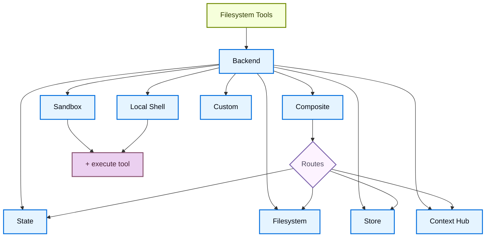

# 后端


> 为深度智能体选择和配置文件系统后端。您可以指定到不同后端的路由、实施虚拟文件系统并实施策略。


深度智能体通过 `ls`、`read_file`、`write_file`、`edit_file`、`delete`、`glob` 和 `grep` 等工具向代理公开文件系统表面。这些工具通过可插入后端运行。 `read_file` 工具本身支持所有后端的图像文件（`.png`、`.jpg`、`.jpeg`、`.gif`、`.webp`），并将它们作为多模式内容块返回。


沙箱和 [`LocalShellBackend`](https://reference.langchain.com/python/deepagents/backends/local_shell/LocalShellBackend) 还提供 `execute` 工具。本页说明如何：


* [选择后端](#specify-a-backend)


* [将不同路径路由到不同后端](#route-to-different-backends)


* [实现自定义后端](#custom-backends)


* [设置权限](#permissions) 文件系统访问


* [符合后端协议](#protocol-reference)


当您在 [LangSmith 部署](https://docs.langchain.com/langsmith/deployment) 上部署时，会自动配置商店。使用 [LangSmith](https://docs.langchain.com/langsmith/observability) 跟踪来调试文件路径、权限拒绝和跨线程存储。按照[可观测性快速入门](https://docs.langchain.com/langsmith/observability-quickstart) 进行设置。


我们建议您还设置 [LangSmith Engine](https://docs.langchain.com/langsmith/engine)，它会监视您的痕迹、检测问题并提出修复建议。


要生成代理可以通过文件系统工具读取的持久存储库 wiki，请参阅 [OpenWiki](https://docs.langchain.com/oss/openwiki/overview)。


## 快速入门


以下是一些预构建的文件系统后端，您可以将它们快速与深度智能体一起使用：


|内置后端|描述|
| ---------------------------------------------------------------- | ------------------------------------------------------------------------------------------------------------------------------------------------------------------------------------------------------------------------------------------------------------------------------------------------------------------------------------------------------------------------------------------------------------------------------------------------------------------------------------------------------------------- |
|[默认](#statebackend)|`agent = create_deep_agent(model="google_genai:gemini-3.6-flash")` <br /> 线程范围。代理的默认文件系统后端存储在 `langgraph` 状态中。文件在线程内持续存在（通过检查点），并且不会跨线程共享。|
|[本地文件系统持久化](#filesystembackend-local-disk)|`agent = create_deep_agent(model="google_genai:gemini-3.6-flash", backend=FilesystemBackend(root_dir="/Users/nh/Desktop/"))` <br /> 这使深度智能体可以访问本地计算机的文件系统。您可以指定代理有权访问的根目录。请注意，任何提供的 `root_dir` 必须是绝对路径。通常，包装在 [CompositeBackend](#compositebackend-router) 中，以将内部代理数据（卸载的工具结果、对话历史记录）与项目文件分开。|
|[持久存储（LangGraph 存储）](#storebackend-langgraph-store)|`agent = create_deep_agent(model="google_genai:gemini-3.6-flash", backend=StoreBackend())` <br />这使代理可以访问“跨线程持久化”的长期存储。这对于存储适用于代理多次执行的长期记忆或指令非常有用。|
|[上下文中心](#contexthubbackend)|`agent = create_deep_agent(model="google_genai:gemini-3.6-flash", backend=ContextHubBackend("my-agent"))` <br /> 将文件持久存储在 LangSmith Hub 存储库中，无需配置单独的 LangGraph 存储。|
|[沙盒](sandboxes.md)|`agent = create_deep_agent(model="google_genai:gemini-3.6-flash", backend=sandbox)` <br /> 在隔离环境中执行代码。沙箱提供文件系统工具以及用于运行 shell 命令的 `execute` 工具。从 LangSmith、AgentCore、Daytona 或其他[沙盒集成](https://docs.langchain.com/oss/python/integrations/sandboxes) 中进行选择。|
|[本地外壳](#localshellbackend-local-shell)|`agent = create_deep_agent(model="google_genai:gemini-3.6-flash", backend=LocalShellBackend(root_dir=".", env={"PATH": "/usr/bin:/bin"}))` <br /> 文件系统和 shell 直接在主机上执行。无隔离——仅在受控开发环境中使用。请参阅下面的[安全注意事项](#localshellbackend-local-shell)。|
|[复合](#compositebackend-router)|默认情况下，`/memories/` 是线程范围的，跨线程持续存在。复合后端具有最大程度的灵活性。您可以在文件系统中指定不同的路由以指向不同的后端。有关准备粘贴的示例，请参阅下面的复合路由。|





## 内置后端


### 状态后端


```python
from deepagents import create_deep_agent
from deepagents.backends import StateBackend

# By default we provide a StateBackend
agent = create_deep_agent(model="google_genai:gemini-3.6-flash")

# Under the hood, it looks like
agent2 = create_deep_agent(
    model="google_genai:gemini-3.6-flash",
    backend=StateBackend(),
)
```


```python
from deepagents import create_deep_agent
from deepagents.backends import StateBackend

# By default we provide a StateBackend
agent = create_deep_agent(model="openai:gpt-5.5")

# Under the hood, it looks like
agent2 = create_deep_agent(
    model="openai:gpt-5.5",
    backend=StateBackend(),
)
```


```python
from deepagents import create_deep_agent
from deepagents.backends import StateBackend

# By default we provide a StateBackend
agent = create_deep_agent(model="anthropic:claude-sonnet-4-6")

# Under the hood, it looks like
agent2 = create_deep_agent(
    model="anthropic:claude-sonnet-4-6",
    backend=StateBackend(),
)
```


```python
from deepagents import create_deep_agent
from deepagents.backends import StateBackend

# By default we provide a StateBackend
agent = create_deep_agent(model="openrouter:z-ai/glm-5.2")

# Under the hood, it looks like
agent2 = create_deep_agent(
    model="openrouter:z-ai/glm-5.2",
    backend=StateBackend(),
)
```


```python
from deepagents import create_deep_agent
from deepagents.backends import StateBackend

# By default we provide a StateBackend
agent = create_deep_agent(model="fireworks:accounts/fireworks/models/glm-5p2")

# Under the hood, it looks like
agent2 = create_deep_agent(
    model="fireworks:accounts/fireworks/models/glm-5p2",
    backend=StateBackend(),
)
```


```python
from deepagents import create_deep_agent
from deepagents.backends import StateBackend

# By default we provide a StateBackend
agent = create_deep_agent(model="baseten:zai-org/GLM-5.2")

# Under the hood, it looks like
agent2 = create_deep_agent(
    model="baseten:zai-org/GLM-5.2",
    backend=StateBackend(),
)
```


```python
from deepagents import create_deep_agent
from deepagents.backends import StateBackend

# By default we provide a StateBackend
agent = create_deep_agent(model="ollama:north-mini-code-1.0")

# Under the hood, it looks like
agent2 = create_deep_agent(
    model="ollama:north-mini-code-1.0",
    backend=StateBackend(),
)
```


 **它是如何工作的：**


* 通过 [`StateBackend`](https://reference.langchain.com/python/deepagents/backends/state/StateBackend) 将文件存储在当前线程的 LangGraph 代理状态中。
* 通过检查点在同一线程上的多个代理上持续存在。文件不在线程之间共享。


设计用于在图表内使用。在图形运行之外调用后端方法（例如，`state_backend.upload_files(...)`）在图形执行之前不会生效。


**最适合：**


* 供代理写入中间结果的便笺簿。
* 自动驱逐大型工具输出，然后代理可以逐段读回。


请注意，此后端在主管代理和子智能体之间共享，即使子智能体执行完成后，子智能体写入的任何文件都将保留在 LangGraph 代理状态中。这些文件将继续可供主管代理和其他子智能体使用。


### 文件系统后端（本地磁盘）


[`FilesystemBackend`](https://reference.langchain.com/python/deepagents/backends/filesystem/FilesystemBackend) 在可配置的根目录下读取和写入真实文件。


该后端授予代理直接文件系统读/写访问权限。请谨慎使用，并且仅在适当的环境中使用。


**适当的用例：**


  * 本地开发 CLI（编码助手、开发工具）
  * CI/CD 管道（请参阅下面的安全注意事项）


**不适当的用例：**


  * Web 服务器或 HTTP API - 使用 `StateBackend`、`StoreBackend` 或 [沙箱后端](sandboxes.md)


**安全风险：**


  * 代理可以读取任何可访问的文件，包括机密（API 密钥、凭证、`.env` 文件）
  * 结合网络工具，可通过SSRF攻击泄露机密
  * 文件修改是永久且不可逆的


**建议的保障措施：**


  1. 启用[人在环（HITL）中间件]（/oss/python/deepagents/human-in-the-loop）以审查敏感操作。
  2. 从可访问的文件系统路径中排除机密（尤其是在 CI/CD 中）。
  3. 对于需要文件系统交互的生产环境使用[沙箱后端](sandboxes.md)。
  4. **始终**将 `virtual_mode=True` 与 `root_dir` 结合使用以启用基于路径的访问限制（阻止 `..`、`~` 和根目录之外的绝对路径）。


请注意，即使设置了 `root_dir`，默认值 (`virtual_mode=False`) 也不提供安全性。


```python
from deepagents import create_deep_agent
from deepagents.backends import FilesystemBackend

agent = create_deep_agent(
    model="google_genai:gemini-3.6-flash",
    backend=FilesystemBackend(root_dir=".", virtual_mode=True),
)
```


```python
from deepagents import create_deep_agent
from deepagents.backends import FilesystemBackend

agent = create_deep_agent(
    model="openai:gpt-5.5",
    backend=FilesystemBackend(root_dir=".", virtual_mode=True),
)
```


```python
from deepagents import create_deep_agent
from deepagents.backends import FilesystemBackend

agent = create_deep_agent(
    model="anthropic:claude-sonnet-4-6",
    backend=FilesystemBackend(root_dir=".", virtual_mode=True),
)
```


```python
from deepagents import create_deep_agent
from deepagents.backends import FilesystemBackend

agent = create_deep_agent(
    model="openrouter:z-ai/glm-5.2",
    backend=FilesystemBackend(root_dir=".", virtual_mode=True),
)
```


```python
from deepagents import create_deep_agent
from deepagents.backends import FilesystemBackend

agent = create_deep_agent(
    model="fireworks:accounts/fireworks/models/glm-5p2",
    backend=FilesystemBackend(root_dir=".", virtual_mode=True),
)
```


```python
from deepagents import create_deep_agent
from deepagents.backends import FilesystemBackend

agent = create_deep_agent(
    model="baseten:zai-org/GLM-5.2",
    backend=FilesystemBackend(root_dir=".", virtual_mode=True),
)
```


```python
from deepagents import create_deep_agent
from deepagents.backends import FilesystemBackend

agent = create_deep_agent(
    model="ollama:north-mini-code-1.0",
    backend=FilesystemBackend(root_dir=".", virtual_mode=True),
)
```


 **它是如何工作的：**


* 在可配置的 `root_dir` 下读取/写入真实文件。
* 您可以选择将 `virtual_mode=True` 设置为沙箱并标准化 `root_dir` 下的路径。
* 使用安全路径解析，尽可能防止不安全的符号链接遍历，可以使用 ripgrep 实现快速 `grep`。


**最适合：**


* 您机器上的本地项目
* CI沙箱
* 已安装的持久卷


有关代理可以使用这些文件系统工具（来自 `openwiki/`）读取的持久存储库 wiki，请参阅 [OpenWiki](https://docs.langchain.com/oss/openwiki/overview)。


**对于大多数用例，将 `FilesystemBackend` 包裹在 `CompositeBackend` 中**。深度智能体自动将内部数据写入后端，包括卸载的大型工具结果（在 `/large_tool_results/` 下）和对话历史记录（在 `/conversation_history/` 下）。当您单独使用 `FilesystemBackend` 时，这些内部文件将写入 `root_dir` 下的真实磁盘，将代理工件与项目文件混合。


使用 `CompositeBackend` 将项目目录路由到 `FilesystemBackend`，同时将内部路径保留在临时 `StateBackend` 存储中：


```python
from deepagents import create_deep_agent
from deepagents.backends import CompositeBackend, StateBackend, FilesystemBackend

agent = create_deep_agent(
    backend=CompositeBackend(
        default=StateBackend(),
        routes={
            "/workspace/": FilesystemBackend(root_dir="/path/to/project", virtual_mode=True),
        },
    )
)
```


 这样，代理在 `/workspace/` 下的读取和写入操作将转到真实磁盘，而卸载工具结果和其他内部数据仍处于短暂状态。有关更多路由模式，请参阅[路由到不同后端](#route-to-different-backends)。


### LocalShellBackend（本地外壳）


该后端向代理授予直接文件系统读/写访问权限**和**在主机上不受限制的 shell 执行。请极其谨慎地使用，并且仅在适当的环境中使用。


**适当的用例：**


  * 本地开发 CLI（编码助手、开发工具）
  * 您信任代理代码的个人开发环境
  * 具有适当秘密管理的 CI/CD 管道


**不适当的用例：**


  * 生产环境（例如 Web 服务器、API、多租户系统）
  * 处理不受信任的用户输入或执行不受信任的代码


**安全风险：**


  * 代理可以使用您的用户权限执行**任意 shell 命令**
  * 代理可以读取任何可访问的文件，包括机密（API 密钥、凭证、`.env` 文件）
  * 秘密可能会被暴露
  * 文件修改和命令执行是**永久且不可逆的**
  * 命令直接在您的主机系统上运行
  * 命令可以消耗无限的CPU、内存、磁盘


**建议的保障措施：**


  1. 启用[人在环（HITL）中间件]（/oss/python/deepagents/human-in-the-loop）以在执行前审核和批准操作。这是**强烈推荐**。
  2. 仅在专用开发环境中运行。切勿在共享或生产系统上使用。
  3. 对于需要 shell 执行的生产环境，请使用[沙箱后端](sandboxes.md)。


**注意：** `virtual_mode=True` 在启用 shell 访问的情况下不提供安全性，因为命令可以访问系统上的任何路径。


```python
from deepagents import create_deep_agent
from deepagents.backends import LocalShellBackend

agent = create_deep_agent(
    model="google_genai:gemini-3.6-flash",
    backend=LocalShellBackend(root_dir=".", virtual_mode=True, env={"PATH": "/usr/bin:/bin"}),
)
```


```python
from deepagents import create_deep_agent
from deepagents.backends import LocalShellBackend

agent = create_deep_agent(
    model="openai:gpt-5.5",
    backend=LocalShellBackend(root_dir=".", virtual_mode=True, env={"PATH": "/usr/bin:/bin"}),
)
```


```python
from deepagents import create_deep_agent
from deepagents.backends import LocalShellBackend

agent = create_deep_agent(
    model="anthropic:claude-sonnet-4-6",
    backend=LocalShellBackend(root_dir=".", virtual_mode=True, env={"PATH": "/usr/bin:/bin"}),
)
```


```python
from deepagents import create_deep_agent
from deepagents.backends import LocalShellBackend

agent = create_deep_agent(
    model="openrouter:z-ai/glm-5.2",
    backend=LocalShellBackend(root_dir=".", virtual_mode=True, env={"PATH": "/usr/bin:/bin"}),
)
```


```python
from deepagents import create_deep_agent
from deepagents.backends import LocalShellBackend

agent = create_deep_agent(
    model="fireworks:accounts/fireworks/models/glm-5p2",
    backend=LocalShellBackend(root_dir=".", virtual_mode=True, env={"PATH": "/usr/bin:/bin"}),
)
```


```python
from deepagents import create_deep_agent
from deepagents.backends import LocalShellBackend

agent = create_deep_agent(
    model="baseten:zai-org/GLM-5.2",
    backend=LocalShellBackend(root_dir=".", virtual_mode=True, env={"PATH": "/usr/bin:/bin"}),
)
```


```python
from deepagents import create_deep_agent
from deepagents.backends import LocalShellBackend

agent = create_deep_agent(
    model="ollama:north-mini-code-1.0",
    backend=LocalShellBackend(root_dir=".", virtual_mode=True, env={"PATH": "/usr/bin:/bin"}),
)
```


 **它是如何工作的：**


* 使用 `execute` 工具扩展 `FilesystemBackend`，以便在主机上运行 shell 命令。
* 命令使用 `subprocess.run(shell=True)` 直接在您的计算机上运行，​​无需沙箱。
* 环境变量支持`timeout`（默认120秒）、`max_output_bytes`（默认10万）、`env`和`inherit_env`。
* Shell 命令使用 `root_dir` 作为工作目录，但可以访问系统上的任何路径。


**最适合：**


* 本地编码助手和开发工具
* 当您信任代理时，开发过程中可以快速迭代


### StoreBackend（LangGraph 商店）


```python
from deepagents import create_deep_agent
from deepagents.backends import StoreBackend
from langgraph.store.memory import InMemoryStore

agent = create_deep_agent(
    model="google_genai:gemini-3.6-flash",
    backend=StoreBackend(
        namespace=lambda rt: (rt.server_info.user.identity,),
    ),
    store=InMemoryStore(),  # Good for local dev; omit for LangSmith Deployment
)
```


```python
from deepagents import create_deep_agent
from deepagents.backends import StoreBackend
from langgraph.store.memory import InMemoryStore

agent = create_deep_agent(
    model="openai:gpt-5.5",
    backend=StoreBackend(
        namespace=lambda rt: (rt.server_info.user.identity,),
    ),
    store=InMemoryStore(),  # Good for local dev; omit for LangSmith Deployment
)
```


```python
from deepagents import create_deep_agent
from deepagents.backends import StoreBackend
from langgraph.store.memory import InMemoryStore

agent = create_deep_agent(
    model="anthropic:claude-sonnet-4-6",
    backend=StoreBackend(
        namespace=lambda rt: (rt.server_info.user.identity,),
    ),
    store=InMemoryStore(),  # Good for local dev; omit for LangSmith Deployment
)
```


```python
from deepagents import create_deep_agent
from deepagents.backends import StoreBackend
from langgraph.store.memory import InMemoryStore

agent = create_deep_agent(
    model="openrouter:z-ai/glm-5.2",
    backend=StoreBackend(
        namespace=lambda rt: (rt.server_info.user.identity,),
    ),
    store=InMemoryStore(),  # Good for local dev; omit for LangSmith Deployment
)
```


```python
from deepagents import create_deep_agent
from deepagents.backends import StoreBackend
from langgraph.store.memory import InMemoryStore

agent = create_deep_agent(
    model="fireworks:accounts/fireworks/models/glm-5p2",
    backend=StoreBackend(
        namespace=lambda rt: (rt.server_info.user.identity,),
    ),
    store=InMemoryStore(),  # Good for local dev; omit for LangSmith Deployment
)
```


```python
from deepagents import create_deep_agent
from deepagents.backends import StoreBackend
from langgraph.store.memory import InMemoryStore

agent = create_deep_agent(
    model="baseten:zai-org/GLM-5.2",
    backend=StoreBackend(
        namespace=lambda rt: (rt.server_info.user.identity,),
    ),
    store=InMemoryStore(),  # Good for local dev; omit for LangSmith Deployment
)
```


```python
from deepagents import create_deep_agent
from deepagents.backends import StoreBackend
from langgraph.store.memory import InMemoryStore

agent = create_deep_agent(
    model="ollama:north-mini-code-1.0",
    backend=StoreBackend(
        namespace=lambda rt: (rt.server_info.user.identity,),
    ),
    store=InMemoryStore(),  # Good for local dev; omit for LangSmith Deployment
)
```


 部署到 [LangSmith 部署](https://docs.langchain.com/langsmith/deployment) 时，省略 `store` 参数。平台自动为您的代理商提供商店。


`namespace` 参数控制数据隔离。对于多用户部署，请始终设置[命名空间工厂](backends.md#namespace-factories) 以隔离每个用户或租户的数据。


**它是如何工作的：**


* [`StoreBackend`](https://reference.langchain.com/python/deepagents/backends/store/StoreBackend) 将文件存储在运行时提供的 LangGraph [`BaseStore`](https://reference.langchain.com/python/langchain-core/stores/BaseStore) 中，从而实现跨线程持久存储。


**最适合：**


* 当您已经使用配置好的 LangGraph 存储（例如，Redis、Postgres 或 [`BaseStore`](https://reference.langchain.com/python/langchain-core/stores/BaseStore) 背后的云实现）运行时。
* 当您通过 [LangSmith 部署](https://docs.langchain.com/langsmith/deployment) 部署代理时（会自动为您的代理配置存储）。


#### 命名空间工厂


命名空间工厂控制 `StoreBackend` 读取和写入数据的位置。它接收 LangGraph [`Runtime`](https://reference.langchain.com/python/langgraph/runtime/Runtime) 并返回用作存储命名空间的字符串元组。使用命名空间工厂来隔离用户、租户或助理之间的数据。


构造 `StoreBackend` 时将命名空间工厂传递给 `namespace` 参数：


```python
NamespaceFactory = Callable[[Runtime], tuple[str, ...]]
```


 `Runtime` 提供：


* `rt.context` - 通过 LangGraph 的 [上下文模式](https://langchain-ai.github.io/langgraph/concepts/runtime/) 传递的用户提供的上下文（例如，`user_id`）
* `rt.server_info` - 在 LangGraph Server 上运行时的服务器特定元数据（助手 ID、图形 ID、经过身份验证的用户）
* `rt.execution_info`—执行身份信息（线程ID、运行ID、检查点ID）


`Runtime` 参数在 `deepagents>=0.5.2` 中可用。早期的 0.5.x 版本通过了 `BackendContext` - 请参阅下面的[从 `BackendContext` 迁移](#migrating-from-backendcontext)。 `rt.server_info` 和 `rt.execution_info` 需要 `deepagents>=0.5.0`。


**常见的命名空间模式：**


```python
from deepagents.backends import StoreBackend

# Per-user: each user gets their own isolated storage
backend = StoreBackend(
    namespace=lambda rt: (rt.server_info.user.identity,),  # [!code highlight]
)

# Per-assistant: all users of the same assistant share storage
backend = StoreBackend(
    namespace=lambda rt: (
        rt.server_info.assistant_id,  # [!code highlight]
    ),
)

# Per-thread: storage scoped to a single conversation
backend = StoreBackend(
    namespace=lambda rt: (
        rt.execution_info.thread_id,  # [!code highlight]
    ),
)
```


 您可以组合多个组件来创建更具体的范围 - 例如，`(user_id, thread_id)` 用于每个用户每个会话隔离，或者附加一个后缀（如 `"filesystem"`）以在同一范围使用多个存储命名空间时消除歧义。


命名空间组件必须仅包含字母数字字符、连字符、下划线、点、`@`、`+`、冒号和波形符。拒绝通配符（`*`、`?`）以防止全局注入。


在 v0.5.0 中，`namespace` 参数将是**必需**。始终为新代码显式设置它。


当未提供命名空间工厂时，旧版默认使用 LangGraph 配置元数据中的 `assistant_id`。这意味着同一[助理](https://docs.langchain.com/langsmith/assistants)的所有用户共享相同的存储。对于多用户[即将投入生产](going-to-production.md)，请始终提供命名空间工厂。


### ContextHub后端


**开始之前：** `ContextHubBackend` 需要在 LangSmith 中设置 Context Hub 存储库。如果您不熟悉代理存储库和技能存储库，请先阅读 [Context Hub 概念](https://docs.langchain.com/langsmith/context-engineering-concepts) 页面。


`ContextHubBackend` 将代理的文件系统存储在 LangSmith Context Hub 存储库中。它可以使用独立存储库或链接到技能存储库的代理存储库。


**存储库结构：** 在 Context Hub 中，*代理存储库* 保存代理的顶级指令和配置（例如，`AGENTS.md`、`tools.json`）。它可以链接到一个或多个“技能存储库”，每个技能存储库都打包为可重用功能（例如，包含电子邮件格式化或代码审查说明的 `SKILL.md`）。当您传递 `ContextHubBackend("my-agent")` 时，后端将代理存储库挂载到文件系统根目录；链接的技能存储库显示为 `/skills/` 下的子目录。


这意味着您的代理的上下文有意分布在存储库中：每个代理一个存储库，每个技能单独的存储库。这种分离使得技能可以在多个代理之间独立地进行版本控制、共享和重用。如果感觉这很支离破碎，请参阅[链接的存储库](https://docs.langchain.com/langsmith/context-engineering-concepts#linked-repos) 了解原因。


```python
from deepagents import create_deep_agent
from deepagents.backends import ContextHubBackend

agent = create_deep_agent(
    model="google_genai:gemini-3.6-flash",
    backend=ContextHubBackend("my-agent"),
)
```


```python
from deepagents import create_deep_agent
from deepagents.backends import ContextHubBackend

agent = create_deep_agent(
    model="openai:gpt-5.5",
    backend=ContextHubBackend("my-agent"),
)
```


```python
from deepagents import create_deep_agent
from deepagents.backends import ContextHubBackend

agent = create_deep_agent(
    model="anthropic:claude-sonnet-4-6",
    backend=ContextHubBackend("my-agent"),
)
```


```python
from deepagents import create_deep_agent
from deepagents.backends import ContextHubBackend

agent = create_deep_agent(
    model="openrouter:z-ai/glm-5.2",
    backend=ContextHubBackend("my-agent"),
)
```


```python
from deepagents import create_deep_agent
from deepagents.backends import ContextHubBackend

agent = create_deep_agent(
    model="fireworks:accounts/fireworks/models/glm-5p2",
    backend=ContextHubBackend("my-agent"),
)
```


```python
from deepagents import create_deep_agent
from deepagents.backends import ContextHubBackend

agent = create_deep_agent(
    model="baseten:zai-org/GLM-5.2",
    backend=ContextHubBackend("my-agent"),
)
```


```python
from deepagents import create_deep_agent
from deepagents.backends import ContextHubBackend

agent = create_deep_agent(
    model="ollama:north-mini-code-1.0",
    backend=ContextHubBackend("my-agent"),
)
```


 使用 `owner/name` 或 `name` 格式的存储库标识符构建它。


使用 `ContextHubBackend` 之前先设置 `LANGSMITH_API_KEY`。


**它是如何工作的：**


* 首次使用时延迟拉取 Hub 存储库树，然后从内存缓存中读取数据。
* 在 Hub 提交时保留写入和编辑，并在成功提交后更新缓存。
* 使用乐观的父提交写入 (`parent_commit`)：每次推送都以最新的已知提交哈希为目标。


**行为和限制：**


* 如果repo不存在，则第一次pull被视为空；第一次成功写入可以创建存储库。
* 如果另一个写入者首先推进存储库，则过时的父提交写入可能会失败。重新拉动并重试冲突。
* `upload_files()` 接受 UTF-8 文本。每个带有 `invalid_path` 的路径都会拒绝非 UTF-8 文件。


**最适合：**


* LangSmith 原生持久文件系统持久性，无需单独连接 LangGraph `BaseStore`。
* 受益于文件系统更改的集线器提交历史记录的工作流程。


### 复合后端（路由器）


```python
from deepagents import create_deep_agent
from deepagents.backends import CompositeBackend, StateBackend, StoreBackend
from langgraph.store.memory import InMemoryStore

agent = create_deep_agent(
    model="google_genai:gemini-3.6-flash",
    backend=CompositeBackend(
        default=StateBackend(),
        routes={
            "/memories/": StoreBackend(namespace=lambda _rt: ("memories",)),
        },
    ),
    store=InMemoryStore(),  # Store passed to create_deep_agent, not backend
)
```


```python
from deepagents import create_deep_agent
from deepagents.backends import CompositeBackend, StateBackend, StoreBackend
from langgraph.store.memory import InMemoryStore

agent = create_deep_agent(
    model="openai:gpt-5.5",
    backend=CompositeBackend(
        default=StateBackend(),
        routes={
            "/memories/": StoreBackend(namespace=lambda _rt: ("memories",)),
        },
    ),
    store=InMemoryStore(),  # Store passed to create_deep_agent, not backend
)
```


```python
from deepagents import create_deep_agent
from deepagents.backends import CompositeBackend, StateBackend, StoreBackend
from langgraph.store.memory import InMemoryStore

agent = create_deep_agent(
    model="anthropic:claude-sonnet-4-6",
    backend=CompositeBackend(
        default=StateBackend(),
        routes={
            "/memories/": StoreBackend(namespace=lambda _rt: ("memories",)),
        },
    ),
    store=InMemoryStore(),  # Store passed to create_deep_agent, not backend
)
```


```python
from deepagents import create_deep_agent
from deepagents.backends import CompositeBackend, StateBackend, StoreBackend
from langgraph.store.memory import InMemoryStore

agent = create_deep_agent(
    model="openrouter:z-ai/glm-5.2",
    backend=CompositeBackend(
        default=StateBackend(),
        routes={
            "/memories/": StoreBackend(namespace=lambda _rt: ("memories",)),
        },
    ),
    store=InMemoryStore(),  # Store passed to create_deep_agent, not backend
)
```


```python
from deepagents import create_deep_agent
from deepagents.backends import CompositeBackend, StateBackend, StoreBackend
from langgraph.store.memory import InMemoryStore

agent = create_deep_agent(
    model="fireworks:accounts/fireworks/models/glm-5p2",
    backend=CompositeBackend(
        default=StateBackend(),
        routes={
            "/memories/": StoreBackend(namespace=lambda _rt: ("memories",)),
        },
    ),
    store=InMemoryStore(),  # Store passed to create_deep_agent, not backend
)
```


```python
from deepagents import create_deep_agent
from deepagents.backends import CompositeBackend, StateBackend, StoreBackend
from langgraph.store.memory import InMemoryStore

agent = create_deep_agent(
    model="baseten:zai-org/GLM-5.2",
    backend=CompositeBackend(
        default=StateBackend(),
        routes={
            "/memories/": StoreBackend(namespace=lambda _rt: ("memories",)),
        },
    ),
    store=InMemoryStore(),  # Store passed to create_deep_agent, not backend
)
```


```python
from deepagents import create_deep_agent
from deepagents.backends import CompositeBackend, StateBackend, StoreBackend
from langgraph.store.memory import InMemoryStore

agent = create_deep_agent(
    model="ollama:north-mini-code-1.0",
    backend=CompositeBackend(
        default=StateBackend(),
        routes={
            "/memories/": StoreBackend(namespace=lambda _rt: ("memories",)),
        },
    ),
    store=InMemoryStore(),  # Store passed to create_deep_agent, not backend
)
```


 **它是如何工作的：**


* [`CompositeBackend`](https://reference.langchain.com/python/deepagents/backends/composite/CompositeBackend) 根据路径前缀将文件操作路由到不同的后端。
* 保留列表和搜索结果中的原始路径前缀。


**最适合：**


* 当您想要为代理提供线程范围和跨线程存储时，`CompositeBackend` 允许您同时提供 `StateBackend` 和 `StoreBackend`
* 当您有多个信息源想要作为单个文件系统的一部分提供给代理时。
  * 例如您在一个商店中的 `/memories/` 下存储了长期记忆，并且您还有一个自定义后端，可以在 /docs/ 访问文档。


## 指定后端


* 将后端实例传递给 `create_deep_agent(model=..., backend=...)`。文件系统中间件将其用于所有工具。
* 后端必须实现 `BackendProtocol`（例如，`StateBackend()`、`FilesystemBackend(root_dir=".")`、`StoreBackend()`、`ContextHubBackend("my-agent")`）。
* 如果省略，则默认为 `StateBackend()`。


## 路由到不同的后端


将命名空间的部分路由到不同的后端。通常用于跨线程持久保存 `/memories/*` 并保持其他所有内容都在线程范围内。


```python
from deepagents import create_deep_agent
from deepagents.backends import CompositeBackend, StateBackend, FilesystemBackend

agent = create_deep_agent(
    model="google_genai:gemini-3.6-flash",
    backend=CompositeBackend(
        default=StateBackend(),
        routes={
            "/memories/": FilesystemBackend(root_dir="/deepagents/myagent", virtual_mode=True),
        },
    )
)
```


 行为：


* `/workspace/plan.md` → `StateBackend`（线程范围）
* `/memories/agent.md` → `/deepagents/myagent` 下的 `FilesystemBackend`
* `ls`、`glob`、`grep` 聚合结果并显示原始路径前缀。


笔记：


* 较长的前缀获胜（例如，路由 `"/memories/projects/"` 可以覆盖 `"/memories/"`）。
* 对于 StoreBackend 路由，请确保商店是通过 `create_deep_agent(model=..., store=...)` 提供的或由平台配置的。
* 深度智能体将内部数据（卸载工具结果、对话历史记录）写入默认后端。使用 `StateBackend` 作为默认值可以使这些工件保持短暂状态并避免将它们写入磁盘或持久存储。有关完整示例，请参阅[文件系统后端提示](#filesystembackend-local-disk)。


## 自定义后端


实施自定义后端以将深度智能体连接到存储系统，例如数据库、对象存储和远程文件系统。有关示例，请参阅[社区构建的后端](https://docs.langchain.com/oss/python/integrations/backends)。


### 实现后端协议


子类 [`BackendProtocol`](https://reference.langchain.com/python/deepagents/backends/protocol/BackendProtocol) 并实现以下方法：


|方法|签名|它的作用|||
| -------- | ------------------------------------------------------------------------------------- | ---------------------------------------------------------------------------------------------------------------------------------------------------------------- | ------------------------------------- | ------------------------------------------ |
|`ls`|`(path: str) -> LsResult`|列出给定路径中的文件和目录。|||
|`read`|`(file_path: str, offset: int, limit: int) -> ReadResult`|返回文件内容，可以选择分页。|||
|`write`|`(file_path: str, content: str) -> WriteResult`|创建或覆盖文件。|||
|`edit`|`(file_path: str, old_string: str, new_string: str, replace_all: bool) -> EditResult`|在现有文件中查找并替换。|||
|`glob`|\`(pattern: str, path: str                                                            | None) -> GlobResult\`|返回与全局模式匹配的路径。||
|`grep`|\`(pattern: str, path: str                                                            | None, glob: str                                                                                                                                                  | None) -> GrepResult\`|在文件内容中搜索文字字符串。|
|`delete`|`(file_path: str) -> DeleteResult`|选修的。删除一个文件，或者递归地删除一个目录。如果后端不支持删除，则该工具会在请求时自动从模型中隐藏。|||


要同时支持 `execute` 工具（运行 shell 命令），请改为实现 [`SandboxBackendProtocol`](https://reference.langchain.com/python/deepagents/backends/protocol/SandboxBackendProtocol)，它使用 `execute` 方法扩展 `BackendProtocol`。


对于失败情况，始终返回带有 `error` 字段的结构化结果类型。不要提出异常。


**示例：S3风格的后端骨架**


该骨架将文件系统路径映射到对象键。使用存储客户端的列表、读取、搜索、上传和读取-修改-写入操作填写每个方法。


```python
from deepagents.backends.protocol import (
    BackendProtocol,
    EditResult,
    GlobResult,
    GrepResult,
    LsResult,
    ReadResult,
    WriteResult,
)

class S3Backend(BackendProtocol):
    def __init__(self, bucket: str, prefix: str = ""):
        self.bucket = bucket
        self.prefix = prefix.rstrip("/")

    def _key(self, path: str) -> str:
        return f"{self.prefix}{path}"

    def ls(self, path: str) -> LsResult:
        ...

    def read(self, file_path: str, offset: int = 0, limit: int = 2000) -> ReadResult:
        ...

    def grep(self, pattern: str, path: str | None = None, glob: str | None = None) -> GrepResult:
        ...

    def glob(self, pattern: str, path: str | None = None) -> GlobResult:
        ...

    def write(self, file_path: str, content: str) -> WriteResult:
        ...

    def edit(self, file_path: str, old_string: str, new_string: str, replace_all: bool = False) -> EditResult:
        ...
```


## 权限


使用 [permissions](permissions.md) 以声明方式控制代理可以读取或写入哪些文件和目录。权限适用于内置文件系统工具，并在调用后端之前进行评估。


```python
from deepagents import create_deep_agent, FilesystemPermission

agent = create_deep_agent(
    model="google_genai:gemini-3.6-flash",
    backend=CompositeBackend(
        default=StateBackend(),
        routes={
            "/memories/": StoreBackend(
                namespace=lambda rt: (rt.server_info.user.identity,),
            ),
            "/policies/": StoreBackend(
                namespace=lambda rt: (rt.context.org_id,),
            ),
        },
    ),
    permissions=[
        FilesystemPermission(
            operations=["write"],
            paths=["/policies/**"],
            mode="deny",
        ),
    ],
)
```


 有关包括规则排序、子智能体权限和复合后端交互在内的全套选项，请参阅[权限指南](permissions.md)。


## 添加策略挂钩


对于超出基于路径的允许/拒绝规则（速率限制、审核日志记录、内容检查）的自定义验证逻辑，通过子类化或包装后端来强制执行企业规则。


阻止在选定前缀（子类）下写入/编辑：


```python
from deepagents.backends.filesystem import FilesystemBackend
from deepagents.backends.protocol import WriteResult, EditResult

class GuardedBackend(FilesystemBackend):
    def __init__(self, *, deny_prefixes: list[str], **kwargs):
        super().__init__(**kwargs)
        self.deny_prefixes = [p if p.endswith("/") else p + "/" for p in deny_prefixes]

    def write(self, file_path: str, content: str) -> WriteResult:
        if any(file_path.startswith(p) for p in self.deny_prefixes):
            return WriteResult(error=f"Writes are not allowed under {file_path}")
        return super().write(file_path, content)

    def edit(self, file_path: str, old_string: str, new_string: str, replace_all: bool = False) -> EditResult:
        if any(file_path.startswith(p) for p in self.deny_prefixes):
            return EditResult(error=f"Edits are not allowed under {file_path}")
        return super().edit(file_path, old_string, new_string, replace_all)
```


 通用包装器（适用于任何后端）：


```python
from deepagents.backends.protocol import (
    BackendProtocol, WriteResult, EditResult, LsResult, ReadResult, GrepResult, GlobResult,
)

class PolicyWrapper(BackendProtocol):
    def __init__(self, inner: BackendProtocol, deny_prefixes: list[str] | None = None):
        self.inner = inner
        self.deny_prefixes = [p if p.endswith("/") else p + "/" for p in (deny_prefixes or [])]

    def _deny(self, path: str) -> bool:
        return any(path.startswith(p) for p in self.deny_prefixes)

    def ls(self, path: str) -> LsResult:
        return self.inner.ls(path)

    def read(self, file_path: str, offset: int = 0, limit: int = 2000) -> ReadResult:
        return self.inner.read(file_path, offset=offset, limit=limit)
    def grep(self, pattern: str, path: str | None = None, glob: str | None = None) -> GrepResult:
        return self.inner.grep(pattern, path, glob)
    def glob(self, pattern: str, path: str | None = None) -> GlobResult:
        return self.inner.glob(pattern, path)
    def write(self, file_path: str, content: str) -> WriteResult:
        if self._deny(file_path):
            return WriteResult(error=f"Writes are not allowed under {file_path}")
        return self.inner.write(file_path, content)
    def edit(self, file_path: str, old_string: str, new_string: str, replace_all: bool = False) -> EditResult:
        if self._deny(file_path):
            return EditResult(error=f"Edits are not allowed under {file_path}")
        return self.inner.edit(file_path, old_string, new_string, replace_all)
```


## 从后端工厂迁移


自 `deepagents` 0.5.0 起，后端工厂模式已被**弃用**。直接传递预先构造的后端实例而不是工厂函数。


以前，像 `StateBackend` 和 `StoreBackend` 这样的后端需要一个接收运行时对象的工厂函数，因为它们需要运行时上下文（状态、存储）来操作。后端现在通过 LangGraph 的 `get_config()`、`get_store()` 和 `get_runtime()` 帮助程序在内部解析此上下文，因此您可以直接传递实例。


### 发生了什么变化


|之前（已弃用）|后|
| -------------------------------------------------------------------- | ------------------------------------------------------- |
|`backend=lambda rt: StateBackend(rt)`|`backend=StateBackend()`|
|`backend=lambda rt: StoreBackend(rt)`|`backend=StoreBackend()`|
|`backend=lambda rt: CompositeBackend(default=StateBackend(rt), ...)`|`backend=CompositeBackend(default=StateBackend(), ...)`|
|`backend: (config) => new StateBackend(config)`|`backend: new StateBackend()`|
|`backend: (config) => new StoreBackend(config)`|`backend: new StoreBackend()`|


### 已弃用的 API


|已弃用|替代品|
| --------------------------------------------------------- | ------------------------------------------------------------ |
|将可调用对象传递给 `create_deep_agent` 中的 `backend=`|直接传递后端实例|
|`StateBackend(runtime)` 上的 `runtime` 构造函数参数|`StateBackend()`（无需参数）|
|`StoreBackend(runtime)` 上的 `runtime` 构造函数参数|`StoreBackend()` 或 `StoreBackend(namespace=..., store=...)`|
|`WriteResult` 和 `EditResult` 上的 `files_update` 字段|状态写入现在由后端在内部处理|
|`Command` 封装在中间件写入/编辑工具中|工具返回纯字符串；不需要 `Command(update=...)`|


工厂模式在运行时仍然有效并发出弃用警告。在下一个主要版本之前更新您的代码以使用直接实例。


### 迁移示例


```python
# Before (deprecated)
from deepagents import create_deep_agent
from deepagents.backends import CompositeBackend, StateBackend, StoreBackend

agent = create_deep_agent(
    model="google_genai:gemini-3.6-flash",
    backend=lambda rt: CompositeBackend(
        default=StateBackend(rt),
        routes={"/memories/": StoreBackend(rt, namespace=lambda rt: (rt.server_info.user.identity,))},
    ),
)

# After
agent = create_deep_agent(
    model="google_genai:gemini-3.6-flash",
    backend=CompositeBackend(
        default=StateBackend(),
        routes={"/memories/": StoreBackend(namespace=lambda rt: (rt.server_info.user.identity,))},
    ),
)
```


### 从 `BackendContext` 迁移


在 `deepagents>=0.5.2` (Python) 和 `deepagents>=1.9.1` (TypeScript) 中，命名空间工厂直接接收 LangGraph [`Runtime`](https://reference.langchain.com/python/langgraph/runtime/Runtime)，而不是 `BackendContext` 包装器。旧的 `BackendContext` 形式仍然可以通过向后兼容的 `.runtime` 和 `.state` 访问器工作，但这些访问器会发出弃用警告，并将在 `deepagents>=0.7` 中删除。


**改变了什么：**


* 工厂参数现在是 `Runtime`，而不是 `BackendContext`。
* 删除 `.runtime` 访问器 — 例如，`ctx.runtime.context.user_id` 变为 `rt.server_info.user.identity`。
* `ctx.state` 没有直接替代品。命名空间信息应该是只读的，并且在运行的生命周期内保持稳定，而状态是可变的，并且会逐步更改——从中派生命名空间可能会导致数据最终处于不一致的键下。如果您有需要读取代理状态的用例，请[打开问题](https://github.com/langchain-ai/deepagents/issues)。


```python
# Before (deprecated, removed in v0.7)
StoreBackend(
    namespace=lambda ctx: (ctx.runtime.context.user_id,),  # [!code --]
)

# After
StoreBackend(
    namespace=lambda rt: (rt.server_info.user.identity,),  # [!code ++]
)
```


## 协议参考


后端必须实现 [`BackendProtocol`](https://reference.langchain.com/python/deepagents/backends/protocol/BackendProtocol)。


所需方法：


* `ls(path: str) -> LsResult`
  * 返回至少包含 `path` 的条目。包括 `is_dir`、`size`、`modified_at`（如果有）。按 `path` 排序以获得确定性输出。
* `read(file_path: str, offset: int = 0, limit: int = 2000) -> ReadResult`
  * 成功时返回文件数据。如果文件丢失，则返回 `ReadResult(error="Error: File '/x' not found")`。
* `grep(pattern: str, path: Optional[str] = None, glob: Optional[str] = None) -> GrepResult`
  * 返回结构化匹配。出错时，返回 `GrepResult(error="...")`（不引发）。
* `glob(pattern: str, path: Optional[str] = None) -> GlobResult`
  * 将匹配的文件返回为 `FileInfo` 条目（如果没有，则为空列表）。
* `write(file_path: str, content: str) -> WriteResult`
  * 仅限创建。如果发生冲突，则返回 `WriteResult(error=...)`。成功后，设置 `path`，对于状态后端，设置 `files_update={...}`；外部后端应使用 `files_update=None`。
* `edit(file_path: str, old_string: str, new_string: str, replace_all: bool = False) -> EditResult`
  * 强制执行 `old_string` 的唯一性，除非 `replace_all=True`。如果没有找到，则返回错误。成功时请包含 `occurrences`。


配套类型：


* `LsResult(error, entries)`—`entries` 成功时为 `list[FileInfo]`，失败时为 `None`。
* `ReadResult(error, file_data)`—`file_data` 是成功时的 `FileData` 指令，失败时的 `None` 指令。
* `GrepResult(error, matches)`—`matches` 成功时为 `list[GrepMatch]`，失败时为 `None`。
* `GlobResult(error, matches)`—`matches` 成功时为 `list[FileInfo]`，失败时为 `None`。
* `WriteResult(error, path, files_update)`
* `EditResult(error, path, files_update, occurrences)`
* `FileInfo`，包含字段：`path`（必填），可选 `is_dir`、`size`、`modified_at`。
* `GrepMatch` 包含字段：`path`、`line`、`text`。
* `FileData` 包含字段：`content` (str)、`encoding`（`"utf-8"` 或 `"base64"`）、`created_at`、`modified_at`。
:::


## 参见


* [OpenWiki](https://docs.langchain.com/oss/openwiki/overview)：生成持久存储库 Markdown，代理通过文件系统工具读取
* [内存](memory.md)：文件系统支持的长期内存
* [沙箱](sandboxes.md)：隔离文件系统和 shell 执行


***


<div className="source-links">


  

[将这些文档](https://docs.langchain.com/use-these-docs) 通过 MCP 连接到 Claude、VSCode 等以获得实时答案。

  


  

[在 GitHub 上编辑此页面](https://github.com/langchain-ai/docs/edit/main/src/oss/deepagents/backends.mdx) 或 [提交问题](https://github.com/langchain-ai/docs/issues/new/choose)。

  

</div>

