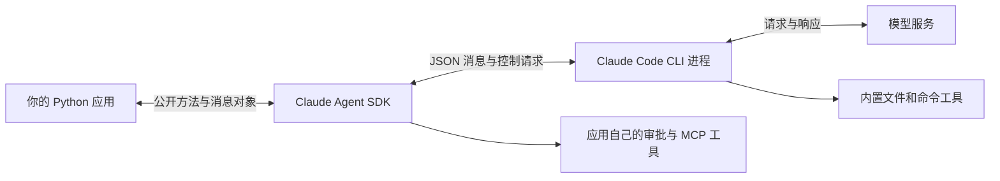

# Claude Code 源码解析：公开 SDK 与运行时边界

**GitHub：** [Claude Code 官方仓库](https://github.com/anthropics/claude-code) · [本章实际逐步阅读的 Python SDK 源码](https://github.com/anthropics/claude-agent-sdk-python) · [SDK 固定提交](claude-code-source-analysis.md)

本章依据完整 SDK 快照 `efd4d865ef1795daffee3cd24cce45307aed8a51`，采用 MIT 许可。Claude Code 官方仓库并未提供完整 CLI 运行时实现，因此本章能逐行解释的是：Python 应用怎样启动 Claude Code、发送任务、接收输出、响应审批、连接工具并管理会话。内置编辑算法和模型循环内部策略不在这份 SDK 源码中。完整源码的获取方法见[下载与版本说明](../source-snapshots/source-reading-method.md)。

下面继续使用“给待办应用增加状态筛选，按截图调整按钮，再运行测试”作为假设任务。代码与流程图是阅读辅助，本次整理没有运行需要模型服务的示例。

## 01. 先看程序边界：你的 Python 代码并没有独自运行整个 Agent

SDK 是 Software Development Kit 的缩写，即给开发者调用的软件开发包。你在 Python 中调用它，它再启动或连接一个负责实际工作的程序。这里那个程序通常是 Claude Code CLI，CLI 指命令行程序。

这和上一章的阅读角度很不一样：Codex 公开仓库能让我们进入核心循环；Claude Python SDK 让我们看到如何与核心运行程序通信。理解这个边界，才能知道一个函数到底是“自己完成工作”，还是“把请求交给另一个程序”。



**进程**可以理解为一个正在运行的程序实例。Python 和 CLI 在不同进程中，不能直接互相调用内存里的普通函数。因此它们使用消息通信：把请求编码成文本发过去，再把返回文本还原成数据。**JSON**是这种数据的文本表示格式，你可以在消息里看到 `type`、`request_id` 等字段。

本章把一次任务连续拆成“启动连接 → 发消息 → 收结果 → 回应控制请求 → 收尾保存”。当提到 CLI 内部工作时，会明确指出是接口所表达的能力，而非已读到内部实现。

## 02. 从哪个函数读起：一次调用与持续对话

SDK 对外提供两种常见入口。顶层 `query()` 适合提交任务并迭代接收消息；`ClaudeSDKClient` 适合在同一个连接中持续交互，例如发第一轮任务、等待结果，再补充要求或中断工作。这里的客户端是你程序里持有的一个对象，不是另一个网页。

打开 `src/claude_agent_sdk/query.py`，可以看到顶层函数创建 `InternalClient`，随后把 `prompt`、`options`、`transport` 交给 `process_query()`。这几项分别是任务输入、运行选项、通信方式。只读这层还没有看到模型调用，因为它的职责主要是向下转交。

继续到 `_internal/client.py`。`process_query()` 先校验会话存储相关选项，必要时准备要恢复的会话，再进入 `_process_query_inner()`。后者选择通信实现，建立连接，创建 `Query` 对象，然后开始读取与初始化。

这里有两个容易混淆的名字：小写 `query()` 是应用入口；大写 `Query` 是内部管理消息与控制请求的类。把它们写成一条实际调用链，就不用记忆一堆孤立术语：

```text
应用调用 query()
  → InternalClient.process_query()
  → _process_query_inner()
  → 创建并连接 Transport
  → 创建 Query，启动读取并初始化
  → 发送用户输入，接收解析后的消息
  → finally 中关闭资源
```

我们的需求现在已经进入 SDK，但还未送到 CLI。下一步要看这条连接怎样建立。

<details markdown="1">
<summary>打开本节源码入口</summary>

- [参数与进程入口](https://github.com/anthropics/claude-agent-sdk-python/blob/efd4d865ef1795daffee3cd24cce45307aed8a51/src/claude_agent_sdk/_internal/transport/subprocess_cli.py) · [离线文件](../source-snapshots/claude-agent-sdk-python/src/claude_agent_sdk/_internal/transport/subprocess_cli.py)
- [initialize 与控制协议](https://github.com/anthropics/claude-agent-sdk-python/blob/efd4d865ef1795daffee3cd24cce45307aed8a51/src/claude_agent_sdk/_internal/query.py) · [离线文件](../source-snapshots/claude-agent-sdk-python/src/claude_agent_sdk/_internal/query.py)
- [公开客户端方法](https://github.com/anthropics/claude-agent-sdk-python/blob/efd4d865ef1795daffee3cd24cce45307aed8a51/src/claude_agent_sdk/client.py) · [离线文件](../source-snapshots/claude-agent-sdk-python/src/claude_agent_sdk/client.py)
- [消息解析](https://github.com/anthropics/claude-agent-sdk-python/blob/efd4d865ef1795daffee3cd24cce45307aed8a51/src/claude_agent_sdk/_internal/message_parser.py) · [离线文件](../source-snapshots/claude-agent-sdk-python/src/claude_agent_sdk/_internal/message_parser.py)
- [消息与增量事件类型](https://github.com/anthropics/claude-agent-sdk-python/blob/efd4d865ef1795daffee3cd24cce45307aed8a51/src/claude_agent_sdk/types.py) · [离线文件](../source-snapshots/claude-agent-sdk-python/src/claude_agent_sdk/types.py)

</details>

入口补充：[query.py](../source-snapshots/claude-agent-sdk-python/src/claude_agent_sdk/query.py) → [InternalClient](../source-snapshots/claude-agent-sdk-python/src/claude_agent_sdk/_internal/client.py)。

## 03. Python 怎样启动 Claude Code：Transport 的真实工作

**Transport**在这里表示消息传输方式。默认的 `SubprocessCLITransport` 通过启动子进程来实现；子进程就是由当前程序启动的另一个程序。SDK 还允许传入自定义 transport，因此默认路径不能当作所有使用方式的唯一实现。

先读 `_internal/transport/subprocess_cli.py` 中的 `_build_command()`。它把 `ClaudeAgentOptions` 中的设置转成 CLI 参数，命令包含 `--output-format stream-json` 和 `--input-format stream-json`。这说明双方交换的不是给人阅读的终端界面，而是可被程序解析的消息流。

再读 `connect()`，找到 `anyio.open_process(...)`。这一步才真正启动进程，并接好输入输出通道。**stdin**是向程序写入数据的通道，**stdout**是程序返回数据的通道，**stderr**通常承载诊断信息。不要把普通调试文字随意混进消息流，否则接收方可能把它当 JSON 解析而失败。

在本例里，工作目录通过选项传给 CLI，决定它从哪个项目环境开始工作。工作目录选对了，并不意味着已经给模型读取全部文件；它只是执行与查找的基础位置。系统提示、权限模式、工具配置也要沿参数或初始化消息传递到对方。

至此我们有了两条可通信的管道。下一节看任务消息怎样真正发出去，以及为什么必须先启动接收。

<details markdown="1">
<summary>打开本节源码入口</summary>

- [参数与进程入口](https://github.com/anthropics/claude-agent-sdk-python/blob/efd4d865ef1795daffee3cd24cce45307aed8a51/src/claude_agent_sdk/_internal/transport/subprocess_cli.py) · [离线文件](../source-snapshots/claude-agent-sdk-python/src/claude_agent_sdk/_internal/transport/subprocess_cli.py)
- [initialize 与控制协议](https://github.com/anthropics/claude-agent-sdk-python/blob/efd4d865ef1795daffee3cd24cce45307aed8a51/src/claude_agent_sdk/_internal/query.py) · [离线文件](../source-snapshots/claude-agent-sdk-python/src/claude_agent_sdk/_internal/query.py)
- [公开客户端方法](https://github.com/anthropics/claude-agent-sdk-python/blob/efd4d865ef1795daffee3cd24cce45307aed8a51/src/claude_agent_sdk/client.py) · [离线文件](../source-snapshots/claude-agent-sdk-python/src/claude_agent_sdk/client.py)

</details>

## 04. 先握手，再发送任务：为什么要同时读和写

**初始化或握手**是双方先确认本次连接如何工作的过程。`_process_query_inner()` 的顺序值得认真看：`query.start()` 先启动读消息任务，`query.initialize()` 再发送初始化请求，之后才写用户任务。

在源码中，启动读取和初始化是两句独立调用：

```python
await query.start()
await query.initialize()
```

`await` 表示等待当前操作；其中 `start()` 安排了持续读取消息的后台工作，然后初始化才能收到对方的回复。

为什么不发完所有东西再读？因为初始化本身就需要对方回复，任务运行中也可能反过来询问权限。如果一端一直等待回复，另一端却还没有安排读取，整个流程就会卡住。

对于字符串输入，源码把它放进一个 `type` 为 `user` 的消息，`message` 里有 `role` 与 `content`，再写进 transport。对于异步输入，SDK 使用后台任务持续发送消息。**异步迭代**可以理解为“消息到一条就处理一条，下一条没到时可以等待”，而不是一次性拿到完整列表。

下面是字段形状的示意，具体默认字段以固定版本源码为准：

```json
{
  "type": "user",
  "message": {
    "role": "user",
    "content": "给待办应用增加状态筛选，最后运行测试"
  }
}
```

这条消息说明 SDK 已把任务交给 CLI，不证明任务已经完成。接下来，同一条连接会返回多种消息，我们需要把它们分开。

<details markdown="1">
<summary>打开本节源码入口</summary>

- [receive_response](https://github.com/anthropics/claude-agent-sdk-python/blob/efd4d865ef1795daffee3cd24cce45307aed8a51/src/claude_agent_sdk/client.py) · [离线文件](../source-snapshots/claude-agent-sdk-python/src/claude_agent_sdk/client.py)
- [消息解析](https://github.com/anthropics/claude-agent-sdk-python/blob/efd4d865ef1795daffee3cd24cce45307aed8a51/src/claude_agent_sdk/_internal/message_parser.py) · [离线文件](../source-snapshots/claude-agent-sdk-python/src/claude_agent_sdk/_internal/message_parser.py)
- [消息与增量事件类型](https://github.com/anthropics/claude-agent-sdk-python/blob/efd4d865ef1795daffee3cd24cce45307aed8a51/src/claude_agent_sdk/types.py) · [离线文件](../source-snapshots/claude-agent-sdk-python/src/claude_agent_sdk/types.py)

</details>

## 05. 从输出流到聊天界面：消息不是只有一段回答

从 transport 的 `read_messages()` 往上追，会到 `Query._read_messages()`。后者按消息类型分流；普通消息经过 `receive_messages()`，由 `parse_message()` 转换成 Python 消息对象，再交给应用。

**解析**就是把传输中的字段还原成程序可使用的数据。例如一条 assistant 消息可能包含文字，也可能包含工具调用内容；`StreamEvent` 表达逐步到达的事件；`ResultMessage` 表达一轮处理的结果。是否接收部分增量与配置有关，不应只凭代码用了 `async for` 就认为每个字符都会单独返回。

在自己的界面中，可以把消息理解成不同更新动作：追加一小段文字、创建一个工具卡片、填入工具结果、标记本轮结果。工具编号用来关联请求与结果；子任务还可能有父工具调用编号。把这些信息全转成字符串塞进一个文本框，虽然简单，却会丢掉“谁在做什么”的关系。

我们的任务可能先返回“正在查看组件”，随后出现读取工具和结果，最后才有修改说明。收到一条文字消息不等于本轮结束，收到一轮 result 也不一定意味着所有后台工作都已结束。先记住这个区别，第 10 节会解释连接为什么不能过早关闭。

现在考虑一条不会直接展示给用户的消息：CLI 请求允许修改文件。它走的是下一节的控制通道。

<details markdown="1">
<summary>打开本节源码入口</summary>

- [receive_response](https://github.com/anthropics/claude-agent-sdk-python/blob/efd4d865ef1795daffee3cd24cce45307aed8a51/src/claude_agent_sdk/client.py) · [离线文件](../source-snapshots/claude-agent-sdk-python/src/claude_agent_sdk/client.py)
- [消息解析](https://github.com/anthropics/claude-agent-sdk-python/blob/efd4d865ef1795daffee3cd24cce45307aed8a51/src/claude_agent_sdk/_internal/message_parser.py) · [离线文件](../source-snapshots/claude-agent-sdk-python/src/claude_agent_sdk/_internal/message_parser.py)
- [消息与增量事件类型](https://github.com/anthropics/claude-agent-sdk-python/blob/efd4d865ef1795daffee3cd24cce45307aed8a51/src/claude_agent_sdk/types.py) · [离线文件](../source-snapshots/claude-agent-sdk-python/src/claude_agent_sdk/types.py)
- [任务跟踪与输入流关闭](https://github.com/anthropics/claude-agent-sdk-python/blob/efd4d865ef1795daffee3cd24cce45307aed8a51/src/claude_agent_sdk/_internal/query.py) · [离线文件](../source-snapshots/claude-agent-sdk-python/src/claude_agent_sdk/_internal/query.py)

</details>

## 06. CLI 反过来问 Python：权限控制请求如何往返

**控制请求**是为了改变或协调运行过程的消息，例如请求审批、设置模式、执行回调。`_read_messages()` 区分 `control_response` 与 `control_request`：前者唤醒等待某个请求结果的代码，后者交给处理函数执行。

**request_id**就是请求编号。系统可能同时等待多个结果，因此用编号把回复匹配给正确的等待者。与工具的 `call_id` 一样，它的作用是关联，但关联的是控制请求，不要把两者混用。

在 `_handle_control_request()` 中找到 `can_use_tool` 分支。CLI 发来工具名与输入，SDK 调用应用设置的 Python 回调，再将 `PermissionResultAllow` 或 `PermissionResultDeny` 编成响应发回去。Allow 可以携带调整后的输入；Deny 可以携带原因。

```text
CLI：请求执行某工具，附工具参数与 request_id
SDK：找到 can_use_tool 回调
应用：根据规则或用户点击作出决定
SDK：将决定写回相同 request_id 的响应
CLI：继续处理该工具调用
```

这里的**回调**就是“先登记一个函数，条件发生时再调用它”。你可以用它连接网页审批框，但需要处理用户离开页面和请求取消；没有收到答复不等于获得允许。

这个回调也不是所有工具调用的总入口：已经由规则或模式处理的请求可能不再触发它。`auto` 等权限模式会通过参数或控制消息传给 CLI；SDK 源码能证明参数怎样传递，不能证明 CLI 私有自动审批算法的全部细节。若需要观察特定执行时机，还要看下一节的 hooks。

<details markdown="1">
<summary>打开本节源码入口</summary>

- [can_use_tool 分支](https://github.com/anthropics/claude-agent-sdk-python/blob/efd4d865ef1795daffee3cd24cce45307aed8a51/src/claude_agent_sdk/_internal/query.py) · [离线文件](../source-snapshots/claude-agent-sdk-python/src/claude_agent_sdk/_internal/query.py)
- [权限结果及 hook 类型](https://github.com/anthropics/claude-agent-sdk-python/blob/efd4d865ef1795daffee3cd24cce45307aed8a51/src/claude_agent_sdk/types.py) · [离线文件](../source-snapshots/claude-agent-sdk-python/src/claude_agent_sdk/types.py)
- [配置组合测试](https://github.com/anthropics/claude-agent-sdk-python/blob/efd4d865ef1795daffee3cd24cce45307aed8a51/tests/test_option_warnings.py) · [离线文件](../source-snapshots/claude-agent-sdk-python/tests/test_option_warnings.py)
- [权限模式参数](https://github.com/anthropics/claude-agent-sdk-python/blob/efd4d865ef1795daffee3cd24cce45307aed8a51/src/claude_agent_sdk/_internal/transport/subprocess_cli.py) · [离线文件](../source-snapshots/claude-agent-sdk-python/src/claude_agent_sdk/_internal/transport/subprocess_cli.py)
- [set_permission_mode](https://github.com/anthropics/claude-agent-sdk-python/blob/efd4d865ef1795daffee3cd24cce45307aed8a51/src/claude_agent_sdk/client.py) · [离线文件](../source-snapshots/claude-agent-sdk-python/src/claude_agent_sdk/client.py)

</details>

## 07. 修改发生前后：Hooks 如何连接业务规则与文件编辑

**Hook**是一种在特定时机触发的回调，例如用户提交任务时、工具执行前、工具执行后。它让应用把自己的逻辑接到运行过程上，而不必修改 CLI 内部代码。

在 `Query.initialize()` 中，Python 回调被分配回调 ID，事件名称、匹配条件与 ID 发给 CLI。Python 函数本身留在原进程中。等 CLI 发来 `hook_callback` 控制请求，SDK 用 ID 找回函数并执行。这就回答了一个常见疑问：另一个进程如何“调用”我写的 Python 函数？实际上它发送消息，请 SDK 代为调用。

本例可以在工具执行前检查要修改的路径，在执行后记录工具结果。某些 hook 的返回类型还允许补充 `additionalContext`，也就是给后续任务加入额外信息。项目约定适合在任务准备阶段提供，刚产生的测试证据适合随执行结果提供；这两者的时机不同。

不过，我们仍然没有读到内置 Edit 工具怎样匹配旧文本、如何生成文件内容。SDK 提供的是执行边界上的接口。文件修改成功与测试通过也应分开记录：前者说明编辑动作完成，后者才对行为是否符合要求提供证据。

到这里，应用能发送任务、展示过程、控制部分动作。下一节补上另一种常用扩展：把自己的业务函数交给 Agent 使用。

<details markdown="1">
<summary>打开本节源码入口</summary>

- [工具前后 hook 契约](https://github.com/anthropics/claude-agent-sdk-python/blob/efd4d865ef1795daffee3cd24cce45307aed8a51/src/claude_agent_sdk/types.py) · [离线文件](../source-snapshots/claude-agent-sdk-python/src/claude_agent_sdk/types.py)
- [更新输入的权限响应](https://github.com/anthropics/claude-agent-sdk-python/blob/efd4d865ef1795daffee3cd24cce45307aed8a51/src/claude_agent_sdk/_internal/query.py) · [离线文件](../source-snapshots/claude-agent-sdk-python/src/claude_agent_sdk/_internal/query.py)
- [编辑约束示例](https://github.com/anthropics/claude-agent-sdk-python/blob/efd4d865ef1795daffee3cd24cce45307aed8a51/examples/hooks.py) · [离线文件](../source-snapshots/claude-agent-sdk-python/examples/hooks.py)
- [配置来源示例](https://github.com/anthropics/claude-agent-sdk-python/blob/efd4d865ef1795daffee3cd24cce45307aed8a51/examples/setting_sources.py) · [离线文件](../source-snapshots/claude-agent-sdk-python/examples/setting_sources.py)

</details>

## 08. 给 Agent 一个自己的工具：MCP 如何跨过进程边界

MCP 是 Model Context Protocol，一套让程序发现并调用工具的协议。假设筛选规则存储在你的业务系统里，可以提供一个读取规则的工具。SDK 支持外部 MCP 服务器，也支持在 Python 进程内创建 SDK MCP server。

进程内工具的入口可以从 `__init__.py` 的 `tool()` 与 `create_sdk_mcp_server()` 开始读。前者描述工具，后者组织这些工具。真实 Python 对象无法直接写进 JSON，所以配置传到 CLI 时不会把 `instance` 这个对象本身发送过去。

`InternalClient` 留下这些 server 实例，`Query` 收到 `mcp_message` 后根据服务器名称路由回相应实例。请求因此形成一趟往返：CLI 决定调用 → SDK 找到 Python 工具 → 执行业务函数 → 返回协议结果 → CLI 继续模型任务。

这条链和内置文件工具的区别是执行位置：你的函数可以留在 Python 应用中，复用现有服务对象。但参数校验、失败反馈与权限要求仍然存在。注册成功只说明能力配置好了，不能证明每一次调用都成功。

当业务工具结果回到 CLI 后，它如何参与下一次模型请求属于 CLI 运行逻辑。本章能追踪到交付结果的边界，不把 Python 的消息读取循环误称为模型决策循环。

<details markdown="1">
<summary>打开本节源码入口</summary>

- [工具装饰器与 MCP server](https://github.com/anthropics/claude-agent-sdk-python/blob/efd4d865ef1795daffee3cd24cce45307aed8a51/src/claude_agent_sdk/__init__.py) · [离线文件](../source-snapshots/claude-agent-sdk-python/src/claude_agent_sdk/__init__.py)
- [MCP 请求路由](https://github.com/anthropics/claude-agent-sdk-python/blob/efd4d865ef1795daffee3cd24cce45307aed8a51/src/claude_agent_sdk/_internal/query.py) · [离线文件](../source-snapshots/claude-agent-sdk-python/src/claude_agent_sdk/_internal/query.py)
- [去除 instance 的序列化边界](https://github.com/anthropics/claude-agent-sdk-python/blob/efd4d865ef1795daffee3cd24cce45307aed8a51/src/claude_agent_sdk/_internal/transport/subprocess_cli.py) · [离线文件](../source-snapshots/claude-agent-sdk-python/src/claude_agent_sdk/_internal/transport/subprocess_cli.py)

</details>

## 09. 用户信息怎样补充进去：文件、图片、澄清与计划

现在回到那句“按截图调整按钮”。SDK 的字符串入口只发送字符串，不会因为里面有 `.png` 就在 Python 这一层自动加载图片。要区分三件事：发送路径、让工具读取路径、传入结构化媒体内容。**结构化内容块**表示一条消息可以包含不同类型的内容，而不只有一段文字。

`@src/App.tsx` 也是如此。Python SDK 没有终端界面中的文件候选列表实现。自己做网页输入框时，要明确选择：只把路径交给 Agent 按需读取，还是由应用读取允许访问的内容并附上来源。它们会产生不同的信息量与后续工具调用。这是应用设计选择，不是对 CLI 私有补全逻辑的描述。

如果筛选规则不明确，Agent 可能需要提问。应用必须有“问题出现 → 用户回答 → 回答返回等待中的请求”的完整通路。`AskUserQuestion` 相关交互可结合工具输入、权限响应与 SDK 的消息接口理解，但不要把允许调用工具这个决定，误当成用户已经回答了业务问题。

计划与任务进度则帮助组织已知工作：查规则、改界面、运行测试。SDK 可以接收相关工具内容和任务消息，界面据此展示状态；真正的步骤执行仍由运行程序推进。进度条到了 100% 并不是测试通过的证据。

这些信息都在围绕同一轮任务流动。下一节讨论它们什么时候可以停止流动，以及何时还必须保持连接。

<details markdown="1">
<summary>打开本节源码入口</summary>

- [query 的字符串与消息字典分支](https://github.com/anthropics/claude-agent-sdk-python/blob/efd4d865ef1795daffee3cd24cce45307aed8a51/src/claude_agent_sdk/client.py) · [离线文件](../source-snapshots/claude-agent-sdk-python/src/claude_agent_sdk/client.py)
- [控制请求与取消](https://github.com/anthropics/claude-agent-sdk-python/blob/efd4d865ef1795daffee3cd24cce45307aed8a51/src/claude_agent_sdk/_internal/query.py) · [离线文件](../source-snapshots/claude-agent-sdk-python/src/claude_agent_sdk/_internal/query.py)
- [PermissionResultAllow 与延后执行类型](https://github.com/anthropics/claude-agent-sdk-python/blob/efd4d865ef1795daffee3cd24cce45307aed8a51/src/claude_agent_sdk/types.py) · [离线文件](../source-snapshots/claude-agent-sdk-python/src/claude_agent_sdk/types.py)
- [图片工具结果测试](https://github.com/anthropics/claude-agent-sdk-python/blob/efd4d865ef1795daffee3cd24cce45307aed8a51/tests/test_sdk_mcp_integration.py) · [离线文件](../source-snapshots/claude-agent-sdk-python/tests/test_sdk_mcp_integration.py)

</details>

## 10. 子任务和后台命令：收到 result 后为什么还不能随意断开

**子 Agent**是在独立任务上下文中处理委派工作的 Agent。例如主任务改界面，子任务只调查测试入口。`AgentDefinition` 描述子 Agent 的提示、工具等选项，SDK 将这些定义通过初始化请求的 `agents` 字段交给 CLI。调度子 Agent 的核心推理逻辑不在 Python 这一层。

后续消息中的 `parent_tool_use_id`、任务编号和生命周期消息帮助把结果对应回父任务。独立上下文也不意味着自动拥有独立文件目录；避免同时修改同一文件仍是任务设计的一部分。

后台 shell 则可能一直运行，例如开发服务器。`Query._track_task_lifecycle()` 对特定的委派 Agent 任务维护集合，但没有把所有后台 shell 都当成必须结束的任务。否则启动一个长期服务，就会让 SDK 永远等不到“所有工作结束”。

`wait_for_result_and_end_input()` 结合任务状态以及是否需要双向通信决定何时关闭输入。这里 **生命周期**只是“创建、运行、结束、清理”的全过程。看结果消息时还要问：后面是否可能有工具回调？子任务是否还要返回？输入通道关掉后，对方还能不能提出问题？

因此一次 result、整个连接结束、所有操作系统子进程清理完毕不能直接画等号。固定源码中也有关于结束时序边界的注释，本文不把它描述成已经解决所有并发收尾问题。

<details markdown="1">
<summary>打开本节源码入口</summary>

- [任务跟踪与输入流关闭](https://github.com/anthropics/claude-agent-sdk-python/blob/efd4d865ef1795daffee3cd24cce45307aed8a51/src/claude_agent_sdk/_internal/query.py) · [离线文件](../source-snapshots/claude-agent-sdk-python/src/claude_agent_sdk/_internal/query.py)
- [stop_task](https://github.com/anthropics/claude-agent-sdk-python/blob/efd4d865ef1795daffee3cd24cce45307aed8a51/src/claude_agent_sdk/client.py) · [离线文件](../source-snapshots/claude-agent-sdk-python/src/claude_agent_sdk/client.py)
- [AgentDefinition 与任务关联字段](https://github.com/anthropics/claude-agent-sdk-python/blob/efd4d865ef1795daffee3cd24cce45307aed8a51/src/claude_agent_sdk/types.py) · [离线文件](../source-snapshots/claude-agent-sdk-python/src/claude_agent_sdk/types.py)
- [官方子 Agent 示例](https://github.com/anthropics/claude-agent-sdk-python/blob/efd4d865ef1795daffee3cd24cce45307aed8a51/examples/agents.py) · [离线文件](../source-snapshots/claude-agent-sdk-python/examples/agents.py)

</details>

## 11. 运行途中失败：先找出断在哪一层

到这里已经有几层等待：等待进程启动、等待有效消息、等待控制回复、等待工具完成。用户看到“任务失败”时，应先把失败放回正确的一层。

| 现象 | 先查什么 | 为什么不能直接重做整轮 |
|---|---|---|
| 找不到 CLI | `CLINotFoundError` 与 CLI 路径 | 尚未进入任务，重试模型无用 |
| 子进程异常退出 | `ProcessError`、退出信息与 stderr | 进程可能已经执行了一部分动作 |
| 消息无法解析 | `SDKJSONDecodeError` 与读取缓冲 | 先解决通信内容问题 |
| 控制回复一直不来 | 请求编号、等待超时、回调状态 | 可能是应用的审批函数没有返回 |
| 工具或任务报错 | 工具结果、`ResultMessage` | 业务失败不一定需要重启连接 |

`_send_control_request()` 登记请求编号与等待状态，发送后等待对应响应，并在结束路径清理。transport 还要处理不完整的 JSON 数据与缓冲大小，避免将半条消息误当成完整消息。

**超时**只意味着在限定时间内没等到结果，不证明对方没有执行。例如文件已经修改，但后续连接断开，此时重新运行整个任务可能重复操作。先核查文件与会话状态，再决定继续或重试，比盲目重做更可靠。

SDK 的异常类也不能告诉我们模型服务内部怎样限流重试。它们解释的是 Python 可见的失败边界。失败后若要从已完成的部分继续，就需要保存与恢复机制。

<details markdown="1">
<summary>打开本节源码入口</summary>

- [异常类型](https://github.com/anthropics/claude-agent-sdk-python/blob/efd4d865ef1795daffee3cd24cce45307aed8a51/src/claude_agent_sdk/_errors.py) · [离线文件](../source-snapshots/claude-agent-sdk-python/src/claude_agent_sdk/_errors.py)
- [请求等待与清理](https://github.com/anthropics/claude-agent-sdk-python/blob/efd4d865ef1795daffee3cd24cce45307aed8a51/src/claude_agent_sdk/_internal/query.py) · [离线文件](../source-snapshots/claude-agent-sdk-python/src/claude_agent_sdk/_internal/query.py)
- [分帧、缓冲及退出处理](https://github.com/anthropics/claude-agent-sdk-python/blob/efd4d865ef1795daffee3cd24cce45307aed8a51/src/claude_agent_sdk/_internal/transport/subprocess_cli.py) · [离线文件](../source-snapshots/claude-agent-sdk-python/src/claude_agent_sdk/_internal/transport/subprocess_cli.py)

</details>

## 12. 关闭以后继续：消息展示、会话存档与恢复

屏幕显示用的消息不一定包含恢复运行所需的全部信息。**transcript**在这里指会话记录，可能包括工具关系、系统事件和其他字段。只存最终回答，下一轮就可能缺少此前的执行依据。

固定版本公开 `SessionStore`，主要通过 `append()` 与 `load()` 接入外部存储。`project_key`、`session_id` 与可选 `subpath` 区分不同记录位置；存储数据应保留未知字段，不能为了省事只提取文字。

`Query` 接收 `transcript_mirror` 消息时，会把它们交给镜像写入逻辑，通常不作为普通聊天消息直接交给展示端。镜像表示再保存一份记录，CLI 仍有自己的本地副本。写入失败有专门的错误反馈，不能因为界面里已经出现回答就认为外部存储也一定成功。

恢复路径在 `session_resume.py`：`materialize_resume_session()` 从外部存储读取记录，准备 CLI 能读取的临时会话目录，再调整启动选项。materialize 在这里就是“把存储中的记录还原成所需的本地文件”。清理顺序也重要：应先关闭还在使用目录的运行程序，再移除临时目录。

`resume`、继续对话与 `fork_session` 分别涉及选择已有会话、继续已有对话和分出新分支，不要只把它们都翻译成“记住之前的聊天”。接下来我们进一步区分：继续旧记录、缩短模型输入和还原代码，分别是什么操作。

<details markdown="1">
<summary>打开本节源码入口</summary>

- [SessionStore 与会话选项](https://github.com/anthropics/claude-agent-sdk-python/blob/efd4d865ef1795daffee3cd24cce45307aed8a51/src/claude_agent_sdk/types.py) · [离线文件](../source-snapshots/claude-agent-sdk-python/src/claude_agent_sdk/types.py)
- [恢复物化流程](https://github.com/anthropics/claude-agent-sdk-python/blob/efd4d865ef1795daffee3cd24cce45307aed8a51/src/claude_agent_sdk/_internal/session_resume.py) · [离线文件](../source-snapshots/claude-agent-sdk-python/src/claude_agent_sdk/_internal/session_resume.py)
- [存储镜像实现](https://github.com/anthropics/claude-agent-sdk-python/blob/efd4d865ef1795daffee3cd24cce45307aed8a51/src/claude_agent_sdk/_internal/session_store.py) · [离线文件](../source-snapshots/claude-agent-sdk-python/src/claude_agent_sdk/_internal/session_store.py)

</details>

## 13. 压缩、记忆、回退：它们改变的是不同东西

**上下文**是当前给模型的信息；**compact**是缩短这些信息，以便任务继续。SDK 有上下文用量查询和压缩相关 hook 等接口，但具体怎样挑选摘要内容，是 CLI 内部实现。应用可以观察这些边界，不能据此写出“源码采用某某摘要算法”的结论。

**长期记忆**是在以后任务中复用信息。项目说明、设置来源与 Agent 记忆配置会影响运行，但 Python 类型中有一个 memory 字段，并不证明 Python 内部完成了记忆提取。阅读接口时要继续追这个字段传到哪里；到 CLI 边界时就明确停下。

**文件回退**改变磁盘内容。客户端的 `rewind_files()` 发出控制请求，需要相关检查点信息及配置。检查点可以理解为以后可能返回的记录位置。发出了回退请求，不等于聊天历史也退回，更不等于数据库写入或外部消息被撤销。

用案例区分三者：测试日志太多需要压缩；下次任务仍要遵循项目风格需要可复用的约定；这次筛选改错了想还原文件则涉及回退。它们都可能让用户感觉“回到更合适的状态”，但操作对象不同，因此存储、接口和验证方式也不同。

<details markdown="1">
<summary>打开本节源码入口</summary>

- [AgentDefinition.memory 与 memoryFiles](https://github.com/anthropics/claude-agent-sdk-python/blob/efd4d865ef1795daffee3cd24cce45307aed8a51/src/claude_agent_sdk/types.py) · [离线文件](../source-snapshots/claude-agent-sdk-python/src/claude_agent_sdk/types.py)
- [文件系统中的 Agent 配置](https://github.com/anthropics/claude-agent-sdk-python/blob/efd4d865ef1795daffee3cd24cce45307aed8a51/examples/filesystem_agents.py) · [离线文件](../source-snapshots/claude-agent-sdk-python/examples/filesystem_agents.py)
- [rewind_files](https://github.com/anthropics/claude-agent-sdk-python/blob/efd4d865ef1795daffee3cd24cce45307aed8a51/src/claude_agent_sdk/client.py) · [离线文件](../source-snapshots/claude-agent-sdk-python/src/claude_agent_sdk/client.py)
- [回退控制请求](https://github.com/anthropics/claude-agent-sdk-python/blob/efd4d865ef1795daffee3cd24cce45307aed8a51/src/claude_agent_sdk/_internal/query.py) · [离线文件](../source-snapshots/claude-agent-sdk-python/src/claude_agent_sdk/_internal/query.py)

</details>

## 14. 接到自己的应用中：外部事件与一次完整任务的收尾

最后把“等待用户输入”的应用扩展成“也能处理业务事件”的应用。例如 CI 构建失败后，服务把失败信息交给已有会话，让 Agent 分析。CI 是自动运行构建与测试的系统。

SDK 提供持续客户端和输入消息的能力；接收外部事件的 HTTP 接口、鉴权、事件去重与可靠保存，需要由你的应用实现。Hook 是运行程序在某个时机发出的回调，不是一个现成的外部事件服务器。

在我们的任务中，流程终于连起来：应用启动 CLI，发送需求和所需资料；读消息任务持续接收输出；审批和 MCP 请求回到 Python 回调；工具结果使运行程序继续；测试结束后交付说明；会话记录保存，客户端按生命周期清理资源。如果后续又收到用户消息或业务事件，再明确选择继续哪个会话。

第二遍读源码时，建议按下列顺序打开文件，并给每一步写一句“它交给下一层什么”：

| 阅读顺序 | 文件 | 先找的入口 |
|---|---|---|
| 1 | `query.py` | 应用调用怎样转交 |
| 2 | `_internal/client.py` | 连接、初始化、输入、收尾顺序 |
| 3 | `_internal/transport/subprocess_cli.py` | 参数、进程、消息读写 |
| 4 | `_internal/query.py` | 普通消息与控制请求的分流 |
| 5 | `_internal/message_parser.py`、`types.py` | 返回给应用的数据形状 |
| 6 | `_internal/session_resume.py` | 已有记录怎样恢复为可运行会话 |

如果你能说明“为什么先启动读取”“为什么审批函数留在 Python”“为什么 result 不一定是全部结束”“为什么保存文字不够恢复”，就已经掌握 SDK 的主体结构。之后再按自己的项目需要深入 hooks、MCP 或存储，比逐个背 API 名称更容易形成连续理解。

对照[Codex 源码解析](codex-source-analysis.md)：Codex 那章追的是核心执行循环，这一章追的是应用如何与执行程序协作。它们解决相关问题，但证据覆盖的层次不同。

<details markdown="1">
<summary>打开本节源码入口</summary>

- [持续客户端的 query](https://github.com/anthropics/claude-agent-sdk-python/blob/efd4d865ef1795daffee3cd24cce45307aed8a51/src/claude_agent_sdk/client.py) · [离线文件](../source-snapshots/claude-agent-sdk-python/src/claude_agent_sdk/client.py)
- [数据与控制消息分流](https://github.com/anthropics/claude-agent-sdk-python/blob/efd4d865ef1795daffee3cd24cce45307aed8a51/src/claude_agent_sdk/_internal/query.py) · [离线文件](../source-snapshots/claude-agent-sdk-python/src/claude_agent_sdk/_internal/query.py)
- [TaskNotificationMessage 与 HookEventMessage](https://github.com/anthropics/claude-agent-sdk-python/blob/efd4d865ef1795daffee3cd24cce45307aed8a51/src/claude_agent_sdk/types.py) · [离线文件](../source-snapshots/claude-agent-sdk-python/src/claude_agent_sdk/types.py)

</details>
