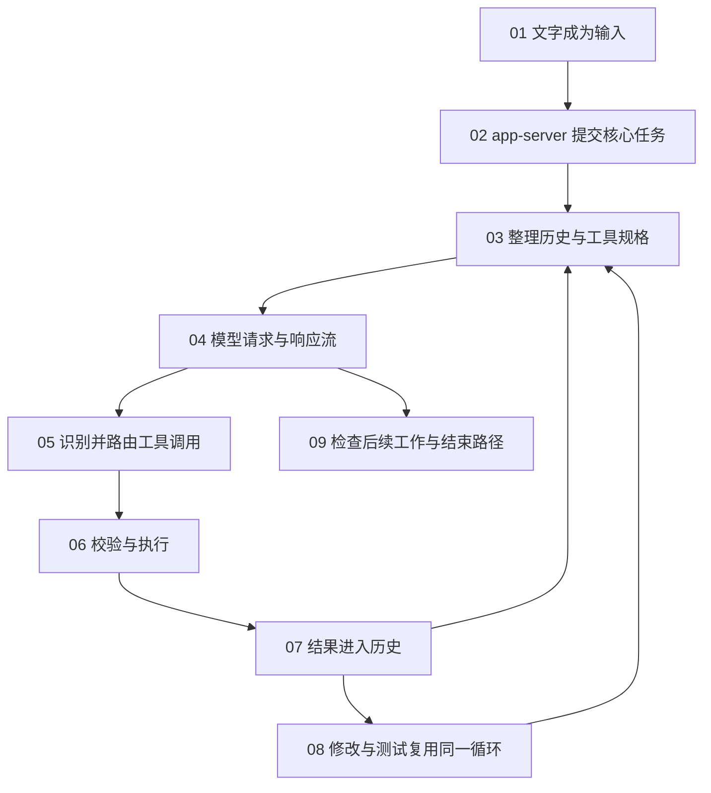

# Codex 源码精读：跟完一次真实任务

从一条用户需求开始，沿着输入、模型请求、工具执行和结果回传，读懂一次任务如何完成。正文直接展示固定版本源码，不需要反复离开文章找文件。

## 从一个具体需求开始

假设你正在开发一个待办事项应用，列表目前会显示所有任务，包括未完成和已完成的任务。现在，你希望增加一个筛选选项，让列表可以只显示已完成的任务。

你在这个项目目录中打开 Codex，在输入框中输入下面这句话，然后按下发送：

> 给待办列表增加已完成筛选，并运行测试。

本课程就从按下发送的这一刻开始，追踪这条需求在程序中的完整过程：输入框里的文字怎样成为结构化数据，怎样提交给核心运行时；模型怎样通过工具读取现有代码、提出修改并运行测试；工具结果又怎样回到模型，直到这一轮任务结束。

后续章节提到的“案例”或“这次任务”，都指这条需求。每一节会接着上一节的状态，继续追踪其中一个环节。

这是用于讲解源码流程的假设场景，课程没有附带可运行的待办应用，也没有实际执行模型请求。文中的案例数据与测试输出均为教学示例；展示的 Codex 源码则来自已标明的固定版本。

## 先认识四种时间范围

| 名称 | 在教程中表示什么 | 不要混淆 |
| --- | --- | --- |
| 会话 / session | 可接续的对话与状态 | 命令工具返回的进程 session_id |
| 一轮任务 / turn | 一次用户任务的处理生命周期 | 一次模型响应 |
| 模型请求 / sampling | 请求模型生成并处理一段响应流 | 用户发消息的次数 |
| 工具调用 / tool call | 带参数和编号的一次动作请求 | 动作已经成功 |

## 沿这条主线阅读

这是一张教学数据流图，省略错误、取消和专题分支。每节的实际调用位置由正文源码片段给出。

| 章节 | 这一节带走的问题 |
| --- | --- |
| [01 · 点击发送后，任务去了哪里](codex-01-input.md) | 用户的文字怎样跨过界面与核心之间的边界？ |
| [02 · 一轮任务怎样开始](codex-02-turn.md) | 收到输入后，哪段代码真正启动 run_turn？ |
| [03 · 模型第一次会收到什么](codex-03-context.md) | 历史、说明和工具如何组成模型请求？ |
| [04 · 一次请求怎样持续返回结果](codex-04-stream.md) | 文字和工具调用如何从响应流中被分开处理？ |
| [05 · 工具调用怎样变成真实动作](codex-05-tools.md) | 从响应项到工具处理器，中间传递了哪些数据？ |
| [06 · 执行前需要满足哪些条件](codex-06-permissions.md) | 参数验证、审批和沙箱分别在哪一步起作用？ |
| [07 · 工具结果怎样回到下一次请求](codex-07-results.md) | 为什么工具读到文件后，模型下一次才有依据修改？ |
| [08 · 从修改文件到测试反馈](codex-08-edit-test.md) | 修改和测试怎样复用工具结果循环？ |
| [09 · 什么时候结束，用户看到什么](codex-09-finish.md) | 一次响应完成为什么不等于本轮任务完成？ |

## 怎样读一段源码

每段先读问题和当前位置，再看带原始行号的代码。代码头部可以复制项目路径、切换换行，正文下方可以展开前后文；需要查整个文件时，打开同一份离线高亮源码并定位到该行。

语法高亮、代码和上下文都在本地页面里。源码保持原文；中文说明放在代码外。函数太长时分段展示，段与段之间的行号不会伪装成连续代码。

不熟悉 Rust 时，先认 `struct` 是字段集合，`enum` 是不同形态，`match` 是分支，`Result` 是成功或错误。遇到 `await` 先追等待的结果会交给谁，不必先学完所有所有权规则。

## 仓库地图

| 路径 | 主要职责 | 从哪里开始读 |
| --- | --- | --- |
| `codex-rs/tui/src/` | 终端输入与显示 | 主线 01、04 |
| `codex-rs/app-server/src/` | 客户端请求适配 | 主线 02 |
| `codex-rs/core/src/session/` | 任务、输入、历史和模型循环 | 主线 02—04、07、09 |
| `codex-rs/core/src/tools/` | 工具路由、处理器与运行时 | 主线 05—08 |
| `codex-rs/rollout/src/` | 会话记录与读取 | 会话专题 |
| `codex-rs/memories/write/src/` | 跨任务记忆流水线 | 记忆专题 |

## 按问题深入专题

先完成相关主线，再选择下面的专题。每篇开头都会标出前置知识。

- [专题 · 启动参数与斜杠命令](codex-topic-entry.md)：为什么有些输入不进入模型请求？
- [专题 · 项目说明、文件引用与图片](codex-topic-context.md)：不同来源的信息怎样成为请求中的上下文？
- [专题 · 上下文压缩](codex-topic-compact.md)：日志越来越长时，后续请求怎样继续？
- [专题 · 流式事件、重试与取消](codex-topic-stream.md)：网络断开、测试失败和取消各自怎样收束？
- [专题 · 审批、沙箱与自动审查](codex-topic-permissions.md)：获准执行之后，为什么仍可能失败？
- [专题 · 后台命令与持续输出](codex-topic-process.md)：测试跑得很久时，如何继续读取而不重复启动？
- [专题 · 澄清、计划与运行中输入](codex-topic-collaboration.md)：新答案和补充要求怎样影响正在执行的任务？
- [专题 · MCP 工具如何接回主循环](codex-topic-mcp.md)：远程工具返回的内容在哪里变成模型可用信息？
- [专题 · 子 Agent 的创建与等待](codex-topic-agents.md)：分出去的任务怎样有开始，也有可验证的结束？
- [专题 · 会话记录、恢复与回退](codex-topic-history.md)：关闭程序后，什么信息能被接续使用？
- [专题 · 长期记忆的独立流程](codex-topic-memory.md)：跨任务的经验与当前轮次压缩有什么区别？
- [专题 · 客户端与核心的边界](codex-topic-boundaries.md)：哪些实现可以复用理解，哪些必须重新核对？

## 版本与证据

本课程依据公开源码固定提交 `121f91fd5d9dc66017866ce9bdc49f1e182721df`。页面中每个摘录都有文件路径、原始行号和校验记录；不把旧快照实现等同于所有现行客户端。

源码摘录以 Apache-2.0 许可保留，完整文件内的版权说明保持不变。更多信息见 [离线源码与许可](../source-snapshots/README.md)。本地构建检查源码片段和固定快照一致，再生成高亮页面。

## 原版章节索引

旧链接仍可定位到这里的对应项。内容已经拆为连续主线与专题。

<a href="codex-01-input.md">01. 从一个具体需求开始：这次我们要追踪什么 →</a>

<a href="codex-topic-entry.md">02. 输入进入系统：命令与普通任务在这里分开 →</a>

<a href="codex-03-context.md">03. 模型第一次看到什么：上下文、文件引用与图片 →</a>

<a href="codex-02-turn.md">04. 沿 run_turn 读主循环：一次回答为什么会请求模型多次 →</a>

<a href="codex-05-tools.md">05. 模型提出读文件：工具调用如何变成真实动作 →</a>

<a href="codex-06-permissions.md">06. 写文件之前：权限审批与沙箱各自负责什么 →</a>

<a href="codex-08-edit-test.md">07. 真正修改代码：为什么要验证补丁，再运行测试 →</a>

<a href="codex-04-stream.md">08. 边执行边显示：流式输出与错误分别怎样返回 →</a>

<a href="codex-topic-collaboration.md">09. 不知道筛选规则怎么办：澄清问题与任务计划 →</a>

<a href="codex-topic-mcp.md">10. 工作变多以后：MCP、后台命令与子 Agent →</a>

<a href="codex-topic-collaboration.md">11. 运行中又收到消息：外部事件如何重新接回循环 →</a>

<a href="codex-topic-compact.md">12. 历史太长怎么办：上下文压缩与长期记忆 →</a>

<a href="codex-topic-history.md">13. 结束、恢复与回退：三种状态不要混在一起 →</a>

<a href="codex-09-finish.md">14. 第二遍怎样读源码：把主线变成自己的调试地图 →</a>

