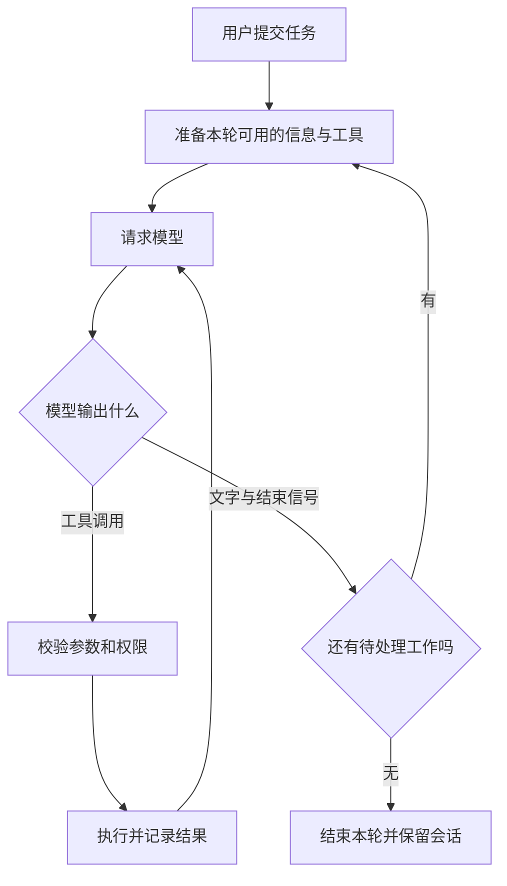

# Codex 源码解析

**GitHub 源码：** [openai/codex](https://github.com/openai/codex) · [本章固定提交](codex-source-analysis.md)

本章依据完整仓库快照 `121f91fd5d9dc66017866ce9bdc49f1e182721df`，讲解公开 Rust 实现。代码采用 Apache-2.0 许可。阅读所需的关键文件附有离线副本；[下载与版本说明](../source-snapshots/source-reading-method.md)记录完整源码的获取方法。本章没有运行付费模型请求，下面的任务是贯穿讲解的假设案例，流程图和伪代码都是为阅读而简化的。

## 01. 从一个具体需求开始：这次我们要追踪什么

假设你在待办应用的项目目录里打开 Codex，输入：“给列表增加已完成筛选，按截图调整按钮，最后运行测试。”你看到的是一个聊天框，但这句话要经过好几个程序部件才会变成代码修改。

先给它们分工。**模型**根据已有信息提出下一步；**工具**是真正读文件、改代码、运行命令的程序；**运行时**负责把模型与工具接起来，记录结果并决定是否继续；**界面**接收你的输入，把运行过程显示给你。源码中这些部件并不总是一一对应一个文件，不过这四个职责足以帮助我们找到主线。

还要分清两个时间范围。**会话（session）**是一段可以继续多次的对话；**一轮任务（turn）**从接收这次用户要求开始，直到这轮处理结束。一次用户任务可能向模型发送多次请求。例如第一次决定读代码，第二次决定改代码，第三次根据测试结果决定继续修复。代码中的模型请求次数，不能直接当成用户发消息的次数。



先把图读成一句话：**拿到信息，请模型决定下一步，把执行结果交回去，直到本轮无需继续。** 接下来每节都只追这句话中的一段。文件名用于定位证据，不要求你先背下整个仓库。

## 02. 输入进入系统：命令与普通任务在这里分开

在终端输入 `codex` 时，程序先处理启动参数。进入聊天界面后输入 `/status`，则是在操作已经运行的程序。这两种“命令”有不同入口：前者看 `cli/src/main.rs`，后者看 `tui/src/slash_command.rs` 与 `chatwidget/slash_dispatch.rs`。TUI 是 Terminal User Interface 的缩写，意思就是终端界面。

在 `SlashCommand` 中先找 `Status` 与 `Compact`，再到 `dispatch_command()` 看对应分支。你会发现命令名称只是入口，真正行为由分支决定：展示状态可以在程序内部完成，压缩上下文则需要把请求交给核心逻辑。由此能解释一个日常现象：不是每一次键盘输入都会消耗一次模型请求。

我们的“增加筛选”属于普通任务，接下来要由核心层处理。此时先记下一个调试问题：如果点击发送后没有任何反应，应该先确认界面是否提交了任务，而不是立即怀疑模型接口。界面接收到文字与核心开始处理，是两个可以分别观察的步骤。

**顺着源码读：** 先看枚举中的两个命令，再看分发函数对应分支；不用把所有命令逐个读完。下一节开始，我们跟着普通任务离开界面。

<details markdown="1">
<summary>打开本节源码入口</summary>

- [命令枚举](https://github.com/openai/codex/blob/121f91fd5d9dc66017866ce9bdc49f1e182721df/codex-rs/tui/src/slash_command.rs) · [离线文件](../source-snapshots/codex/codex-rs/tui/src/slash_command.rs)
- [命令分发](https://github.com/openai/codex/blob/121f91fd5d9dc66017866ce9bdc49f1e182721df/codex-rs/tui/src/chatwidget/slash_dispatch.rs) · [离线文件](../source-snapshots/codex/codex-rs/tui/src/chatwidget/slash_dispatch.rs)
- [启动参数入口](https://github.com/openai/codex/blob/121f91fd5d9dc66017866ce9bdc49f1e182721df/codex-rs/cli/src/main.rs) · [离线文件](../source-snapshots/codex/codex-rs/cli/src/main.rs)

</details>

## 03. 模型第一次看到什么：上下文、文件引用与图片

模型不能凭空看见你的硬盘。程序必须把任务所需的信息组织进请求，或者让模型通过工具读取。**上下文（context）**就是本次请求提供给模型的信息，包括对话历史、项目说明、当前任务以及已经获得的工具结果。

打开 `core/src/session/turn.rs`，在 `run_turn()` 的前半段找 `capture_step_context_with_required_mcp_servers`、`record_context_updates_and_set_reference_context_item` 与 `build_skills_and_plugins`。名字很长，但依次回答的是：“这一步有哪些环境和能力”“哪些环境信息需要记入历史”“这次任务额外需要哪些说明”。这里的 step 是一次推进所使用的工作信息，先把它理解为本次模型请求前的准备即可。

`AGENTS.md` 等项目说明提供项目约定；技能与插件可能补充当前任务相关的说明。**注入**只是源码讨论中对“由程序加入这些信息”的简称，不意味着它们一定来自用户刚输入的文字。查问题时需要问清楚这段话来自用户、项目文件还是工具结果，不能只看它们最后都变成了文本。

我们输入 `@src/App.tsx`，是帮助程序定位文件。引用路径、加载全文、把全文送进请求是不同步骤：需要继续追输入处理和后续读取工具，不能看到路径就认定模型已读完文件。截图同理，文本路径不能替代图像数据。图片内容需要以支持的输入形式进入系统；源码中的 `view_image` 又提供了通过工具查看图片的另一条路径。

回到案例：第一次请求至少需要知道“要增加筛选”，随后可能读取组件文件和截图。如果答案无视现有代码，优先检查这些资料是否真正进入了请求，而不是只加强提示词语气。信息准备好后，才轮到模型作决定。

<details markdown="1">
<summary>打开本节源码入口</summary>

- [文件补全及测试](https://github.com/openai/codex/blob/121f91fd5d9dc66017866ce9bdc49f1e182721df/codex-rs/tui/src/bottom_pane/chat_composer.rs) · [离线文件](../source-snapshots/codex/codex-rs/tui/src/bottom_pane/chat_composer.rs)
- [结构化输入类型](https://github.com/openai/codex/blob/121f91fd5d9dc66017866ce9bdc49f1e182721df/codex-rs/protocol/src/user_input.rs) · [离线文件](../source-snapshots/codex/codex-rs/protocol/src/user_input.rs)
- [项目说明加载](https://github.com/openai/codex/blob/121f91fd5d9dc66017866ce9bdc49f1e182721df/codex-rs/core/src/agents_md.rs) · [离线文件](../source-snapshots/codex/codex-rs/core/src/agents_md.rs)
- [上下文片段](https://github.com/openai/codex/blob/121f91fd5d9dc66017866ce9bdc49f1e182721df/codex-rs/core/src/context/mod.rs) · [离线文件](../source-snapshots/codex/codex-rs/core/src/context/mod.rs)
- [项目说明管理](https://github.com/openai/codex/blob/121f91fd5d9dc66017866ce9bdc49f1e182721df/codex-rs/core/src/agents_md_manager.rs) · [离线文件](../source-snapshots/codex/codex-rs/core/src/agents_md_manager.rs)
- [查看图片工具](https://github.com/openai/codex/blob/121f91fd5d9dc66017866ce9bdc49f1e182721df/codex-rs/core/src/tools/handlers/view_image.rs) · [离线文件](../source-snapshots/codex/codex-rs/core/src/tools/handlers/view_image.rs)
- [图片准备](https://github.com/openai/codex/blob/121f91fd5d9dc66017866ce9bdc49f1e182721df/codex-rs/core/src/image_preparation.rs) · [离线文件](../source-snapshots/codex/codex-rs/core/src/image_preparation.rs)

</details>

## 04. 沿 run_turn 读主循环：一次回答为什么会请求模型多次

继续往下找到 `run_turn()` 中的 `loop`。Rust 的 `loop` 表示反复执行这段代码，直到分支明确退出；`await` 表示等待一个尚未完成的操作，并不意味着程序只能停在那里什么也不做。

循环中一个关键片段是 `sess.clone_history().await.for_prompt(...)`：先取出会话历史，再整理成这次模型可用的输入。随后调用 `run_sampling_request(...)`。这里 sampling 指模型生成输出，不需要先学习概率采样公式才能读懂本段，它在主线中就是“一次模型请求”。

请求结束后，函数取出 `model_needs_follow_up`，还会检查 `has_pending_input`，最后合成 `needs_follow_up`。这些字段分别表达“模型处理链还需要继续”和“用户运行中又补充了内容”。因此一次流结束后，循环可能继续准备新请求。

对应判断在源码中直接体现为下面这一行。两边用 `||` 连接，意思是任意一个条件成立就继续处理：

```rust
let needs_follow_up = model_needs_follow_up || has_pending_input;
```

```text
教学伪代码，省略了错误、取消和压缩分支：
重复：
    接收本轮允许处理的新输入
    准备当前环境与会话历史
    请求模型，并处理本次返回的工具调用
    把新的输出和工具结果记入会话
    如果仍需后续处理或存在待处理输入：继续
    否则：结束这一轮
```

在案例里，模型第一次提出读取 `App.tsx`。文件内容成为历史的一部分，下一次请求才有依据生成修改。工具执行结果如何回到循环，正是下一节要补上的连接。

<details markdown="1">
<summary>打开本节源码入口</summary>

- [run_turn 主循环](https://github.com/openai/codex/blob/121f91fd5d9dc66017866ce9bdc49f1e182721df/codex-rs/core/src/session/turn.rs) · [离线文件](../source-snapshots/codex/codex-rs/core/src/session/turn.rs)
- [响应项与工具执行](https://github.com/openai/codex/blob/121f91fd5d9dc66017866ce9bdc49f1e182721df/codex-rs/core/src/stream_events_utils.rs) · [离线文件](../source-snapshots/codex/codex-rs/core/src/stream_events_utils.rs)
- [终端流式呈现](https://github.com/openai/codex/blob/121f91fd5d9dc66017866ce9bdc49f1e182721df/codex-rs/tui/src/chatwidget/streaming.rs) · [离线文件](../source-snapshots/codex/codex-rs/tui/src/chatwidget/streaming.rs)

</details>

## 05. 模型提出读文件：工具调用如何变成真实动作

**工具调用（tool call）**是一份结构化请求，通常包含工具名、参数和调用编号。结构化是指这些信息分开存放，程序可以逐项读取，而不是从“我想读一下 App.tsx”这句话中猜路径。

响应处理代码 `stream_events_utils.rs` 识别模型返回的响应项，将工具调用交给工具执行路径。`ToolRouter` 可以理解为工具分发表：用工具身份找到相应处理程序。`call_id` 是调用编号，用来把某个结果对应回原来的请求；没有这层关联，同时读两个文件时就容易把结果接错。

对于本例，数据流是：读文件请求 → 读取工具 → 文件内容或错误 → 带关联信息的工具结果 → 会话历史 → 下一次模型请求。**模型说“我要读取”和程序确实读到了内容，必须分成两个状态。** 日志里只有前者，不能证明读取已经成功。

源码中还会遇到 future，可以先理解为“一个将来完成的操作”。创建这样的对象不等于动作已经完成，调用方还要等待它的结果。工具的并发执行也不是随意同时开跑：某些动作可以并行，某些动作依赖前一步结果。例如必须先读到当前文件，才能合理地基于它生成修改。

追到这里，我们已经能执行读文件，但修改和命令可能带来实际影响。执行路径还需要回答一个更早的问题：这个动作被允许吗？

<details markdown="1">
<summary>打开本节源码入口</summary>

- [run_turn 主循环](https://github.com/openai/codex/blob/121f91fd5d9dc66017866ce9bdc49f1e182721df/codex-rs/core/src/session/turn.rs) · [离线文件](../source-snapshots/codex/codex-rs/core/src/session/turn.rs)
- [响应项与工具执行](https://github.com/openai/codex/blob/121f91fd5d9dc66017866ce9bdc49f1e182721df/codex-rs/core/src/stream_events_utils.rs) · [离线文件](../source-snapshots/codex/codex-rs/core/src/stream_events_utils.rs)
- [终端流式呈现](https://github.com/openai/codex/blob/121f91fd5d9dc66017866ce9bdc49f1e182721df/codex-rs/tui/src/chatwidget/streaming.rs) · [离线文件](../source-snapshots/codex/codex-rs/tui/src/chatwidget/streaming.rs)
- [重试、退避与传输回退](https://github.com/openai/codex/blob/121f91fd5d9dc66017866ce9bdc49f1e182721df/codex-rs/core/src/responses_retry.rs) · [离线文件](../source-snapshots/codex/codex-rs/core/src/responses_retry.rs)
- [工具生命周期与取消](https://github.com/openai/codex/blob/121f91fd5d9dc66017866ce9bdc49f1e182721df/codex-rs/core/src/tools/parallel.rs) · [离线文件](../source-snapshots/codex/codex-rs/core/src/tools/parallel.rs)

</details>

分发入口补充：[ToolRouter 离线源码](../source-snapshots/codex/codex-rs/core/src/tools/router.rs)。

## 06. 写文件之前：权限审批与沙箱各自负责什么

假设模型准备修改 `src/App.tsx`。**权限审批**判断这个具体动作是否获得允许；**沙箱（sandbox）**是执行环境施加的访问限制，例如只能写入某些目录。允许一次工具调用，并不自动解除环境的所有限制。

在 `tools/orchestrator.rs` 的 `run()` 中，先关注标着 Approval 的部分。它读取当前审批策略，计算工具需要什么批准，再安排执行环境。Orchestrator 直译容易让人困惑，这里把它理解为“统一安排审批与执行顺序的代码”就够了。不同工具仍有各自参数和执行实现。

把路径想具体：读取项目文件可能直接允许；写到另一个目录可能需要额外权限；用户拒绝后，应把拒绝作为这次调用的结果处理。不能把拒绝简单转换成“换个命令再做同一件事”。下一次模型请求需要知道真实约束，才能提出可行方案。

**auto 审批**改变的是某些批准决定如何作出。固定版本中能看到自动审查相关路径，但它仍然需要结合工具要求、配置和环境理解，不能归纳为“完全不检查”。阅读时沿同一个动作追踪：要求由谁计算、决定由谁返回、执行端还限制什么。这样不会把界面上的一个模式名称当成完整权限模型。

经过这一关，我们才可以讨论编辑工具究竟怎样改文件。

<details markdown="1">
<summary>打开本节源码入口</summary>

- [工具审批与执行编排](https://github.com/openai/codex/blob/121f91fd5d9dc66017866ce9bdc49f1e182721df/codex-rs/core/src/tools/orchestrator.rs) · [离线文件](../source-snapshots/codex/codex-rs/core/src/tools/orchestrator.rs)
- [文件编辑的权限路径](https://github.com/openai/codex/blob/121f91fd5d9dc66017866ce9bdc49f1e182721df/codex-rs/core/src/tools/handlers/apply_patch.rs) · [离线文件](../source-snapshots/codex/codex-rs/core/src/tools/handlers/apply_patch.rs)
- [自动审查总览](https://github.com/openai/codex/blob/121f91fd5d9dc66017866ce9bdc49f1e182721df/codex-rs/core/src/guardian/mod.rs) · [离线文件](../source-snapshots/codex/codex-rs/core/src/guardian/mod.rs)
- [具体审查路径](https://github.com/openai/codex/blob/121f91fd5d9dc66017866ce9bdc49f1e182721df/codex-rs/core/src/guardian/review.rs) · [离线文件](../source-snapshots/codex/codex-rs/core/src/guardian/review.rs)
- [另一代扩展入口](https://github.com/openai/codex/blob/121f91fd5d9dc66017866ce9bdc49f1e182721df/codex-rs/ext/guardian-v2/src/lib.rs) · [离线文件](../source-snapshots/codex/codex-rs/ext/guardian-v2/src/lib.rs)

</details>

## 07. 真正修改代码：为什么要验证补丁，再运行测试

Codex 的 `apply_patch` 接收的是描述变化的文本。**补丁（patch）**写明增加、删除或修改哪些内容；修改片段附近的旧代码帮助程序找到位置。它比一句“把筛选功能加上”具体得多，执行端可以检查格式和目标是否匹配。

从工具处理入口继续读 `apply-patch` 的解析和应用逻辑：先解析修改请求，定位文件与片段，再尝试将变更应用到当前内容。这里“当前”很重要。模型生成修改时看到的是先前读取的内容，如果你刚好也在编辑，目标内容可能已变化。找不到预期位置应返回失败，让模型重新读取并调整方案。

本例的正常链条因此是：读取组件 → 生成变更 → 检查权限 → 应用补丁 → 查看结果 → 运行测试。前四步成功，只证明文本已按请求修改，并不证明筛选逻辑正确。测试失败的输出需要进入历史，让模型修正条件判断或补齐测试。

**幂等**是源码讨论中常见的术语，意思是重复执行是否仍得到相同结果。读文件往往容易重复，给文件追加一段代码则可能重复追加。因此网络中断后不能不分青红皂白重做写入；要先看动作是否已完成。这也把我们带到失败处理与实时反馈。

<details markdown="1">
<summary>打开本节源码入口</summary>

- [编辑工具入口](https://github.com/openai/codex/blob/121f91fd5d9dc66017866ce9bdc49f1e182721df/codex-rs/core/src/tools/handlers/apply_patch.rs) · [离线文件](../source-snapshots/codex/codex-rs/core/src/tools/handlers/apply_patch.rs)
- [补丁执行](https://github.com/openai/codex/blob/121f91fd5d9dc66017866ce9bdc49f1e182721df/codex-rs/apply-patch/src/lib.rs) · [离线文件](../source-snapshots/codex/codex-rs/apply-patch/src/lib.rs)
- [上下文匹配](https://github.com/openai/codex/blob/121f91fd5d9dc66017866ce9bdc49f1e182721df/codex-rs/apply-patch/src/seek_sequence.rs) · [离线文件](../source-snapshots/codex/codex-rs/apply-patch/src/seek_sequence.rs)

</details>

## 08. 边执行边显示：流式输出与错误分别怎样返回

用户不想等整个任务结束才知道它在做什么。**流式输出（streaming）**是结果分批到达就分批处理；**增量（delta）**是本次新增加的一小段，例如几个新字符。它与已经拼好的完整消息并不相同。

核心向外发送事件，TUI 的 streaming 代码把事件转换成终端显示。这样“模型开始解释”“工具开始运行”“工具结束”能分别呈现。前端应按事件类型与编号更新对应位置，如果把完整消息再次接到增量后面，屏幕就会出现重复文本。

测试失败与网络失败也要分开。测试进程返回非零退出码，通常是可供模型分析的工具结果；模型连接断开，则进入通信恢复相关逻辑。`responses_retry.rs` 包含重试等待与传输回退路径。**退避**就是连续失败时延长两次尝试之间的等待，避免立即重复请求。具体次数和分支受配置与错误类型影响。

如果我们的测试因为断言错误而失败，正确下一步是把错误交给模型修代码；如果因为连接中断没有拿到模型回复，应处理连接。把这两种情况都显示成“正在重试”，会让用户和开发者都无法判断系统到底卡在哪里。

至此已经有一个能读、改、测的最小闭环。下一节处理一种不能靠测试解决的阻碍：需求本身不明确。

<details markdown="1">
<summary>打开本节源码入口</summary>

- [run_turn 主循环](https://github.com/openai/codex/blob/121f91fd5d9dc66017866ce9bdc49f1e182721df/codex-rs/core/src/session/turn.rs) · [离线文件](../source-snapshots/codex/codex-rs/core/src/session/turn.rs)
- [响应项与工具执行](https://github.com/openai/codex/blob/121f91fd5d9dc66017866ce9bdc49f1e182721df/codex-rs/core/src/stream_events_utils.rs) · [离线文件](../source-snapshots/codex/codex-rs/core/src/stream_events_utils.rs)
- [终端流式呈现](https://github.com/openai/codex/blob/121f91fd5d9dc66017866ce9bdc49f1e182721df/codex-rs/tui/src/chatwidget/streaming.rs) · [离线文件](../source-snapshots/codex/codex-rs/tui/src/chatwidget/streaming.rs)
- [重试、退避与传输回退](https://github.com/openai/codex/blob/121f91fd5d9dc66017866ce9bdc49f1e182721df/codex-rs/core/src/responses_retry.rs) · [离线文件](../source-snapshots/codex/codex-rs/core/src/responses_retry.rs)
- [工具生命周期与取消](https://github.com/openai/codex/blob/121f91fd5d9dc66017866ce9bdc49f1e182721df/codex-rs/core/src/tools/parallel.rs) · [离线文件](../source-snapshots/codex/codex-rs/core/src/tools/parallel.rs)

</details>

## 09. 不知道筛选规则怎么办：澄清问题与任务计划

“已完成筛选”可能指只看已完成，也可能指提供“全部、未完成、已完成”三个选项。这里缺的是用户意图，不能靠重试网络或多读几次代码补出来。请求用户输入的工具把问题送到界面，等待答案，再让结果回到任务。

这种等待与权限审批的区别是：澄清问“应该做什么”，审批问“已经明确的动作能不能做”。即使界面都用了弹窗，也应在内部保留不同含义。用户尚未回答时，系统可以继续已确定的独立工作，但不能把等待超时解释成用户选中了某个选项。

另一种工具维护任务计划，例如“了解现有组件 → 修改筛选 → 运行测试”。计划是让用户和 Agent 看见进度的数据，不是自动执行这些步骤的程序。把状态改为完成并不会自动运行测试，是否完成还要由真正的执行结果支持。

在我们的主线里，澄清答案补充到下一次请求，计划则帮助跟踪剩余工作。任务变复杂后，一个模型可能需要别人帮忙调查，测试也可能运行很久；下一节再引入这些扩展。

<details markdown="1">
<summary>打开本节源码入口</summary>

- [问题工具处理器](https://github.com/openai/codex/blob/121f91fd5d9dc66017866ce9bdc49f1e182721df/codex-rs/core/src/tools/handlers/request_user_input.rs) · [离线文件](../source-snapshots/codex/codex-rs/core/src/tools/handlers/request_user_input.rs)
- [问题与回答协议](https://github.com/openai/codex/blob/121f91fd5d9dc66017866ce9bdc49f1e182721df/codex-rs/protocol/src/request_user_input.rs) · [离线文件](../source-snapshots/codex/codex-rs/protocol/src/request_user_input.rs)
- [计划 schema](https://github.com/openai/codex/blob/121f91fd5d9dc66017866ce9bdc49f1e182721df/codex-rs/core/src/tools/handlers/plan_spec.rs) · [离线文件](../source-snapshots/codex/codex-rs/core/src/tools/handlers/plan_spec.rs)
- [计划事件处理](https://github.com/openai/codex/blob/121f91fd5d9dc66017866ce9bdc49f1e182721df/codex-rs/core/src/tools/handlers/plan.rs) · [离线文件](../source-snapshots/codex/codex-rs/core/src/tools/handlers/plan.rs)

</details>

## 10. 工作变多以后：MCP、后台命令与子 Agent

如果任务需要查外部接口，首先需要一种把外部能力交给 Agent 的方式。**MCP（Model Context Protocol）**是一套工具连接协议：服务器说明自己提供哪些工具，客户端发现并调用它们。注册 MCP 服务器之后，工具结果仍然要回到前面已经读过的工具循环。连接成功、工具可见、动作获准、动作成功，是四件不同的事。

如果测试很久才结束，不必一直占着一次前台等待。后台命令保留进程或会话标识，后续用标识继续获取输出和退出状态。`session_id` 在这里可能指命令会话，不要因为它也叫 session 就与聊天会话混淆。关键是知道这个 ID 由哪个模块创建、后续交给哪个接口。

**子 Agent**则是带着单独任务与上下文工作的另一段 Agent 执行。例如让它只调查测试入口，主任务继续检查界面。它与后台 shell 的区别在于，它还会调用模型并使用工具，而不是只运行一个固定命令。子任务需要返回结论和依据，主任务再决定如何使用。

不同上下文不自动意味着不同磁盘目录。如果父子任务同时编辑同一个文件，仍可能冲突。因此本例更适合分开做调查，再由一个执行者统一修改。源码中要追踪的是创建、消息传递、等待、结束与清理，不能只看到 spawn 这个“启动”动作就算读完子 Agent。

<details markdown="1">
<summary>打开本节源码入口</summary>

- [McpManager](https://github.com/openai/codex/blob/121f91fd5d9dc66017866ce9bdc49f1e182721df/codex-rs/core/src/mcp.rs) · [离线文件](../source-snapshots/codex/codex-rs/core/src/mcp.rs)
- [MCP 运行时模块](https://github.com/openai/codex/blob/121f91fd5d9dc66017866ce9bdc49f1e182721df/codex-rs/codex-mcp/src/lib.rs) · [离线文件](../source-snapshots/codex/codex-rs/codex-mcp/src/lib.rs)
- [MCP 调用路径](https://github.com/openai/codex/blob/121f91fd5d9dc66017866ce9bdc49f1e182721df/codex-rs/core/src/mcp_tool_call.rs) · [离线文件](../source-snapshots/codex/codex-rs/core/src/mcp_tool_call.rs)
- [命令与 stdin 工具](https://github.com/openai/codex/blob/121f91fd5d9dc66017866ce9bdc49f1e182721df/codex-rs/core/src/tools/handlers/unified_exec.rs) · [离线文件](../source-snapshots/codex/codex-rs/core/src/tools/handlers/unified_exec.rs)
- [进程和输出管理](https://github.com/openai/codex/blob/121f91fd5d9dc66017866ce9bdc49f1e182721df/codex-rs/core/src/unified_exec/process_manager.rs) · [离线文件](../source-snapshots/codex/codex-rs/core/src/unified_exec/process_manager.rs)
- [协作工具总览](https://github.com/openai/codex/blob/121f91fd5d9dc66017866ce9bdc49f1e182721df/codex-rs/core/src/tools/handlers/multi_agents.rs) · [离线文件](../source-snapshots/codex/codex-rs/core/src/tools/handlers/multi_agents.rs)
- [创建子任务](https://github.com/openai/codex/blob/121f91fd5d9dc66017866ce9bdc49f1e182721df/codex-rs/core/src/tools/handlers/multi_agents/spawn.rs) · [离线文件](../source-snapshots/codex/codex-rs/core/src/tools/handlers/multi_agents/spawn.rs)
- [等待子任务](https://github.com/openai/codex/blob/121f91fd5d9dc66017866ce9bdc49f1e182721df/codex-rs/core/src/tools/handlers/multi_agents/wait.rs) · [离线文件](../source-snapshots/codex/codex-rs/core/src/tools/handlers/multi_agents/wait.rs)
- [AgentControl](https://github.com/openai/codex/blob/121f91fd5d9dc66017866ce9bdc49f1e182721df/codex-rs/core/src/agent/control.rs) · [离线文件](../source-snapshots/codex/codex-rs/core/src/agent/control.rs)

</details>

## 11. 运行中又收到消息：外部事件如何重新接回循环

用户可能在测试时补一句“不要改按钮颜色”，后台任务也可能返回结果。主循环因此不仅等待模型，还要处理新输入。前面见过的 `has_pending_input` 就在这里派上用场：**pending input** 是已到达、尚待处理的输入。

更一般的外部事件可以是构建完成、文件变化或监控工具发现状态变化。事件必须经过系统提供的输入或通知路径，才能参与后续处理，文件发生变化并不自动等于模型知道变化。

阅读监控相关工具时，要把“启动监听”“发现事件”“投递给会话”“模型处理”画成四步。重复事件可能造成重复工作，永远没有新变化的监听则不应被误认为当前任务永远无法结束。取消时还需要处理正在等待的监听与命令。

这也解释了为什么事件文本不能自动获得更高权限：它描述外部发生了什么，不能自行批准新的动作。输入会影响接下来模型的决定，但真实执行仍走第 6 节的检查。事件越多，历史越长，我们接下来必须解决信息容量问题。

<details markdown="1">
<summary>打开本节源码入口</summary>

- [启动、steer 与待处理输入](https://github.com/openai/codex/blob/121f91fd5d9dc66017866ce9bdc49f1e182721df/codex-rs/core/src/session/turn_input.rs) · [离线文件](../source-snapshots/codex/codex-rs/core/src/session/turn_input.rs)
- [后续输入的循环条件](https://github.com/openai/codex/blob/121f91fd5d9dc66017866ce9bdc49f1e182721df/codex-rs/core/src/session/turn.rs) · [离线文件](../source-snapshots/codex/codex-rs/core/src/session/turn.rs)
- [带来源的消息片段](https://github.com/openai/codex/blob/121f91fd5d9dc66017866ce9bdc49f1e182721df/codex-rs/core/src/context/mod.rs) · [离线文件](../source-snapshots/codex/codex-rs/core/src/context/mod.rs)

</details>

## 12. 历史太长怎么办：上下文压缩与长期记忆

模型一次能处理的信息量有限，通常用 **token** 计量，它是模型处理文本的单位，不严格等于一个汉字或一个英文词。文件内容、测试日志和来回对话都会占用空间。

**compact（压缩上下文）**把近期任务仍需要的信息整理成更短的表示，为后续请求腾出空间。回到 `run_turn()`，会发现首次请求前以及请求完成后的容量检查。压缩参与循环的推进，而不是只在用户手动输入命令时才相关。压缩后的历史与用户界面显示的全部历史也不必完全相同。

在案例里，需要保留“用户要三个筛选项、相关文件在哪里、测试失败的原因”，而大量重复日志可以减少。压缩不是无损归档：摘要漏掉关键条件，后续行为就可能偏离任务。排查长任务失忆，应看压缩前后哪些事实被留下，而不是只看摘要有没有生成。

**长期记忆**解决另一个时间尺度的问题：新任务开始时，能否复用过往的稳定经验。源码中的记忆流程有自己的生成、整理和使用路径，它不等于模型权重被修改，也不等于复制所有旧消息。项目约定可能长期有用，某次临时测试结果则可能很快过期。

当前任务被压缩后仍可继续，但关掉程序后怎么接着做？这需要下一节的磁盘记录。

<details markdown="1">
<summary>打开本节源码入口</summary>

- [记忆启动流程](https://github.com/openai/codex/blob/121f91fd5d9dc66017866ce9bdc49f1e182721df/codex-rs/memories/write/src/start.rs) · [离线文件](../source-snapshots/codex/codex-rs/memories/write/src/start.rs)
- [第一阶段提取](https://github.com/openai/codex/blob/121f91fd5d9dc66017866ce9bdc49f1e182721df/codex-rs/memories/write/src/phase1.rs) · [离线文件](../source-snapshots/codex/codex-rs/memories/write/src/phase1.rs)
- [第二阶段整合](https://github.com/openai/codex/blob/121f91fd5d9dc66017866ce9bdc49f1e182721df/codex-rs/memories/write/src/phase2.rs) · [离线文件](../source-snapshots/codex/codex-rs/memories/write/src/phase2.rs)
- [记忆工具入口](https://github.com/openai/codex/blob/121f91fd5d9dc66017866ce9bdc49f1e182721df/codex-rs/ext/memories/src/lib.rs) · [离线文件](../source-snapshots/codex/codex-rs/ext/memories/src/lib.rs)
- [本地压缩与历史重建](https://github.com/openai/codex/blob/121f91fd5d9dc66017866ce9bdc49f1e182721df/codex-rs/core/src/compact.rs) · [离线文件](../source-snapshots/codex/codex-rs/core/src/compact.rs)
- [运行中的压缩触发](https://github.com/openai/codex/blob/121f91fd5d9dc66017866ce9bdc49f1e182721df/codex-rs/core/src/session/turn.rs) · [离线文件](../source-snapshots/codex/codex-rs/core/src/session/turn.rs)
- [远端压缩入口](https://github.com/openai/codex/blob/121f91fd5d9dc66017866ce9bdc49f1e182721df/codex-rs/core/src/compact_remote.rs) · [离线文件](../source-snapshots/codex/codex-rs/core/src/compact_remote.rs)

</details>

## 13. 结束、恢复与回退：三种状态不要混在一起

**持久化**就是把内存中的信息保存到程序结束后仍能读取的存储。Codex 的 `RolloutRecorder` 负责写入会话记录，JSONL 表示“每行一条 JSON 记录”。写入器收到记录、记录写到文件、数据满足某种断电保存保证，是不同阶段，源码里的 flush 要结合具体调用路径理解。

**resume（恢复会话）**读取已有记录并重建历史，使下一次任务能够接着此前的信息继续。它并非把终端屏幕截图重新给模型：工具调用与结果的关系、压缩记录、回退记录都可能影响重建。

**rewind（回退）**改变的是你希望保留到哪个位置。对话回退、工作区代码恢复和外部世界回滚必须分开看。撤掉某轮对话，不会天然撤回已经发送的外部请求；恢复文件也不意味着把所有外部服务回到之前状态。固定版本中的回退与文件快照相关路径应分别追踪，不能从一个按钮名称推断全部保证。

最终，我们的测试通过，Agent 给出修改说明，本轮结束。会话仍可恢复，代码仍在工作区；如果发现需求理解错误，应先明确是要继续修正、回到旧对话，还是还原文件。到这里，一次用户任务才算从输入走到了可继续工作的状态。

<details markdown="1">
<summary>打开本节源码入口</summary>

- [RolloutRecorder 与 JSONL 写入](https://github.com/openai/codex/blob/121f91fd5d9dc66017866ce9bdc49f1e182721df/codex-rs/rollout/src/recorder.rs) · [离线文件](../source-snapshots/codex/codex-rs/rollout/src/recorder.rs)
- [恢复与历史重建](https://github.com/openai/codex/blob/121f91fd5d9dc66017866ce9bdc49f1e182721df/codex-rs/core/src/session/mod.rs) · [离线文件](../source-snapshots/codex/codex-rs/core/src/session/mod.rs)
- [核心层适配](https://github.com/openai/codex/blob/121f91fd5d9dc66017866ce9bdc49f1e182721df/codex-rs/core/src/rollout.rs) · [离线文件](../source-snapshots/codex/codex-rs/core/src/rollout.rs)
- [thread_rollback](https://github.com/openai/codex/blob/121f91fd5d9dc66017866ce9bdc49f1e182721df/codex-rs/core/src/session/handlers.rs) · [离线文件](../source-snapshots/codex/codex-rs/core/src/session/handlers.rs)
- [回退后的有效历史](https://github.com/openai/codex/blob/121f91fd5d9dc66017866ce9bdc49f1e182721df/codex-rs/core/src/thread_rollout_truncation.rs) · [离线文件](../source-snapshots/codex/codex-rs/core/src/thread_rollout_truncation.rs)

</details>

## 14. 第二遍怎样读源码：把主线变成自己的调试地图

第一次只沿本文读懂数据如何移动；第二次打开源码，给案例记录下面这张表。它不是实际运行日志，而是建议你亲手补全的观察记录。

| 观察位置 | 你要记下的证据 | 它回答什么 |
|---|---|---|
| 输入分发 | 普通输入还是本地命令 | 任务是否进入核心 |
| 请求准备 | 历史与文件来源 | 模型是否有足够依据 |
| 工具请求 | 工具名、参数、调用编号 | 模型想做什么 |
| 审批与执行 | 允许/拒绝、结果或退出码 | 实际做了什么 |
| 后续判断 | 是否还有工具或新输入 | 为什么继续或结束 |
| 会话记录 | 会话标识、保存与恢复位置 | 重启后能否接着工作 |

不熟悉 Rust 时，先认出 `struct` 是一组数据字段，`enum` 是几种可能情况，`match` 是按情况分支，`Result` 是成功或错误的返回值，再看业务调用顺序。暂时跳过泛型、所有权细节和性能优化，也能追完整条执行链；遇到读不懂的类型时，先问它承载的是任务、结果还是控制信号。

现在再读[Claude Code 与官方 SDK 源码解析](claude-code-source-analysis.md)，重点对比同一条主线在哪里跨过了进程边界，而不是机械寻找同名函数。两份源码的公开范围不同，下一章会把这个区别画出来。
