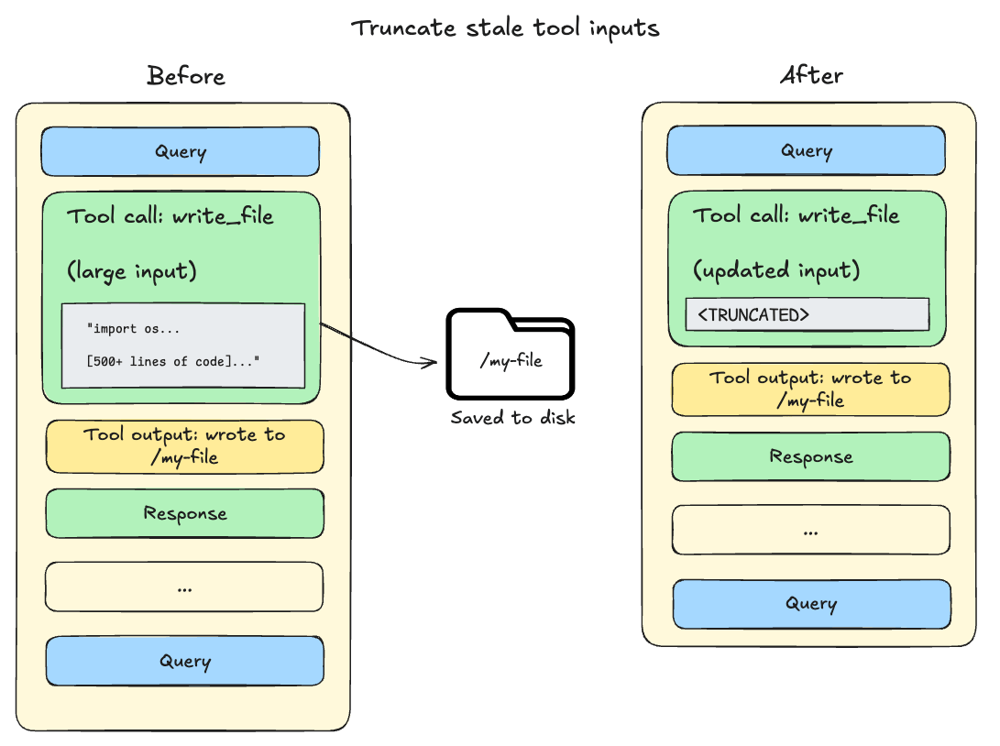
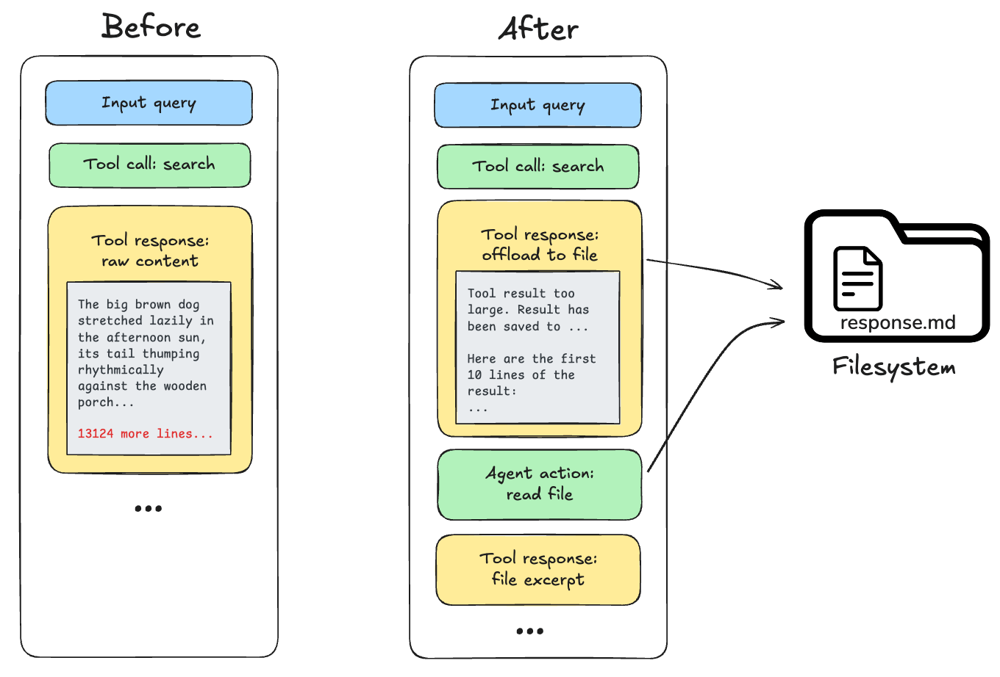
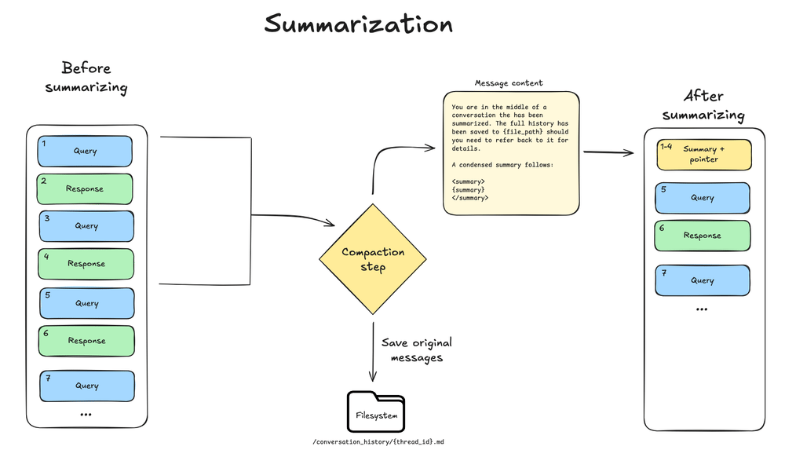

# Deep Agent 中的上下文工程


> 控制深度智能体可以访问的上下文以及如何在长时间运行的任务中管理它


上下文工程以正确的格式提供正确的信息和工具，以便您的深度智能体能够可靠地完成任务。


深度智能体可以访问多种上下文。一些资源在启动时提供给代理；其他的在运行时变得可用，例如用户输入。深度智能体包括用于管理长时间运行的会话中的上下文的内置机制。


此页面概述了您的深度智能体可以访问和管理的不同类型的上下文。


环境工程新手？有关不同类型的上下文以及何时使用它们，请参阅[概念概述](https://docs.langchain.com/oss/python/concepts/context)。


## 上下文类型


|上下文类型|你控制什么|范围|
| ---------------------------------------------------------- | --------------------------------------------------------------------------------- | --------------------------------- |
|**[输入上下文](#input-context)**|代理启动时的提示内容（系统提示、内存、技能）|静态，每次运行应用|
|**[运行时上下文](#runtime-context)**|调用时传递的静态配置（用户元数据、API 密钥、连接）|每次运行，传播到子智能体|
|**[上下文压缩](#context-compression)**|内置卸载和汇总，将上下文保持在窗口限制内|当接近极限时自动|
|**[上下文隔离](#context-isolation-with-subagents)**|使用子智能体隔离繁重的工作，仅将结果返回给主代理|每个子智能体，当被委托时|
|**[长期记忆](#long-term-memory)**|使用虚拟文件系统跨线程持久存储|对话中持续存在|


## 输入上下文


输入上下文是在启动时提供给深度智能体的信息，该信息成为其系统提示的一部分。最终的提示由几个来源组成：


  
**系统提示**


[查看相关页面](#system-prompt)


您提供的自定义说明以及内置代理指导。

  


  
**记忆**


[查看相关页面](#memory)


配置时始终加载持久 `AGENTS.md` 文件。

  


  
**技能**


[查看相关页面](#skills)


相关时加载按需功能（渐进式披露）。

  


  
**工具提示**


[查看相关页面](#tool-prompts)


使用内置工具或自定义工具的说明。

  

### 系统提示


您的自定义系统提示符位于内置系统提示符之前，其中包括文件系统工具和子智能体的指南。用它来定义代理的角色、行为和知识：


```python
from deepagents import create_deep_agent

agent = create_deep_agent(
    model="google_genai:gemini-3.6-flash",
    system_prompt=(
        "You are a research assistant specializing in scientific literature. "
        "Always cite sources. Use subagents for parallel research on different topics."
    ),
)
```


```python
from deepagents import create_deep_agent

agent = create_deep_agent(
    model="openai:gpt-5.5",
    system_prompt=(
        "You are a research assistant specializing in scientific literature. "
        "Always cite sources. Use subagents for parallel research on different topics."
    ),
)
```


```python
from deepagents import create_deep_agent

agent = create_deep_agent(
    model="anthropic:claude-sonnet-4-6",
    system_prompt=(
        "You are a research assistant specializing in scientific literature. "
        "Always cite sources. Use subagents for parallel research on different topics."
    ),
)
```


```python
from deepagents import create_deep_agent

agent = create_deep_agent(
    model="openrouter:z-ai/glm-5.2",
    system_prompt=(
        "You are a research assistant specializing in scientific literature. "
        "Always cite sources. Use subagents for parallel research on different topics."
    ),
)
```


```python
from deepagents import create_deep_agent

agent = create_deep_agent(
    model="fireworks:accounts/fireworks/models/glm-5p2",
    system_prompt=(
        "You are a research assistant specializing in scientific literature. "
        "Always cite sources. Use subagents for parallel research on different topics."
    ),
)
```


```python
from deepagents import create_deep_agent

agent = create_deep_agent(
    model="baseten:zai-org/GLM-5.2",
    system_prompt=(
        "You are a research assistant specializing in scientific literature. "
        "Always cite sources. Use subagents for parallel research on different topics."
    ),
)
```


```python
from deepagents import create_deep_agent

agent = create_deep_agent(
    model="ollama:north-mini-code-1.0",
    system_prompt=(
        "You are a research assistant specializing in scientific literature. "
        "Always cite sources. Use subagents for parallel research on different topics."
    ),
)
```


 `system_prompt` 参数是静态的，这意味着它不会在每次调用时发生更改。对于某些用例，您可能需要动态提示：例如，告诉模型“您具有管理员访问权限”与“您具有只读访问权限”，或者从[长期记忆](#long-term-memory)注入用户首选项，例如“用户更喜欢简洁的响应”。如果您的提示取决于上下文或 `runtime.store`，请使用 `@dynamic_prompt` 构建上下文感知指令。您的中间件可以读取 `request.runtime.context` 和 `request.runtime.store`。请参阅[自定义](customization.md#middleware)了解[深度智能体堆栈](customization.md#deep-agents-stack)以及添加[自定义中间件](https://docs.langchain.com/oss/python/langchain/middleware)。有关示例，请参阅[LangChain 上下文工程](https://docs.langchain.com/oss/python/langchain/context-engineering#system-prompt) 指南。


当工具单独使用上下文或 `runtime.store` 时，您**不需要**需要中间件；工具直接接收[ToolRuntime](https://reference.langchain.com/python/langchain/tools/#langchain.tools.ToolRuntime)对象（包括`runtime.context`和`runtime.store`）。仅当工具应与系统提示符更新一起打包时才添加中间件。


要调整特定提供商或型号的组装系统提示，请使用 [harness profile](profiles.md#harness-profiles)：`base_system_prompt` 完全替换基本提示，并附加 `system_prompt_suffix`。


### 记忆


内存文件 ([`AGENTS.md`](https://agents.md/)) 提供持久上下文，**始终加载**到系统提示符中。记住项目约定、用户偏好和适用于每次对话的关键准则：


```python
agent = create_deep_agent(
    model="google_genai:gemini-3.6-flash",
    memory=["/project/AGENTS.md", "~/.deepagents/preferences.md"],
)
```


```python
agent = create_deep_agent(
    model="openai:gpt-5.5",
    memory=["/project/AGENTS.md", "~/.deepagents/preferences.md"],
)
```


```python
agent = create_deep_agent(
    model="anthropic:claude-sonnet-4-6",
    memory=["/project/AGENTS.md", "~/.deepagents/preferences.md"],
)
```


```python
agent = create_deep_agent(
    model="openrouter:z-ai/glm-5.2",
    memory=["/project/AGENTS.md", "~/.deepagents/preferences.md"],
)
```


```python
agent = create_deep_agent(
    model="fireworks:accounts/fireworks/models/glm-5p2",
    memory=["/project/AGENTS.md", "~/.deepagents/preferences.md"],
)
```


```python
agent = create_deep_agent(
    model="baseten:zai-org/GLM-5.2",
    memory=["/project/AGENTS.md", "~/.deepagents/preferences.md"],
)
```


```python
agent = create_deep_agent(
    model="ollama:north-mini-code-1.0",
    memory=["/project/AGENTS.md", "~/.deepagents/preferences.md"],
)
```


 与技能不同，记忆总是被注入的——没有渐进的披露。保持最小内存以避免上下文过载；使用[技能](skills.md) 获取详细的工作流程和特定领域的内容。配置详情请参见[内存](customization.md#memory)。


要生成编程智能体通过 `AGENTS.md` 发现的存储库 wiki，请参阅 [OpenWiki](https://docs.langchain.com/oss/openwiki/overview)。


### 技能


技能提供**按需**功能。代理在启动时从每个 `SKILL.md` 读取 frontmatter，然后仅在确定技能相关时加载完整的技能内容。这减少了令牌的使用，同时仍然提供专门的工作流程：


```python
agent = create_deep_agent(
    model="google_genai:gemini-3.6-flash",
    skills=["/skills/"],
)
```


```python
agent = create_deep_agent(
    model="openai:gpt-5.5",
    skills=["/skills/"],
)
```


```python
agent = create_deep_agent(
    model="anthropic:claude-sonnet-4-6",
    skills=["/skills/"],
)
```


```python
agent = create_deep_agent(
    model="openrouter:z-ai/glm-5.2",
    skills=["/skills/"],
)
```


```python
agent = create_deep_agent(
    model="fireworks:accounts/fireworks/models/glm-5p2",
    skills=["/skills/"],
)
```


```python
agent = create_deep_agent(
    model="baseten:zai-org/GLM-5.2",
    skills=["/skills/"],
)
```


```python
agent = create_deep_agent(
    model="ollama:north-mini-code-1.0",
    skills=["/skills/"],
)
```


 让每项技能专注于单一工作流程或领域；广泛或重叠的技能会削弱相关性，并在加载时使上下文变得臃肿。在技​​能中，保持主要内容简洁，并将详细的参考材料移至技能文件中引用的单独文件中。将始终相关的约定放入[内存](#memory)中。请参阅[技能](skills.md) 以了解创作和配置。


### 工具提示


[工具](https://docs.langchain.com/oss/python/langchain/tools) 提示是决定模型如何使用工具的说明。所有工具都会公开模型在提示中看到的元数据 - 通常是模式和描述。您通过 `tools` 参数传递的工具将工具元数据（架构和描述）传递给模型。深度智能体的内置工具打包在[深度智能体堆栈](customization.md#deep-agents-stack) 中，通常还会更新系统提示，为这些工具提供更多指导。


**内置工具**：添加利用功能（文件系统、子智能体和可选规划）的中间件会自动将特定于工具的指令附加到系统提示符中，从而创建解释如何有效使用这些工具的工具提示。完整列表请参见[自定义](customization.md#middleware)：


* 文件系统提示：`ls`、`read_file`、`write_file`、`edit_file`、`delete`、`glob`、`grep`（以及使用沙箱后端时的 `execute`）的文档


* 子智能体提示：使用 `task` 工具委派工作的指南


* 人机交互提示：用于在指定工具调用时暂停（当设置 `interrupt_on` 时）


* 本地上下文提示：当前目录和项目信息（仅限 CLI）


**您提供的工具**：通过 `tools` 参数传递的工具将其描述（来自工具架构）发送到模型。您还可以添加[自定义中间件](https://docs.langchain.com/oss/python/langchain/middleware)，该中间件添加工具并附加其自己的系统提示指令。


对于您提供的工具，请确保提供清晰的名称、描述和参数描述。这些指导模型关于何时以及如何使用该工具的推理。在描述中包含*何时*使用该工具并描述每个参数的作用。


```python
from langchain.tools import tool


@tool(parse_docstring=True)
def search_orders(
    user_id: str,
    status: str,
    limit: int = 10,
) -> str:
    """Search for user orders by status.

    Use this when the user asks about order history or wants to check
    order status. Always filter by the provided status.

    Args:
        user_id: Unique identifier for the user
        status: Order status: 'pending', 'shipped', or 'delivered'
        limit: Maximum number of results to return
    """
    # Implementation here
    return f"orders for {user_id} with status {status} (limit {limit})"
```


 要覆盖特定提供程序或模型的内置或用户提供的工具的描述，请使用按工具名称键入的 [harness profile](profiles.md#harness-profiles) 的 `tool_description_overrides`。


未使用的内置工具仍然每次都会发送其完整模式。使用 `excluded_tools` 删除代理不应调用的工具（例如只读代理上的 `write_file` 或 `execute`）。这会缩小整个运行的基线提示大小。这是配置，而不是[上下文压缩](#context-compression)中的自动卸载或汇总。


请参阅[利用配置文件](profiles.md#harness-profiles) 和[在不使用默认文件系统工具的情况下运行](overview.md#virtual-filesystem-access)。


有关内置功能，请参阅[概述](overview.md#execution-environment)；有关直接传递工具的信息，请参阅[自定义](customization.md#tools)。


### 完整的系统提示


深度智能体的系统消息（模型在运行开始时收到的组装系统提示）由以下部分组成：


1. 定制 `system_prompt`（如果提供）
2. [基地代理提示](https://github.com/langchain-ai/deepagents/blob/e18e9dcd0e6edc72c0a4a5b76ae752c4bc539752/libs/deepagents/deepagents/graph.py#L37)
3. 内存提示：`AGENTS.md` + 内存使用指南（仅当提供`memory`时）
4. 技能提示：技能位置+技能列表及前置信息+用法（仅当提供技能时）
5. 虚拟文件系统提示（文件系统+执行工具文档，如果适用）
6. 子智能体提示：任务工具使用
7. 用户提供的中间件提示（如果提供了自定义中间件）
8. 人机交互提示（当设置`interrupt_on`时）


## 运行时上下文


运行时上下文是您调用代理时传递的每次运行配置。它不会自动包含在模型提示中；仅当工具、中间件或其他逻辑读取它并将其添加到消息或系统提示中时，模型才会看到它。使用用户元数据（ID、首选项、角色）、API 密钥、数据库连接、功能标志或工具和工具所需的其他值的运行时上下文。


使用 `context_schema` 定义该数据的形状：使用 `dataclasses.dataclass` 或 `typing.TypedDict` 类。将带有 **`context`** 参数的值传递给 `invoke` / `ainvoke`。有关完整详细信息，请参阅[运行时](https://docs.langchain.com/oss/python/langchain/runtime) 和 [LangGraph 运行时上下文](https://docs.langchain.com/oss/python/langgraph/graph-api#runtime-context)。


在工具内部，从注入的 [ToolRuntime](https://reference.langchain.com/python/langchain/tools/#langchain.tools.ToolRuntime) 读取上下文：


```python
from dataclasses import dataclass

from deepagents import create_deep_agent
from langchain.tools import ToolRuntime, tool


@dataclass
class Context:
    user_id: str
    api_key: str


@tool
def fetch_user_data(query: str, runtime: ToolRuntime[Context]) -> str:
    """Fetch data for the current user."""
    user_id = runtime.context.user_id
    return f"Data for user {user_id}: {query}"


agent = create_deep_agent(
    model="google_genai:gemini-3.6-flash",
    tools=[fetch_user_data],
    context_schema=Context,
)

result = agent.invoke(
    {"messages": [{"role": "user", "content": "Get my recent activity"}]},
    context=Context(user_id="user-123", api_key="sk-..."),
)
```


```python
from dataclasses import dataclass

from deepagents import create_deep_agent
from langchain.tools import ToolRuntime, tool


@dataclass
class Context:
    user_id: str
    api_key: str


@tool
def fetch_user_data(query: str, runtime: ToolRuntime[Context]) -> str:
    """Fetch data for the current user."""
    user_id = runtime.context.user_id
    return f"Data for user {user_id}: {query}"


agent = create_deep_agent(
    model="openai:gpt-5.5",
    tools=[fetch_user_data],
    context_schema=Context,
)

result = agent.invoke(
    {"messages": [{"role": "user", "content": "Get my recent activity"}]},
    context=Context(user_id="user-123", api_key="sk-..."),
)
```


```python
from dataclasses import dataclass

from deepagents import create_deep_agent
from langchain.tools import ToolRuntime, tool


@dataclass
class Context:
    user_id: str
    api_key: str


@tool
def fetch_user_data(query: str, runtime: ToolRuntime[Context]) -> str:
    """Fetch data for the current user."""
    user_id = runtime.context.user_id
    return f"Data for user {user_id}: {query}"


agent = create_deep_agent(
    model="anthropic:claude-sonnet-4-6",
    tools=[fetch_user_data],
    context_schema=Context,
)

result = agent.invoke(
    {"messages": [{"role": "user", "content": "Get my recent activity"}]},
    context=Context(user_id="user-123", api_key="sk-..."),
)
```


```python
from dataclasses import dataclass

from deepagents import create_deep_agent
from langchain.tools import ToolRuntime, tool


@dataclass
class Context:
    user_id: str
    api_key: str


@tool
def fetch_user_data(query: str, runtime: ToolRuntime[Context]) -> str:
    """Fetch data for the current user."""
    user_id = runtime.context.user_id
    return f"Data for user {user_id}: {query}"


agent = create_deep_agent(
    model="openrouter:z-ai/glm-5.2",
    tools=[fetch_user_data],
    context_schema=Context,
)

result = agent.invoke(
    {"messages": [{"role": "user", "content": "Get my recent activity"}]},
    context=Context(user_id="user-123", api_key="sk-..."),
)
```


```python
from dataclasses import dataclass

from deepagents import create_deep_agent
from langchain.tools import ToolRuntime, tool


@dataclass
class Context:
    user_id: str
    api_key: str


@tool
def fetch_user_data(query: str, runtime: ToolRuntime[Context]) -> str:
    """Fetch data for the current user."""
    user_id = runtime.context.user_id
    return f"Data for user {user_id}: {query}"


agent = create_deep_agent(
    model="fireworks:accounts/fireworks/models/glm-5p2",
    tools=[fetch_user_data],
    context_schema=Context,
)

result = agent.invoke(
    {"messages": [{"role": "user", "content": "Get my recent activity"}]},
    context=Context(user_id="user-123", api_key="sk-..."),
)
```


```python
from dataclasses import dataclass

from deepagents import create_deep_agent
from langchain.tools import ToolRuntime, tool


@dataclass
class Context:
    user_id: str
    api_key: str


@tool
def fetch_user_data(query: str, runtime: ToolRuntime[Context]) -> str:
    """Fetch data for the current user."""
    user_id = runtime.context.user_id
    return f"Data for user {user_id}: {query}"


agent = create_deep_agent(
    model="baseten:zai-org/GLM-5.2",
    tools=[fetch_user_data],
    context_schema=Context,
)

result = agent.invoke(
    {"messages": [{"role": "user", "content": "Get my recent activity"}]},
    context=Context(user_id="user-123", api_key="sk-..."),
)
```


```python
from dataclasses import dataclass

from deepagents import create_deep_agent
from langchain.tools import ToolRuntime, tool


@dataclass
class Context:
    user_id: str
    api_key: str


@tool
def fetch_user_data(query: str, runtime: ToolRuntime[Context]) -> str:
    """Fetch data for the current user."""
    user_id = runtime.context.user_id
    return f"Data for user {user_id}: {query}"


agent = create_deep_agent(
    model="ollama:north-mini-code-1.0",
    tools=[fetch_user_data],
    context_schema=Context,
)

result = agent.invoke(
    {"messages": [{"role": "user", "content": "Get my recent activity"}]},
    context=Context(user_id="user-123", api_key="sk-..."),
)
```


 运行时上下文**传播到所有子智能体**。当子智能体运行时，它会接收与父代理相同的运行时上下文。有关每个子智能体上下文（命名空间键），请参阅[子智能体](subagents.md#context-management)。


## 自定义状态模式


自定义状态模式需要 `deepagents>=0.6.6`。


当您的代理或中间件需要跟踪必须在整个代理生命周期中持续存在并在检查点中幸存的数据时，请使用自定义状态架构。自定义状态可以让您：


* **跟踪整个运行过程中的状态**：维护在模型调用和工具调用中存活的计数器、标志或累积值
* **在工具和中间件之间共享数据**：工具可以将值写入状态，中间件挂钩可以读取它，反之亦然
* **实现横切关注点**：添加速率限制、使用跟踪或审核日志记录等功能，而无需修改核心代理逻辑
* **在调用时传递初始值**：每次运行开始时种子状态字段，然后让代理在执行期间更新它们


当数据必须是代理可变图状态的一部分、通过线程设置检查点或通过 `runtime.state` 提供时，请使用 `state_schema`。对于不可变的每次运行输入（例如用户 ID、凭据或功能标志），首选 [运行时上下文](#runtime-context)。


自定义状态模式必须子类化 [DeepAgentState](https://reference.langchain.com/python/deepagents/graph/DeepAgentState)。这保留了 `messages` 上的内置 `DeltaChannel` 减速器，随着对话时间的延长，检查点的增长保持线性。


```python
from deepagents import DeepAgentState, create_deep_agent
from langchain.tools import ToolRuntime, tool


class ResearchState(DeepAgentState):
    page_url: str
    file_urls: list[str]


@tool
def cite_page(runtime: ToolRuntime) -> str:
    """Return the current page URL."""
    return runtime.state["page_url"]


agent = create_deep_agent(
    model="google_genai:gemini-3.6-flash",
    tools=[cite_page],
    state_schema=ResearchState,
)

result = agent.invoke(
    {
        "messages": [{"role": "user", "content": "Cite the current page"}],
        "page_url": "https://example.com/report",
        "file_urls": [],
    },
)
```


```python
from deepagents import DeepAgentState, create_deep_agent
from langchain.tools import ToolRuntime, tool


class ResearchState(DeepAgentState):
    page_url: str
    file_urls: list[str]


@tool
def cite_page(runtime: ToolRuntime) -> str:
    """Return the current page URL."""
    return runtime.state["page_url"]


agent = create_deep_agent(
    model="openai:gpt-5.5",
    tools=[cite_page],
    state_schema=ResearchState,
)

result = agent.invoke(
    {
        "messages": [{"role": "user", "content": "Cite the current page"}],
        "page_url": "https://example.com/report",
        "file_urls": [],
    },
)
```


```python
from deepagents import DeepAgentState, create_deep_agent
from langchain.tools import ToolRuntime, tool


class ResearchState(DeepAgentState):
    page_url: str
    file_urls: list[str]


@tool
def cite_page(runtime: ToolRuntime) -> str:
    """Return the current page URL."""
    return runtime.state["page_url"]


agent = create_deep_agent(
    model="anthropic:claude-sonnet-4-6",
    tools=[cite_page],
    state_schema=ResearchState,
)

result = agent.invoke(
    {
        "messages": [{"role": "user", "content": "Cite the current page"}],
        "page_url": "https://example.com/report",
        "file_urls": [],
    },
)
```


```python
from deepagents import DeepAgentState, create_deep_agent
from langchain.tools import ToolRuntime, tool


class ResearchState(DeepAgentState):
    page_url: str
    file_urls: list[str]


@tool
def cite_page(runtime: ToolRuntime) -> str:
    """Return the current page URL."""
    return runtime.state["page_url"]


agent = create_deep_agent(
    model="openrouter:z-ai/glm-5.2",
    tools=[cite_page],
    state_schema=ResearchState,
)

result = agent.invoke(
    {
        "messages": [{"role": "user", "content": "Cite the current page"}],
        "page_url": "https://example.com/report",
        "file_urls": [],
    },
)
```


```python
from deepagents import DeepAgentState, create_deep_agent
from langchain.tools import ToolRuntime, tool


class ResearchState(DeepAgentState):
    page_url: str
    file_urls: list[str]


@tool
def cite_page(runtime: ToolRuntime) -> str:
    """Return the current page URL."""
    return runtime.state["page_url"]


agent = create_deep_agent(
    model="fireworks:accounts/fireworks/models/glm-5p2",
    tools=[cite_page],
    state_schema=ResearchState,
)

result = agent.invoke(
    {
        "messages": [{"role": "user", "content": "Cite the current page"}],
        "page_url": "https://example.com/report",
        "file_urls": [],
    },
)
```


```python
from deepagents import DeepAgentState, create_deep_agent
from langchain.tools import ToolRuntime, tool


class ResearchState(DeepAgentState):
    page_url: str
    file_urls: list[str]


@tool
def cite_page(runtime: ToolRuntime) -> str:
    """Return the current page URL."""
    return runtime.state["page_url"]


agent = create_deep_agent(
    model="baseten:zai-org/GLM-5.2",
    tools=[cite_page],
    state_schema=ResearchState,
)

result = agent.invoke(
    {
        "messages": [{"role": "user", "content": "Cite the current page"}],
        "page_url": "https://example.com/report",
        "file_urls": [],
    },
)
```


```python
from deepagents import DeepAgentState, create_deep_agent
from langchain.tools import ToolRuntime, tool


class ResearchState(DeepAgentState):
    page_url: str
    file_urls: list[str]


@tool
def cite_page(runtime: ToolRuntime) -> str:
    """Return the current page URL."""
    return runtime.state["page_url"]


agent = create_deep_agent(
    model="ollama:north-mini-code-1.0",
    tools=[cite_page],
    state_schema=ResearchState,
)

result = agent.invoke(
    {
        "messages": [{"role": "user", "content": "Cite the current page"}],
        "page_url": "https://example.com/report",
        "file_urls": [],
    },
)
```


 该模式与中间件贡献的状态模式合并。当 Deep Agents 为 `task` 工具编译它们时，传递给 `subagents=` 的声明性 [SubAgent](https://reference.langchain.com/python/deepagents/middleware/subagents/SubAgent) 规范继承父级 `state_schema`。 [CompiledSubAgent](https://reference.langchain.com/python/deepagents/middleware/subagents/CompiledSubAgent) 可运行对象和远程 [AsyncSubAgent](https://reference.langchain.com/python/deepagents/middleware/async_subagents/AsyncSubAgent) 规范不会继承它，因为它们的图形已单独编译或托管。如果这些图需要相同的状态字段，请使用兼容的模式编译这些图。


## 上下文压缩


每个 `create_deep_agent` 调用都包含内置上下文压缩。您无需添加中间件即可进行卸载或汇总工作。


长时间运行的任务会产生大量的工具输出和较长的对话历史记录。上下文压缩可以减少代理工作记忆中的信息大小，同时保留与任务相关的细节。以下技术是确保传递给 LLM 的上下文保持在其上下文窗口限制内的内置机制：


  
**卸载**


[查看相关页面](#offloading)


大型工具输入和结果存储在文件系统中并替换为引用。

  


  
**总结**


[查看相关页面](#summarization)


当接近限制时，旧消息会被压缩到 LLM 生成的摘要中。

  

要在压缩运行之前缩小每次发送的工具架构，请通过 [harness profile](profiles.md#harness-profiles) (`excluded_tools`) 排除未使用的内置工具。参见【工具提示】(#tool-prompts)。


### 卸载


Deep Agent 使用[内置文件系统工具](overview.md#virtual-filesystem-access) 自动卸载内容并根据需要搜索和检索卸载的内容。当工具调用输入或结果超过令牌阈值（默认 20,000）时，就会发生内容卸载：


1. **工具调用输入超过 20,000 个令牌**：文件写入和编辑操作会在代理的对话历史记录中留下包含完整文件内容的工具调用。
由于此内容已持久保存到文件系统中，因此通常是多余的。当会话上下文跨越模型可用窗口的 85% 时，深度智能体会截断旧的工具调用，将其替换为指向磁盘上文件的指针，并减小活动上下文的大小。


   


2. **工具调用结果超过 20,000 个令牌**：当发生这种情况时，深度智能体会将响应卸载到配置的后端，并用文件路径引用和前 10 行的预览替换它。然后，代理可以根据需要重新阅读或搜索内容。


   


内置上下文压缩不会调整图像大小、降低图像分辨率或生成视觉嵌入。有关多模式输入、工具输出以及压缩如何与媒体交互，请参阅[多模式](multimodal.md)。


### 总结


每个 `create_deep_agent` 调用都包含 [裸堆栈](customization.md#bare-stack) 中的 [`SummarizationMiddleware`](https://reference.langchain.com/python/langchain/agents/middleware/summarization/SummarizationMiddleware)。当上下文大小超过模型的上下文窗口限制（例如 `max_input_tokens` 的 85%），并且没有更多上下文符合卸载条件时，深度智能体会自动汇总消息历史记录。


这个过程有两个组成部分：


* **上下文摘要**：LLM 生成对话的结构化摘要，包括会话意图、创建的工件和后续步骤，这会替换座席工作记忆中的完整对话历史记录。
* **文件系统保存**：原始对话消息的文本呈现作为规范记录写入文件系统。


这种双重方法确保代理保持对其目标和进度的了解（通过摘要），同时保留在需要时恢复文本详细信息的能力（通过文件系统搜索）。





**配置：**


* 在[模型配置文件](https://docs.langchain.com/oss/python/langchain/models#model-profiles) 中模型 `max_input_tokens` 的 85% 处触发
* 保留 10% 的令牌作为最近的上下文
* 如果模型配置文件不可用，则回落至 170,000 个令牌触发/保留 6 条消息
* 如果任何模型调用引发标准 [ContextOverflowError](https://reference.langchain.com/python/langchain-core/exceptions/ContextOverflowError)，深度智能体会立即回退到摘要并使用摘要 + 最近保留的消息重试
* 较旧的消息由模型进行总结


来自代理的[流令牌](streaming.md#llm-tokens)通常包括汇总步骤生成的令牌。您可以使用相关元数据过滤掉这些令牌：


```python
for chunk in agent.stream(
    {"messages": [...]},
    stream_mode="messages",
    version="v2",
):
    token, metadata = chunk["data"]
    if metadata.get("lc_source") == "summarization":  # [!code highlight]
        continue
    else:
        ...
```


##### 按需压缩工具


默认情况下，自动摘要会在达到上下文阈值时运行。另外，您可以为代理提供 `compact_conversation` [工具](https://docs.langchain.com/oss/python/langchain/tools)，以便它可以按需触发压缩（例如在任务之间），而不是等待 85% 阈值。


通过使用 `create_deep_agent` 上的 `middleware` 参数传递 [`create_summarization_tool_middleware`](https://reference.langchain.com/python/deepagents/middleware/summarization/create_summarization_tool_middleware) 来启用该工具。自定义中间件插入到[深度智能体堆栈](customization.md#deep-agents-stack)中的[`PatchToolCallsMiddleware`](https://reference.langchain.com/python/deepagents/middleware/patch_tool_calls/PatchToolCallsMiddleware)之后：


```python
from deepagents import create_deep_agent
from deepagents.backends import StateBackend
from deepagents.middleware.summarization import create_summarization_tool_middleware

backend = StateBackend  # if using default backend

model = "google_genai:gemini-3.6-flash"
agent = create_deep_agent(
    model=model,
    middleware=[  # [!code highlight]
        create_summarization_tool_middleware(model, backend),  # [!code highlight]
    ],  # [!code highlight]
)
```


```python
from deepagents import create_deep_agent
from deepagents.backends import StateBackend
from deepagents.middleware.summarization import create_summarization_tool_middleware

backend = StateBackend  # if using default backend

model = "openai:gpt-5.5"
agent = create_deep_agent(
    model=model,
    middleware=[  # [!code highlight]
        create_summarization_tool_middleware(model, backend),  # [!code highlight]
    ],  # [!code highlight]
)
```


```python
from deepagents import create_deep_agent
from deepagents.backends import StateBackend
from deepagents.middleware.summarization import create_summarization_tool_middleware

backend = StateBackend  # if using default backend

model = "anthropic:claude-sonnet-4-6"
agent = create_deep_agent(
    model=model,
    middleware=[  # [!code highlight]
        create_summarization_tool_middleware(model, backend),  # [!code highlight]
    ],  # [!code highlight]
)
```


```python
from deepagents import create_deep_agent
from deepagents.backends import StateBackend
from deepagents.middleware.summarization import create_summarization_tool_middleware

backend = StateBackend  # if using default backend

model = "openrouter:z-ai/glm-5.2"
agent = create_deep_agent(
    model=model,
    middleware=[  # [!code highlight]
        create_summarization_tool_middleware(model, backend),  # [!code highlight]
    ],  # [!code highlight]
)
```


```python
from deepagents import create_deep_agent
from deepagents.backends import StateBackend
from deepagents.middleware.summarization import create_summarization_tool_middleware

backend = StateBackend  # if using default backend

model = "fireworks:accounts/fireworks/models/glm-5p2"
agent = create_deep_agent(
    model=model,
    middleware=[  # [!code highlight]
        create_summarization_tool_middleware(model, backend),  # [!code highlight]
    ],  # [!code highlight]
)
```


```python
from deepagents import create_deep_agent
from deepagents.backends import StateBackend
from deepagents.middleware.summarization import create_summarization_tool_middleware

backend = StateBackend  # if using default backend

model = "baseten:zai-org/GLM-5.2"
agent = create_deep_agent(
    model=model,
    middleware=[  # [!code highlight]
        create_summarization_tool_middleware(model, backend),  # [!code highlight]
    ],  # [!code highlight]
)
```


```python
from deepagents import create_deep_agent
from deepagents.backends import StateBackend
from deepagents.middleware.summarization import create_summarization_tool_middleware

backend = StateBackend  # if using default backend

model = "ollama:north-mini-code-1.0"
agent = create_deep_agent(
    model=model,
    middleware=[  # [!code highlight]
        create_summarization_tool_middleware(model, backend),  # [!code highlight]
    ],  # [!code highlight]
)
```


 添加压缩工具不会在模型上下文限制的 85% 时禁用自动摘要。两者共享相同的摘要引擎和状态。


有关详细信息，请参阅 API 参考中的 [`SummarizationToolMiddleware`](https://reference.langchain.com/python/deepagents/middleware/summarization/SummarizationToolMiddleware) 和 [`create_summarization_tool_middleware`](https://reference.langchain.com/python/deepagents/middleware/summarization/create_summarization_tool_middleware)。


## 与子智能体的上下文隔离


子智能体解决了**上下文膨胀问题**。当主代理使用具有大量输出的工具（网络搜索、文件读取、数据库查询）时，上下文窗口很快就会填满。子智能体隔离了这项工作——主代理仅接收最终结果，而不是产生该结果的数十个工具调用。您还可以独立于主代理配置每个子智能体（例如，模型、工具、系统提示和技能）。


**它是如何工作的：**


* 主代理有一个 `task` 工具来委派工作
* 子智能体以其自己的新上下文运行
* 子智能体自主执行直至完成
* 子智能体向主代理返回单个最终报告
* 主要代理的上下文保持干净


**最佳实践：**


1. **委派复杂任务**：使用子智能体进行多步骤工作，这会扰乱主代理的上下文。


2. **保持子智能体响应简洁**：指示子智能体返回摘要，而不是原始数据：


```python
research_subagent = {
    "name": "researcher",
    "description": "Conducts research on a topic",
    "system_prompt": """You are a research assistant.
    IMPORTANT: Return only the essential summary (under 500 words).
    Do NOT include raw search results or detailed tool outputs.""",
    "tools": [web_search],
}
```


3. **使用文件系统处理大数据**：子智能体可以将结果写入文件；主代理读取它需要的内容。


有关配置，请参阅[子智能体](subagents.md)；有关运行时上下文传播和每个子智能体命名空间，请参阅[上下文管理](subagents.md#context-management)。


## 长期记忆


使用默认文件系统时，深度智能体将其工作内存文件存储在代理状态中，该状态仅在单个线程中持续存在。长期记忆使您的深度智能体能够跨不同线程和对话保存信息。深度智能体可以使用长期记忆来存储用户偏好、积累的知识、研究进展或任何应在单个会话之后持续存在的信息。


要使用长期内存，您必须使用 `CompositeBackend` 将特定路径（通常为 `/memories/`）路由到 LangGraph Store，从而提供持久的跨线程持久性。 `CompositeBackend` 是一种混合存储系统，其中一些文件无限期地保留，而其他文件则保留在单个线程范围内。


```python
from deepagents import create_deep_agent
from deepagents.backends import CompositeBackend, StateBackend, StoreBackend
from langgraph.store.memory import InMemoryStore

store = InMemoryStore()

agent = create_deep_agent(
    model="google_genai:gemini-3.6-flash",
    store=store,
    backend=CompositeBackend(
        default=StateBackend(),
        routes={
            "/memories/": StoreBackend(namespace=lambda _rt: ("memories",)),
        },
    ),
    system_prompt="""When users tell you their preferences, save them to
    /memories/user_preferences.txt so you remember them in future conversations.""",
)
```


```python
from deepagents import create_deep_agent
from deepagents.backends import CompositeBackend, StateBackend, StoreBackend
from langgraph.store.memory import InMemoryStore

store = InMemoryStore()

agent = create_deep_agent(
    model="openai:gpt-5.5",
    store=store,
    backend=CompositeBackend(
        default=StateBackend(),
        routes={
            "/memories/": StoreBackend(namespace=lambda _rt: ("memories",)),
        },
    ),
    system_prompt="""When users tell you their preferences, save them to
    /memories/user_preferences.txt so you remember them in future conversations.""",
)
```


```python
from deepagents import create_deep_agent
from deepagents.backends import CompositeBackend, StateBackend, StoreBackend
from langgraph.store.memory import InMemoryStore

store = InMemoryStore()

agent = create_deep_agent(
    model="anthropic:claude-sonnet-4-6",
    store=store,
    backend=CompositeBackend(
        default=StateBackend(),
        routes={
            "/memories/": StoreBackend(namespace=lambda _rt: ("memories",)),
        },
    ),
    system_prompt="""When users tell you their preferences, save them to
    /memories/user_preferences.txt so you remember them in future conversations.""",
)
```


```python
from deepagents import create_deep_agent
from deepagents.backends import CompositeBackend, StateBackend, StoreBackend
from langgraph.store.memory import InMemoryStore

store = InMemoryStore()

agent = create_deep_agent(
    model="openrouter:z-ai/glm-5.2",
    store=store,
    backend=CompositeBackend(
        default=StateBackend(),
        routes={
            "/memories/": StoreBackend(namespace=lambda _rt: ("memories",)),
        },
    ),
    system_prompt="""When users tell you their preferences, save them to
    /memories/user_preferences.txt so you remember them in future conversations.""",
)
```


```python
from deepagents import create_deep_agent
from deepagents.backends import CompositeBackend, StateBackend, StoreBackend
from langgraph.store.memory import InMemoryStore

store = InMemoryStore()

agent = create_deep_agent(
    model="fireworks:accounts/fireworks/models/glm-5p2",
    store=store,
    backend=CompositeBackend(
        default=StateBackend(),
        routes={
            "/memories/": StoreBackend(namespace=lambda _rt: ("memories",)),
        },
    ),
    system_prompt="""When users tell you their preferences, save them to
    /memories/user_preferences.txt so you remember them in future conversations.""",
)
```


```python
from deepagents import create_deep_agent
from deepagents.backends import CompositeBackend, StateBackend, StoreBackend
from langgraph.store.memory import InMemoryStore

store = InMemoryStore()

agent = create_deep_agent(
    model="baseten:zai-org/GLM-5.2",
    store=store,
    backend=CompositeBackend(
        default=StateBackend(),
        routes={
            "/memories/": StoreBackend(namespace=lambda _rt: ("memories",)),
        },
    ),
    system_prompt="""When users tell you their preferences, save them to
    /memories/user_preferences.txt so you remember them in future conversations.""",
)
```


```python
from deepagents import create_deep_agent
from deepagents.backends import CompositeBackend, StateBackend, StoreBackend
from langgraph.store.memory import InMemoryStore

store = InMemoryStore()

agent = create_deep_agent(
    model="ollama:north-mini-code-1.0",
    store=store,
    backend=CompositeBackend(
        default=StateBackend(),
        routes={
            "/memories/": StoreBackend(namespace=lambda _rt: ("memories",)),
        },
    ),
    system_prompt="""When users tell you their preferences, save them to
    /memories/user_preferences.txt so you remember them in future conversations.""",
)
```


 您不需要使用文件预先填充 `/memories/`。您提供后端配置、存储和系统提示指令，告诉代理“保存什么”和“在哪里”。例如，您可以提示代理将首选项存储在 `/memories/preferences.txt` 中。该路径开始为空，当用户共享值得记住的信息时，代理会使用其文件系统工具（`write_file`、`edit_file`）按需创建文件。


要预先植入内存，请在 LangSmith 上部署时使用 [Store API](https://docs.langchain.com/langsmith/custom-store)。有关设置和用例，请参阅[长期存储器](memory.md)。


## 最佳实践


1. **从正确的输入上下文开始**：为始终相关的约定保持最小的内存；使用专注技能来实现特定任务的能力。
2. **利用子智能体完成繁重的工作**：委派多步骤、输出繁重的任务，以保持主代理的上下文干净。
3. **在配置中调整子智能体输出**：如果您在调试时注意到子智能体生成长输出，则可以向子智能体的 `system_prompt` 添加指导以创建摘要和综合结果。
4. **使用文件系统**：将大型输出保留到文件（例如子智能体写入或[自动卸载](#offloading)），以便活动上下文保持较小；当模型需要细节时，可以使用 `read_file` 和 `grep` 拉取片段。
5. **记录长期记忆结构**：告诉代理 `/memories/` 中存在什么以及如何使用它。
6. **传递工具的运行时上下文**：使用 `context` 来获取用户元数据、API 密钥以及工具所需的其他静态配置。


## 相关资源


* [Harness](overview.md)：上下文管理概述、卸载、
总结* [多模态](multimodal.md)：图像、音频、视频和多模态工具输出
* [Subagents](subagents.md)：上下文隔离，运行时上下文传播
* [长期记忆](memory.md)：跨线程持久化
* * [OpenWiki](https://docs.langchain.com/oss/openwiki/overview)：编程智能体通过 `AGENTS.md` 找到的存储库 wiki
* [技能](skills.md)：渐进式披露和技能创作
* [后端](backends.md)：文件系统后端和 CompositeBackend
* [上下文概念概述](https://docs.langchain.com/oss/python/concepts/context)：上下文类型和生命周期


***


<div className="source-links">


  

[将这些文档](https://docs.langchain.com/use-these-docs) 通过 MCP 连接到 Claude、VSCode 等以获得实时答案。

  


  

[在 GitHub 上编辑此页面](https://github.com/langchain-ai/docs/edit/main/src/oss/deepagents/context-engineering.mdx) 或 [提交问题](https://github.com/langchain-ai/docs/issues/new/choose)。

  

</div>

