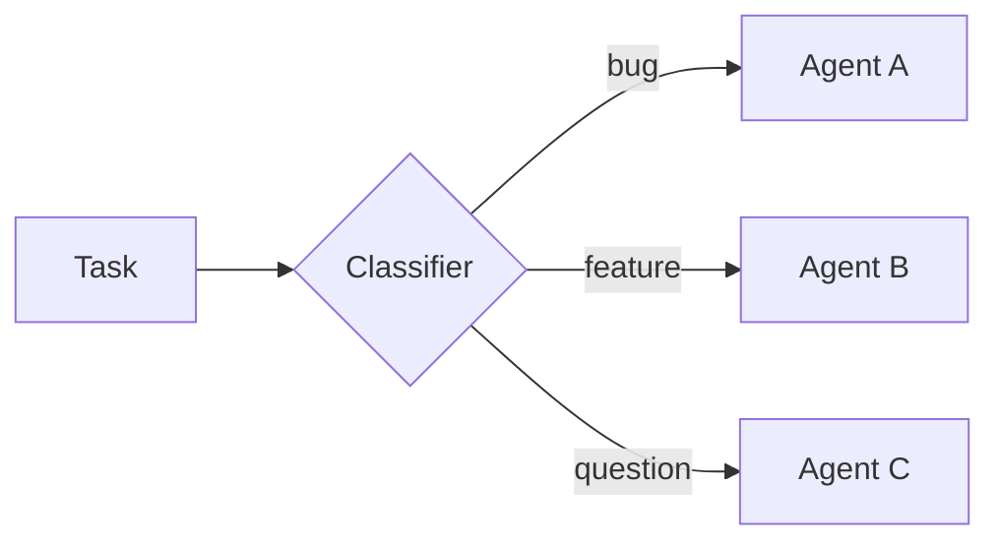
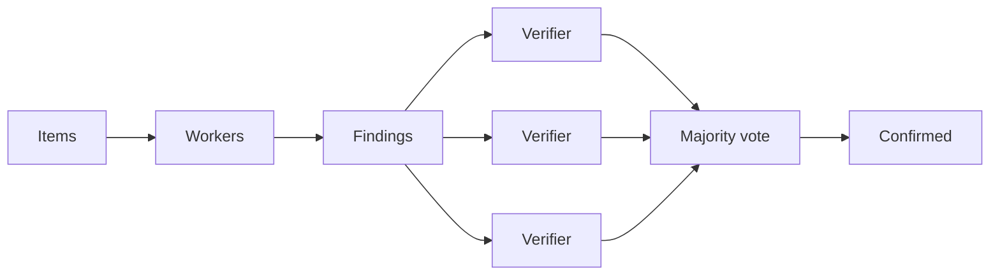
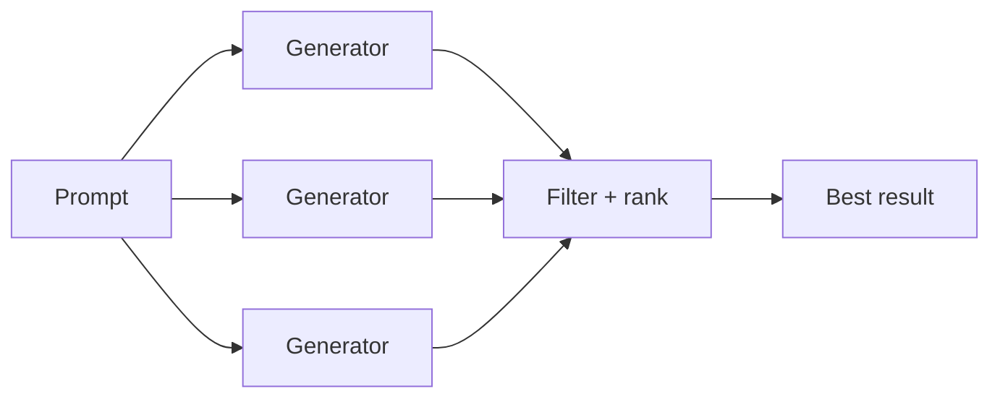
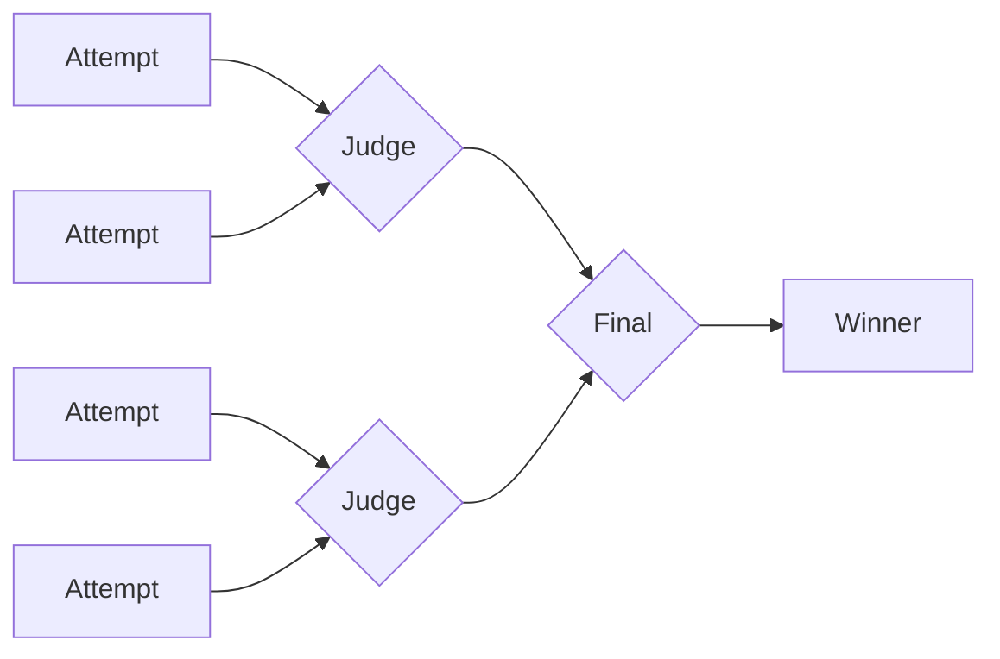
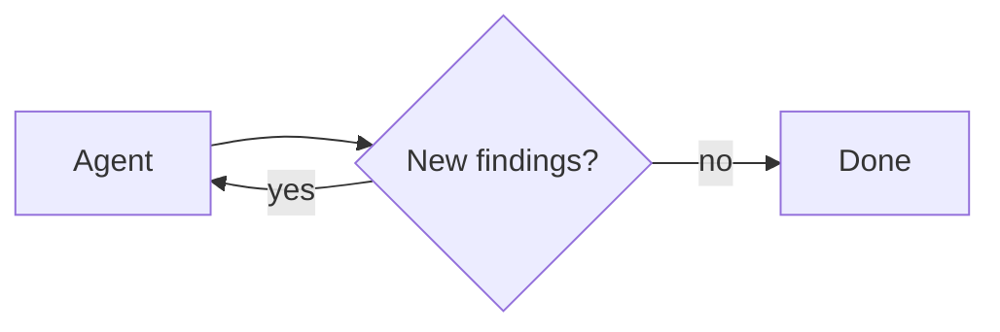

# 动态子智能体


> 使用解释器从代码中调度和编排 Deep Agents 子智能体


动态子智能体允许代理从解释器代码中调度 [子智能体](subagents.md)。代理可以使用 JavaScript 循环、分支和并行批处理来跨配置的子智能体路由工作并综合结果，而不是要求模型一次选择一个子智能体调用。


当工作跨越许多独立单元、需要多个视角或受益于递归分析时，请使用此模式。有关一般解释器设置，请参阅[解释器](interpreters.md)。


动态子智能体使用解释器运行时，该运行时位于 [**beta**](https://docs.langchain.com/oss/python/versioning) 中。 API 和生命周期行为可能会在版本之间发生变化。


解释器需要 `langchain-quickjs>=0.2.0` 和 Python `>=3.11`。


## 快速入门


动态子智能体需要[解释器](interpreters.md)中间件。首先安装并连接解释器。内置的[通用子智能体](subagents.md#default-subagent) 无需额外配置即可处理基本扇出。


```python
from deepagents import create_deep_agent
from langchain_quickjs import CodeInterpreterMiddleware

agent = create_deep_agent(
    model="google_genai:gemini-3.6-flash",
    subagents=[{
        "name": "reviewer",
        "description": "Reviews code for security issues, citing lines and severity",
        "system_prompt": "You are a security-focused code reviewer. Report issues with line numbers and severity.",
    }],
    middleware=[CodeInterpreterMiddleware()],
)
```


```python
from deepagents import create_deep_agent
from langchain_quickjs import CodeInterpreterMiddleware

agent = create_deep_agent(
    model="openai:gpt-5.5",
    subagents=[{
        "name": "reviewer",
        "description": "Reviews code for security issues, citing lines and severity",
        "system_prompt": "You are a security-focused code reviewer. Report issues with line numbers and severity.",
    }],
    middleware=[CodeInterpreterMiddleware()],
)
```


```python
from deepagents import create_deep_agent
from langchain_quickjs import CodeInterpreterMiddleware

agent = create_deep_agent(
    model="anthropic:claude-sonnet-4-6",
    subagents=[{
        "name": "reviewer",
        "description": "Reviews code for security issues, citing lines and severity",
        "system_prompt": "You are a security-focused code reviewer. Report issues with line numbers and severity.",
    }],
    middleware=[CodeInterpreterMiddleware()],
)
```


```python
from deepagents import create_deep_agent
from langchain_quickjs import CodeInterpreterMiddleware

agent = create_deep_agent(
    model="openrouter:z-ai/glm-5.2",
    subagents=[{
        "name": "reviewer",
        "description": "Reviews code for security issues, citing lines and severity",
        "system_prompt": "You are a security-focused code reviewer. Report issues with line numbers and severity.",
    }],
    middleware=[CodeInterpreterMiddleware()],
)
```


```python
from deepagents import create_deep_agent
from langchain_quickjs import CodeInterpreterMiddleware

agent = create_deep_agent(
    model="fireworks:accounts/fireworks/models/glm-5p2",
    subagents=[{
        "name": "reviewer",
        "description": "Reviews code for security issues, citing lines and severity",
        "system_prompt": "You are a security-focused code reviewer. Report issues with line numbers and severity.",
    }],
    middleware=[CodeInterpreterMiddleware()],
)
```


```python
from deepagents import create_deep_agent
from langchain_quickjs import CodeInterpreterMiddleware

agent = create_deep_agent(
    model="baseten:zai-org/GLM-5.2",
    subagents=[{
        "name": "reviewer",
        "description": "Reviews code for security issues, citing lines and severity",
        "system_prompt": "You are a security-focused code reviewer. Report issues with line numbers and severity.",
    }],
    middleware=[CodeInterpreterMiddleware()],
)
```


```python
from deepagents import create_deep_agent
from langchain_quickjs import CodeInterpreterMiddleware

agent = create_deep_agent(
    model="ollama:north-mini-code-1.0",
    subagents=[{
        "name": "reviewer",
        "description": "Reviews code for security issues, citing lines and severity",
        "system_prompt": "You are a security-focused code reviewer. Report issues with line numbers and severity.",
    }],
    middleware=[CodeInterpreterMiddleware()],
)
```


 有关安装步骤和解释器设置，请参阅[解释器](interpreters.md#quickstart)。


对于专门工作，请使用自己的名称、描述和系统提示配置自定义[子智能体](subagents.md)。子智能体的名称和描述作为代理评估要达到哪个角色的信息。


要触发动态子智能体，请使用单词“workflow”提示代理：


```python
result = agent.invoke({
    "messages": [{"role": "user", "content": "Run a workflow that reviews every file in src/routes/ and summarizes the top risks."}]
})
```


 **“工作流”一词是一个有用的触发器。** 解释器系统提示将“工作流”视为通过解释器组织工作的信号，从代码中调度带有 `task()` 的子智能体，而不是一次通过一个模型选择的工具调用的项目。将请求表述为“工作流”是一个有意的杠杆，您可以选择动态编排。对于单一的直接授权，请清楚地表达请求。


使用LangChain终端编程智能体`dcode`的动态子智能体？ `dcode` 附带启用的代码解释器，因此动态子智能体可以开箱即用。有关设置和使用详细信息，请参阅[dcode 子智能体页面](https://docs.langchain.com/oss/deepagents/code/subagents)。


## 它是如何运作的


当代理具有 [子智能体](subagents.md) 和解释器中间件时，解释器会公开从代码中调度子智能体的内置 `task()` 全局变量。跨越许多独立单元的任务（检查目录中的每个文件，对一批票进行分类）成为一个循环，使工作分散，因此它确定性地运行，而不是一次调用一个模型选择的工具。


子智能体编排还支持递归语言模型 (RLM) 工作流程，即[递归语言模型论文](https://arxiv.org/abs/2512.24601) 中描述的方法：将工作集保留在解释器变量中，选择切片，使用 `task()` 调用子智能体，然后综合结果。


许多编排工作流程将动态子智能体与[编程工具调用 (PTC)](interpreters.md#programmatic-tool-calling-ptc) 相结合：使用解释器代码中的 `tools.*` 来发现或过滤输入，然后使用 `task()` 调度子智能体。 PTC默认关闭；通过解释器中间件上的显式允许列表启用它。


`task()` 是进入子智能体执行的能力桥梁，类似于工具的 PTC。有关隔离默认值、审批边界和中间件选项，请参阅[安全](interpreters.md#security) 和[配置](interpreters.md#configuration)。


使用 `mode="thread"`（默认值）时，多轮编排可以跨代理轮次保留解释器变量。请参阅解释器页面上的[持久性](interpreters.md#persistence)。


`task()` 采用以下输入：


* `description`：子智能体的提示符
* `subagentType`：配置了哪个子智能体来运行
* `responseSchema`（可选）：结构化输出


`task()` 运行完整的代理循环并解析为子智能体的结果：


```ts
const review = await task({
  description: "Review src/auth/login.ts for auth issues. Cite line numbers.",
  subagentType: "reviewer",
  responseSchema: {
    type: "object",
    properties: {
      issues: { type: "array", items: { type: "object", properties: {
        file: { type: "string" }, line: { type: "number" },
        severity: { type: "string" }, description: { type: "string" },
      }}},
    },
  },
});

// With responseSchema, the result is already a typed value, so no JSON.parse is needed.
const critical = review.issues.filter((issue) => issue.severity === "high");
```


 当你传递`responseSchema`时，解析的值已经是一个类型化的JavaScript对象；仅当子智能体故意返回 JSON 字符串时才调用 `JSON.parse`。


## 图案


代理根据任务的形状选择策略；这些来自它编写解释器代码的方式，而不是来自配置，并且您提供的子智能体决定了它可以做什么。每个模式都共享相同的编排方法：在 JS 变量中保存工作，使用 `task()` 分派子智能体，并在代码中组合结果。下图显示了常见的形状，每个形状都有一个可运行的示例。


### 分类并采取行动


首先对项目进行分类，然后每个项目由专门的子智能体根据其分类进行处理。这使您可以处理不同项目需要不同专业知识的混合输入。





 **用例：** 对支持票证、错误日志、用户反馈或需要根据其类型进行不同处理的任何批次的项目进行分类。


**示例：分类和行动**


**您配置的内容**


  


```python
from deepagents import create_deep_agent
from langchain_quickjs import CodeInterpreterMiddleware

agent = create_deep_agent(
    model="google_genai:gemini-3.6-flash",
    subagents=[
        {
            "name": "bug-fixer",
            "description": "Investigates bug reports and provides reproduction steps",
            "system_prompt": "You are a bug triage specialist. Investigate each bug report and provide clear reproduction steps.",
        },
        {
            "name": "feature-analyst",
            "description": "Evaluates feature requests for feasibility and effort",
            "system_prompt": "You are a product analyst. Evaluate each feature request for technical feasibility, estimated effort, and potential impact.",
        },
        {
            "name": "support-agent",
            "description": "Answers user questions based on documentation",
            "system_prompt": "You are a support specialist. Answer user questions clearly based on the available documentation.",
        },
    ],
    middleware=[CodeInterpreterMiddleware()],
)
```


```python
from deepagents import create_deep_agent
from langchain_quickjs import CodeInterpreterMiddleware

agent = create_deep_agent(
    model="openai:gpt-5.5",
    subagents=[
        {
            "name": "bug-fixer",
            "description": "Investigates bug reports and provides reproduction steps",
            "system_prompt": "You are a bug triage specialist. Investigate each bug report and provide clear reproduction steps.",
        },
        {
            "name": "feature-analyst",
            "description": "Evaluates feature requests for feasibility and effort",
            "system_prompt": "You are a product analyst. Evaluate each feature request for technical feasibility, estimated effort, and potential impact.",
        },
        {
            "name": "support-agent",
            "description": "Answers user questions based on documentation",
            "system_prompt": "You are a support specialist. Answer user questions clearly based on the available documentation.",
        },
    ],
    middleware=[CodeInterpreterMiddleware()],
)
```


```python
from deepagents import create_deep_agent
from langchain_quickjs import CodeInterpreterMiddleware

agent = create_deep_agent(
    model="anthropic:claude-sonnet-4-6",
    subagents=[
        {
            "name": "bug-fixer",
            "description": "Investigates bug reports and provides reproduction steps",
            "system_prompt": "You are a bug triage specialist. Investigate each bug report and provide clear reproduction steps.",
        },
        {
            "name": "feature-analyst",
            "description": "Evaluates feature requests for feasibility and effort",
            "system_prompt": "You are a product analyst. Evaluate each feature request for technical feasibility, estimated effort, and potential impact.",
        },
        {
            "name": "support-agent",
            "description": "Answers user questions based on documentation",
            "system_prompt": "You are a support specialist. Answer user questions clearly based on the available documentation.",
        },
    ],
    middleware=[CodeInterpreterMiddleware()],
)
```


```python
from deepagents import create_deep_agent
from langchain_quickjs import CodeInterpreterMiddleware

agent = create_deep_agent(
    model="openrouter:z-ai/glm-5.2",
    subagents=[
        {
            "name": "bug-fixer",
            "description": "Investigates bug reports and provides reproduction steps",
            "system_prompt": "You are a bug triage specialist. Investigate each bug report and provide clear reproduction steps.",
        },
        {
            "name": "feature-analyst",
            "description": "Evaluates feature requests for feasibility and effort",
            "system_prompt": "You are a product analyst. Evaluate each feature request for technical feasibility, estimated effort, and potential impact.",
        },
        {
            "name": "support-agent",
            "description": "Answers user questions based on documentation",
            "system_prompt": "You are a support specialist. Answer user questions clearly based on the available documentation.",
        },
    ],
    middleware=[CodeInterpreterMiddleware()],
)
```


```python
from deepagents import create_deep_agent
from langchain_quickjs import CodeInterpreterMiddleware

agent = create_deep_agent(
    model="fireworks:accounts/fireworks/models/glm-5p2",
    subagents=[
        {
            "name": "bug-fixer",
            "description": "Investigates bug reports and provides reproduction steps",
            "system_prompt": "You are a bug triage specialist. Investigate each bug report and provide clear reproduction steps.",
        },
        {
            "name": "feature-analyst",
            "description": "Evaluates feature requests for feasibility and effort",
            "system_prompt": "You are a product analyst. Evaluate each feature request for technical feasibility, estimated effort, and potential impact.",
        },
        {
            "name": "support-agent",
            "description": "Answers user questions based on documentation",
            "system_prompt": "You are a support specialist. Answer user questions clearly based on the available documentation.",
        },
    ],
    middleware=[CodeInterpreterMiddleware()],
)
```


```python
from deepagents import create_deep_agent
from langchain_quickjs import CodeInterpreterMiddleware

agent = create_deep_agent(
    model="baseten:zai-org/GLM-5.2",
    subagents=[
        {
            "name": "bug-fixer",
            "description": "Investigates bug reports and provides reproduction steps",
            "system_prompt": "You are a bug triage specialist. Investigate each bug report and provide clear reproduction steps.",
        },
        {
            "name": "feature-analyst",
            "description": "Evaluates feature requests for feasibility and effort",
            "system_prompt": "You are a product analyst. Evaluate each feature request for technical feasibility, estimated effort, and potential impact.",
        },
        {
            "name": "support-agent",
            "description": "Answers user questions based on documentation",
            "system_prompt": "You are a support specialist. Answer user questions clearly based on the available documentation.",
        },
    ],
    middleware=[CodeInterpreterMiddleware()],
)
```


```python
from deepagents import create_deep_agent
from langchain_quickjs import CodeInterpreterMiddleware

agent = create_deep_agent(
    model="ollama:north-mini-code-1.0",
    subagents=[
        {
            "name": "bug-fixer",
            "description": "Investigates bug reports and provides reproduction steps",
            "system_prompt": "You are a bug triage specialist. Investigate each bug report and provide clear reproduction steps.",
        },
        {
            "name": "feature-analyst",
            "description": "Evaluates feature requests for feasibility and effort",
            "system_prompt": "You are a product analyst. Evaluate each feature request for technical feasibility, estimated effort, and potential impact.",
        },
        {
            "name": "support-agent",
            "description": "Answers user questions based on documentation",
            "system_prompt": "You are a support specialist. Answer user questions clearly based on the available documentation.",
        },
    ],
    middleware=[CodeInterpreterMiddleware()],
)
```


  


 **代理人写的内容**


```ts
// The agent has already classified each ticket; this routes every item to
// the right specialist and collects the handled results.
const SPECIALIST = { bug: "bug-fixer", feature: "feature-analyst", question: "support-agent" };

const handled = await Promise.all(
  tickets.map((ticket) =>
    task({
      description: `Handle this ${ticket.category}:\n${ticket.text}`,
      subagentType: SPECIALIST[ticket.category],
    }),
  ),
);
// ... group handled results by category into a single triage report
handled;
```


### 扇出和合成


代理在许多项目上并行分派相同类型的工作，然后组合结果。


 **用例：** 跨目录进行代码审查、分析一批文档、处理日志文件、跨多个服务运行相同的检查。


从解释器代码中发现文件需要[编程工具调用(PTC)](interpreters.md#programmatic-tool-calling-ptc)。在解释器中间件上的 PTC 允许列表中启用 `glob`。


**示例：扇出和合成**


**您配置的内容**


  


```python
from deepagents import create_deep_agent
from langchain_quickjs import CodeInterpreterMiddleware

agent = create_deep_agent(
    model="google_genai:gemini-3.6-flash",
    subagents=[{
        "name": "reviewer",
        "description": "Reviews code for security issues, citing lines and severity",
        "system_prompt": "You are a security-focused code reviewer. Read the file carefully and report any authentication or authorization issues with line numbers and severity.",
    }],
    middleware=[CodeInterpreterMiddleware(ptc=["glob"])],
)
```


```python
from deepagents import create_deep_agent
from langchain_quickjs import CodeInterpreterMiddleware

agent = create_deep_agent(
    model="openai:gpt-5.5",
    subagents=[{
        "name": "reviewer",
        "description": "Reviews code for security issues, citing lines and severity",
        "system_prompt": "You are a security-focused code reviewer. Read the file carefully and report any authentication or authorization issues with line numbers and severity.",
    }],
    middleware=[CodeInterpreterMiddleware(ptc=["glob"])],
)
```


```python
from deepagents import create_deep_agent
from langchain_quickjs import CodeInterpreterMiddleware

agent = create_deep_agent(
    model="anthropic:claude-sonnet-4-6",
    subagents=[{
        "name": "reviewer",
        "description": "Reviews code for security issues, citing lines and severity",
        "system_prompt": "You are a security-focused code reviewer. Read the file carefully and report any authentication or authorization issues with line numbers and severity.",
    }],
    middleware=[CodeInterpreterMiddleware(ptc=["glob"])],
)
```


```python
from deepagents import create_deep_agent
from langchain_quickjs import CodeInterpreterMiddleware

agent = create_deep_agent(
    model="openrouter:z-ai/glm-5.2",
    subagents=[{
        "name": "reviewer",
        "description": "Reviews code for security issues, citing lines and severity",
        "system_prompt": "You are a security-focused code reviewer. Read the file carefully and report any authentication or authorization issues with line numbers and severity.",
    }],
    middleware=[CodeInterpreterMiddleware(ptc=["glob"])],
)
```


```python
from deepagents import create_deep_agent
from langchain_quickjs import CodeInterpreterMiddleware

agent = create_deep_agent(
    model="fireworks:accounts/fireworks/models/glm-5p2",
    subagents=[{
        "name": "reviewer",
        "description": "Reviews code for security issues, citing lines and severity",
        "system_prompt": "You are a security-focused code reviewer. Read the file carefully and report any authentication or authorization issues with line numbers and severity.",
    }],
    middleware=[CodeInterpreterMiddleware(ptc=["glob"])],
)
```


```python
from deepagents import create_deep_agent
from langchain_quickjs import CodeInterpreterMiddleware

agent = create_deep_agent(
    model="baseten:zai-org/GLM-5.2",
    subagents=[{
        "name": "reviewer",
        "description": "Reviews code for security issues, citing lines and severity",
        "system_prompt": "You are a security-focused code reviewer. Read the file carefully and report any authentication or authorization issues with line numbers and severity.",
    }],
    middleware=[CodeInterpreterMiddleware(ptc=["glob"])],
)
```


```python
from deepagents import create_deep_agent
from langchain_quickjs import CodeInterpreterMiddleware

agent = create_deep_agent(
    model="ollama:north-mini-code-1.0",
    subagents=[{
        "name": "reviewer",
        "description": "Reviews code for security issues, citing lines and severity",
        "system_prompt": "You are a security-focused code reviewer. Read the file carefully and report any authentication or authorization issues with line numbers and severity.",
    }],
    middleware=[CodeInterpreterMiddleware(ptc=["glob"])],
)
```


  


 **代理人写的内容**


```ts
// One reviewer per file, dispatched in parallel, then findings merged.
const files = (await tools.glob({ pattern: "src/routes/**/*.ts" }))
  .split("\n")
  .filter(Boolean);

const reviews = await Promise.all(
  files.map((file) =>
    task({
      description: `Review ${file} for authentication issues. Cite line numbers.`,
      subagentType: "reviewer",
      responseSchema: issuesSchema, // -> { issues: [{ file, line, severity }] }
    }),
  ),
);

const issues = reviews.flatMap((r) => r.issues);
// ... sort by severity, drop duplicates, summarize the top risks
issues;
```


### 对抗性验证


两遍模式。第一步产生结果。第二遍将每个发现发送给独立验证者，并且仅保留符合协议的发现。当信心比速度更重要时，这可以减少误报。





 **使用案例：**误报代价高昂的安全审计、合规性检查以及需要对结果具有高度信心的任何审查。


**示例：对抗性验证**


**您配置的内容**


  


```python
from deepagents import create_deep_agent
from langchain_quickjs import CodeInterpreterMiddleware

agent = create_deep_agent(
    model="google_genai:gemini-3.6-flash",
    subagents=[
        {
            "name": "reviewer",
            "description": "Finds potential security vulnerabilities in code",
            "system_prompt": "You are a security auditor. Find potential vulnerabilities and report each with file, line, and description.",
        },
        {
            "name": "verifier",
            "description": "Independently verifies whether a reported vulnerability is real",
            "system_prompt": "You are a security verification specialist. Given a reported vulnerability, independently verify whether it is exploitable. Be skeptical. Only confirm real issues.",
        },
    ],
    middleware=[CodeInterpreterMiddleware()],
)
```


```python
from deepagents import create_deep_agent
from langchain_quickjs import CodeInterpreterMiddleware

agent = create_deep_agent(
    model="openai:gpt-5.5",
    subagents=[
        {
            "name": "reviewer",
            "description": "Finds potential security vulnerabilities in code",
            "system_prompt": "You are a security auditor. Find potential vulnerabilities and report each with file, line, and description.",
        },
        {
            "name": "verifier",
            "description": "Independently verifies whether a reported vulnerability is real",
            "system_prompt": "You are a security verification specialist. Given a reported vulnerability, independently verify whether it is exploitable. Be skeptical. Only confirm real issues.",
        },
    ],
    middleware=[CodeInterpreterMiddleware()],
)
```


```python
from deepagents import create_deep_agent
from langchain_quickjs import CodeInterpreterMiddleware

agent = create_deep_agent(
    model="anthropic:claude-sonnet-4-6",
    subagents=[
        {
            "name": "reviewer",
            "description": "Finds potential security vulnerabilities in code",
            "system_prompt": "You are a security auditor. Find potential vulnerabilities and report each with file, line, and description.",
        },
        {
            "name": "verifier",
            "description": "Independently verifies whether a reported vulnerability is real",
            "system_prompt": "You are a security verification specialist. Given a reported vulnerability, independently verify whether it is exploitable. Be skeptical. Only confirm real issues.",
        },
    ],
    middleware=[CodeInterpreterMiddleware()],
)
```


```python
from deepagents import create_deep_agent
from langchain_quickjs import CodeInterpreterMiddleware

agent = create_deep_agent(
    model="openrouter:z-ai/glm-5.2",
    subagents=[
        {
            "name": "reviewer",
            "description": "Finds potential security vulnerabilities in code",
            "system_prompt": "You are a security auditor. Find potential vulnerabilities and report each with file, line, and description.",
        },
        {
            "name": "verifier",
            "description": "Independently verifies whether a reported vulnerability is real",
            "system_prompt": "You are a security verification specialist. Given a reported vulnerability, independently verify whether it is exploitable. Be skeptical. Only confirm real issues.",
        },
    ],
    middleware=[CodeInterpreterMiddleware()],
)
```


```python
from deepagents import create_deep_agent
from langchain_quickjs import CodeInterpreterMiddleware

agent = create_deep_agent(
    model="fireworks:accounts/fireworks/models/glm-5p2",
    subagents=[
        {
            "name": "reviewer",
            "description": "Finds potential security vulnerabilities in code",
            "system_prompt": "You are a security auditor. Find potential vulnerabilities and report each with file, line, and description.",
        },
        {
            "name": "verifier",
            "description": "Independently verifies whether a reported vulnerability is real",
            "system_prompt": "You are a security verification specialist. Given a reported vulnerability, independently verify whether it is exploitable. Be skeptical. Only confirm real issues.",
        },
    ],
    middleware=[CodeInterpreterMiddleware()],
)
```


```python
from deepagents import create_deep_agent
from langchain_quickjs import CodeInterpreterMiddleware

agent = create_deep_agent(
    model="baseten:zai-org/GLM-5.2",
    subagents=[
        {
            "name": "reviewer",
            "description": "Finds potential security vulnerabilities in code",
            "system_prompt": "You are a security auditor. Find potential vulnerabilities and report each with file, line, and description.",
        },
        {
            "name": "verifier",
            "description": "Independently verifies whether a reported vulnerability is real",
            "system_prompt": "You are a security verification specialist. Given a reported vulnerability, independently verify whether it is exploitable. Be skeptical. Only confirm real issues.",
        },
    ],
    middleware=[CodeInterpreterMiddleware()],
)
```


```python
from deepagents import create_deep_agent
from langchain_quickjs import CodeInterpreterMiddleware

agent = create_deep_agent(
    model="ollama:north-mini-code-1.0",
    subagents=[
        {
            "name": "reviewer",
            "description": "Finds potential security vulnerabilities in code",
            "system_prompt": "You are a security auditor. Find potential vulnerabilities and report each with file, line, and description.",
        },
        {
            "name": "verifier",
            "description": "Independently verifies whether a reported vulnerability is real",
            "system_prompt": "You are a security verification specialist. Given a reported vulnerability, independently verify whether it is exploitable. Be skeptical. Only confirm real issues.",
        },
    ],
    middleware=[CodeInterpreterMiddleware()],
)
```


  


 **代理人写的内容**


```ts
// Pass 1: audit. Pass 2: verify each finding independently; keep only confirmed.
const { findings } = await task({
  description: "Audit the payments module for vulnerabilities.",
  subagentType: "reviewer",
  responseSchema: findingsSchema, // -> { findings: [{ id, file, line, description }] }
});

const verdicts = await Promise.all(
  findings.map((f) =>
    task({
      description: `Verify ${f.file}:${f.line} (${f.description}). Confirm or refute.`,
      subagentType: "verifier",
      responseSchema: verdictSchema, // -> { confirmed: boolean }
    }),
  ),
);

const confirmed = findings.filter((_, i) => verdicts[i]?.confirmed);
// ... report only the confirmed vulnerabilities
confirmed;
```


### 生成并过滤


多个子智能体针对同一问题生成独立的解决方案。代理在代码中对结果进行比较、评分和过滤，只保留最好的。





 **用例：** 架构提案、重构策略、内容变化以及在提交之前探索多个选项的任何任务会产生更好的结果。


**示例：生成和过滤**


**您配置的内容**


  


```python
from deepagents import create_deep_agent
from langchain_quickjs import CodeInterpreterMiddleware

agent = create_deep_agent(
    model="google_genai:gemini-3.6-flash",
    subagents=[{
        "name": "architect",
        "description": "Proposes a database schema design with tradeoff analysis",
        "system_prompt": "You are a database architect. Propose a schema design for the given requirements. Include tradeoffs, migration considerations, and a clear rationale.",
    }],
    middleware=[CodeInterpreterMiddleware()],
)
```


```python
from deepagents import create_deep_agent
from langchain_quickjs import CodeInterpreterMiddleware

agent = create_deep_agent(
    model="openai:gpt-5.5",
    subagents=[{
        "name": "architect",
        "description": "Proposes a database schema design with tradeoff analysis",
        "system_prompt": "You are a database architect. Propose a schema design for the given requirements. Include tradeoffs, migration considerations, and a clear rationale.",
    }],
    middleware=[CodeInterpreterMiddleware()],
)
```


```python
from deepagents import create_deep_agent
from langchain_quickjs import CodeInterpreterMiddleware

agent = create_deep_agent(
    model="anthropic:claude-sonnet-4-6",
    subagents=[{
        "name": "architect",
        "description": "Proposes a database schema design with tradeoff analysis",
        "system_prompt": "You are a database architect. Propose a schema design for the given requirements. Include tradeoffs, migration considerations, and a clear rationale.",
    }],
    middleware=[CodeInterpreterMiddleware()],
)
```


```python
from deepagents import create_deep_agent
from langchain_quickjs import CodeInterpreterMiddleware

agent = create_deep_agent(
    model="openrouter:z-ai/glm-5.2",
    subagents=[{
        "name": "architect",
        "description": "Proposes a database schema design with tradeoff analysis",
        "system_prompt": "You are a database architect. Propose a schema design for the given requirements. Include tradeoffs, migration considerations, and a clear rationale.",
    }],
    middleware=[CodeInterpreterMiddleware()],
)
```


```python
from deepagents import create_deep_agent
from langchain_quickjs import CodeInterpreterMiddleware

agent = create_deep_agent(
    model="fireworks:accounts/fireworks/models/glm-5p2",
    subagents=[{
        "name": "architect",
        "description": "Proposes a database schema design with tradeoff analysis",
        "system_prompt": "You are a database architect. Propose a schema design for the given requirements. Include tradeoffs, migration considerations, and a clear rationale.",
    }],
    middleware=[CodeInterpreterMiddleware()],
)
```


```python
from deepagents import create_deep_agent
from langchain_quickjs import CodeInterpreterMiddleware

agent = create_deep_agent(
    model="baseten:zai-org/GLM-5.2",
    subagents=[{
        "name": "architect",
        "description": "Proposes a database schema design with tradeoff analysis",
        "system_prompt": "You are a database architect. Propose a schema design for the given requirements. Include tradeoffs, migration considerations, and a clear rationale.",
    }],
    middleware=[CodeInterpreterMiddleware()],
)
```


```python
from deepagents import create_deep_agent
from langchain_quickjs import CodeInterpreterMiddleware

agent = create_deep_agent(
    model="ollama:north-mini-code-1.0",
    subagents=[{
        "name": "architect",
        "description": "Proposes a database schema design with tradeoff analysis",
        "system_prompt": "You are a database architect. Propose a schema design for the given requirements. Include tradeoffs, migration considerations, and a clear rationale.",
    }],
    middleware=[CodeInterpreterMiddleware()],
)
```


  


 **代理人写的内容**


```ts
// Generate independent proposals in parallel, then score and keep the best.
const proposals = await Promise.all(
  [1, 2, 3].map((n) =>
    task({
      description: `Approach ${n}: redesign the orders schema, with tradeoffs.`,
      subagentType: "architect",
      responseSchema: designSchema, // -> { design, tradeoffs }
    }),
  ),
);

// ... score each proposal against the requirements
const best = proposals.sort((a, b) => score(b) - score(a))[0];
best;
```


### 比赛


裁判副代理人将对各种变化进行正面比较，获胜者将通过淘汰赛晋级。





 **用例：** 根据主观标准、风格选择、竞争实现之间的选择进行优化。


**示例：锦标赛**


**您配置的内容**


  


```python
from deepagents import create_deep_agent
from langchain_quickjs import CodeInterpreterMiddleware

agent = create_deep_agent(
    model="google_genai:gemini-3.6-flash",
    subagents=[
        {
            "name": "writer",
            "description": "Rewrites a function with a focus on readability and clarity",
            "system_prompt": "You are an expert programmer focused on clean code. Rewrite the given function to maximize readability. Explain your choices.",
        },
        {
            "name": "judge",
            "description": "Compares two code implementations and picks the more readable one",
            "system_prompt": "You are a code quality judge. Compare two implementations and pick the more readable one. Justify your choice with specific criteria.",
        },
    ],
    middleware=[CodeInterpreterMiddleware()],
)
```


```python
from deepagents import create_deep_agent
from langchain_quickjs import CodeInterpreterMiddleware

agent = create_deep_agent(
    model="openai:gpt-5.5",
    subagents=[
        {
            "name": "writer",
            "description": "Rewrites a function with a focus on readability and clarity",
            "system_prompt": "You are an expert programmer focused on clean code. Rewrite the given function to maximize readability. Explain your choices.",
        },
        {
            "name": "judge",
            "description": "Compares two code implementations and picks the more readable one",
            "system_prompt": "You are a code quality judge. Compare two implementations and pick the more readable one. Justify your choice with specific criteria.",
        },
    ],
    middleware=[CodeInterpreterMiddleware()],
)
```


```python
from deepagents import create_deep_agent
from langchain_quickjs import CodeInterpreterMiddleware

agent = create_deep_agent(
    model="anthropic:claude-sonnet-4-6",
    subagents=[
        {
            "name": "writer",
            "description": "Rewrites a function with a focus on readability and clarity",
            "system_prompt": "You are an expert programmer focused on clean code. Rewrite the given function to maximize readability. Explain your choices.",
        },
        {
            "name": "judge",
            "description": "Compares two code implementations and picks the more readable one",
            "system_prompt": "You are a code quality judge. Compare two implementations and pick the more readable one. Justify your choice with specific criteria.",
        },
    ],
    middleware=[CodeInterpreterMiddleware()],
)
```


```python
from deepagents import create_deep_agent
from langchain_quickjs import CodeInterpreterMiddleware

agent = create_deep_agent(
    model="openrouter:z-ai/glm-5.2",
    subagents=[
        {
            "name": "writer",
            "description": "Rewrites a function with a focus on readability and clarity",
            "system_prompt": "You are an expert programmer focused on clean code. Rewrite the given function to maximize readability. Explain your choices.",
        },
        {
            "name": "judge",
            "description": "Compares two code implementations and picks the more readable one",
            "system_prompt": "You are a code quality judge. Compare two implementations and pick the more readable one. Justify your choice with specific criteria.",
        },
    ],
    middleware=[CodeInterpreterMiddleware()],
)
```


```python
from deepagents import create_deep_agent
from langchain_quickjs import CodeInterpreterMiddleware

agent = create_deep_agent(
    model="fireworks:accounts/fireworks/models/glm-5p2",
    subagents=[
        {
            "name": "writer",
            "description": "Rewrites a function with a focus on readability and clarity",
            "system_prompt": "You are an expert programmer focused on clean code. Rewrite the given function to maximize readability. Explain your choices.",
        },
        {
            "name": "judge",
            "description": "Compares two code implementations and picks the more readable one",
            "system_prompt": "You are a code quality judge. Compare two implementations and pick the more readable one. Justify your choice with specific criteria.",
        },
    ],
    middleware=[CodeInterpreterMiddleware()],
)
```


```python
from deepagents import create_deep_agent
from langchain_quickjs import CodeInterpreterMiddleware

agent = create_deep_agent(
    model="baseten:zai-org/GLM-5.2",
    subagents=[
        {
            "name": "writer",
            "description": "Rewrites a function with a focus on readability and clarity",
            "system_prompt": "You are an expert programmer focused on clean code. Rewrite the given function to maximize readability. Explain your choices.",
        },
        {
            "name": "judge",
            "description": "Compares two code implementations and picks the more readable one",
            "system_prompt": "You are a code quality judge. Compare two implementations and pick the more readable one. Justify your choice with specific criteria.",
        },
    ],
    middleware=[CodeInterpreterMiddleware()],
)
```


```python
from deepagents import create_deep_agent
from langchain_quickjs import CodeInterpreterMiddleware

agent = create_deep_agent(
    model="ollama:north-mini-code-1.0",
    subagents=[
        {
            "name": "writer",
            "description": "Rewrites a function with a focus on readability and clarity",
            "system_prompt": "You are an expert programmer focused on clean code. Rewrite the given function to maximize readability. Explain your choices.",
        },
        {
            "name": "judge",
            "description": "Compares two code implementations and picks the more readable one",
            "system_prompt": "You are a code quality judge. Compare two implementations and pick the more readable one. Justify your choice with specific criteria.",
        },
    ],
    middleware=[CodeInterpreterMiddleware()],
)
```


  


 **代理人写的内容**


```ts
// Generate variants, then judge pairwise until a single winner remains.
let bracket = await Promise.all(
  [1, 2, 3, 4, 5].map((n) =>
    task({ description: `Rewrite processOrder for readability (variant ${n}).`, subagentType: "writer" }),
  ),
);

while (bracket.length > 1) {
  const winners = [];
  for (let i = 0; i < bracket.length; i += 2) {
    if (bracket[i + 1] === undefined) { winners.push(bracket[i]); break; }
    const { winner } = await task({
      description: `Pick the more readable:\n\nA:\n${bracket[i]}\n\nB:\n${bracket[i + 1]}`,
      subagentType: "judge",
      responseSchema: pickSchema, // -> { winner: "A" | "B" }
    });
    winners.push(winner === "A" ? bracket[i] : bracket[i + 1]);
  }
  bracket = winners;
}
bracket[0]; // the winning rewrite
```


### 循环直到完成


该代理运行一个发现循环，对已发现的内容进行重复数据删除，直到没有新结果出现。当预先不知道工作范围时很有用。





 **用例：** 详尽的搜索、死代码检测、依赖性审计、任何您想要完整性而不是固定数量结果的扫描。


**示例：循环直到完成**


**您配置的内容**


  


```python
from deepagents import create_deep_agent
from langchain_quickjs import CodeInterpreterMiddleware

agent = create_deep_agent(
    model="google_genai:gemini-3.6-flash",
    subagents=[{
        "name": "analyzer",
        "description": "Analyzes code for unused exports, functions, and dead code paths",
        "system_prompt": "You are a code analyst specializing in dead code detection. Find unused exports, unreachable functions, and orphaned modules. Report each with file path and evidence.",
    }],
    middleware=[CodeInterpreterMiddleware()],
)
```


```python
from deepagents import create_deep_agent
from langchain_quickjs import CodeInterpreterMiddleware

agent = create_deep_agent(
    model="openai:gpt-5.5",
    subagents=[{
        "name": "analyzer",
        "description": "Analyzes code for unused exports, functions, and dead code paths",
        "system_prompt": "You are a code analyst specializing in dead code detection. Find unused exports, unreachable functions, and orphaned modules. Report each with file path and evidence.",
    }],
    middleware=[CodeInterpreterMiddleware()],
)
```


```python
from deepagents import create_deep_agent
from langchain_quickjs import CodeInterpreterMiddleware

agent = create_deep_agent(
    model="anthropic:claude-sonnet-4-6",
    subagents=[{
        "name": "analyzer",
        "description": "Analyzes code for unused exports, functions, and dead code paths",
        "system_prompt": "You are a code analyst specializing in dead code detection. Find unused exports, unreachable functions, and orphaned modules. Report each with file path and evidence.",
    }],
    middleware=[CodeInterpreterMiddleware()],
)
```


```python
from deepagents import create_deep_agent
from langchain_quickjs import CodeInterpreterMiddleware

agent = create_deep_agent(
    model="openrouter:z-ai/glm-5.2",
    subagents=[{
        "name": "analyzer",
        "description": "Analyzes code for unused exports, functions, and dead code paths",
        "system_prompt": "You are a code analyst specializing in dead code detection. Find unused exports, unreachable functions, and orphaned modules. Report each with file path and evidence.",
    }],
    middleware=[CodeInterpreterMiddleware()],
)
```


```python
from deepagents import create_deep_agent
from langchain_quickjs import CodeInterpreterMiddleware

agent = create_deep_agent(
    model="fireworks:accounts/fireworks/models/glm-5p2",
    subagents=[{
        "name": "analyzer",
        "description": "Analyzes code for unused exports, functions, and dead code paths",
        "system_prompt": "You are a code analyst specializing in dead code detection. Find unused exports, unreachable functions, and orphaned modules. Report each with file path and evidence.",
    }],
    middleware=[CodeInterpreterMiddleware()],
)
```


```python
from deepagents import create_deep_agent
from langchain_quickjs import CodeInterpreterMiddleware

agent = create_deep_agent(
    model="baseten:zai-org/GLM-5.2",
    subagents=[{
        "name": "analyzer",
        "description": "Analyzes code for unused exports, functions, and dead code paths",
        "system_prompt": "You are a code analyst specializing in dead code detection. Find unused exports, unreachable functions, and orphaned modules. Report each with file path and evidence.",
    }],
    middleware=[CodeInterpreterMiddleware()],
)
```


```python
from deepagents import create_deep_agent
from langchain_quickjs import CodeInterpreterMiddleware

agent = create_deep_agent(
    model="ollama:north-mini-code-1.0",
    subagents=[{
        "name": "analyzer",
        "description": "Analyzes code for unused exports, functions, and dead code paths",
        "system_prompt": "You are a code analyst specializing in dead code detection. Find unused exports, unreachable functions, and orphaned modules. Report each with file path and evidence.",
    }],
    middleware=[CodeInterpreterMiddleware()],
)
```


  


 **代理人写的内容**


```ts
// Keep dispatching rounds, deduping against what's found, until a round adds nothing.
const seen = new Set();
const found = [];

while (true) {
  const { items } = await task({
    description: `Find dead code. Already found: ${[...seen].join(", ") || "(none)"}.`,
    subagentType: "analyzer",
    responseSchema: itemsSchema, // -> { items: [{ id, file }] }
  });
  const fresh = items.filter((i) => !seen.has(i.id));
  if (fresh.length === 0) break; // converged: nothing new
  for (const i of fresh) { seen.add(i.id); found.push(i); }
}
found;
```


 `task()` 从已运行的 `eval` 调用内部调度。它不经过正常的工具调用路径，因此每次调度时不会强制执行父代理上的 `interrupt_on` 审批工作流。如果您在子智能体编排运行之前需要批准，请控制 `eval` 工具本身。


## 禁用动态子智能体


只要代理有子智能体，子智能体调度就会默认打开。如果您希望子智能体仅通过正常的 `task` 工具路径可用，请禁用它。对于其他中间件选项，请参阅解释器页面上的[配置](interpreters.md#configuration)。


```python
from deepagents import create_deep_agent
from langchain_quickjs import CodeInterpreterMiddleware

agent = create_deep_agent(
    model="google_genai:gemini-3.6-flash",
    subagents=[{"name": "reviewer", "description": "Reviews code", "system_prompt": "Review code."}],
    middleware=[CodeInterpreterMiddleware(subagents=False)],
)
```


```python
from deepagents import create_deep_agent
from langchain_quickjs import CodeInterpreterMiddleware

agent = create_deep_agent(
    model="openai:gpt-5.5",
    subagents=[{"name": "reviewer", "description": "Reviews code", "system_prompt": "Review code."}],
    middleware=[CodeInterpreterMiddleware(subagents=False)],
)
```


```python
from deepagents import create_deep_agent
from langchain_quickjs import CodeInterpreterMiddleware

agent = create_deep_agent(
    model="anthropic:claude-sonnet-4-6",
    subagents=[{"name": "reviewer", "description": "Reviews code", "system_prompt": "Review code."}],
    middleware=[CodeInterpreterMiddleware(subagents=False)],
)
```


```python
from deepagents import create_deep_agent
from langchain_quickjs import CodeInterpreterMiddleware

agent = create_deep_agent(
    model="openrouter:z-ai/glm-5.2",
    subagents=[{"name": "reviewer", "description": "Reviews code", "system_prompt": "Review code."}],
    middleware=[CodeInterpreterMiddleware(subagents=False)],
)
```


```python
from deepagents import create_deep_agent
from langchain_quickjs import CodeInterpreterMiddleware

agent = create_deep_agent(
    model="fireworks:accounts/fireworks/models/glm-5p2",
    subagents=[{"name": "reviewer", "description": "Reviews code", "system_prompt": "Review code."}],
    middleware=[CodeInterpreterMiddleware(subagents=False)],
)
```


```python
from deepagents import create_deep_agent
from langchain_quickjs import CodeInterpreterMiddleware

agent = create_deep_agent(
    model="baseten:zai-org/GLM-5.2",
    subagents=[{"name": "reviewer", "description": "Reviews code", "system_prompt": "Review code."}],
    middleware=[CodeInterpreterMiddleware(subagents=False)],
)
```


```python
from deepagents import create_deep_agent
from langchain_quickjs import CodeInterpreterMiddleware

agent = create_deep_agent(
    model="ollama:north-mini-code-1.0",
    subagents=[{"name": "reviewer", "description": "Reviews code", "system_prompt": "Review code."}],
    middleware=[CodeInterpreterMiddleware(subagents=False)],
)
```


## 参见


* [解释器](interpreters.md)：QuickJS 设置、编程工具调用、持久性、安全性和中间件配置
* [子智能体](subagents.md)：配置子智能体名称、描述和系统提示
* [事件流](event-streaming.md)：从协调器和委托子智能体流式传输更新


***


<div className="source-links">


  

[将这些文档](https://docs.langchain.com/use-these-docs) 通过 MCP 连接到 Claude、VSCode 等以获得实时答案。

  


  

[在 GitHub 上编辑此页面](https://github.com/langchain-ai/docs/edit/main/src/oss/deepagents/dynamic-subagents.mdx) 或 [提交问题](https://github.com/langchain-ai/docs/issues/new/choose)。

  

</div>

