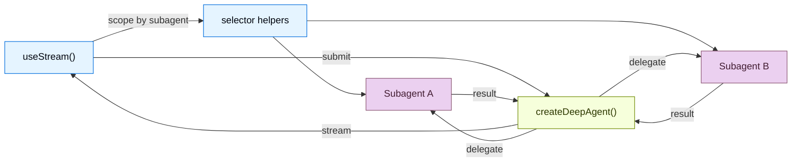

# 概述


> 构建显示实时子智能体流、任务进度和深度智能体沙箱的 UI


构建实时可视化深度智能体工作流程的前端。这些模式展示了如何从使用 `createDeepAgent` 创建的代理中呈现子智能体进度、任务规划、流内容和类似 IDE 的沙箱体验。


当 UI 使委托可见时，深度智能体最为有用。 LangChain SDK 没有显示单个不透明的助手气泡，而是公开了协调器、子智能体发现、自定义状态和沙箱支持的工件，以便用户可以检查长时间运行的任务是如何分解和完成的。


这些模式使用 v1 前端 SDK 包。如果您使用的是早期版本，请参阅 [React](https://github.com/langchain-ai/langgraphjs/blob/main/libs/sdk-react/docs/v1-migration.md)、[Vue](https://github.com/langchain-ai/langgraphjs/blob/main/libs/sdk-vue/docs/v1-migration.md)、[Svelte](https://github.com/langchain-ai/langgraphjs/blob/main/libs/sdk-svelte/docs/v1-migration.md) 和 [Angular](https://github.com/langchain-ai/langgraphjs/blob/main/libs/sdk-angular/docs/v1-migration.md) 的迁移指南。


## 建筑学


深度智能体使用协调员-工作人员架构。主代理计划任务并将其委托给专门的子智能体，每个子智能体独立运行。在前端，v1 流句柄在根流上显示协调器消息，并公开作用域子智能体视图的子智能体发现快照。





```python
from deepagents import create_deep_agent

agent = create_deep_agent(
    model="google_genai:gemini-3.6-flash",
    tools=[get_weather],
    system_prompt="You are a helpful assistant",
    subagents=[
        {
            "name": "researcher",
            "description": "Research assistant",
            "system_prompt": "You are a research assistant.",
        }
    ],
)
```


 在前端，以与 `createAgent` 相同的方式连接 [`useStream`](https://reference.langchain.com/javascript/langchain-react/index/useStream)。传递[类型参数](https://docs.langchain.com/oss/python/langchain/frontend/overview)以获得类型安全的流状态。深度智能体模式使用 `stream.subagents`、选择器帮助器（例如 `useMessages(stream, subagent)`）以及自定义状态值（例如 `stream.values.todos`）来呈现特定于子智能体的 UI。


```ts
function App() {
  const stream = useStream<typeof agent>({
    apiUrl: "http://localhost:2024",
    assistantId: "agent",
  });

  // Deep agent state beyond messages
  const todos = stream.values?.todos;
  const subagents = [...stream.subagents.values()];
}
```


## SDK公开了什么


深度智能体 UI 通常需要的不仅仅是最终答案。前端 SDK 为您提供了用户关心的运行部分的结构化投影：


|投影|用它来|
| ------------------ | ---------------------------------------------------------------------------------------------------------- |
|`stream.messages`|协调员对话和最终综合。|
|`stream.subagents`|实时发现专业工作人员，包括状态和任务元数据。|
|`stream.values`|共享状态，例如待办事项、计划、报告部分、沙箱元数据或代理编写的任何自定义密钥。|
|工具调用状态|将文件系统、搜索、浏览器或域工具呈现为带有进度和结果的卡片。|
|中断|暂停委派的工作以供用户批准或丢失输入，而不会丢失运行状态。|


这使您可以构建比简单的聊天记录更接近 IDE、任务板或工作流程监视器的界面。


## 图案


  
**子智能体流媒体**


[查看相关页面](frontend--subagent-streaming.md)


显示带有流媒体内容、进度跟踪和可折叠卡片的专业子智能体。

  


  
**待办事项清单**


[查看相关页面](frontend--todo-list.md)


当客服人员选择任务计划时，通过实时待办事项列表跟踪进度。

  


  
**沙盒**


[查看相关页面](frontend--sandbox.md)


使用文件浏览器、代码查看器和沙箱支持的差异面板构建类似 IDE 的 UI。

  

## 相关图案


[LangChain前端模式](https://docs.langchain.com/oss/python/langchain/frontend/overview)，包括markdown消息、工具调用和人机交互，也都可以与深度智能体配合使用。深度智能体构建在相同的 LangGraph 运行时上，因此 `useStream` 提供相同的核心 API。


对于较低级别的图形可视化，请参阅 [LangGraph 前端模式](https://docs.langchain.com/oss/python/langgraph/frontend/overview)。它们展示了如何将图形节点和状态键直接映射到 UI 组件。


***


<div className="source-links">


  

[将这些文档](https://docs.langchain.com/use-these-docs) 通过 MCP 连接到 Claude、VSCode 等以获得实时答案。

  


  

[在 GitHub 上编辑此页面](https://github.com/langchain-ai/docs/edit/main/src/oss/deepagents/frontend/overview.mdx) 或 [提交问题](https://github.com/langchain-ai/docs/issues/new/choose)。

  

</div>

