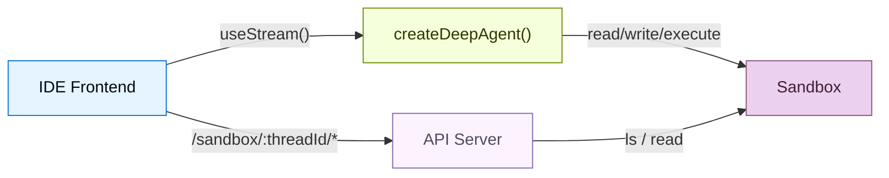
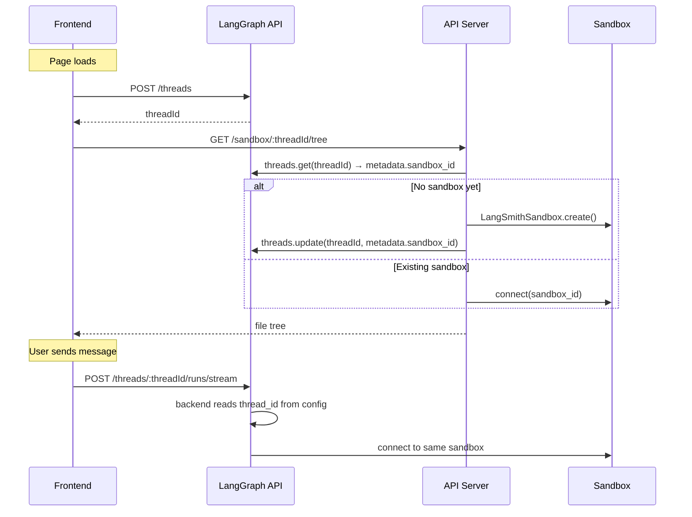

# 沙盒


> 为沙箱环境支持的编程智能体构建类似 IDE 的 UI


编程智能体需要的不仅仅是聊天窗口。他们需要文件浏览器、代码查看器、差异面板和 IDE 体验。此模式将深度智能体连接到[沙箱](sandboxes.md)，以便它可以在隔离环境中读取、写入和执行代码，然后通过自定义 API 服务器公开沙箱文件系统，以便前端可以在代理工作时实时显示文件。


本页面涵盖了**三面板 UI**（文件树、代码查看器和聊天）以及向其公开沙箱文件系统的**自定义 API 路由**。对于沙箱提供程序、生命周期范围、种子文件、机密、部署和生产 `useStream` 配置，请参阅[进入生产](going-to-production.md)。


## 建筑学


此设置分为三个部分：


1. **具有沙箱后端的深度智能体：**代理获取文件系统工具
（`read_file`、`write_file`、`edit_file`、`delete`、`execute`）自动从沙箱中


2. **自定义 API 服务器** - 通过 `langgraph.json` 的 `http.app` 公开的 FastAPI 应用程序
字段，提供前端可以调用的文件浏览端点


3. **三面板前端：** 文件树、代码/差异查看器和聊天面板
当代理进行更改时实时同步文件





## 沙箱生命周期


在连接前端之前选择沙箱的生存时间以及共享沙箱的人员。请参阅[沙箱生命周期](going-to-production.md#lifecycle)，了解线程范围与助理范围沙箱、异步[图形工厂](https://docs.langchain.com/langsmith/graph-rebuild)设置、TTL 行为和 SDK 调用示例。


本指南默认使用**线程范围的沙箱**。前端和自定义 API 服务器都从 LangGraph [线程](https://docs.langchain.com/langsmith/use-threads) ID 解析沙箱。当您[保留线程 ID](#thread-creation) 时，这可以保持对话隔离并允许页面重新加载重新连接到相同的环境。





 对于[多租户](going-to-production.md#multi-tenancy) 应用程序，请改为按后端工厂中的用户或助理来确定沙箱范围。对于没有 LangGraph 线程的演示，请在 API URL 中传递客户端生成的会话 ID。会话 ID 不会在浏览器会话中持续存在。


## 连接代理和 API 服务器


如[执行环境](going-to-production.md#execution-environment)中所述，使用[沙箱后端](sandboxes.md)配置深度智能体。代理自动获取文件系统工具和 `execute` 工具；无需额外的工具配置。


构建此 UI 在生产设置之上添加了一项要求：在代理图之外运行的**自定义 API 服务器**，因此代理后端和文件浏览路由都必须为每个线程解析**相同的沙箱**。将沙箱 ID 存储在线程元数据上，并在它们之间共享单个查找函数。


### 从线程元数据解析沙箱


```python
from deepagents import create_deep_agent
from deepagents.backends.langsmith import LangSmithSandbox
from langgraph.config import get_config


def get_or_create_sandbox_for_thread(thread_id: str) -> LangSmithSandbox:
    if not thread_id:
        raise ValueError("thread_id is required")
    # Look up sandbox_id from thread metadata, create if missing, and seed files.
    raise NotImplementedError(
        "Implement sandbox lookup and creation for your deployment environment."
    )


def get_thread_id_from_config() -> str:
    configurable = get_config().get("configurable", {})
    thread_id = configurable.get("thread_id")
    if not thread_id:
        raise ValueError("No thread_id, agent must run on a thread")
    return thread_id


def agent():
    return create_deep_agent(
        model="google_genai:gemini-3.6-flash",
        backend=lambda _runtime: get_or_create_sandbox_for_thread(
            get_thread_id_from_config()
        ),
    )
```


```python
from deepagents import create_deep_agent
from deepagents.backends.langsmith import LangSmithSandbox
from langgraph.config import get_config


def get_or_create_sandbox_for_thread(thread_id: str) -> LangSmithSandbox:
    if not thread_id:
        raise ValueError("thread_id is required")
    # Look up sandbox_id from thread metadata, create if missing, and seed files.
    raise NotImplementedError(
        "Implement sandbox lookup and creation for your deployment environment."
    )


def get_thread_id_from_config() -> str:
    configurable = get_config().get("configurable", {})
    thread_id = configurable.get("thread_id")
    if not thread_id:
        raise ValueError("No thread_id, agent must run on a thread")
    return thread_id


def agent():
    return create_deep_agent(
        model="openai:gpt-5.5",
        backend=lambda _runtime: get_or_create_sandbox_for_thread(
            get_thread_id_from_config()
        ),
    )
```


```python
from deepagents import create_deep_agent
from deepagents.backends.langsmith import LangSmithSandbox
from langgraph.config import get_config


def get_or_create_sandbox_for_thread(thread_id: str) -> LangSmithSandbox:
    if not thread_id:
        raise ValueError("thread_id is required")
    # Look up sandbox_id from thread metadata, create if missing, and seed files.
    raise NotImplementedError(
        "Implement sandbox lookup and creation for your deployment environment."
    )


def get_thread_id_from_config() -> str:
    configurable = get_config().get("configurable", {})
    thread_id = configurable.get("thread_id")
    if not thread_id:
        raise ValueError("No thread_id, agent must run on a thread")
    return thread_id


def agent():
    return create_deep_agent(
        model="anthropic:claude-sonnet-4-6",
        backend=lambda _runtime: get_or_create_sandbox_for_thread(
            get_thread_id_from_config()
        ),
    )
```


```python
from deepagents import create_deep_agent
from deepagents.backends.langsmith import LangSmithSandbox
from langgraph.config import get_config


def get_or_create_sandbox_for_thread(thread_id: str) -> LangSmithSandbox:
    if not thread_id:
        raise ValueError("thread_id is required")
    # Look up sandbox_id from thread metadata, create if missing, and seed files.
    raise NotImplementedError(
        "Implement sandbox lookup and creation for your deployment environment."
    )


def get_thread_id_from_config() -> str:
    configurable = get_config().get("configurable", {})
    thread_id = configurable.get("thread_id")
    if not thread_id:
        raise ValueError("No thread_id, agent must run on a thread")
    return thread_id


def agent():
    return create_deep_agent(
        model="openrouter:z-ai/glm-5.2",
        backend=lambda _runtime: get_or_create_sandbox_for_thread(
            get_thread_id_from_config()
        ),
    )
```


```python
from deepagents import create_deep_agent
from deepagents.backends.langsmith import LangSmithSandbox
from langgraph.config import get_config


def get_or_create_sandbox_for_thread(thread_id: str) -> LangSmithSandbox:
    if not thread_id:
        raise ValueError("thread_id is required")
    # Look up sandbox_id from thread metadata, create if missing, and seed files.
    raise NotImplementedError(
        "Implement sandbox lookup and creation for your deployment environment."
    )


def get_thread_id_from_config() -> str:
    configurable = get_config().get("configurable", {})
    thread_id = configurable.get("thread_id")
    if not thread_id:
        raise ValueError("No thread_id, agent must run on a thread")
    return thread_id


def agent():
    return create_deep_agent(
        model="fireworks:accounts/fireworks/models/glm-5p2",
        backend=lambda _runtime: get_or_create_sandbox_for_thread(
            get_thread_id_from_config()
        ),
    )
```


```python
from deepagents import create_deep_agent
from deepagents.backends.langsmith import LangSmithSandbox
from langgraph.config import get_config


def get_or_create_sandbox_for_thread(thread_id: str) -> LangSmithSandbox:
    if not thread_id:
        raise ValueError("thread_id is required")
    # Look up sandbox_id from thread metadata, create if missing, and seed files.
    raise NotImplementedError(
        "Implement sandbox lookup and creation for your deployment environment."
    )


def get_thread_id_from_config() -> str:
    configurable = get_config().get("configurable", {})
    thread_id = configurable.get("thread_id")
    if not thread_id:
        raise ValueError("No thread_id, agent must run on a thread")
    return thread_id


def agent():
    return create_deep_agent(
        model="baseten:zai-org/GLM-5.2",
        backend=lambda _runtime: get_or_create_sandbox_for_thread(
            get_thread_id_from_config()
        ),
    )
```


```python
from deepagents import create_deep_agent
from deepagents.backends.langsmith import LangSmithSandbox
from langgraph.config import get_config


def get_or_create_sandbox_for_thread(thread_id: str) -> LangSmithSandbox:
    if not thread_id:
        raise ValueError("thread_id is required")
    # Look up sandbox_id from thread metadata, create if missing, and seed files.
    raise NotImplementedError(
        "Implement sandbox lookup and creation for your deployment environment."
    )


def get_thread_id_from_config() -> str:
    configurable = get_config().get("configurable", {})
    thread_id = configurable.get("thread_id")
    if not thread_id:
        raise ValueError("No thread_id, agent must run on a thread")
    return thread_id


def agent():
    return create_deep_agent(
        model="ollama:north-mini-code-1.0",
        backend=lambda _runtime: get_or_create_sandbox_for_thread(
            get_thread_id_from_config()
        ),
    )
```


 与[进入生产](going-to-production.md#lifecycle)中的示例类似，代理是每次运行时调用的异步图形工厂。将沙箱 ID 存储在线程元数据上，以便自定义 `http.app` 路由可以调用相同的 `getOrCreateSandboxForThread` 帮助程序。当 LangGraph SDK 是唯一的入口点时，进入生产环境会使用提供商标签查找。


### 种子项目文件


在代理运行之前，使用 `uploadFiles` / `upload_files` 上传启动文件。请参阅[文件传输](going-to-production.md#file-transfers)了解播种模式、提供程序示例以及将[记忆](memory.md)或[技能](skills.md)同步到沙箱中。对于 LangSmith 沙箱，在创建容器时从 [沙箱快照](https://docs.langchain.com/langsmith/sandbox-snapshots) 传递 `templateName`。


上传 `package.json` 后运行 `sandbox.execute("cd /app && npm install")`，以便依赖项在第一个代理轮流之前准备就绪。


## 添加文件浏览API


代理可以读取和写入文件，但前端还需要直接访问才能浏览沙箱文件系统。添加自定义 [FastAPI](https://fastapi.tiangolo.com) API 服务器并通过 `langgraph.json` 中的 `http.app` 字段公开它。


### 创建API服务器


沙箱 API 端点使用线程 ID 作为 URL 路径参数。这可确保前端始终访问当前对话的正确沙箱，使用与代理后端相同的 `get_or_create_sandbox_for_thread` 函数：


```python
# src/api/server.py
from fastapi import FastAPI, Query, Path
from utils import get_or_create_sandbox_for_thread

app = FastAPI()

@app.get("/sandbox/{thread_id}/tree")
async def list_tree(
    thread_id: str = Path(...),
    filePath: str = Query("/app"),
):
    sandbox = await get_or_create_sandbox_for_thread(thread_id)
    result = await sandbox.aexecute(
        f"find {filePath} -printf '%y\\t%s\\t%p\\n' 2>/dev/null | sort"
    )
    entries = []
    for line in result.output.strip().split("\n"):
        if not line:
            continue
        type_char, size_str, full_path = line.split("\t")
        entries.append({
            "name": full_path.split("/")[-1],
            "type": "directory" if type_char == "d" else "file",
            "path": full_path,
            "size": int(size_str),
        })
    return {"path": filePath, "entries": entries, "sandboxId": sandbox.id}

@app.get("/sandbox/{thread_id}/file")
async def read_file(
    thread_id: str = Path(...),
    filePath: str = Query(...),
):
    sandbox = await get_or_create_sandbox_for_thread(thread_id)
    results = await sandbox.adownload_files([filePath])
    return {"path": filePath, "content": results[0].content.decode()}
```


 代理的后端和API服务器都调用相同的`get_or_create_sandbox_for_thread`函数。这确保他们始终能够解决


到给定线程的同一沙箱。线程元数据中的沙箱 ID 是唯一的事实来源——不需要内存缓存。


### 配置`langgraph.json`


注册代理图和 API 服务器。 `http.app` 字段告诉 LangGraph 平台为您的自定义路由和默认路由提供服务。有关完整的 `langgraph.json` 选项集，请参阅[应用程序结构](https://docs.langchain.com/oss/python/langgraph/application-structure) 和 [LangSmith 部署](going-to-production.md#langsmith-deployments)。


```json
{
  "graphs": {
    "deep_agent_ide": "./src/agents/my_agent.py:agent"
  },
  "env": ".env",
  "http": {
    "app": "./src/api/server.py:app"
  }
}
```


 您的自定义路由可在与 LangGraph API 相同的主机上使用。对于使用 `langgraph dev` 进行本地开发，即为 `http://localhost:2024`。


`http.app` 中定义的自定义路由优先于默认 LangGraph 路由。这意味着您可以根据需要隐藏内置端点，但请注意不要意外覆盖 `/threads` 或 `/runs` 等路由。


## 构建前端


前端具有三个面板：文件树侧边栏、代码/差异查看器和聊天面板。它使用 [`useStream`](https://reference.langchain.com/javascript/langchain-react/index/useStream) 进行代理对话，并使用自定义 API 端点进行文件浏览。


对于生产部署，请将 `apiUrl` 指向您的 [LangSmith 部署](https://docs.langchain.com/langsmith/deployment)，并在每次运行时传递稳定的 `thread_id`。有关这些设置以及使用 `thread_id` 和运行时 `context` 的[调用代理](going-to-production.md#invoking-the-agent)，请参阅[进入生产](going-to-production.md)中的[前端](going-to-production.md#frontend)。


### 线程创建


当页面加载时创建一个 LangGraph 线程并将其 ID 保留在 `sessionStorage` 中，以便页面重新加载时重新连接到同一个沙箱：


```tsx
const THREAD_KEY = "sandbox-thread-id";

function IDEPreview() {
  const [threadId, setThreadId] = useState<string | null>(
    () => sessionStorage.getItem(THREAD_KEY),
  );

  const updateThreadId = useCallback((id: string | null) => {
    setThreadId(id);
    if (id) sessionStorage.setItem(THREAD_KEY, id);
    else sessionStorage.removeItem(THREAD_KEY);
  }, []);

  const stream = useStream<typeof myAgent>({
    apiUrl: AGENT_URL,
    assistantId: "deep_agent_ide",
    threadId,
    onThreadId: updateThreadId,
  });

  // Create thread on first mount
  useEffect(() => {
    if (threadId) return;
    stream.client.threads.create().then((t) => updateThreadId(t.thread_id));
  }, [stream.client, threadId, updateThreadId]);

  // Pass threadId to sandbox file hooks
  const { tree, files } = useSandboxFiles(threadId);
  // ...
}
```


 “新线程”按钮会清除存储的 ID，以便下一次挂载创建一个新线程（和沙箱）：


```tsx
function handleNewThread() {
  updateThreadId(null);
}
```


### 文件状态管理


跟踪沙箱文件系统的两个快照：原始状态（代理运行之前）和当前状态（实时更新）。线程 ID 包含在 API URL 中，因此请求始终会到达正确的沙箱：


```ts
const AGENT_URL = "http://localhost:2024";

async function fetchTree(threadId: string): Promise<FileEntry[]> {
  const res = await fetch(
    `${AGENT_URL}/sandbox/${encodeURIComponent(threadId)}/tree?filePath=/app`,
  );
  const data = await res.json();
  return data.entries.filter((e: FileEntry) => !e.path.includes("node_modules"));
}

async function fetchFile(threadId: string, path: string): Promise<string | null> {
  const res = await fetch(
    `${AGENT_URL}/sandbox/${encodeURIComponent(threadId)}/file?filePath=${encodeURIComponent(path)}`,
  );
  const data = await res.json();
  return data.content ?? null;
}
```


### 实时文件同步


IDE 体验的关键是在代理工作时更新文件，而不是在完成后更新文件。通过文件变异工具观察 `ToolMessage` 实例的流消息。当 `write_file` 或 `edit_file` 工具调用完成时，刷新该特定文件。当 `execute` 完成时，刷新所有内容（因为 shell 命令可以修改任何文件）：


```tsx
import { useStream } from "@langchain/react";
import { ToolMessage, AIMessage } from "langchain";

const FILE_MUTATING_TOOLS = new Set(["write_file", "edit_file", "execute"]);

export function IDEPreview() {
  const stream = useStream<typeof myAgent>({
    apiUrl: AGENT_URL,
    assistantId: "deep_agent_ide",
  });

  const processedIds = useRef(new Set<string>());

  useEffect(() => {
    // Build a map of file-mutating tool calls from AI messages
    const toolCallMap = new Map();
    for (const msg of stream.messages) {
      if (!AIMessage.isInstance(msg)) continue;
      for (const tc of msg.tool_calls ?? []) {
        if (tc.id && FILE_MUTATING_TOOLS.has(tc.name)) {
          toolCallMap.set(tc.id, { name: tc.name, args: tc.args });
        }
      }
    }

    // When a ToolMessage appears for a file-mutating tool, refresh
    for (const msg of stream.messages) {
      if (!ToolMessage.isInstance(msg)) continue;
      const id = msg.id ?? msg.tool_call_id;
      if (!id || processedIds.current.has(id)) continue;

      const call = toolCallMap.get(msg.tool_call_id);
      if (!call) continue;
      processedIds.current.add(id);

      if (call.name === "write_file" || call.name === "edit_file") {
        refreshSingleFile(call.args.path ?? call.args.file_path);
      } else if (call.name === "execute") {
        refreshTreeAndFiles();
      }
    }
  }, [stream.messages]);
}
```


```vue
<script setup lang="ts">
import { useStream } from "@langchain/vue";
import { ToolMessage, AIMessage } from "langchain";
import { watch } from "vue";

const FILE_MUTATING_TOOLS = new Set(["write_file", "edit_file", "execute"]);
const processedIds = new Set<string>();

const stream = useStream<typeof myAgent>({
  apiUrl: AGENT_URL,
  assistantId: "deep_agent_ide",
});

watch(
  () => stream.messages.value,
  (messages) => {
    const toolCallMap = new Map();
    for (const msg of messages) {
      if (AIMessage.isInstance(msg)) {
        for (const tc of msg.tool_calls ?? []) {
          if (tc.id && FILE_MUTATING_TOOLS.has(tc.name)) {
            toolCallMap.set(tc.id, { name: tc.name, args: tc.args });
          }
        }
      }
    }

    for (const msg of messages) {
      if (!ToolMessage.isInstance(msg)) continue;
      const id = msg.id ?? msg.tool_call_id;
      if (!id || processedIds.has(id)) continue;

      const call = toolCallMap.get(msg.tool_call_id);
      if (!call) continue;
      processedIds.add(id);

      if (call.name === "write_file" || call.name === "edit_file") {
        refreshSingleFile(call.args.path ?? call.args.file_path);
      } else if (call.name === "execute") {
        refreshTreeAndFiles();
      }
    }
  },
  { deep: true },
);
</script>
```


```svelte
<script lang="ts">
  import { useStream } from "@langchain/svelte";
  import { ToolMessage, AIMessage } from "langchain";

  const FILE_MUTATING_TOOLS = new Set(["write_file", "edit_file", "execute"]);
  const processedIds = new Set<string>();

  const stream = useStream<typeof myAgent>({
    apiUrl: AGENT_URL,
    assistantId: "deep_agent_ide",
  });

  $effect(() => {
    const msgs = stream.messages;
    const toolCallMap = new Map();
    for (const msg of msgs) {
      if (AIMessage.isInstance(msg)) {
        for (const tc of msg.tool_calls ?? []) {
          if (tc.id && FILE_MUTATING_TOOLS.has(tc.name)) {
            toolCallMap.set(tc.id, { name: tc.name, args: tc.args });
          }
        }
      }
    }

    for (const msg of msgs) {
      if (!ToolMessage.isInstance(msg)) continue;
      const id = msg.id ?? msg.tool_call_id;
      if (!id || processedIds.has(id)) continue;

      const call = toolCallMap.get(msg.tool_call_id);
      if (!call) continue;
      processedIds.add(id);

      if (call.name === "write_file" || call.name === "edit_file") {
        refreshSingleFile(call.args.path ?? call.args.file_path);
      } else if (call.name === "execute") {
        refreshTreeAndFiles();
      }
    }
  });
</script>
```


```ts
import { Component, effect } from "@angular/core";
import { injectStream } from "@langchain/angular";
import { ToolMessage, AIMessage } from "langchain";

const FILE_MUTATING_TOOLS = new Set(["write_file", "edit_file", "execute"]);

@Component({
  selector: "app-ide-preview",
  template: `<!-- ... -->`,
})
export class IdePreviewComponent {
  stream = injectStream<typeof myAgent>({
    apiUrl: AGENT_URL,
    assistantId: "deep_agent_ide",
  });

  private processedIds = new Set<string>();

  constructor() {
    effect(() => {
      const messages = this.stream.messages();
      const toolCallMap = new Map();
      for (const msg of messages) {
        if (AIMessage.isInstance(msg)) {
          for (const tc of (msg as AIMessage).tool_calls ?? []) {
            if (tc.id && FILE_MUTATING_TOOLS.has(tc.name)) {
              toolCallMap.set(tc.id, { name: tc.name, args: tc.args });
            }
          }
        }
      }

      for (const msg of messages) {
        if (!ToolMessage.isInstance(msg)) continue;
        const id = (msg as ToolMessage).id ?? (msg as ToolMessage).tool_call_id;
        if (!id || this.processedIds.has(id)) continue;

        const call = toolCallMap.get((msg as ToolMessage).tool_call_id);
        if (!call) continue;
        this.processedIds.add(id);

        if (call.name === "write_file" || call.name === "edit_file") {
          this.refreshSingleFile(call.args.path ?? call.args.file_path);
        } else if (call.name === "execute") {
          this.refreshTreeAndFiles();
        }
      }
    });
  }
}
```


### 检测更改的文件


在每个代理运行之前，对当前文件内容进行快照。文件刷新后，与快照进行比较以确定哪些文件发生了更改：


```ts
function detectChanges(
  current: FileSnapshot,
  original: FileSnapshot,
): Set<string> {
  const changed = new Set<string>();
  for (const [path, content] of Object.entries(current)) {
    if (original[path] !== content) changed.add(path);
  }
  for (const path of Object.keys(original)) {
    if (!(path in current)) changed.add(path);
  }
  return changed;
}
```


 当用户选择更改的文件时，默认为差异视图，以便他们立即看到代理修改的内容。


### 显示差异


使用适合框架的 diff 库来呈现统一的 diff：


|框架|图书馆|成分|
| --------- | -------------------------------------------------------------------------- | --------------------------------------------------------------- |
|反应 | [`@pierre/diffs`](https://diffs.com) | `
` with `parseDiffFromFile` ||视图 | [`@git-diff-view/vue`](https://github.com/MrWangJustToDo/git-diff-view) | `
` with `generateDiffFile` from `@git-diff-view/file` ||苗条 | [`@git-diff-view/svelte`](https://github.com/MrWangJustToDo/git-diff-view) | `
` with `generateDiffFile` from `@git-diff-view/file` ||角|[`ngx-diff`](https://github.com/rars/ngx-diff)|`<ngx-unified-diff>` 与 `[before]` 和 `[after]`|


`@pierre/diffs` 示例（React）：


```tsx
function DiffPanel({ original, current, fileName }) {
  const diff = parseDiffFromFile(
    { name: fileName, contents: original },
    { name: fileName, contents: current },
  );

  return (
    <FileDiff
      fileDiff={diff}
      options={{ theme: "github-dark", diffStyle: "unified", diffIndicators: "bars" }}
    />
  );
}
```


### 更改文件摘要


显示所有修改文件的摘要以及行级添加/删除计数。这使用户可以快速概览代理的影响，类似于 `git status`：


```tsx
function ChangedFilesSummary({ changedFiles, files, originalFiles, onSelect }) {
  const stats = [...changedFiles].map((path) => {
    const oldLines = (originalFiles[path] ?? "").split("\n");
    const newLines = (files[path] ?? "").split("\n");
    // Compute additions/deletions by comparing lines
    return { path, additions, deletions };
  });

  return (
    <div>
      <h3>{stats.length} Files Changed</h3>
      {stats.map((file) => (
        <button key={file.path} onClick={() => onSelect(file.path)}>
          {file.path}
          <span className="text-green-400">+{file.additions}</span>
          <span className="text-red-400">-{file.deletions}</span>
        </button>
      ))}
    </div>
  );
}
```


## 使用案例


在以下情况下，沙箱是正确的选择：


* 创建、修改和运行代码的**编程智能体**需要可视化界面
超越聊天* **代码审查工作流程**，其中代理建议更改并由用户提出
在接受之前审查差异* **教程或学习应用程序**，其中人工智能助手帮助用户构建
项目逐步进行，显示上下文的变化* **原型设计工具**，用户可以用自然语言描述功能并
观看代理实时实施它们


## 最佳实践


前端特定：


* **将 `threadId` 保留在 `sessionStorage` 中**，以便页面重新加载并重新连接到
相同的线程和沙箱，而不是创建新的。


* **在每个相关工具调用时同步文件**，而不仅仅是在运行完成时同步。注意 `write_file`、`edit_file`、`delete` 和 `execute`
工具消息并立即刷新。


* **默认为已更改文件的差异视图**。当用户单击一个文件时
被代理修改了，首先显示差异——这就是他们关心的。


* **显示只读操作的紧凑工具结果**。而不是倾销
聊天中`read_file`的完整输出，显示出像`Read router.js L1-42`这样的一句台词。为变异工具保留完整的输出显示。


* **从文件树中过滤 `node_modules`**。没有人愿意浏览
数千个依赖文件。获取树时将它们过滤掉。


对于后端和沙箱：


* **对生产应用程序使用线程范围的沙箱**。看
[沙箱生命周期](going-to-production.md#lifecycle)。* **通过代理后端和 API 服务器之间共享沙箱解析**
线程元数据，因此两者都解析相同的环境，没有内存缓存。* **用真实的项目为沙箱播种**。看
[文件传输](going-to-production.md#file-transfers)。* **将秘密保密在沙箱之外**。使用
[沙盒身份验证代理](going-to-production.md#managing-secrets) 而不是 API 密钥的环境变量或文件上传。* **发射前添加护栏**。配置
用于自主编程智能体的[速率限制](fault-tolerance.md#rate-limiting)、[错误处理](fault-tolerance.md#error-handling)和[数据隐私](going-to-production.md#data-privacy)中间件。


## 有关的


  
**投入生产**


[查看相关页面](going-to-production.md)


使用持久沙箱、身份验证、护栏和生产 `useStream` 设置来部署代理。

  


  
**沙箱**


[查看相关页面](sandboxes.md)


沙箱提供程序、安全模型和文件传输 API。

  


  
**前端概述**


[查看相关页面](frontend--overview.md)


其他深度智能体 UI 模式：子智能体流、待办事项列表和自定义状态。

  


  
**应用程序结构**


[查看相关页面](https://docs.langchain.com/oss/python/langgraph/application-structure)


完整的 `langgraph.json` 参考，包括自定义 `http.app` 路线。

  

## 相关 LangChain 指南


沙箱 IDE 建立在核心 LangChain 前端模式之上。这些指南涵盖了本页中使用的相同 `useStream` 原语：


  
**工具调用**


[查看相关页面](https://docs.langchain.com/oss/python/langchain/frontend/tool-calling)


将文件和执行工具调用渲染为具有类型安全结果的专用 UI​​ 卡。

  


  
**无头工具**


[查看相关页面](https://docs.langchain.com/oss/python/langchain/frontend/headless-tools)


在客户端运行浏览器和设备 API — 对于在 IDE 面板中嵌入实时预览或终端输出非常有用。

  


  
**开放式生成式用户界面**


[查看相关页面](https://docs.langchain.com/oss/python/langchain/frontend/open-ended-generative-ui)


在生成 UI 范围的开放端渲染沙盒应用程序预览和 MCP 生成的界面。

  


  
**加入和重新加入流**


[查看相关页面](https://docs.langchain.com/oss/python/langchain/frontend/join-rejoin)


页面重新加载后重新连接到正在运行的编码会话，而不会丢失沙箱状态。

  

***


<div className="source-links">


  

[将这些文档](https://docs.langchain.com/use-these-docs) 通过 MCP 连接到 Claude、VSCode 等以获得实时答案。

  


  

[在 GitHub 上编辑此页面](https://github.com/langchain-ai/docs/edit/main/src/oss/deepagents/frontend/sandbox.mdx) 或 [提交问题](https://github.com/langchain-ai/docs/issues/new/choose)。

  

</div>

