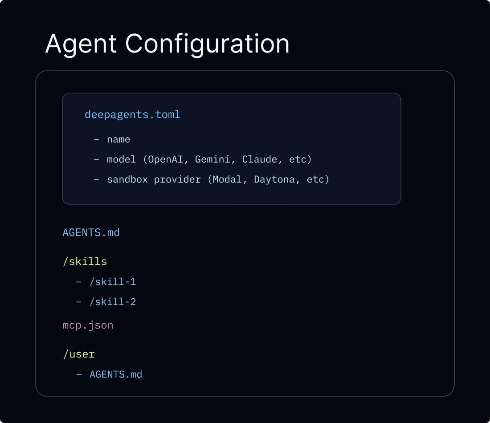
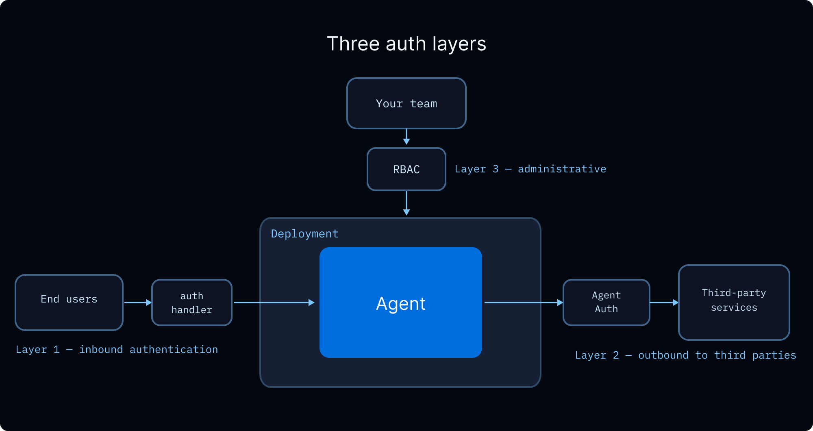
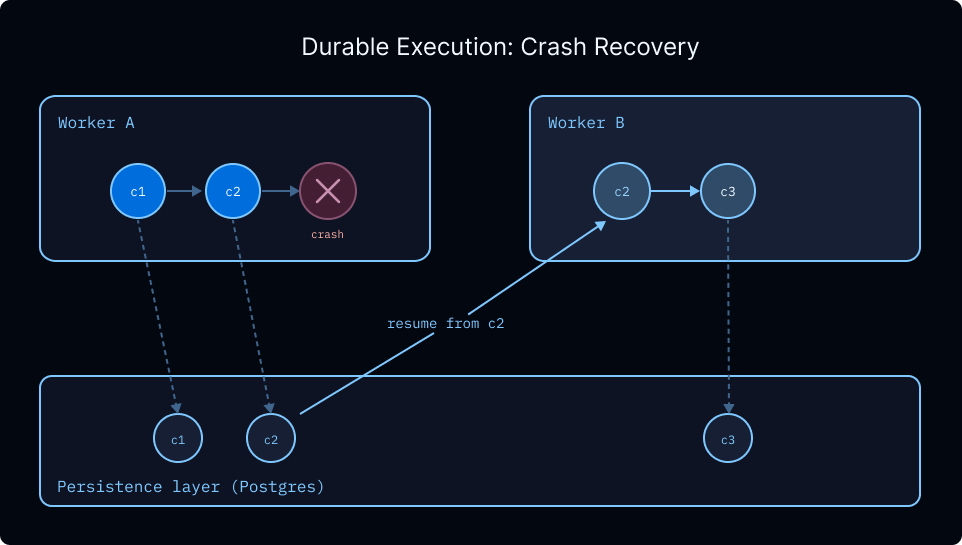
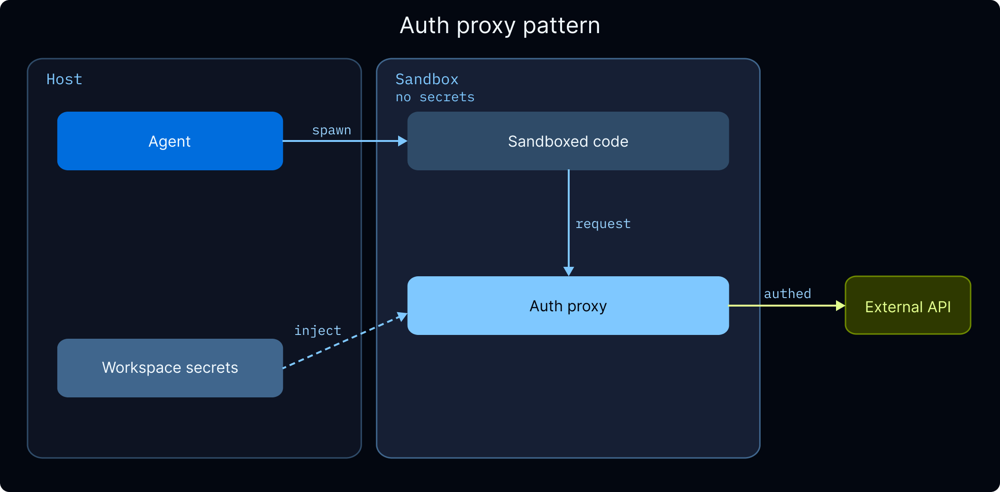

# 即将投入生产


> 使用持久内存、沙箱、弹性中间件和部署选项将深度智能体投入生产


本指南涵盖了将深度智能体从本地原型转移到生产部署的注意事项。它逐步介绍了内存范围、配置执行环境、添加护栏以及连接前端。


## 概述


代理使用内存及其执行环境中的信息来完成任务。在生产中，有一些原语决定如何共享和访问信息：


* **主题**：单个对话。默认情况下，消息历史记录和临时文件的范围仅限于线程，并且不会保留。
* **用户**：与您的代理交互的人。内存和文件可以是用户私有的，也可以在用户之间共享。身份和授权来自您的[授权层](https://docs.langchain.com/langsmith/auth)。
* **Assistant**：配置好的代理实例。内存和文件可以与一名助手绑定，也可以在所有助手之间共享。


此页面涵盖：


* **[LangSmith 部署](#langsmith-deployments)**：具有 auth、webhooks 和 cron 的托管基础​​架构
* **[生产注意事项](#production-considerations)**：调用、多租户、身份验证、凭据、异步和持久性
* **[Memory](#memory)**：在对话中保留信息
* **【执行环境】(#execution-environment)**：文件存储和代码执行
* **[Guardrails](#guardrails)**：权限和数据隐私
* **[Frontend](#frontend)**：将您的 UI 连接到已部署的代理


## LangSmith 部署





将深度智能体投入生产的建议路径是[托管深度智能体](https://docs.langchain.com/langsmith/python/managed-deep-agents-overview)，这是一个 CLI 优先的托管运行时，用于在 LangSmith 中创建、运行和操作深度智能体。 Managed Deep Agents 目前处于私人预览版（[加入候补名单](https://www.langchain.com/langsmith-managed-deep-agents-waitlist)）。对于需要自定义应用程序代码、自定义路由、高级身份验证的团队，您可以直接配置 [LangSmith 部署](https://docs.langchain.com/langsmith/deployment)。任一路径都提供代理所需的基础设施：[线程](https://docs.langchain.com/langsmith/use-threads)、[运行](https://docs.langchain.com/langsmith/runs)、存储和检查指针，因此您不必自己设置这些。传统的 LangSmith 部署还为您提供开箱即用的 [身份验证](https://docs.langchain.com/langsmith/auth)、[webhooks](https://docs.langchain.com/langsmith/use-webhooks)、[cron 作业](https://docs.langchain.com/langsmith/cron-jobs) 和 [可观察性](https://docs.langchain.com/langsmith/observability)，并且可以通过 [MCP](https://docs.langchain.com/langsmith/server-mcp) 或[A2A](https://docs.langchain.com/langsmith/server-a2a)。


LangSmith 云部署会自动将跟踪发送到以您的部署命名的项目。打开 [LangSmith](https://smith.langchain.com?utm_source=docs\&utm_medium=cta\&utm_campaign=langsmith-signup\&utm_content=oss-deepagents-going-to-production) 调试运行并监控使用情况。对于混合或自托管设置，请参阅 [LangSmith 跟踪](https://docs.langchain.com/langsmith/data-plane#langsmith-tracing)。我们建议您还设置 [LangSmith Engine](https://docs.langchain.com/langsmith/engine)，它会监视您的痕迹、检测问题并提出修复建议。


除非另有说明，本页上的所有代码片段均使用以下 `langgraph.json`：


```json
{
  "dependencies": ["."],
  "graphs": {
    "agent": "./agent.py:agent"
  },
  "env": ".env"
}
```


 `langgraph.json` 是告诉 LangGraph 平台如何构建和运行应用程序的配置文件。它位于项目的根目录，是本地开发（使用 `langgraph dev`）和生产部署所必需的。关键字段是：


|场地|描述|
| -------------- | ----------------------------------------------------------------------------------------------------------------------------------------------------------------------------------------------------------------------------------------------- |
|`dependencies`|要安装的软件包。 `["."]` 将当前目录作为包安装（从 `requirements.txt`、`pyproject.toml` 或 `package.json` 读取）。|
|`graphs`|将图形 ID 映射到其代码位置。每个条目都是 `"<id>": "./<file>:<variable>"`，其中 `<id>` 是用于通过 API 调用图形的名称，`<variable>` 是从 `<file>` 导出的已编译图形或构造函数。|
|`env`|包含环境变量（API 密钥、机密）的 `.env` 文件的路径。这些在构建时设置并在运行时可用。|


有关完整的配置选项集（自定义 Docker 步骤、存储索引、身份验证处理程序等），请参阅[应用程序结构](https://docs.langchain.com/oss/python/langgraph/application-structure)。


## 生产注意事项


### 调用代理


在生产中，每次调用都应携带两个运行级别参数：


* **`thread_id`**（通过 `config={"configurable": {"thread_id": ...}}` 传递）：对话的稳定标识符。 [检查指针](#durability) 使用它来保存和恢复消息历史记录，因此后续轮流继续相同的对话。生成新的 `thread_id` 以开始新的对话。
* **`context`**：工具和中间件在调用时读取的每次运行数据，例如 `user_id`、API 密钥、功能标志或会话元数据。使用 `context_schema` 定义形状并通过 `runtime.context` 访问它。请参阅[运行时上下文](context-engineering.md#runtime-context)。


两者是独立的并且几乎总是一起通过：


```python
from dataclasses import dataclass

from deepagents import create_deep_agent
from langchain_core.utils.uuid import uuid7


@dataclass
class Context:
    user_id: str


agent = create_deep_agent(
    model="google_genai:gemini-3.6-flash",
    context_schema=Context,
)

# Start a conversation
config = {"configurable": {"thread_id": str(uuid7())}}
agent.invoke(
    {"messages": [{"role": "user", "content": "Plan a 3-day trip to Tokyo"}]},
    config=config,
    context=Context(user_id="user-123"),
)

# Follow-up on the same conversation: reuse the same thread_id
agent.invoke(
    {"messages": [{"role": "user", "content": "Make it 5 days instead"}]},
    config=config,
    context=Context(user_id="user-123"),
)
```


```python
from dataclasses import dataclass

from deepagents import create_deep_agent
from langchain_core.utils.uuid import uuid7


@dataclass
class Context:
    user_id: str


agent = create_deep_agent(
    model="openai:gpt-5.5",
    context_schema=Context,
)

# Start a conversation
config = {"configurable": {"thread_id": str(uuid7())}}
agent.invoke(
    {"messages": [{"role": "user", "content": "Plan a 3-day trip to Tokyo"}]},
    config=config,
    context=Context(user_id="user-123"),
)

# Follow-up on the same conversation: reuse the same thread_id
agent.invoke(
    {"messages": [{"role": "user", "content": "Make it 5 days instead"}]},
    config=config,
    context=Context(user_id="user-123"),
)
```


```python
from dataclasses import dataclass

from deepagents import create_deep_agent
from langchain_core.utils.uuid import uuid7


@dataclass
class Context:
    user_id: str


agent = create_deep_agent(
    model="anthropic:claude-sonnet-4-6",
    context_schema=Context,
)

# Start a conversation
config = {"configurable": {"thread_id": str(uuid7())}}
agent.invoke(
    {"messages": [{"role": "user", "content": "Plan a 3-day trip to Tokyo"}]},
    config=config,
    context=Context(user_id="user-123"),
)

# Follow-up on the same conversation: reuse the same thread_id
agent.invoke(
    {"messages": [{"role": "user", "content": "Make it 5 days instead"}]},
    config=config,
    context=Context(user_id="user-123"),
)
```


```python
from dataclasses import dataclass

from deepagents import create_deep_agent
from langchain_core.utils.uuid import uuid7


@dataclass
class Context:
    user_id: str


agent = create_deep_agent(
    model="openrouter:z-ai/glm-5.2",
    context_schema=Context,
)

# Start a conversation
config = {"configurable": {"thread_id": str(uuid7())}}
agent.invoke(
    {"messages": [{"role": "user", "content": "Plan a 3-day trip to Tokyo"}]},
    config=config,
    context=Context(user_id="user-123"),
)

# Follow-up on the same conversation: reuse the same thread_id
agent.invoke(
    {"messages": [{"role": "user", "content": "Make it 5 days instead"}]},
    config=config,
    context=Context(user_id="user-123"),
)
```


```python
from dataclasses import dataclass

from deepagents import create_deep_agent
from langchain_core.utils.uuid import uuid7


@dataclass
class Context:
    user_id: str


agent = create_deep_agent(
    model="fireworks:accounts/fireworks/models/glm-5p2",
    context_schema=Context,
)

# Start a conversation
config = {"configurable": {"thread_id": str(uuid7())}}
agent.invoke(
    {"messages": [{"role": "user", "content": "Plan a 3-day trip to Tokyo"}]},
    config=config,
    context=Context(user_id="user-123"),
)

# Follow-up on the same conversation: reuse the same thread_id
agent.invoke(
    {"messages": [{"role": "user", "content": "Make it 5 days instead"}]},
    config=config,
    context=Context(user_id="user-123"),
)
```


```python
from dataclasses import dataclass

from deepagents import create_deep_agent
from langchain_core.utils.uuid import uuid7


@dataclass
class Context:
    user_id: str


agent = create_deep_agent(
    model="baseten:zai-org/GLM-5.2",
    context_schema=Context,
)

# Start a conversation
config = {"configurable": {"thread_id": str(uuid7())}}
agent.invoke(
    {"messages": [{"role": "user", "content": "Plan a 3-day trip to Tokyo"}]},
    config=config,
    context=Context(user_id="user-123"),
)

# Follow-up on the same conversation: reuse the same thread_id
agent.invoke(
    {"messages": [{"role": "user", "content": "Make it 5 days instead"}]},
    config=config,
    context=Context(user_id="user-123"),
)
```


```python
from dataclasses import dataclass

from deepagents import create_deep_agent
from langchain_core.utils.uuid import uuid7


@dataclass
class Context:
    user_id: str


agent = create_deep_agent(
    model="ollama:north-mini-code-1.0",
    context_schema=Context,
)

# Start a conversation
config = {"configurable": {"thread_id": str(uuid7())}}
agent.invoke(
    {"messages": [{"role": "user", "content": "Plan a 3-day trip to Tokyo"}]},
    config=config,
    context=Context(user_id="user-123"),
)

# Follow-up on the same conversation: reuse the same thread_id
agent.invoke(
    {"messages": [{"role": "user", "content": "Make it 5 days instead"}]},
    config=config,
    context=Context(user_id="user-123"),
)
```


 使用 LangGraph SDK 进行部署时，SDK 会为您管理线程，并将返回的 `thread_id` 传递给每次运行：


```python
from langgraph_sdk import get_client

client = get_client(url="<DEPLOYMENT_URL>", api_key="<LANGSMITH_API_KEY>")

thread = await client.threads.create()
async for chunk in client.runs.stream(
    thread["thread_id"],  # [!code highlight]
    "agent",
    input={"messages": [{"role": "user", "content": "Plan a 3-day trip to Tokyo"}]},
    context={"user_id": "user-123"},  # [!code highlight]
    stream_mode="updates",
):
    print(chunk.data)
```


 `thread_id` 限定*对话*（消息历史记录、检查点）。 `context` 携带您的工具和中间件读取的“每次运行”数据。它们是独立的：更改一个不会影响另一个，您可以通过其中一个或两个。


### 多租户


当您的代理为多个用户提供服务时，您需要处理三个问题：验证每个用户的身份、控制他们可以访问的内容以及管理代理用于代表他们执行操作的凭据。





#### 用户身份和访问控制


[LangSmith 部署](https://docs.langchain.com/langsmith/deployment) 支持[自定义身份验证](https://docs.langchain.com/langsmith/custom-auth) 来建立用户身份，并支持[授权处理程序](https://docs.langchain.com/langsmith/auth) 来控制对线程、助手和存储命名空间等资源的访问。授权处理程序在身份验证成功后运行，并且可以：


* 使用所有权元数据标记资源（例如，`owner: user_id`）
* 返回过滤器，以便用户只能看到自己的资源
* 拒绝使用 HTTP 403 进行未经授权的操作


有关分步教程，请参阅[将对话设为私密](https://docs.langchain.com/langsmith/resource-auth)。有关演练，请观看[自定义身份验证视频](https://www.youtube.com/watch?v=DkNqgCz8cjE)。


[范围内存](#scoping) 和[执行环境](#execution-environment) 如何确定用户之间共享哪些数据。有关详细信息，请参阅以下部分。


#### 团队访问控制 (RBAC)


LangSmith 的[基于角色的访问控制](https://docs.langchain.com/langsmith/rbac) 控制团队中的哪些人可以部署、配置和监控代理。这与上面的最终用户授权是分开的。


|角色|使用权|
| ---------------- | --------------------------------------------------------------------- |
|工作区管理员|包括设置和会员管理在内的完整权限|
|工作区编辑器|创建和修改资源，但无法删除运行或管理成员|
|工作区查看器|只读访问|


企业计划提供具有精细权限的自定义角色。有关完整权限模型，请参阅[RBAC 参考](https://docs.langchain.com/langsmith/rbac)。


#### 最终用户凭证


当您的代理需要代表用户调用外部 API（例如，读取其 GitHub 存储库、发送 Slack 消息、查询其数据仓库）时，您需要一种方法将用户的凭据传递给代理而不对其进行硬编码。


**通过代理身份验证进行 OAuth。** [代理身份验证](https://docs.langchain.com/langsmith/agent-auth) 提供托管 OAuth 2.0 流程。配置 OAuth 提供程序，代理可以请求范围为每个用户的令牌。首次使用时，代理会[中断](https://docs.langchain.com/oss/python/langgraph/interrupts) 执行并显示 OAuth 同意 URL。用户进行身份验证后，代理将使用有效令牌恢复。令牌会自动存储和刷新。


```python
from langchain_auth import Client
from langchain.tools import tool, ToolRuntime

auth_client = Client()

# Inside your agent's tool:
@tool
async def github_action(runtime: ToolRuntime):
    """Perform an action on behalf of the user via GitHub."""
    auth_result = await auth_client.authenticate(
        provider="github",
        scopes=["repo", "read:org"],
        user_id=runtime.server_info.user.identity,  # [!code highlight]
    )
    # Use auth_result.token for GitHub API calls on the user's behalf
```


 **沙箱的凭据注入。** 如果您的代理在调用外部 API 的 [沙箱](#sandboxes) 内运行代码，则 [沙箱身份验证代理](https://docs.langchain.com/langsmith/sandbox-auth-proxy) 可以自动将凭据注入出站请求中，因此沙箱代码永远不会收到原始 API 密钥。有关设置详细信息，请参阅[管理机密](#managing-secrets)。


**工作区机密。** 对于所有用户共享的 API 密钥（例如您组织的 LLM 提供商密钥、搜索 API 密钥），请将它们存储为 LangSmith 中的 [工作区机密](https://docs.langchain.com/langsmith/set-up-hierarchy#configure-workspace-settings)。详细信息请参见[管理机密](#managing-secrets)。


### 异步


基于 LLM 的应用程序严重依赖 I/O：调用语言模型、数据库和外部服务。异步编程允许这些操作并发运行而不是阻塞，从而提高吞吐量和响应能力。


LangChain 遵循在异步方法名称前添加 `a` 的约定（例如 `ainvoke`、`abefore_agent`、`astream`）。同步和异步变体位于同一类或命名空间中。


为生产而构建时：


* **创建异步工具。** LangChain 在单独的线程中运行同步工具以避免阻塞，但本机异步完全避免了线程开销。
* **使用异步中间件方法。** 自定义[中间件](https://docs.langchain.com/oss/python/langchain/middleware/custom) 应实现异步挂钩（例如，`abefore_agent` 而不是 `before_agent`）。
* **对外部资源生命周期使用异步。** 创建[沙箱](#sandboxes) 或连接到[MCP 服务器](https://docs.langchain.com/oss/python/langchain/mcp) 涉及网络调用，应等待。这就是为什么提供这些资源的[图工厂](https://docs.langchain.com/langsmith/graph-rebuild) 是异步的。


### 耐用性


Deep Agents 在 LangGraph 上运行，提供开箱即用的持久执行。 [持久性](https://docs.langchain.com/oss/python/langgraph/persistence) 层在每个步骤中检查状态，因此因故障、超时或[人在环](https://docs.langchain.com/oss/python/langgraph/interrupts) 暂停而中断的运行会从上次记录的状态恢复，而无需重新处理之前的步骤。对于产生许多子智能体的长时间运行的深度智能体来说，这意味着中期运行失败不会丢失已完成的工作。





检查点还可以：


* **无限期[中断](https://docs.langchain.com/oss/python/langgraph/interrupts)。** 人机交互工作流程可以暂停几分钟或几天，然后从中断的地方准确恢复。
* **[时间旅行](https://docs.langchain.com/oss/python/langgraph/use-time-travel).** 每个检查点步骤都是您可以倒回的快照，以便在出现问题时从较早的状态重播。
* **安全处理敏感操作。** 对于涉及付款或其他不可逆转操作的工作流程，检查点提供审计跟踪和恢复点来检查导致操作的确切状态。


[LangSmith 部署](https://docs.langchain.com/langsmith/deployment) 自动配置持久检查点。如果您是自托管，请参阅[持久性](https://docs.langchain.com/oss/python/langgraph/persistence) 了解设置说明。


## 记忆


没有记忆，每一次对话都从头开始。记忆可以让您的代理保留对话中的信息（用户偏好、学到的指令、过去的经验），以便随着时间的推移，它可以个性化其行为。有关内存类型的概述，请参阅[内存概念指南](https://docs.langchain.com/oss/python/concepts/memory)。


### 范围界定


记忆在对话中总是持久的。主要问题是它如何跨越用户和助手的界限。正确的范围取决于谁应该查看和修改数据：


|范围|命名空间|使用案例|例子|
| ------------------------------ | ---------------- | ----------------------------------------------- | --------------------------------- |
|**用户**（建议默认）|`(user_id)`|每个用户的偏好和上下文|“我更喜欢简洁的回答”|
|**助手**|`(assistant_id)`|一名助理的共享说明|“帖子上限为 280 个字符”|
|**全球的**|`(org_id)`|所有用户和助理的只读策略|“永远不要透露内部定价”|


共享内存（助理、用户或组织范围）是提示注入的向量。如果一个用户可以写入另一用户的对话读取的内存，则恶意用户可以将指令注入该共享状态。在适当的情况下强制执行只读访问。例如，使组织范围的策略只能通过应用程序代码写入，而不能由代理本身写入。使用 [权限](permissions.md) 以声明方式拒绝写入共享路径，或使用 [后端策略挂钩](backends.md#add-policy-hooks) 来自定义验证逻辑。


### 配置


在 Deep Agents 中，内存作为文件存储在虚拟文件系统中。默认情况下，文件的范围仅限于单个线程（对话），并且不会跨线程共享。否则，要跨线程共享内存，请将 `/memories/` 之类的路径路由到写入 LangGraph [Store](https://docs.langchain.com/langsmith/custom-store) 的 [StoreBackend](https://reference.langchain.com/python/deepagents/backends/store/StoreBackend)。使用 [CompositeBackend](https://reference.langchain.com/python/deepagents/backends/composite/CompositeBackend) 为代理提供线程范围的暂存空间和跨线程 [长期内存](memory.md)。


下面显示的 `rt.server_info` 和 `rt.execution_info` 命名空间模式需要 `deepagents>=0.5.0`。


  
**用户（推荐）**


命名空间为 `user_id`。每个用户都有自己的私人内存。这是推荐的默认设置，因为大多数应用程序都部署一个助手。


```python
from deepagents import create_deep_agent
from deepagents.backends import CompositeBackend, StateBackend, StoreBackend

agent = create_deep_agent(
    model="google_genai:gemini-3.6-flash",
    backend=CompositeBackend(
        default=StateBackend(),
        routes={
            "/memories/": StoreBackend(
                namespace=lambda rt: (
                    rt.server_info.assistant_id,  # [!code highlight]
                    rt.server_info.user.identity,  # [!code highlight]
                ),
            ),
        },
    ),
    system_prompt="""You have persistent memory at /memories/.

    Read /memories/instructions.txt at the start of each conversation for
    accumulated knowledge and preferences. When you learn something that
    should persist, update that file.""",
)
```


  


  

 **助手**


命名空间为 `assistant_id`。内存在同一助手的所有用户之间共享，因此任何用户都可以读取或更新它。将此用于共享指示或知识，适用于使用给定助手的每个人（例如，“始终以正式语气回复”）。


```python
from deepagents import create_deep_agent
from deepagents.backends import CompositeBackend, StateBackend, StoreBackend

agent = create_deep_agent(
    model="google_genai:gemini-3.6-flash",
    backend=CompositeBackend(
        default=StateBackend(),
        routes={
            "/memories/": StoreBackend(
                namespace=lambda rt: (
                    rt.server_info.assistant_id,  # [!code highlight]
                ),
            ),
        },
    ),
)
```


  


  

 **用户**


命名空间仅由 `user_id` 组成。记忆在所有助手中都跟随用户。将此用于全局用户配置文件（名称、时区、通信首选项），无论用户与哪个助手交谈，该配置文件都应适用。


```python
from deepagents import create_deep_agent
from deepagents.backends import CompositeBackend, StateBackend, StoreBackend

agent = create_deep_agent(
    model="google_genai:gemini-3.6-flash",
    backend=CompositeBackend(
        default=StateBackend(),
        routes={
            "/memories/": StoreBackend(
                namespace=lambda rt: (rt.server_info.user.identity,),  # [!code highlight]
            ),
        },
    ),
)
```


  


  

 **组织**


命名空间为 `org_id`。内存在所有用户和所有助手之间共享。通常用于组织范围内的策略（合规性规则、品牌指南），这些策略对于代理来说应该是只读的。写访问权限应仅限于应用程序代码，以防止提示注入。


```python
from deepagents import create_deep_agent
from deepagents.backends import CompositeBackend, StateBackend, StoreBackend

agent = create_deep_agent(
    model="google_genai:gemini-3.6-flash",
    backend=CompositeBackend(
        default=StateBackend(),
        routes={
            "/memories/": StoreBackend(
                namespace=lambda rt: (rt.context.org_id,),
            ),
        },
    ),
)
```


  


 您还可以使用 [Store API](https://docs.langchain.com/langsmith/custom-store) 从应用程序代码读取和写入商店。示例请参见[高级用法](memory.md#advanced-usage)。


有关完整的命名空间工厂 API，请参阅[命名空间工厂](backends.md#namespace-factories)。对于自我改进指令和知识库等记忆模式，请参阅[长期记忆](memory.md)。


## 执行环境


在本地，代理可以在磁盘上读写文件并直接运行 shell 命令。在生产中，您需要考虑隔离和持久性。正确的设置取决于您的代理是否需要执行代码：


* 如果您的代理仅读取和写入文件，**文件系统后端**就足够了。选择符合您的持久性需求的后端：线程范围的暂存空间、跨线程存储或两者的组合。
* **沙箱** 添加一个隔离容器，其中包含用于运行 shell 命令的 `execute` 工具。如果您的代理需要运行代码、安装软件包或执行文件 I/O 之外的任何操作，请使用沙箱。


### 文件系统


根据需要保留的内容选择后端：


* [StateBackend](https://reference.langchain.com/python/deepagents/backends/state/StateBackend)（默认）：线程范围的暂存空间。文件通过检查指针在线程内持续存在，但不会跨线程共享。每一步都有检查点，因此避免写入大文件。


* [StoreBackend](https://reference.langchain.com/python/deepagents/backends/store/StoreBackend)：跨会话保存的跨线程存储。具有[命名空间工厂](backends.md#namespace-factories) 的范围。


* [CompositeBackend](https://reference.langchain.com/python/deepagents/backends/composite/CompositeBackend)：混合两者。默认情况下，线程范围的暂存空间具有针对 `/memories/` 等特定路径的跨线程路由。


* [`ContextHubBackend`](backends.md#contexthubbackend)：LangSmith Hub 存储库中的持久文件（`owner/name` 或 `name`）。当您想要 LangSmith 本机持久性而不需要配置单独的 LangGraph 存储时，请使用此选项。


有关后端的完整列表以及如何构建自定义后端，请参阅[后端](backends.md)。


`FilesystemBackend`和`LocalShellBackend`直接访问主机。不要在已部署的代理中使用它们。


### 沙箱


如果您的代理需要运行代码（不仅仅是读写文件），请使用[沙箱](sandboxes.md)。沙箱提供文件系统和 `execute` 工具来运行 shell 命令，所有这些都在一个隔离的容器内。这种隔离还可以保护您的主机：如果代理的代码耗尽内存或崩溃，则只有沙箱受到影响。您的服务器继续运行。


#### 生命周期


关键的决定是沙箱的寿命有多长。每次对话都是新的，还是对话共享一个持久的环境？


|范围|沙箱 ID 存储于|生命周期|示例用例|
| -------------------- | ----------------------------------------- | ----------------------------------------- | -------------------------------------------------------------------- |
|**线程范围**|[主题](https://docs.langchain.com/langsmith/use-threads) 元数据|每次对话都是新鲜的，在 TTL 上进行了清理|数据分析机器人，每次对话都以干净的方式开始|
|**助理范围**|[助手](https://docs.langchain.com/langsmith/assistants) 配置|在所有对话中共享|一个编码助手，可在对话中维护克隆存储库|


下面的示例使用异步[图形工厂](https://docs.langchain.com/langsmith/graph-rebuild) 而不是静态图形，因为沙箱需要 `thread_id` 或 `assistant_id` 来查找或创建正确的沙箱。图工厂没有收到完整的 `Runtime`（没有 `server_info` 或 `execution_info`）；相反，接受 `RunnableConfig` 并从 `config["configurable"]` 读取 `thread_id` 和 `assistant_id`。该工厂是异步的，因为沙箱创建是一项 I/O 绑定操作，需要仅在调用时可用的每次运行信息。


  
**线程范围（最常见）**


每个对话都有自己的沙箱。 [图工厂](https://docs.langchain.com/langsmith/graph-rebuild)从运行配置中读取`thread_id`，因此每个[线程](https://docs.langchain.com/langsmith/use-threads)自动获得自己的隔离环境。命名沙箱查找处理跨运行的重复数据删除。沙箱 [TTL](https://docs.langchain.com/langsmith/configure-ttl) 过期时清理。


```python
from deepagents import create_deep_agent
from deepagents.backends.langsmith import LangSmithSandbox
from langchain_core.runnables import RunnableConfig
from langsmith.sandbox import SandboxClient

client = SandboxClient()


async def agent(config: RunnableConfig):
    thread_id = config["configurable"]["thread_id"]  # [!code highlight]
    sandbox_name = f"thread-{thread_id}"
    existing = [
        sb
        for sb in client.list_sandboxes()
        if getattr(sb, "name", None) == sandbox_name
    ]
    if existing:
        ls_sandbox = existing[0]
    else:
        ls_sandbox = client.create_sandbox(
            name=sandbox_name,
            idle_ttl_seconds=3600,  # TTL: clean up when idle
        )
    return create_deep_agent(
        model="google_genai:gemini-3.6-flash",
        backend=LangSmithSandbox(sandbox=ls_sandbox),
    )
```


  


  

 **助理范围**


所有对话共享一个沙箱。 [图工厂](https://docs.langchain.com/langsmith/graph-rebuild)从`config["configurable"]`读取[助手](https://docs.langchain.com/langsmith/assistants)ID，因此同一助手上的每个线程都返回到相同的环境。文件、已安装的包和克隆的存储库在对话中保留。


```python
from deepagents import create_deep_agent
from deepagents.backends.langsmith import LangSmithSandbox
from langchain_core.runnables import RunnableConfig
from langsmith.sandbox import SandboxClient

client = SandboxClient()


async def agent(config: RunnableConfig):
    assistant_id = config["configurable"]["assistant_id"]  # [!code highlight]
    sandbox_name = f"assistant-{assistant_id}"
    existing = [
        sb
        for sb in client.list_sandboxes()
        if getattr(sb, "name", None) == sandbox_name
    ]
    if existing:
        ls_sandbox = existing[0]
    else:
        ls_sandbox = client.create_sandbox(name=sandbox_name)
    return create_deep_agent(
        model="google_genai:gemini-3.6-flash",
        backend=LangSmithSandbox(sandbox=ls_sandbox),
    )
```


    


 随着时间的推移，助理范围的沙箱会积累文件、已安装的软件包和其他沙箱内状态。与沙箱提供程序配置 TTL，使用快照定期重置，或实施清理逻辑以防止沙箱的磁盘和内存无限制增长。

    

  

由于 `agent` 变量是一个异步函数（不是编译图），因此服务器将其视为[图工厂](https://docs.langchain.com/langsmith/graph-rebuild)，并在每次运行时调用它，注入配置。工厂按名称查找或创建沙箱，并返回连接到该沙箱的新代理图。


使用 `langgraph deploy` 进行部署后，使用 SDK 从应用程序代码中调用代理。无论范围如何，客户端代码都是相同的。作用域完全在上面的代理工厂中处理，但行为有所不同：


  
**线程范围**


每个线程都有自己的沙箱。同一线程中的后续消息会重用相同的沙箱，但新线程始终会重新启动，不会留下先前对话中的剩余文件或已安装的包。


```python
from langgraph_sdk import get_client

client = get_client(url="<DEPLOYMENT_URL>", api_key="<LANGSMITH_API_KEY>")

# Conversation 1: install pandas and analyze data
thread_1 = await client.threads.create()
async for chunk in client.runs.stream(
    thread_1["thread_id"],
    "agent",
    input={"messages": [{"role": "human", "content": "Install pandas and analyze sales_data.csv"}]},
    stream_mode="updates",
):
    print(chunk.data)

# Follow-up in the same conversation — pandas is still installed
async for chunk in client.runs.stream(
    thread_1["thread_id"],
    "agent",
    input={"messages": [{"role": "human", "content": "Now plot the results"}]},
    stream_mode="updates",
):
    print(chunk.data)

# Conversation 2: fresh sandbox — pandas is NOT installed, no files from conversation 1
thread_2 = await client.threads.create()
async for chunk in client.runs.stream(
    thread_2["thread_id"],
    "agent",
    input={"messages": [{"role": "human", "content": "What packages are installed?"}]},
    stream_mode="updates",
):
    print(chunk.data)
```


  


  

 **助理范围**


所有线程共享一个沙箱。当沙箱具有重新创建成本高昂的状态（例如克隆的存储库、安装的依赖项或构建工件）时，这非常有用。同一个助手上的任何对话都会从上一个对话结束的地方继续，无需重复设置。


```python
from langgraph_sdk import get_client

client = get_client(url="<DEPLOYMENT_URL>", api_key="<LANGSMITH_API_KEY>")

# Conversation 1: clone and set up the project
thread_1 = await client.threads.create()
async for chunk in client.runs.stream(
    thread_1["thread_id"],
    "agent",
    input={"messages": [{"role": "human", "content": "Clone https://github.com/org/repo and install dependencies"}]},
    stream_mode="updates",
):
    print(chunk.data)

# Conversation 2: repo and dependencies are still there
thread_2 = await client.threads.create()
async for chunk in client.runs.stream(
    thread_2["thread_id"],
    "agent",
    input={"messages": [{"role": "human", "content": "Run the test suite and fix any failures"}]},
    stream_mode="updates",
):
    print(chunk.data)
```


  


#### 文件传输


沙箱是隔离的容器，因此您的应用程序代码无法直接访问其中的文件。使用 `upload_files()` 和 `download_files()` 跨沙箱边界移动数据：


* **在代理运行之前为沙箱播种**：上传用户文件、[技能](skills.md) 脚本、配置或[持久内存](memory.md)，以便代理从一开始就拥有所需的内容
* **代理完成后检索结果**：下载生成的工件（报告、绘图、导出）并同步更新的内存以供将来的对话使用


有关特定于提供商的文件传输示例，请参阅[使用文件](sandboxes.md#working-with-files)。有关提供程序设置、安全性和生命周期模式，请参阅完整的[沙箱指南](sandboxes.md)。


**示例：使用自定义中间件同步技能和记忆**


[技巧](skills.md) Agent需要执行的脚本必须在Agent运行之前上传到沙箱中。您可能还想同步[内存](memory.md)，以便代理可以在容器内读取和更新它们。将 [自定义中间件](https://docs.langchain.com/oss/python/langchain/middleware/custom) 与 `before_agent` 和 `after_agent` 挂钩结合使用，跨沙箱边界移动文件：


```python
from deepagents import create_deep_agent
from deepagents.backends import CompositeBackend, StoreBackend
from deepagents.backends.langsmith import LangSmithSandbox
from langchain.agents.middleware import AgentMiddleware, AgentState
from langgraph.runtime import Runtime
from langsmith.sandbox import SandboxClient


def _safe_filename(key: str) -> str:
    """Reject keys that contain path traversal or glob characters."""
    name = key.split("/")[-1]
    if ".." in name or any(c in name for c in ("*", "?")):
        raise ValueError(f"Invalid key: {key}")
    return name


class SandboxSyncMiddleware(AgentMiddleware):
    """Sync skills and memories between the store and the sandbox."""

    def __init__(self, backend: CompositeBackend):
        super().__init__()
        self.backend = backend

    async def abefore_agent(self, state: AgentState, runtime: Runtime) -> None:
        """Upload skill scripts and memories into the sandbox."""
        user_id = runtime.server_info.user.identity  # [!code highlight]
        store = runtime.store
        files = []
        for item in await store.asearch(("skills", user_id)):
            name = _safe_filename(item.key)
            files.append((f"/skills/{name}", item.value["content"].encode()))
        for item in await store.asearch(("memories", user_id)):
            name = _safe_filename(item.key)
            files.append((f"/memories/{name}", item.value["content"].encode()))
        if files:
            await self.backend.upload_files(files)

    async def aafter_agent(self, state: AgentState, runtime: Runtime) -> None:
        """Sync updated memories back to the store."""
        user_id = runtime.server_info.user.identity  # [!code highlight]
        store = runtime.store
        items = await store.asearch(("memories", user_id))
        results = await self.backend.download_files(
            [f"/memories/{item.key}" for item in items]
        )
        for result in results:
            if result.content is not None:
                await store.aput(
                    ("memories", user_id),
                    result.path.split("/")[-1],
                    {"content": result.content.decode()},
                )


client = SandboxClient()
ls_sandbox = client.create_sandbox()


backend = CompositeBackend(
    default=LangSmithSandbox(sandbox=ls_sandbox),
    routes={
        "/skills/": StoreBackend(
            rt,
            namespace=lambda rt: ("skills", rt.server_info.user.identity),  # [!code highlight]
        ),
        "/memories/": StoreBackend(
            rt,
            namespace=lambda rt: ("memories", rt.server_info.user.identity),  # [!code highlight]
        ),
    },
)

agent = create_deep_agent(
    model="google_genai:gemini-3.6-flash",
    backend=backend,
    middleware=[SandboxSyncMiddleware(backend)],
)
```


#### 管理秘密


沙箱是隔离的容器，因此主机中的环境变量在其中不可用。有两种方法可以向沙箱代码提供 API 密钥和其他秘密：


**身份验证代理（推荐）。** [沙箱身份验证代理](https://docs.langchain.com/langsmith/sandbox-auth-proxy) 拦截来自沙箱的出站请求并自动注入身份验证标头。沙箱代码正常调用外部API，代理根据目标主机添加正确的凭据。这意味着 API 密钥永远不会出现在沙箱代码、环境变量或日志中。





```json
{
  "proxy_config": {
    "rules": [
      {
        "name": "openai-api",
        "match_hosts": ["api.openai.com"],
        "inject_headers": {
          "Authorization": "Bearer ${OPENAI_API_KEY}"
        }
      },
      {
        "name": "anthropic-api",
        "match_hosts": ["api.anthropic.com"],
        "inject_headers": {
          "x-api-key": "${ANTHROPIC_API_KEY}"
        }
      }
    ]
  }
}
```


 `${SECRET_KEY}` 引用针对存储在 LangSmith [工作区设置](https://docs.langchain.com/langsmith/set-up-hierarchy#configure-workspace-settings) 中的机密进行解析。在创建引用它们的模板之前，先在那里配置机密。


**工作区秘密。** 对于不需要基于代理的注入的 API 密钥（例如，代理服务器本身使用的密钥，而不是沙箱代码），将它们存储为 LangSmith 中的 [工作区秘密](https://docs.langchain.com/langsmith/set-up-hierarchy#configure-workspace-settings)。这些在运行时可用作工作区中所有代理的环境变量。


避免通过环境变量或文件上传将机密传递到沙箱中。代理可以读取沙箱内任何可访问的文件或环境变量，包括凭据。身份验证代理将秘密完全排除在沙箱之外。


## 护栏


生产中的代理自主运行，这意味着它们可以无限循环、达到速率限制或处理包含敏感信息的用户数据。深度智能体提供两层保护：


* **[权限](#permissions)**：声明性允许/拒绝规则，控制代理可以读取或写入哪些文件和目录。
* **[容错](#fault-tolerance)**：速率限制、重试、回退和错误处理。
* **[数据隐私](#data-privacy)**：在 PII 到达模型或存储在日志中之前检测和处理 PII 的中间件。


### 权限


[权限](permissions.md) 是声明性允许/拒绝规则，用于控制代理可以读取或写入哪些文件和目录。使用权限将代理隔离到工作目录、保护敏感文件或强制执行只读内存。规则按声明顺序进行评估，第一个匹配的规则获胜。


### 容错能力


有关速率限制、重试、回退和错误处理的信息，请参阅[容错](fault-tolerance.md)。


### 数据隐私


如果您的代理处理可能包含电子邮件、信用卡号或其他 PII 的用户输入，您可以在其到达模型或存储在日志中之前检测并处理它：


```python
from deepagents import create_deep_agent
from langchain.agents.middleware import PIIMiddleware

agent = create_deep_agent(
    model="google_genai:gemini-3.6-flash",
    middleware=[
        PIIMiddleware("email", strategy="redact", apply_to_input=True),
        PIIMiddleware("credit_card", strategy="mask", apply_to_input=True),
    ],
)
```


 策略包括 `redact`（替换为 `[REDACTED_EMAIL]`）、`mask`（部分屏蔽，如 `****-****-****-1234`）、`hash`（确定性哈希）和 `block`（引发错误）。您还可以为特定于域的模式编写自定义检测器。有关完整配置，请参阅 [PIIMiddleware](https://reference.langchain.com/python/langchain/agents/middleware/pii/PIIMiddleware)。


对于默认的 Deep Agents 中间件堆栈，请参阅[自定义](customization.md#middleware)。有关 LangChain 的其他预构建中间件（重试、回退、PII 检测等），请参阅[预构建中间件](https://docs.langchain.com/oss/python/langchain/middleware/built-in)。


## 前端


深度智能体使用 [`useStream`](https://docs.langchain.com/oss/python/langchain/frontend/overview) 将您的 UI 连接到代理后端。 [`useStream`](https://reference.langchain.com/javascript/langchain-react/index/useStream) 是一个前端挂钩（适用于 React、Vue、Svelte 和 Angular），可实时传输来自代理的消息、子智能体进度和自定义状态。


在本地，`useStream` 指向 `http://localhost:2024`。在生产中，将其指向您的 [LangSmith 部署](https://docs.langchain.com/langsmith/deployment) 并配置重新连接，以便用户在连接断开时不会丢失进度。


```tsx
function App() {
  const stream = useStream<typeof agent>({
    apiUrl: "https://your-deployment.langsmith.dev",
    assistantId: "agent",
  });
}
```


 对于产生许多子智能体的深度智能体工作流程，请在提交时设置较高的 `recursionLimit` 以避免切断长时间运行的执行：


```tsx
stream.submit(
  { messages: [{ type: "human", content: text }] },
  {
    streamSubgraphs: true,
    config: { recursionLimit: 10000 },
  },
);
```


 有关特定于深度智能体的 UI 模式，例如子智能体卡、待办事项列表和自定义状态渲染，请参阅[前端指南](frontend--overview.md)。


***


<div className="source-links">


  

[将这些文档](https://docs.langchain.com/use-these-docs) 通过 MCP 连接到 Claude、VSCode 等以获得实时答案。

  


  

[在 GitHub 上编辑此页面](https://github.com/langchain-ai/docs/edit/main/src/oss/deepagents/going-to-production.mdx) 或 [提交问题](https://github.com/langchain-ai/docs/issues/new/choose)。

  

</div>

