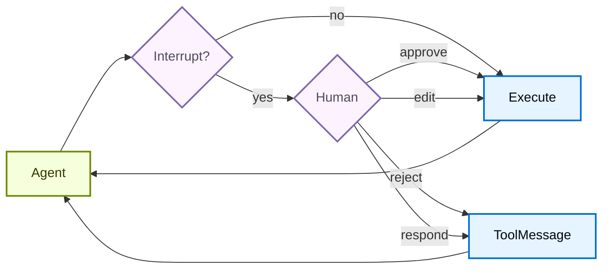

# 人在回路


> 了解如何为敏感工具操作配置人工审批


某些工具操作可能很敏感，需要人工批准才能执行。深度智能体通过 LangGraph 的中断功能支持人机交互工作流程。您可以使用 `interrupt_on` 参数配置哪些工具需要批准。设置 `interrupt_on` 后，`HumanInTheLoopMiddleware` 将添加到 [深度智能体堆栈](customization.md#deep-agents-stack)。如果在工具返回结果之前取消或中断运行，同一堆栈中的 [`PatchToolCallsMiddleware`](https://reference.langchain.com/python/deepagents/middleware/patch_tool_calls/PatchToolCallsMiddleware) 会自动修复消息历史记录。





## 基本配置


`interrupt_on` 参数接受字典映射工具名称以中断配置。每个工具都可以配置：


* **`True`**：以默认行为启用中断（允许批准、编辑、拒绝、响应）
* **`False`**：禁用该工具的中断
* **`InterruptOnConfig`**：自定义配置。设置 `allowed_decisions` 来控制审阅选项。
在 Python 中，添加可选的 `when` 谓词以仅中断特定调用（请参阅[条件中断](#conditional-interrupts)）。


```python
from langchain.tools import tool
from deepagents import create_deep_agent
from langgraph.checkpoint.memory import MemorySaver


@tool
def remove_file(path: str) -> str:
    """Delete a file from the filesystem."""
    return f"Deleted {path}"


@tool
def fetch_file(path: str) -> str:
    """Read a file from the filesystem."""
    return f"Contents of {path}"


@tool
def notify_email(to: str, subject: str, body: str) -> str:
    """Send an email."""
    return f"Sent email to {to}"


# Checkpointer is REQUIRED for human-in-the-loop
checkpointer = MemorySaver()

agent = create_deep_agent(
    model="google_genai:gemini-3.6-flash",
    tools=[remove_file, fetch_file, notify_email],
    interrupt_on={
        "remove_file": True,  # Default: approve, edit, reject, respond
        "fetch_file": False,  # No interrupts needed
        "notify_email": {"allowed_decisions": ["approve", "reject"]},  # No editing
    },
    checkpointer=checkpointer,  # Required!
)
```


```python
from langchain.tools import tool
from deepagents import create_deep_agent
from langgraph.checkpoint.memory import MemorySaver


@tool
def remove_file(path: str) -> str:
    """Delete a file from the filesystem."""
    return f"Deleted {path}"


@tool
def fetch_file(path: str) -> str:
    """Read a file from the filesystem."""
    return f"Contents of {path}"


@tool
def notify_email(to: str, subject: str, body: str) -> str:
    """Send an email."""
    return f"Sent email to {to}"


# Checkpointer is REQUIRED for human-in-the-loop
checkpointer = MemorySaver()

agent = create_deep_agent(
    model="openai:gpt-5.5",
    tools=[remove_file, fetch_file, notify_email],
    interrupt_on={
        "remove_file": True,  # Default: approve, edit, reject, respond
        "fetch_file": False,  # No interrupts needed
        "notify_email": {"allowed_decisions": ["approve", "reject"]},  # No editing
    },
    checkpointer=checkpointer,  # Required!
)
```


```python
from langchain.tools import tool
from deepagents import create_deep_agent
from langgraph.checkpoint.memory import MemorySaver


@tool
def remove_file(path: str) -> str:
    """Delete a file from the filesystem."""
    return f"Deleted {path}"


@tool
def fetch_file(path: str) -> str:
    """Read a file from the filesystem."""
    return f"Contents of {path}"


@tool
def notify_email(to: str, subject: str, body: str) -> str:
    """Send an email."""
    return f"Sent email to {to}"


# Checkpointer is REQUIRED for human-in-the-loop
checkpointer = MemorySaver()

agent = create_deep_agent(
    model="anthropic:claude-sonnet-4-6",
    tools=[remove_file, fetch_file, notify_email],
    interrupt_on={
        "remove_file": True,  # Default: approve, edit, reject, respond
        "fetch_file": False,  # No interrupts needed
        "notify_email": {"allowed_decisions": ["approve", "reject"]},  # No editing
    },
    checkpointer=checkpointer,  # Required!
)
```


```python
from langchain.tools import tool
from deepagents import create_deep_agent
from langgraph.checkpoint.memory import MemorySaver


@tool
def remove_file(path: str) -> str:
    """Delete a file from the filesystem."""
    return f"Deleted {path}"


@tool
def fetch_file(path: str) -> str:
    """Read a file from the filesystem."""
    return f"Contents of {path}"


@tool
def notify_email(to: str, subject: str, body: str) -> str:
    """Send an email."""
    return f"Sent email to {to}"


# Checkpointer is REQUIRED for human-in-the-loop
checkpointer = MemorySaver()

agent = create_deep_agent(
    model="openrouter:z-ai/glm-5.2",
    tools=[remove_file, fetch_file, notify_email],
    interrupt_on={
        "remove_file": True,  # Default: approve, edit, reject, respond
        "fetch_file": False,  # No interrupts needed
        "notify_email": {"allowed_decisions": ["approve", "reject"]},  # No editing
    },
    checkpointer=checkpointer,  # Required!
)
```


```python
from langchain.tools import tool
from deepagents import create_deep_agent
from langgraph.checkpoint.memory import MemorySaver


@tool
def remove_file(path: str) -> str:
    """Delete a file from the filesystem."""
    return f"Deleted {path}"


@tool
def fetch_file(path: str) -> str:
    """Read a file from the filesystem."""
    return f"Contents of {path}"


@tool
def notify_email(to: str, subject: str, body: str) -> str:
    """Send an email."""
    return f"Sent email to {to}"


# Checkpointer is REQUIRED for human-in-the-loop
checkpointer = MemorySaver()

agent = create_deep_agent(
    model="fireworks:accounts/fireworks/models/glm-5p2",
    tools=[remove_file, fetch_file, notify_email],
    interrupt_on={
        "remove_file": True,  # Default: approve, edit, reject, respond
        "fetch_file": False,  # No interrupts needed
        "notify_email": {"allowed_decisions": ["approve", "reject"]},  # No editing
    },
    checkpointer=checkpointer,  # Required!
)
```


```python
from langchain.tools import tool
from deepagents import create_deep_agent
from langgraph.checkpoint.memory import MemorySaver


@tool
def remove_file(path: str) -> str:
    """Delete a file from the filesystem."""
    return f"Deleted {path}"


@tool
def fetch_file(path: str) -> str:
    """Read a file from the filesystem."""
    return f"Contents of {path}"


@tool
def notify_email(to: str, subject: str, body: str) -> str:
    """Send an email."""
    return f"Sent email to {to}"


# Checkpointer is REQUIRED for human-in-the-loop
checkpointer = MemorySaver()

agent = create_deep_agent(
    model="baseten:zai-org/GLM-5.2",
    tools=[remove_file, fetch_file, notify_email],
    interrupt_on={
        "remove_file": True,  # Default: approve, edit, reject, respond
        "fetch_file": False,  # No interrupts needed
        "notify_email": {"allowed_decisions": ["approve", "reject"]},  # No editing
    },
    checkpointer=checkpointer,  # Required!
)
```


```python
from langchain.tools import tool
from deepagents import create_deep_agent
from langgraph.checkpoint.memory import MemorySaver


@tool
def remove_file(path: str) -> str:
    """Delete a file from the filesystem."""
    return f"Deleted {path}"


@tool
def fetch_file(path: str) -> str:
    """Read a file from the filesystem."""
    return f"Contents of {path}"


@tool
def notify_email(to: str, subject: str, body: str) -> str:
    """Send an email."""
    return f"Sent email to {to}"


# Checkpointer is REQUIRED for human-in-the-loop
checkpointer = MemorySaver()

agent = create_deep_agent(
    model="ollama:north-mini-code-1.0",
    tools=[remove_file, fetch_file, notify_email],
    interrupt_on={
        "remove_file": True,  # Default: approve, edit, reject, respond
        "fetch_file": False,  # No interrupts needed
        "notify_email": {"allowed_decisions": ["approve", "reject"]},  # No editing
    },
    checkpointer=checkpointer,  # Required!
)
```


## 决策类型


`allowed_decisions` 列表控制人们在查看工具调用时可以采取的操作：


|决策类型|描述|示例用例|
| ------------- | --------------------------------------------------------------------------------------------------------------- | ------------------------------------------------- |
|✅ `approve`|使用代理建议的原始参数执行该工具。|发送与书面内容完全一致的电子邮件草稿|
|✏️`edit`|执行前修改工具参数。|发送电子邮件之前更改收件人|
|❌`reject`|完全跳过执行此工具调用并向代理返回拒绝反馈。|拒绝删除文件并解释原因|
|💬`respond`|对于“询问用户”风格的工具，直接将人类的消息作为合成工具结果返回，跳过执行。|通过直接回复回答 `"ask_user"` 提示|


当人类拒绝提议的操作时，使用 `reject`。仅当人类充当工具时才使用 `respond`，例如回答 `ask_user` 提示。不要使用 `respond` 来拒绝副作用工具，因为模型可能会将其消息视为成功的工具结果。


**编辑**工具参数时，请保守地进行更改。对原始参数的重大修改可能会导致模型重新评估其方法，并可能多次执行该工具或采取意外的操作。


您可以自定义每个工具可用的决策：


```python
interrupt_on = {
    # Sensitive operations: allow all options
    "delete_file": {"allowed_decisions": ["approve", "edit", "reject"]},

    # Moderate risk: approval or rejection only
    "write_file": {"allowed_decisions": ["approve", "reject"]},

    # Must approve (no rejection allowed)
    "critical_operation": {"allowed_decisions": ["approve"]},
}
```


## 条件中断


默认情况下，`interrupt_on` 中列出的每个工具调用都会暂停以供审核。要仅暂停某些调用，请将 `when` 谓词添加到工具的 `InterruptOnConfig`。该谓词接收 [ToolCallRequest](https://reference.langchain.com/python/langgraph.prebuilt/tool_node/ToolCallRequest) 并返回 `True` 以进行中断或返回 `False` 以进行自动批准，以便您可以控制工具的参数。


条件中断需要 `langchain>=1.3.3`。


```python
from deepagents import create_deep_agent
from langchain.agents.middleware import ToolCallRequest
from langgraph.checkpoint.memory import MemorySaver


def writes_outside_workspace(request: ToolCallRequest) -> bool:
    """Pause writes to paths outside the workspace directory."""
    path = request.tool_call["args"].get("file_path", "")
    return not path.startswith("/workspace/")


agent = create_deep_agent(
    model="google_genai:gemini-3.6-flash",
    interrupt_on={
        "write_file": {
            "allowed_decisions": ["approve", "edit", "reject"],
            "when": writes_outside_workspace,
        },
    },
    checkpointer=MemorySaver(),
)
```


```python
from deepagents import create_deep_agent
from langchain.agents.middleware import ToolCallRequest
from langgraph.checkpoint.memory import MemorySaver


def writes_outside_workspace(request: ToolCallRequest) -> bool:
    """Pause writes to paths outside the workspace directory."""
    path = request.tool_call["args"].get("file_path", "")
    return not path.startswith("/workspace/")


agent = create_deep_agent(
    model="openai:gpt-5.5",
    interrupt_on={
        "write_file": {
            "allowed_decisions": ["approve", "edit", "reject"],
            "when": writes_outside_workspace,
        },
    },
    checkpointer=MemorySaver(),
)
```


```python
from deepagents import create_deep_agent
from langchain.agents.middleware import ToolCallRequest
from langgraph.checkpoint.memory import MemorySaver


def writes_outside_workspace(request: ToolCallRequest) -> bool:
    """Pause writes to paths outside the workspace directory."""
    path = request.tool_call["args"].get("file_path", "")
    return not path.startswith("/workspace/")


agent = create_deep_agent(
    model="anthropic:claude-sonnet-4-6",
    interrupt_on={
        "write_file": {
            "allowed_decisions": ["approve", "edit", "reject"],
            "when": writes_outside_workspace,
        },
    },
    checkpointer=MemorySaver(),
)
```


```python
from deepagents import create_deep_agent
from langchain.agents.middleware import ToolCallRequest
from langgraph.checkpoint.memory import MemorySaver


def writes_outside_workspace(request: ToolCallRequest) -> bool:
    """Pause writes to paths outside the workspace directory."""
    path = request.tool_call["args"].get("file_path", "")
    return not path.startswith("/workspace/")


agent = create_deep_agent(
    model="openrouter:z-ai/glm-5.2",
    interrupt_on={
        "write_file": {
            "allowed_decisions": ["approve", "edit", "reject"],
            "when": writes_outside_workspace,
        },
    },
    checkpointer=MemorySaver(),
)
```


```python
from deepagents import create_deep_agent
from langchain.agents.middleware import ToolCallRequest
from langgraph.checkpoint.memory import MemorySaver


def writes_outside_workspace(request: ToolCallRequest) -> bool:
    """Pause writes to paths outside the workspace directory."""
    path = request.tool_call["args"].get("file_path", "")
    return not path.startswith("/workspace/")


agent = create_deep_agent(
    model="fireworks:accounts/fireworks/models/glm-5p2",
    interrupt_on={
        "write_file": {
            "allowed_decisions": ["approve", "edit", "reject"],
            "when": writes_outside_workspace,
        },
    },
    checkpointer=MemorySaver(),
)
```


```python
from deepagents import create_deep_agent
from langchain.agents.middleware import ToolCallRequest
from langgraph.checkpoint.memory import MemorySaver


def writes_outside_workspace(request: ToolCallRequest) -> bool:
    """Pause writes to paths outside the workspace directory."""
    path = request.tool_call["args"].get("file_path", "")
    return not path.startswith("/workspace/")


agent = create_deep_agent(
    model="baseten:zai-org/GLM-5.2",
    interrupt_on={
        "write_file": {
            "allowed_decisions": ["approve", "edit", "reject"],
            "when": writes_outside_workspace,
        },
    },
    checkpointer=MemorySaver(),
)
```


```python
from deepagents import create_deep_agent
from langchain.agents.middleware import ToolCallRequest
from langgraph.checkpoint.memory import MemorySaver


def writes_outside_workspace(request: ToolCallRequest) -> bool:
    """Pause writes to paths outside the workspace directory."""
    path = request.tool_call["args"].get("file_path", "")
    return not path.startswith("/workspace/")


agent = create_deep_agent(
    model="ollama:north-mini-code-1.0",
    interrupt_on={
        "write_file": {
            "allowed_decisions": ["approve", "edit", "reject"],
            "when": writes_outside_workspace,
        },
    },
    checkpointer=MemorySaver(),
)
```


 当 `when` 谓词返回 `False` 时，调用将不中断地运行。当它返回 `True` 时，或者当您省略 `when` 时，呼叫照常暂停。评估为 `False` 的调用永远不会添加到中断批次中，因此审核者只能看到需要决策的操作。


有关其他配置选项和示例，请参阅 [LangChain 人机交互文档](https://docs.langchain.com/oss/python/langchain/human-in-the-loop#conditional-interrupts)。


## 处理中断


当中断被触发时，代理暂停执行并返回控制权。检查结果中是否存在中断并进行相应处理。如果用户拒绝某个操作，请包含一个明确的 `message`，告诉代理该工具未执行以及下一步要做什么。


```python
from langchain_core.utils.uuid import uuid7
from langgraph.types import Command

# Create config with thread_id for state persistence
config = {"configurable": {"thread_id": str(uuid7())}}

# Invoke the agent
result = agent.invoke(
    {"messages": [{"role": "user", "content": "Delete the file temp.txt"}]},
    config=config,
    version="v2",  # [!code highlight]
)

# Check if execution was interrupted
if result.interrupts:  # [!code highlight]
    # Extract interrupt information
    interrupt_value = result.interrupts[0].value  # [!code highlight]
    action_requests = interrupt_value["action_requests"]
    review_configs = interrupt_value["review_configs"]

    # Create a lookup map from tool name to review config
    config_map = {cfg["action_name"]: cfg for cfg in review_configs}

    # Display the pending actions to the user
    for action in action_requests:
        review_config = config_map[action["name"]]
        print(f"Tool: {action['name']}")
        print(f"Arguments: {action['args']}")
        print(f"Allowed decisions: {review_config['allowed_decisions']}")

    # Get user decisions (one per action_request, in order)
    decisions = [
        {
            "type": "reject",
            "message": "User rejected deleting temp.txt. Do not retry deletion.",
        }
    ]

    # Resume execution with decisions
    result = agent.invoke(
        Command(resume={"decisions": decisions}),
        config=config,  # Must use the same config!
        version="v2",
    )

# Process final result
print(result.value["messages"][-1].content)  # [!code highlight]
```


## 多个工具调用


当代理调用需要批准的多个工具时，所有中断都会在一个中断中批量处理。您必须按顺序为每一项做出决定。


```python
config = {"configurable": {"thread_id": str(uuid7())}}

result = agent.invoke(
    {"messages": [{
        "role": "user",
        "content": "Delete temp.txt and send an email to admin@example.com"
    }]},
    config=config,
    version="v2",  # [!code highlight]
)

if result.interrupts:  # [!code highlight]
    interrupt_value = result.interrupts[0].value  # [!code highlight]
    action_requests = interrupt_value["action_requests"]

    # Two tools need approval
    assert len(action_requests) == 2

    # Provide decisions in the same order as action_requests
    decisions = [
        {"type": "approve"},  # First tool: delete_file
        {
            "type": "reject",
            "message": "User rejected this action. Do not retry this tool call.",
        }  # Second tool: send_email
    ]

    result = agent.invoke(
        Command(resume={"decisions": decisions}),
        config=config,
        version="v2",
    )
```


## 拒绝消息


当审核者返回 `reject` 决策时，深度智能体会跳过工具调用并将拒绝反馈发送回代理。如果省略 `message`，默认反馈会告诉模型该工具尚未执行，并且除非用户要求，否则不要重试同一工具调用。


对于敏感或副作用工具，请传递特定于域的 `message` 和决策。明确客服人员是否应该放弃该操作、提出后续问题或尝试更安全的替代方案。


```python
decisions = [
    {
        "type": "reject",
        "message": "User rejected deleting this file. Do not retry deletion. Ask which file to archive instead.",
    }
]
```


## 编辑工具参数


当 `"edit"` 处于允许决策范围内时，您可以在执行前修改工具参数：


```python
if result.interrupts:  # [!code highlight]
    interrupt_value = result.interrupts[0].value  # [!code highlight]
    action_request = interrupt_value["action_requests"][0]

    # Original args from the agent
    print(action_request["args"])  # {"to": "everyone@company.com", ...}

    # User decides to edit the recipient
    decisions = [{
        "type": "edit",
        "edited_action": {
            "name": action_request["name"],  # Must include the tool name
            "args": {"to": "team@company.com", "subject": "...", "body": "..."}
        }
    }]

    result = agent.invoke(
        Command(resume={"decisions": decisions}),
        config=config,
        version="v2",
    )
```


## 子智能体中断


使用子智能体时，您可以[在工具调用上](#interrupts-on-tool-calls) 和[在工具调用内](#interrupts-within-tool-calls) 使用中断。


### 工具调用中断


每个子智能体都可以有自己的 `interrupt_on` 配置，该配置会覆盖主代理的设置：


```python
agent = create_deep_agent(
    model="google_genai:gemini-3.6-flash",
    tools=[delete_file, read_file],
    interrupt_on={
        "delete_file": True,
        "read_file": False,
    },
    subagents=[{
        "name": "file-manager",
        "description": "Manages file operations",
        "system_prompt": "You are a file management assistant.",
        "tools": [delete_file, read_file],
        "interrupt_on": {
            # Override: require approval for reads in this subagent
            "delete_file": True,
            "read_file": True,  # Different from main agent!
        }
    }],
    checkpointer=checkpointer
)
```


 当子智能体触发中断时，处理是相同的 - 检查结果中的 `interrupts` 并使用 `Command` 恢复。


### 工具调用内的中断


子智能体工具可以直接调用`interrupt()`来暂停执行并等待批准：


```python
from langchain.agents import create_agent
from langchain_anthropic import ChatAnthropic
from langchain.messages import HumanMessage
from langchain.tools import tool
from langgraph.checkpoint.memory import InMemorySaver
from langgraph.types import Command, interrupt

from deepagents.graph import create_deep_agent
from deepagents.middleware.subagents import CompiledSubAgent


@tool(description="Request human approval before proceeding with an action.")
def request_approval(action_description: str) -> str:
    """Request human approval using the interrupt() primitive."""
    # interrupt() pauses execution and returns the value passed to Command(resume=...)
    approval = interrupt({
        "type": "approval_request",
        "action": action_description,
        "message": f"Please approve or reject: {action_description}",
    })

    if approval.get("approved"):
        return f"Action '{action_description}' was APPROVED. Proceeding..."
    else:
        return f"Action '{action_description}' was REJECTED. Reason: {approval.get('reason', 'No reason provided')}"


def main():
    checkpointer = InMemorySaver()
    model = ChatAnthropic(
        model_name="claude-sonnet-4-6",
        max_tokens=4096,
    )

    compiled_subagent = create_agent(
        model=model,
        tools=[request_approval],
        name="approval-agent",
    )

    parent_agent = create_deep_agent(
        model="google_genai:gemini-3.6-flash",
        checkpointer=checkpointer,
        subagents=[
            CompiledSubAgent(
                name="approval-agent",
                description="An agent that can request approvals",
                runnable=compiled_subagent,
            )
        ],
    )

    thread_id = "test_interrupt_directly"
    config = {"configurable": {"thread_id": thread_id}}

    print("Invoking agent - sub-agent will use request_approval tool...")

    result = parent_agent.invoke(
        {
            "messages": [
                HumanMessage(
                    content="Use the task tool to launch the approval-agent sub-agent. "
                    "Tell it to use the request_approval tool to request approval for 'deploying to production'."
                )
            ]
        },
        config=config,
        version="v2",  # [!code highlight]
    )

    # Check for interrupt
    if result.interrupts:  # [!code highlight]
        interrupt_value = result.interrupts[0].value  # [!code highlight]
        print(f"\nInterrupt received!")
        print(f"  Type: {interrupt_value.get('type')}")
        print(f"  Action: {interrupt_value.get('action')}")
        print(f"  Message: {interrupt_value.get('message')}")

        print("\nResuming with Command(resume={'approved': True})...")
        result2 = parent_agent.invoke(
            Command(resume={"approved": True}),
            config=config,
            version="v2",  # [!code highlight]
        )

        if not result2.interrupts:  # [!code highlight]
            print("\nExecution completed!")
            # Find the tool response
            tool_msgs = [m for m in result2.value.get("messages", []) if m.type == "tool"]  # [!code highlight]
            if tool_msgs:
                print(f"  Tool result: {tool_msgs[-1].content}")
        else:
            print("\nAnother interrupt occurred")
    else:
        print("\n  No interrupt - the model may not have called request_approval")


if __name__ == "__main__":
    main()
```


 运行时，会产生以下输出：


```text
Invoking agent - sub-agent will use request_approval tool...

Interrupt received!
  Type: approval_request
  Action: deploying to production
  Message: Please approve or reject: deploying to production

Resuming with Command(resume={'approved': True})...

Execution completed!
  Tool result: Great! The approval request has been processed. The action **"deploying to production"** was **APPROVED**. You can now proceed with the production deployment.
```


## 文件系统权限中断


文件系统权限中断需要 `deepagents>=0.6.8`。


除了`interrupt_on`之外，您还可以通过用`mode="interrupt"`标记[权限规则](permissions.md)来暂停内置文件系统工具。当代理在与中断模式规则匹配的路径上调用 `write_file` 或 `edit_file` 时，`create_deep_agent` 会引发与已配置工具相同的人机交互中断，并使用文件系统工具的名称作为操作名称。


```python
from deepagents import FilesystemPermission, create_deep_agent
from langgraph.checkpoint.memory import MemorySaver


agent = create_deep_agent(
    model=model,
    permissions=[
        FilesystemPermission(
            operations=["write"],
            paths=["/secrets/**"],
            mode="interrupt",
        ),
    ],
    checkpointer=MemorySaver(),  # Required to pause and resume
)
```


 处理和恢复中断的方式与工具调用中断相同：运行直到暂停，检查请求，然后做出决定继续。


```python
from langgraph.types import Command

config = {"configurable": {"thread_id": "fs-thread-1"}}

result = agent.invoke(
    {"messages": [{"role": "user", "content": "Save the API key to /secrets/key.txt"}]},
    config=config,
    version="v2",
)

if result.interrupts:
    action = result.interrupts[0].value["action_requests"][0]
    print(f"Approve {action['name']} on {action['args']}?")

    # Resume with the human decision (approve, edit, or reject).
    result = agent.invoke(
        Command(resume={"decisions": [{"type": "approve"}]}),
        config=config,  # Same thread ID
        version="v2",
    )
```


 文件系统权限中断与您传递的任何 `interrupt_on` 合并，因此单个审查步骤可以涵盖自定义工具和受保护的文件系统路径。


## 最佳实践


### 始终使用检查点


人机交互需要一个检查指针来在中断和恢复之间保持代理状态：


```python
from langgraph.checkpoint.memory import MemorySaver

checkpointer = MemorySaver()
agent = create_deep_agent(
    model="google_genai:gemini-3.6-flash",
    tools=[...],
    interrupt_on={...},
    checkpointer=checkpointer  # Required for HITL
)
```


### 使用相同的线程ID


恢复时，您必须使用具有相同 `thread_id` 的相同配置：


```python
# First call
config = {"configurable": {"thread_id": "my-thread"}}
result = agent.invoke(input, config=config, version="v2")

# Resume (use same config)
result = agent.invoke(Command(resume={...}), config=config, version="v2")
```


### 将决策顺序与行动相匹配


决策列表必须与 `action_requests` 的顺序匹配：


```python
if result.interrupts:  # [!code highlight]
    interrupt_value = result.interrupts[0].value  # [!code highlight]
    action_requests = interrupt_value["action_requests"]

    # Create one decision per action, in order
    decisions = []
    for action in action_requests:
        decision = get_user_decision(action)  # Your logic
        decisions.append(decision)

    result = agent.invoke(
        Command(resume={"decisions": decisions}),
        config=config,
        version="v2",
    )
```


### 按风险定制配置


根据风险级别配置不同的工具：


```python
interrupt_on = {
    # High risk: full control (approve, edit, reject)
    "delete_file": {"allowed_decisions": ["approve", "edit", "reject"]},
    "send_email": {"allowed_decisions": ["approve", "edit", "reject"]},

    # Medium risk: no editing allowed
    "write_file": {"allowed_decisions": ["approve", "reject"]},

    # Low risk: no interrupts
    "read_file": False,
    "ls": False,
}
```


 ***


<div className="source-links">


  

[将这些文档](https://docs.langchain.com/use-these-docs) 通过 MCP 连接到 Claude、VSCode 等以获得实时答案。

  


  

[在 GitHub 上编辑此页面](https://github.com/langchain-ai/docs/edit/main/src/oss/deepagents/human-in-the-loop.mdx) 或 [提交问题](https://github.com/langchain-ai/docs/issues/new/choose)。

  

</div>

