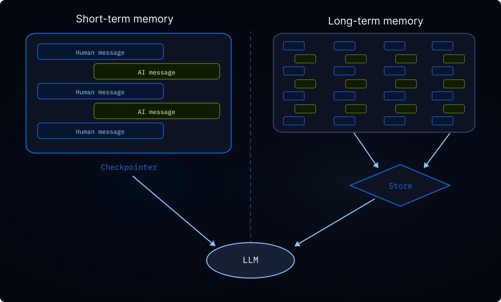
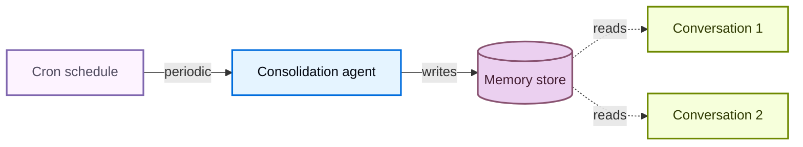

# 记忆


> 为使用深度智能体构建的代理添加持久记忆，以便他们在对话中学习和改进


记忆可以让您的代理在对话中学习和改进。 Deep Agents 通过文件系统支持的内存使内存成为一流的：代理将内存作为文件读取和写入，并且您可以使用[后端](backends.md) 控制这些文件的存储位置。


要生成编程智能体通过 [`AGENTS.md`](https://agents.md/) 发现的存储库 wiki，请参阅 [OpenWiki](https://docs.langchain.com/oss/openwiki/overview)。


本页涵盖**长期记忆**：在对话中持续存在的记忆。对于短期记忆（单个会话中的对话历史记录和临时文件），请参阅[上下文工程](context-engineering.md) 指南。短期记忆作为代理[状态](https://docs.langchain.com/oss/python/langgraph/graph-api#state)的一部分自动管理。


  


## 记忆是如何运作的


1. **将代理指向内存文件。** 创建代理时将文件路径传递给 `memory=`。您还可以通过 `skills=` 传递 [技能](skills.md) 以获取程序内存（告诉代理*如何*执行任务的可重用指令）。 [后端](backends.md) 控制文件的存储位置以及谁可以访问它们。
2. **代理读取内存。** 代理可以在启动时将内存文件加载到系统提示符中，或者在会话过程中按需读取它们。例如，[skills](skills.md) 使用按需加载：代理在启动时仅读取技能描述，然后仅在与任务匹配时读取完整的技能文件。这可以保持上下文精简，直到需要某种功能为止。
3. **代理更新内存（可选）。** 当代理了解新信息时，它可以使用其内置的 `edit_file` 工具来更新内存文件。更新可以在对话期间（默认）进行，也可以通过[后台合并](#background-consolidation) 在对话之间的后台进行。更改将保留并在下一次对话中可用。并非所有内存都是可写的：开发人员定义的[技能](skills.md)和[组织策略](#organization-level-memory)通常是只读的。详细信息请参见[只读与可写内存](#read-only-vs-writable-memory)。


两种最常见的模式是[代理范围内存](#agent-scoped-memory)（在所有用户之间共享）和[用户范围内存](#user-scoped-memory)（每个用户隔离）。


对于编程智能体通过 [`AGENTS.md`](https://agents.md/) 发现的生成的存储库 wiki，请参阅 [OpenWiki](https://docs.langchain.com/oss/openwiki/overview)。


## 作用域内存


代理内存可以划分范围，以便使用代理的每个人都可以访问相同的内存文件，或者每个用户都可以单独使用内存文件。


### 代理范围内存


为代理提供随时间演变的持久身份。代理范围的内存在所有用户之间共享，因此代理可以通过每次对话建立自己的角色、积累知识并学习偏好。当它与用户交互时，它会发展专业知识，完善其方法，并记住什么是有效的。当它具有写访问权限时，它还可以学习和更新[技能](skills.md)。


关键是后端命名空间：将其设置为 `(assistant_id,)` 意味着该代理的每个对话都会读取和写入同一内​​存文件。


访问`rt.server_info`需要`deepagents>=0.5.0`。在旧版本上，请改为从 `get_config()["metadata"]["assistant_id"]` 读取助手 ID。


```python
from deepagents import create_deep_agent
from deepagents.backends import CompositeBackend, StateBackend, StoreBackend

agent = create_deep_agent(
    model="google_genai:gemini-3.6-flash",
    memory=["/memories/AGENTS.md"],
    skills=["/skills/"],
    backend=CompositeBackend(
        default=StateBackend(),
        routes={
            "/memories/": StoreBackend(
                namespace=lambda rt: (
                    rt.server_info.assistant_id,  # [!code highlight]
                ),
            ),
            "/skills/": StoreBackend(
                namespace=lambda rt: (
                    rt.server_info.assistant_id,  # [!code highlight]
                ),
            ),
        },
    ),
)
```


 **完整示例：种子内存和调用**


用初始记忆填充存储，然后跨两个线程调用代理以查看它记住并更新它学到的内容。


```python
from langchain_core.utils.uuid import uuid7

from deepagents import create_deep_agent
from deepagents.backends import CompositeBackend, StateBackend, StoreBackend
from deepagents.backends.utils import create_file_data
from langgraph.store.memory import InMemoryStore

store = InMemoryStore()  # Use platform store when deploying to LangSmith

# Seed the memory file
store.put(
    ("my-agent",),
    "/memories/AGENTS.md",
    create_file_data("""## Response style
- Keep responses concise
- Use code examples where possible
"""),
)

# Seed a skill
store.put(
    ("my-agent",),
    "/skills/langgraph-docs/SKILL.md",
    create_file_data("""---
name: langgraph-docs
description: Fetch relevant LangGraph documentation to provide accurate guidance.
---

# langgraph-docs

Use the fetch_url tool to read https://docs.langchain.com/llms.txt, then fetch relevant pages.
"""),
)

agent = create_deep_agent(
    model="google_genai:gemini-3.6-flash",
    memory=["/memories/AGENTS.md"],
    skills=["/skills/"],
    backend=lambda rt: CompositeBackend(
        default=StateBackend(rt),
        routes={
            "/memories/": StoreBackend(
                rt, namespace=lambda rt: ("my-agent",)
            ),
            "/skills/": StoreBackend(
                rt, namespace=lambda rt: ("my-agent",)
            ),
        },
    ),
    store=store,
)

# Thread 1: the agent learns a new preference and saves it to memory
config1 = {"configurable": {"thread_id": str(uuid7())}}
agent.invoke(
    {"messages": [{"role": "user", "content": "I prefer detailed explanations. Remember that."}]},
    config=config1,
)

# Thread 2: the agent reads memory and applies the preference
config2 = {"configurable": {"thread_id": str(uuid7())}}
agent.invoke(
    {"messages": [{"role": "user", "content": "Explain how transformers work."}]},
    config=config2,
)
```


### 用户范围内存


为每个用户提供自己的内存文件。代理会记住每个用户的偏好、上下文和历史记录，而核心代理指令保持不变。如果存储在用户范围的后端中，用户还可以拥有每个用户的[技能](skills.md)。


命名空间使用 `(user_id,)`，因此每个用户都会获得内存文件的独立副本。用户 A 的偏好永远不会泄漏到用户 B 的对话中。


```python
from deepagents import create_deep_agent
from deepagents.backends import CompositeBackend, StateBackend, StoreBackend

agent = create_deep_agent(
    model="google_genai:gemini-3.6-flash",
    memory=["/memories/preferences.md"],
    skills=["/skills/"],
    backend=CompositeBackend(
        default=StateBackend(),
        routes={
            "/memories/": StoreBackend(
                namespace=lambda rt: (rt.server_info.user.identity,),
            ),
            "/skills/": StoreBackend(
                namespace=lambda rt: (rt.server_info.user.identity,),
            ),
        },
    ),
)
```


 **完整示例：跨用户隔离内存**


为每个用户存储种子并以两个不同用户的身份调用代理。每个用户只能看到自己的偏好。


```python
from langchain_core.utils.uuid import uuid7

from deepagents import create_deep_agent
from deepagents.backends import CompositeBackend, StateBackend, StoreBackend
from deepagents.backends.utils import create_file_data
from langgraph.store.memory import InMemoryStore


store = InMemoryStore()  # Use platform store when deploying to LangSmith

# Seed preferences for two users
store.put(
    ("user-alice",),
    "/memories/preferences.md",
    create_file_data("""## Preferences
- Likes concise bullet points
- Prefers Python examples
"""),
)
store.put(
    ("user-bob",),
    "/memories/preferences.md",
    create_file_data("""## Preferences
- Likes detailed explanations
- Prefers TypeScript examples
"""),
)

# Seed a skill for Alice
store.put(
    ("user-alice",),
    "/skills/langgraph-docs/SKILL.md",
    create_file_data("""---
name: langgraph-docs
description: Fetch relevant LangGraph documentation to provide accurate guidance.
---

# langgraph-docs

Use the fetch_url tool to read https://docs.langchain.com/llms.txt, then fetch relevant pages.
"""),
)

agent = create_deep_agent(
    model="google_genai:gemini-3.6-flash",
    memory=["/memories/preferences.md"],
    skills=["/skills/"],
    backend=lambda rt: CompositeBackend(
        default=StateBackend(rt),
        routes={
            "/memories/": StoreBackend(
                rt,
                namespace=lambda rt: (rt.server_info.user.identity,),
            ),
            "/skills/": StoreBackend(
                rt,
                namespace=lambda rt: (rt.server_info.user.identity,),
            ),
        },
    ),
    store=store,
)

# When deployed, each authenticated request resolves
# `rt.server_info.user.identity` to the calling user, so Alice and Bob
# automatically see only their own preferences.
agent.invoke(
    {"messages": [{"role": "user", "content": "How do I read a CSV file?"}]},
    config={"configurable": {"thread_id": str(uuid7())}},
)
```


## 高级用法


除了内存路径和范围的基本配置选项之外，您还可以配置更高级的内存参数：


|方面|提问它回答|选项|
| --------------------- | ------------------------------- | ------------------------------------------------------------------------------------------------------------------------------------------------------------------------------------------ |
|**期间**|持续多久？|[短期](context-engineering.md)（单个对话）或[长期](#scoped-memory)（跨对话）|
|**信息类型**|这是什么样的信息？|[情景](#episodic-memory)（过去的经历）、[程序](skills.md)（说明和技能）或[语义](https://docs.langchain.com/oss/python/concepts/memory#semantic-memory)（事实）|
|**范围**|谁可以查看和修改它？|[用户](#user-scoped-memory)、[代理](#agent-scoped-memory) 或 [组织](#organization-level-memory)|
|**更新策略**|记忆是什么时候写的？|通话期间（默认）或[通话之间](#background-consolidation)|
|**检索**|记忆是如何被读取的？|加载到提示（默认）或按需（例如，[技能](skills.md)）|
|**代理权限**|代理可以写入内存吗？|[读写](#read-only-vs-writable-memory)（默认）或[只读](#read-only-vs-writable-memory)（对于共享策略）|


### 情景记忆


情景记忆存储过去经历的记录：发生了什么、发生的顺序以及结果是什么。与语义记忆（存储在 `AGENTS.md` 等文件中的事实和偏好）不同，情景记忆保留了完整的对话上下文，因此代理可以回忆“如何”解决问题，而不仅仅是从中“学到什么”。要生成和维护编程智能体的存储库级 wiki，请参阅 [OpenWiki](https://docs.langchain.com/oss/openwiki/overview)。


深度智能体已经使用[检查点](https://docs.langchain.com/oss/python/langgraph/checkpointers#checkpoints)，这是支持情景记忆的机制：每个对话都作为检查点线程保存。


要使过去的对话可搜索，请将线程搜索包装在工具中。 `user_id` 是从运行时上下文中提取的，而不是作为参数传递：


```python
from langgraph_sdk import get_client
from langchain.tools import tool, ToolRuntime

client = get_client(url="<DEPLOYMENT_URL>")


@tool
async def search_past_conversations(query: str, runtime: ToolRuntime) -> str:
    """Search past conversations for relevant context."""
    user_id = runtime.server_info.user.identity  # [!code highlight]
    threads = await client.threads.search(
        metadata={"user_id": user_id},
        limit=5,
    )
    results = []
    for thread in threads:
        history = await client.threads.get_history(thread_id=thread["thread_id"])
        results.append(history)
    return str(results)
```


 您可以通过调整元数据过滤器按用户或组织确定主题搜索范围：


```python
# Search conversations for a specific user
threads = await client.threads.search(
    metadata={"user_id": user_id},
    limit=5,
)

# Search conversations across an organization
threads = await client.threads.search(
    metadata={"org_id": org_id},
    limit=5,
)
```


 这对于执行复杂的多步骤任务的代理非常有用。例如，编程智能体可以回顾过去的调试会话并直接跳到可能的根本原因。


### 组织级内存


组织级内存遵循与用户范围内存相同的模式，但具有组织范围的命名空间，而不是每个用户的命名空间。将其用于应适用于组织中所有用户和代理的策略或知识。


组织内存通常是**只读**，以防止通过共享状态进行提示注入。有关详细信息，请参阅[只读与可写内存](#read-only-vs-writable-memory)。


```python
from deepagents import create_deep_agent
from deepagents.backends import CompositeBackend, StateBackend, StoreBackend

agent = create_deep_agent(
    model="google_genai:gemini-3.6-flash",
    memory=[
        "/memories/preferences.md",
        "/policies/compliance.md",
    ],
    backend=CompositeBackend(
        default=StateBackend(),
        routes={
            "/memories/": StoreBackend(
                namespace=lambda rt: (rt.server_info.user.identity,),
            ),
            "/policies/": StoreBackend(
                namespace=lambda rt: (rt.context.org_id,),
            ),
        },
    ),
)
```


 从应用程序代码填充组织内存：


```python
from langgraph_sdk import get_client
from deepagents.backends.utils import create_file_data

client = get_client(url="<DEPLOYMENT_URL>")

await client.store.put_item(
    (org_id,),
    "/compliance.md",
    create_file_data("""## Compliance policies
- Never disclose internal pricing
- Always include disclaimers on financial advice
"""),
)
```


 使用 [权限](permissions.md) 强制组织级内存为只读，或使用 [策略挂钩](backends.md#add-policy-hooks) 自定义验证逻辑。


### 后台整合


默认情况下，代理在对话期间写入内存（热路径）。另一种方法是将对话之间的记忆处理作为后台任务，有时称为“睡眠时间计算”。一个单独的深度智能体会审查最近的对话，提取关键事实，并将其与现有记忆合并。


|方法|优点|缺点|
| -------------------------------------- | -------------------------------------------------------------------- | ----------------------------------------------------------------------- |
|**热路径**（对话期间）|内存立即可用，对用户透明|增加延迟，代理必须执行多项任务|
|**背景**（对话之间）|无面向用户的延迟，可以跨多个对话进行合成|记忆在下次对话之前不可用，需要第二个特工|


对于大多数应用程序，热路径就足够了。当您需要减少多个对话的延迟或提高内存质量时，请添加后台整合。


推荐的模式是在主代理旁边部署一个**整合代理** - 一个深度智能体，读取最近的对话历史记录，提取关键事实，并将它们合并到内存存储中 - 并按 [cron 计划](#cron) 触发它。选择反映用户实际与代理交互频率的节奏：每日流量稳定的聊天产品可能每隔几个小时就会整合一次，而每周使用几次的工具只需要每晚或每周运行一次。比用户交谈更频繁的整合只会在无操作运行时烧毁代币。


#### 集运代理


整合代理读取最近的对话历史并将关键事实合并到内存存储中。将其与您的主要代理一起注册在 `langgraph.json` 中：


```python
from datetime import datetime, timedelta, timezone

from deepagents import create_deep_agent
from langchain.tools import tool, ToolRuntime
from langgraph_sdk import get_client

sdk_client = get_client(url="<DEPLOYMENT_URL>")


@tool
async def search_recent_conversations(query: str, runtime: ToolRuntime) -> str:
    """Search this user's conversations updated in the last 6 hours."""
    user_id = runtime.server_info.user.identity  # [!code highlight]

    since = datetime.now(timezone.utc) - timedelta(hours=6)
    threads = await sdk_client.threads.search(
        metadata={"user_id": user_id},
        updated_after=since.isoformat(),
        limit=20,
    )
    conversations = []
    for thread in threads:
        history = await sdk_client.threads.get_history(
            thread_id=thread["thread_id"]
        )
        conversations.append(history["values"]["messages"])
    return str(conversations)


agent = create_deep_agent(
    model="google_genai:gemini-3.6-flash",
    system_prompt="""Review recent conversations and update the user's memory file.
Merge new facts, remove outdated information, and keep it concise.""",
    tools=[search_recent_conversations],
)
```


```json
{
  "dependencies": ["."],
  "graphs": {
    "agent": "./agent.py:agent",
    "consolidation_agent": "./consolidation_agent.py:agent"
  },
  "env": ".env"
}
```


#### 克朗


[cron 作业](https://docs.langchain.com/langsmith/cron-jobs) 按固定计划运行整合代理。代理搜索最近的对话并将其合成到内存中。将计划与您的使用模式相匹配，以便整合运行大致跟踪实际活动。





 使用 cron 作业安排整合代理：


```python
from langgraph_sdk import get_client

client = get_client(url="<DEPLOYMENT_URL>")

cron_job = await client.crons.create(
    assistant_id="consolidation_agent",
    schedule="0 */6 * * *",
    input={"messages": [{"role": "user", "content": "Consolidate recent memories."}]},
)
```


 所有 cron 计划均以 **UTC** 解释。有关管理和删除 cron 作业的详细信息，请参阅 [cron 作业](https://docs.langchain.com/langsmith/cron-jobs)。


cron 间隔必须与整合代理内的回顾窗口相匹配。上面的示例每 6 小时运行一次 (`0 */6 * * *`)，代理的 `search_recent_conversations` 工具会回溯 `timedelta(hours=6)` — 保持这些同步。如果 cron 运行的次数比回溯的次数多，您将重新处理相同的对话；如果它运行得较少，你就会丢弃那些落在窗外的记忆。


有关使用后台进程部署代理的更多信息，请参阅[即将投入生产](going-to-production.md)。


### 只读与可写内存


默认情况下，代理可以读取和写入内存文件。对于组织策略或合规性规则等共享状态，您可能希望将内存设为**只读**，以便代理可以引用它但不能修改它。这可以防止通过共享内存进行提示注入，并确保只有您的应用程序代码控制文件中的内容。


|允许|使用案例|它是如何运作的|
| ------------------------ | -------------------------------------------------------------------------------------------------------------------------- | ------------------------------------------------------------------------------------------------------------------------------------------------------------------------------------------------------------------------------------------------------------------- |
|**读写**（默认）|用户喜好，座席自我提升，学到的【技能】(/oss/python/deepagents/skills)|代理通过 `edit_file` 工具更新文件|
|**只读**|组织政策、合规规则、共享知识库、开发人员定义的[技能](skills.md)|通过应用程序代码或[Store API](https://docs.langchain.com/langsmith/custom-store) 进行填充。使用 [权限](permissions.md) 拒绝写入特定路径，或使用 [策略挂钩](backends.md#add-policy-hooks) 自定义验证逻辑。|


**安全注意事项：** 如果一个用户可以写入另一用户读取的内存，则恶意用户可以将指令注入共享状态。为了缓解这种情况：


* **默认为用户范围** `(user_id)` 除非您有特定的共享原因
* 将**只读内存**用于共享策略（通过应用程序代码填充，而不是代理）
* 在代理写入共享内存之前添加**人机交互**验证。使用[中断](https://docs.langchain.com/oss/python/langgraph/interrupts) 要求人工批准才能写入敏感路径。


要强制执行只读内存，请使用 [permissions](permissions.md) 以声明方式拒绝对特定路径的写入。对于自定义验证逻辑（速率限制、审核日志记录、内容检查），请使用[后端策略挂钩](backends.md#add-policy-hooks)。


### 并发写入


多个线程可以并行写入内存，但并发写入**同一文件**可能会导致最后写入获胜冲突。对于用户范围的内存来说，这种情况很少见，因为用户通常一次只有一个活动对话。对于代理范围或组织范围的内存，请考虑使用[后台整合](#background-consolidation) 来序列化写入，或将内存构造为每个主题的单独文件以减少争用。


在实践中，如果写入由于冲突而失败，LLM 通常足够聪明，可以重试或正常恢复，因此单个丢失的写入并不是灾难性的。


### 同一部署中的多个代理


要在共享部署中为每个代理提供自己的内存，请将 `assistant_id` 添加到命名空间：


```python
StoreBackend(
    namespace=lambda rt: (
        rt.server_info.assistant_id,  # [!code highlight]
        rt.server_info.user.identity,
    ),
)
```


 如果您只需要每个代理隔离而不需要每个用户范围，请单独使用 `assistant_id`。


使用 [LangSmith 跟踪](https://docs.langchain.com/langsmith/trace-with-langgraph) 审核代理写入内存的内容。每个文件写入在跟踪中都显示为工具调用。


## 参见


* [OpenWiki](https://docs.langchain.com/oss/openwiki/overview)：生成和维护编程智能体通过 `AGENTS.md` 找到的存储库 wiki
* [Backends](backends.md): 选择内存文件的存储位置
* [上下文工程](context-engineering.md)：短期记忆、卸载和总结
* 【技能】(/oss/python/deepagents/skills)：按需程序记忆


***


<div className="source-links">


  

[将这些文档](https://docs.langchain.com/use-these-docs) 通过 MCP 连接到 Claude、VSCode 等以获得实时答案。

  


  

[在 GitHub 上编辑此页面](https://github.com/langchain-ai/docs/edit/main/src/oss/deepagents/memory.mdx) 或 [提交问题](https://github.com/langchain-ai/docs/issues/new/choose)。

  

</div>

