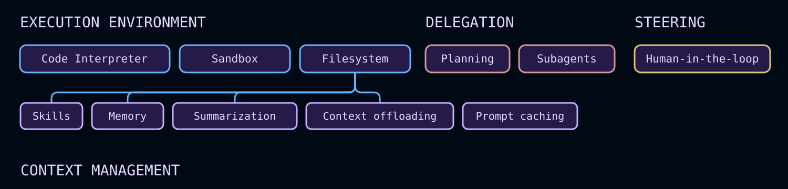

# 深度智能体概述


> 构建可以规划、使用子智能体并利用文件系统来执行复杂任务的代理


Deep Agents 是开始构建由 LLM 支持的代理和应用程序的最简单方法 - 具有用于上下文管理、子智能体生成和长期内存的文件系统内置功能。 [任务规划](#task-planning) 和[技能](#skills) 等可选功能可在您的用例需要时扩展工具。您可以将深度智能体用于任何任务，包括复杂的多步骤任务。


Deep Agents 具有以下功能：


* **在环境中采取行动**：通过工具采取行动，读写文件，执行代码
* **连接到您的数据**：在适当的时刻加载记忆、技能和领域知识
* **管理不断增长的环境**：总结历史并在长期运行中卸载大量结果
* **并行化任务**：委托给在隔离上下文窗口中运行的通用或专用子智能体
* **留在循环中**：在关键决策点暂停以供人工批准
* **随着时间的推移而改进**：根据实际使用情况更新记忆、技能和提示


有关每个组件的完整详细信息，请参阅[核心功能](#core-capabilities)。


## 尝试一下


## 快速入门


```python
from deepagents import create_deep_agent


def get_weather(city: str) -> str:
    """Get weather for a given city."""
    return f"It's always sunny in {city}!"


agent = create_deep_agent(
    model="google_genai:gemini-3.6-flash",
    tools=[get_weather],
    system_prompt="You are a helpful assistant",
)

# Run the agent
agent.invoke(
    {"messages": [{"role": "user", "content": "what is the weather in sf"}]}
)
```


```python
from deepagents import create_deep_agent


def get_weather(city: str) -> str:
    """Get weather for a given city."""
    return f"It's always sunny in {city}!"


agent = create_deep_agent(
    model="openai:gpt-5.5",
    tools=[get_weather],
    system_prompt="You are a helpful assistant",
)

# Run the agent
agent.invoke(
    {"messages": [{"role": "user", "content": "what is the weather in sf"}]}
)
```


```python
from deepagents import create_deep_agent


def get_weather(city: str) -> str:
    """Get weather for a given city."""
    return f"It's always sunny in {city}!"


agent = create_deep_agent(
    model="anthropic:claude-sonnet-4-6",
    tools=[get_weather],
    system_prompt="You are a helpful assistant",
)

# Run the agent
agent.invoke(
    {"messages": [{"role": "user", "content": "what is the weather in sf"}]}
)
```


```python
from deepagents import create_deep_agent


def get_weather(city: str) -> str:
    """Get weather for a given city."""
    return f"It's always sunny in {city}!"


agent = create_deep_agent(
    model="openrouter:z-ai/glm-5.2",
    tools=[get_weather],
    system_prompt="You are a helpful assistant",
)

# Run the agent
agent.invoke(
    {"messages": [{"role": "user", "content": "what is the weather in sf"}]}
)
```


```python
from deepagents import create_deep_agent


def get_weather(city: str) -> str:
    """Get weather for a given city."""
    return f"It's always sunny in {city}!"


agent = create_deep_agent(
    model="fireworks:accounts/fireworks/models/glm-5p2",
    tools=[get_weather],
    system_prompt="You are a helpful assistant",
)

# Run the agent
agent.invoke(
    {"messages": [{"role": "user", "content": "what is the weather in sf"}]}
)
```


```python
from deepagents import create_deep_agent


def get_weather(city: str) -> str:
    """Get weather for a given city."""
    return f"It's always sunny in {city}!"


agent = create_deep_agent(
    model="baseten:zai-org/GLM-5.2",
    tools=[get_weather],
    system_prompt="You are a helpful assistant",
)

# Run the agent
agent.invoke(
    {"messages": [{"role": "user", "content": "what is the weather in sf"}]}
)
```


```python
from deepagents import create_deep_agent


def get_weather(city: str) -> str:
    """Get weather for a given city."""
    return f"It's always sunny in {city}!"


agent = create_deep_agent(
    model="ollama:north-mini-code-1.0",
    tools=[get_weather],
    system_prompt="You are a helpful assistant",
)

# Run the agent
agent.invoke(
    {"messages": [{"role": "user", "content": "what is the weather in sf"}]}
)
```


 请参阅[快速入门](quickstart.md) 和[自定义指南](customization.md)，开始使用 Deep Agents 构建您自己的代理和应用程序。


使用 [LangSmith](https://smith.langchain.com?utm_source=docs\&utm_medium=cta\&utm_campaign=langsmith-signup\&utm_content=oss-deepagents-overview) 跟踪请求、调试代理行为并评估输出。按照[可观测性快速入门](https://docs.langchain.com/langsmith/observability-quickstart) 进行设置。准备好投入生产后，请参阅[进入生产](going-to-production.md) 了解 LangSmith 部署选项。


## 核心能力





Deep Agents 是一个[“代理工具”](https://docs.langchain.com/oss/python/concepts/products#agent-harnesses-like-the-deep-agents-sdk)。它与其他代理框架具有相同的核心工具调用循环，但具有使代理可靠地执行实际任务的内置功能：


  
**执行环境**


[查看相关页面](#execution-environment)


工具、虚拟文件系统、可选沙箱和 REPL（解释器）

  


  
**上下文管理**


[查看相关页面](#context-management)


技能、记忆、总结、上下文卸载和提示缓存

  


  
**代表团**


[查看相关页面](#delegation)


子智能体生成和可选的任务规划

  


  
**转向**


[查看相关页面](#steering)


人机交互批准和中断

  

[`deepagents`](https://pypi.org/project/deepagents/) 是一个独立的库，构建在 [LangChain](https://docs.langchain.com/oss/python/langchain/) 的代理核心构建块之上。它使用 [LangGraph](https://docs.langchain.com/oss/python/langgraph/) 运行时来实现持久执行、流式处理、人机交互和其他功能。


[LangChain](https://docs.langchain.com/oss/python/langchain/) 是为您的代理提供核心构建块的框架。要了解有关 LangChain、LangGraph 和 Deep Agent 之间差异的更多信息，请参阅[框架、运行时和利用](https://docs.langchain.com/oss/python/concepts/products)。有关与 Anthropic 的工具的并排比较，请参阅 [Deep Agents 与 Claude Agent SDK](comparison.md)。


要构建没有这些内置功能的自定义代理，请考虑使用 LangChain 的 [`create_agent`](https://docs.langchain.com/oss/python/langchain/agents) 或构建自定义 [LangGraph](https://docs.langchain.com/oss/python/langgraph/overview) 工作流程。


## 执行环境


执行环境是代理执行操作的地方。它有四层：


* **[工具](#tools-and-mcp)**：代理可以调用​​的自定义函数、API 和数据库
* **[虚拟文件系统](#virtual-filesystem-access)**：由可插入后端支持的文件工具
* **[文件系统权限](#filesystem-permissions)**：对代理可以读取或写入的路径进行声明性访问控制
* **[代码执行](#code-execution)**：沙盒 shell 执行和进程内 JavaScript 解释器


**[流](#streaming)** 允许您使用消息、工具、值和委派任务的类型化事件流来跟上发生的一切。


### 工具和 MCP


使用 `tools=` 参数传递自定义函数、LangChain 工具或来自任何 [MCP 服务器](tools.md#mcp-tools) 的工具。 Deep Agents 完全支持 [模型上下文协议 (MCP)](https://docs.langchain.com/oss/python/langchain/mcp)，让您通过标准接口连接到数据库、API、文件系统等。


```python
from deepagents import create_deep_agent

agent = create_deep_agent(
    model="anthropic:claude-sonnet-4-6",
    tools=[search, fetch_page, run_query],
)
```


 有关定义自定义工具、使用 MCP 服务器以及内置线束工具的完整列表的详细信息，请参阅[工具](tools.md)。


### 虚拟文件系统访问


该工具提供了一个可配置的虚拟文件系统，可以由不同的[可插入后端](backends.md) 支持：内存状态、本地磁盘、LangGraph 存储、复合路由或具有用于读写访问的[权限规则](permissions.md) 的自定义后端。


后端支持以下文件系统操作：


|工具|描述|
| ------------ | ------------------------------------------------------------------------------------------------------------------------------------------------------------------------------------------------------------------------ |
|`ls`|列出目录中的文件以及元数据（大小、修改时间）|
|`read_file`|使用行号读取文件内容，支持大文件的偏移/限制。还支持返回非文本文件（图像、视频、音频和文档）的多模式内容块。请参阅下面支持的扩展。|
|`write_file`|创建一个新文件，或覆盖现有文件|
|`edit_file`|在文件中执行精确的字符串替换（使用全局替换模式）|
|`delete`|递归删除文件或目录及其内容|
|`glob`|查找匹配模式的文件（例如，`**/*.py`）|
|`grep`|使用多种输出模式搜索文件内容（仅文件、带上下文的内容或计数）|
|`execute`|在环境中运行 shell 命令（仅适用于 [沙盒后端](sandboxes.md)）|


`delete` 工具需要 `deepagents>=0.7`。不支持删除的后端会自动从模型中隐藏该工具。


**支持的多模式文件扩展名**


|类型|扩展|
  | -------------------------------------------------- | ------------------------------------------------------------------------- |
|[图片](https://docs.langchain.com/oss/python/langchain/messages#multimodal)|`.png`、`.jpg`、`.jpeg`、`.gif`、`.webp`、`.heic`、`.heif`|
|[视频](https://docs.langchain.com/oss/python/langchain/messages#multimodal)|`.mp4`、`.mpeg`、`.mov`、`.avi`、`.flv`、`.mpg`、`.webm`、`.wmv`、`.3gpp`|
|[音频](https://docs.langchain.com/oss/python/langchain/messages#multimodal)|`.wav`、`.mp3`、`.aiff`、`.aac`、`.ogg`、`.flac`|
|[文件](https://docs.langchain.com/oss/python/langchain/messages#multimodal)|`.pdf`、`.ppt`、`.pptx`|


**不使用默认文件系统工具运行**


要从模型中隐藏上面列出的文件系统工具，请使用 `excluded_tools` 注册 [harness profile](profiles.md#harness-profiles)：


```python
from deepagents import HarnessProfile, register_harness_profile

register_harness_profile(
    "anthropic:claude-sonnet-4-6",
    HarnessProfile(
        excluded_tools=frozenset(
            {"ls", "read_file", "write_file", "edit_file", "delete", "glob", "grep"}
        ),
    ),
)
```


 通过 `excluded_middleware` 删除 [`FilesystemMiddleware`](https://reference.langchain.com/python/deepagents/middleware/filesystem/FilesystemMiddleware) 本身被故意拒绝——它需要 [深度智能体堆栈](customization.md#deep-agents-stack) 中的脚手架。使用 `excluded_tools` 仅隐藏模型可见的工具表面并将中间件保留在适当的位置。要删除 `task` 工具，请参阅[在没有子智能体的情况下运行](subagents.md#running-without-subagents)。


**限制文件系统工具**


  

`FilesystemMiddleware` 上的 `tools` 允许列表需要 `deepagents>=0.7`。

  


要仅公开上面列出的文件系统工具的子集，而不是将它们全部隐藏，请将 `tools` 白名单传递给 [`FilesystemMiddleware`](https://reference.langchain.com/python/deepagents/middleware/filesystem/FilesystemMiddleware) 并通过 `middleware=` 提供实例。列表中未列出的任何内置文件系统工具都将从模型的工具列表中删除。


```python
from deepagents import create_deep_agent
from deepagents.middleware import FilesystemMiddleware

# Read-only agent: write_file, edit_file, delete, and execute are never shown
agent = create_deep_agent(
    model="claude-sonnet-4-6",
    middleware=[
        FilesystemMiddleware(backend=backend, tools=["read_file", "ls", "glob", "grep"]),
    ],
)
```


 `read_file` 必须始终包含在列表中 - 忽略它会在创建代理时引发 `ValueError`。当配置的后端不支持 `execute` 和 `delete` 工具时，无论您是否将它们包含在 `tools` 中，它们也会从工具表面删除。您通过 `create_deep_agent` 自己的 `tools=` 参数添加的自定义工具永远不会受到此白名单的影响。


通过这种方式传递您自己的 [`FilesystemMiddleware`](https://reference.langchain.com/python/deepagents/middleware/filesystem/FilesystemMiddleware) 实例将替换主代理的默认实例，并且通用子智能体继承相同的限制。有关详细信息，请参阅[覆盖默认中间件实例](customization.md#override-a-default-middleware-instance)。声明性子智能体不会继承它：在该子智能体自己的 `middleware` 字段中包含 `FilesystemMiddleware(tools=...)` 实例以独立限制它。


虚拟文件系统由其他几个工具功能使用，例如技能、内存、代码执行和上下文管理。您还可以在为 Deep Agent 构建自定义工具和中间件时使用文件系统。


有关更多信息，请参阅[后端](backends.md)。要生成代理可以从文件系统读取的持久存储库 wiki，请参阅 [OpenWiki](https://docs.langchain.com/oss/openwiki/overview)。


### 文件系统权限


该工具支持声明性权限规则，控制代理可以读取或写入哪些文件和目录。权限适用于上面列出的内置文件系统工具，并按照声明顺序和首匹配胜语义进行评估。


创建代理时，通过将规则列表传递给 `permissions=` 来定义权限。每条规则包括：


* `operations`：`"read"` 和/或 `"write"`
* `paths`：文件或目录的全局模式
* `mode`：`"allow"` 或 `"deny"`


规则从上到下进行评估，第一个匹配的规则获胜。如果没有规则匹配，则允许该操作。


此模型允许您将代理限制到特定目录（例如，`/workspace/`），保护敏感文件（例如 `.env` 或凭据），并为子智能体提供比父代理更窄的访问权限。


权限不适用于[沙箱后端](sandboxes.md)，它支持通过 `execute` 工具执行任意命令。对于自定义验证逻辑，请使用[后端策略挂钩](backends.md#add-policy-hooks)。


有关完整的规则结构、示例和子智能体继承，请参阅[权限](permissions.md)。


### 代码执行


Deep Agents 通过两种方式支持代码执行：


* [沙箱后端](sandboxes.md) 在隔离环境中公开用于 shell 命令的 `execute` 工具。
* [解释器](interpreters.md) 添加一个 `eval` 工具，该工具在限定范围的 QuickJS 运行时中运行 JavaScript。


当代理需要安装依赖项、运行测试、调用 CLI 或使用操作系统文件系统时，请使用沙箱后端。沙箱后端实现 `SandboxBackendProtocolV2`；当检测到时，该工具会将 `execute` 工具添加到代理的可用工具中。


当代理需要轻量级可编程层用于循环、批处理、确定性数据转换或编程工具调用时，请使用解释器。解释器不提供 shell 访问、软件包安装或文件系统和网络访问。


有关沙箱设置、提供程序和文件传输 API，请参阅[沙箱](sandboxes.md)。对于 QuickJS 运行时和编程工具调用，请参阅[解释器](interpreters.md)。


### 流媒体


[事件流](event-streaming.md) 将代理运行公开为消息、工具调用、值和输出的类型化投影。深度智能体添加 `stream.subagents`，以便每个委派任务获得自己的句柄以及独立的消息、工具调用和嵌套子智能体流。


## 上下文管理


上下文管理组件控制代理知道什么、它可以在令牌限制内运行多长时间以及它在会话中保留什么。它有四层：


* **[技能](#skills)**：从技能文件逐步加载按需领域知识
* **[内存](#memory)**：启动时从 `AGENTS.md` 文件加载的持久指令和首选项
* **[摘要和上下文卸载](#summarization-and-context-offloading)**：自动压缩对话历史记录和大型工具结果
* **[提示缓存](#prompt-caching)**：静态提示部分符合缓存条件，可加快推理速度并降低支持模型的成本


### 技能


技能包为您的深度智能体提供专门的工作流程、领域知识和自定义说明。


每个技能都遵循[代理技能标准](https://agentskills.io/)，并位于包含 `SKILL.md` 文件的目录中。技能还可以包括脚本、模板、参考文档和其他支持资源。


深度智能体以渐进式披露方式加载技能：代理在启动时读取 `SKILL.md` frontmatter，然后仅在任务需要时读取完整的技能内容。这使得启动上下文保持紧凑，同时仍然可以按需提供丰富的功能。


更多信息请参见【技能​​】(/oss/python/deepagents/skills)。


### 记忆


记忆为您的深度智能体提供跨对话的持久上下文，例如编码风格、偏好、约定和项目指南。


内存使用您在创建代理时通过 `memory` 参数传递的 [`AGENTS.md` 文件](https://agents.md/)。与技能不同的是，内存文件始终会加载，内容存储在配置的后端（`StateBackend`、`StoreBackend` 或 `FilesystemBackend`）中。


代理还可以根据交互和反馈更新记忆，因此偏好和模式可以继续下去，而无需在每个线程中重述它们。


有关配置详细信息和示例，请参阅[内存](customization.md#memory)。要生成编程智能体通过 `AGENTS.md` 发现的存储库 wiki，请参阅 [OpenWiki](https://docs.langchain.com/oss/openwiki/overview)。


### 总结和上下文卸载


该工具管理上下文，以便深度智能体可以在令牌限制内处理长时间运行的工作，同时将最相关的信息保留在范围内。


该上下文流有四个部分：


* **输入上下文**：系统提示、记忆、技能和工具提示定义了代理的开始内容。
* **压缩**：内置卸载和摘要压缩对话历史记录和大型中间结果。
* **隔离**：子智能体隔离繁重的子任务并仅返回最终结果（请参阅[委派](#delegation)）。
* **长期内存**：虚拟文件系统中的持久存储跨线程传送信息。


这些机制共同支持超出单个上下文窗口的多步骤任务，同时减少手动上下文修剪和令牌使用。


详细配置请参见[上下文工程](context-engineering.md)。对于多模态输入和工具输出，请参见[多模态](multimodal.md)。


### 提示缓存


对于 Anthropic 和 Amazon Bedrock 模型，`create_deep_agent` 自动将提示缓存应用于系统提示的静态部分 - 每回合重复的基本代理指令、内存和技能内容。这避免了在调用之间重新处理相同的令牌，从而减少了长时间运行的代理的延迟和成本。


使用人类模型或基岩模型（Claude 或 Nova）时，默认启用提示缓存。无需配置。


对于其他提供商，请参阅[中间件集成](https://docs.langchain.com/oss/python/integrations/middleware)，了解可用的特定于提供商的缓存中间件。


## 代表团


委托组件使代理能够将大问题分解为更小的、可并行的工作单元。它有两层：


* **[任务计划](#task-planning)**：用于结构化任务跟踪的可选 `write_todos` 工具
* **[子智能体](#subagents)**：处理独立子任务的临时子智能体


### 任务规划


任务规划是一种可选的利用功能，可让代理在执行期间维护结构化任务列表。


从 v0.7 开始，任务计划只能选择加入。在早期版本中，默认包含任务计划中间件。


规划通常有助于：


* 长或复杂的多步骤任务
* 能力较差的模型受益于明确的问责工具
* 从代理状态传输进度的 UI（请参阅 [待办事项列表](frontend--todo-list.md)）


将 [`TodoListMiddleware`](https://reference.langchain.com/python/langchain/agents/middleware/todo/TodoListMiddleware) 传递给中间件参数，为代理提供 `write_todos` 工具，用于在执行期间维护结构化任务列表。


```python
from deepagents import create_deep_agent
from langchain.agents.middleware import TodoListMiddleware

agent = create_deep_agent(
    model="google_genai:gemini-3.6-flash",
    middleware=[TodoListMiddleware()],
)
```


```python
from deepagents import create_deep_agent
from langchain.agents.middleware import TodoListMiddleware

agent = create_deep_agent(
    model="openai:gpt-5.5",
    middleware=[TodoListMiddleware()],
)
```


```python
from deepagents import create_deep_agent
from langchain.agents.middleware import TodoListMiddleware

agent = create_deep_agent(
    model="anthropic:claude-sonnet-4-6",
    middleware=[TodoListMiddleware()],
)
```


```python
from deepagents import create_deep_agent
from langchain.agents.middleware import TodoListMiddleware

agent = create_deep_agent(
    model="openrouter:z-ai/glm-5.2",
    middleware=[TodoListMiddleware()],
)
```


```python
from deepagents import create_deep_agent
from langchain.agents.middleware import TodoListMiddleware

agent = create_deep_agent(
    model="fireworks:accounts/fireworks/models/glm-5p2",
    middleware=[TodoListMiddleware()],
)
```


```python
from deepagents import create_deep_agent
from langchain.agents.middleware import TodoListMiddleware

agent = create_deep_agent(
    model="baseten:zai-org/GLM-5.2",
    middleware=[TodoListMiddleware()],
)
```


```python
from deepagents import create_deep_agent
from langchain.agents.middleware import TodoListMiddleware

agent = create_deep_agent(
    model="ollama:north-mini-code-1.0",
    middleware=[TodoListMiddleware()],
)
```


 任务支持状态跟踪（`'pending'`、`'in_progress'`、`'completed'`）并保留在代理状态。这为代理提供了一个轻量级的规划层，用于组织长期运行和多步骤的工作。


有关配置选项和行为详细信息，请参阅[待办事项列表](https://docs.langchain.com/oss/python/langchain/middleware/built-in#to-do-list)。


### 子智能体


该工具包括一个内置的 `task` 工具，可让主代理为隔离、长时间运行、多步骤或并行任务创建临时子智能体。


子智能体执行提供：


* **新上下文**：每次调用都会创建一个具有自己的上下文的新代理实例。
* **自主执行**：子智能体独立运行直到完成。
* **单次切换**：它将一份最终报告返回给主代理。
* **可配置策略**：使用[默认 `general-purpose` 子智能体](subagents.md#default-subagent)（默认启用）或定义[自定义子智能体](subagents.md#custom-subagents)。
* **无状态消息传递**：子智能体是无状态的，不能发回多条消息。
* **上下文和令牌效率**：繁重的子任务工作保持隔离并被压缩为紧凑的结果。


**无需子智能体即可运行（无 `task` 工具）**


要在不使用 `task` 工具的情况下运行代理，请参阅[在不使用子智能体的情况下运行](subagents.md#running-without-subagents)。不要尝试通过 `excluded_middleware` 删除 [`SubAgentMiddleware`](https://reference.langchain.com/python/deepagents/middleware/subagents/SubAgentMiddleware)——这是故意拒绝的。相反，通过 [harness profile](profiles.md#harness-profiles) 禁用自动添加的子智能体，并且不通过 `subagents=` 传递任何同步子智能体。异步子智能体不受影响。有关完整订购信息，请参阅[全栈](customization.md#full-stack)。


有关详细信息，请参阅[子智能体](subagents.md)。


## 转向


控制组件使人们能够在运行时控制代理行为，并为代理工作设置文件系统权限。


### 人在回路


Deep Agents 与 LangGraph 中断集成，因此您可以暂停敏感工具调用以供批准。使用 `create_deep_agent` 中的 `interrupt_on` 参数启用此行为。


`interrupt_on` 接受工具名称到中断配置的映射。例如，`interrupt_on={"edit_file": True}` 在每次编辑之前暂停，让您在执行之前批准调用、添加指导或修改工具输入。


这为您提供了一个运行时安全和控制层，用于破坏性操作、昂贵的 API 调用和交互式调试。


有关更多信息，请参阅[人在环](human-in-the-loop.md)。


## 开始使用


  
**快速入门**


[查看相关页面](quickstart.md)


构建您的第一个深度智能体

  


  
**定制**


[查看相关页面](customization.md)


了解定制选项

  


  
**代码**


[查看相关页面](code-link.md)


使用深度智能体代码

  


  
**非加普**


[查看相关页面](acp.md)


通过 ACP 在代码编辑器中使用深度智能体

  


  
**参考**


[查看相关页面](https://reference.langchain.com/python/deepagents/)


请参阅 `deepagents` API 参考

  

***


<div className="source-links">


  

[将这些文档](https://docs.langchain.com/use-these-docs) 通过 MCP 连接到 Claude、VSCode 等以获得实时答案。

  


  

[在 GitHub 上编辑此页面](https://github.com/langchain-ai/docs/edit/main/src/oss/deepagents/overview.mdx) 或 [提交问题](https://github.com/langchain-ai/docs/issues/new/choose)。

  

</div>

