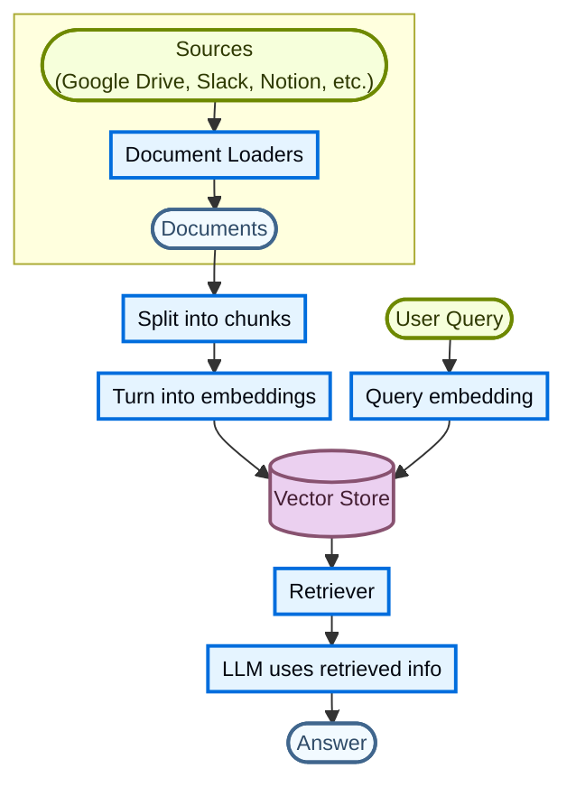
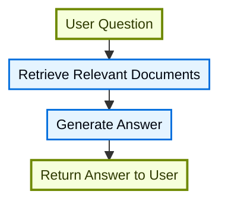
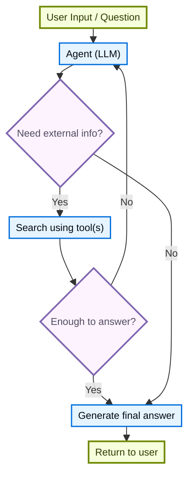
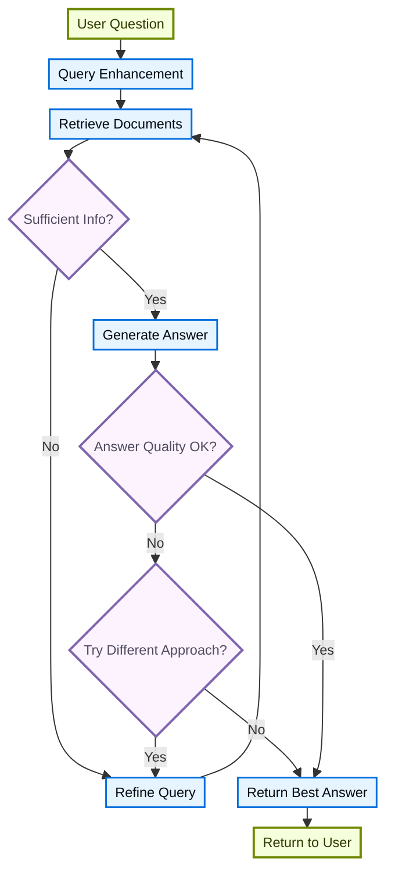

# 检索


大型语言模型 (LLM) 功能强大，但有两个关键限制：


* **有限上下文**：他们无法一次摄取整个语料库。
* **静态知识**：他们的训练数据被冻结在某个时间点。


检索通过在查询时获取相关的外部知识来解决这些问题。这是**检索增强生成（RAG）**的基础，通过上下文特定信息增强法学硕士的答案。


## 建立知识库


**知识库**是检索过程中使用的文档或结构化数据的存储库。


如果您需要一个自定义知识库，您可以使用 LangChain 的文档加载器和矢量存储来根据您自己的数据构建一个知识库。


如果您已经拥有知识库（例如 SQL 数据库、文档数据库、CRM 或内部文档系统），则**不需要**需要重建它。你可以：


  * 将其连接为 Agentic RAG 中代理的**工具**。
  * 查询它并将检索到的内容作为上下文提供给 LLM [(2-Step RAG)](#2-step-rag)。


有关更多信息，请参阅以下教程来构建可搜索的知识库和最小的 RAG 工作流程：


**教程：语义搜索**


[查看相关页面](https://docs.langchain.com/oss/python/langchain/knowledge-base)


了解如何使用 LangChain 的文档加载器、嵌入和向量存储从您自己的数据创建可搜索的知识库。在本教程中，您将在 PDF 上构建一个搜索引擎，从而能够检索与查询相关的段落。您还将在此引擎之上实现一个最小的 RAG 工作流程，以了解如何将外部知识集成到 LLM 推理中。


### 从检索到 RAG


检索允许法学硕士在运行时访问相关上下文。但大多数现实世界的应用程序更进一步：它们**将检索与生成集成**以生成接地气的、上下文感知的答案。


这是**检索增强生成（RAG）**背后的核心思想。检索管道成为将搜索与生成相结合的更广泛系统的基础。


### 检索管道


典型的检索工作流程如下所示：





 每个组件都是模块化的：您可以交换加载器、拆分器、嵌入或向量存储，而无需重写应用程序的逻辑。


### 积木


  
**文档加载器**


[查看相关页面](https://docs.langchain.com/oss/python/integrations/document_loaders)


从外部源（Google Drive、Slack、Notion 等）获取数据，返回标准化的 [`Document`](https://reference.langchain.com/python/langchain-core/documents/base/Document) 对象。

  


  
**文本分割器**


[查看相关页面](https://docs.langchain.com/oss/python/integrations/splitters)


将大文档分成更小的块，这些块可以单独检索并适合模型的上下文窗口。

  


  
**嵌入模型**


[查看相关页面](https://docs.langchain.com/oss/python/integrations/embeddings)


嵌入模型将文本转换为数字向量，以便具有相似含义的文本在该向量空间中紧密结合在一起。

  


  
**矢量商店**


[查看相关页面](https://docs.langchain.com/oss/python/integrations/vectorstores/)


用于存储和搜索嵌入的专用数据库。

  


  
**猎犬**


[查看相关页面](https://docs.langchain.com/oss/python/integrations/retrievers/)


检索器是一个接口，它根据非结构化查询返回文档。

  

## RAG架构


RAG 可以通过多种方式实施，具体取决于系统的需求。我们在下面的部分中概述了每种类型。


|建筑学|描述|控制|灵活性|延迟|示例用例|
| --------------- | -------------------------------------------------------------------------- | --------- | ----------- | ---------- | ------------------------------------------------- |
|**2步RAG**|检索总是发生在生成之前。简单且可预测|✅ 高|❌低|⚡ 快|常见问题解答、文档机器人|
|**代理RAG**|由 LLM 支持的代理决定在推理期间“何时”和“如何”检索|❌低|✅ 高|⏳ 变量|研究助理可以使用多种工具|
|**杂交种**|将两种方法的特征与验证步骤相结合|⚖️ 中等|⚖️ 中等|⏳ 变量|具有质量验证的特定领域问答|


**延迟**：在 **2 步 RAG** 中，延迟通常更容易**预测**，因为 LLM 调用的最大数量是已知的且有上限。这种可预测性假设 LLM 推理时间是主导因素。然而，现实世界的延迟也可能受到检索步骤性能的影响，例如 API 响应时间、网络延迟或数据库查询，这些性能可能会根据所使用的工具和基础设施而有所不同。


### 2步RAG


在 **2-Step RAG** 中，检索步骤始终在生成步骤之前执行。这种架构简单且可预测，使其适用于许多应用程序，在这些应用程序中，检索相关文档是生成答案的明确先决条件。





<br />


  
**教程：语义搜索**


[查看相关页面](https://docs.langchain.com/oss/python/langchain/knowledge-base)


使用文档加载器、嵌入和向量存储构建可搜索的知识库，然后在其上运行最小的检索然后生成 RAG 工作流程。

  


  
**教程：评估 RAG 应用程序**


[查看相关页面](https://docs.langchain.com/langsmith/evaluate-rag-tutorial)


构建一个简单的检索然后生成 RAG 应用程序，并使用 LangSmith 衡量答案的正确性、相关性、基础性和检索质量。

  

### 代理RAG


**代理检索增强生成 (RAG)** 结合了检索增强生成与基于代理的推理的优势。代理（由法学硕士提供支持）不是在回答之前检索文档，而是逐步推理并决定在交互过程中**何时**和**如何**检索信息。


代理启用 RAG 行为所需的唯一一件事就是访问一个或多个可以获取外部知识的**工具**，例如文档加载器、Web API 或数据库查询。





```python
import requests
from langchain.tools import tool
from langchain.chat_models import init_chat_model
from langchain.agents import create_agent


@tool
def fetch_url(url: str) -> str:
    """Fetch text content from a URL"""
    response = requests.get(url, timeout=10.0)
    response.raise_for_status()
    return response.text

system_prompt = """\
Use fetch_url when you need to fetch information from a web-page; quote relevant snippets.
"""

agent = create_agent(
    model="claude-sonnet-4-6",
    tools=[fetch_url], # A tool for retrieval [!code highlight]
    system_prompt=system_prompt,
)
```


 **扩展示例：LangGraph 的 llms.txt 的 Agentic RAG**


本示例实现了**Agentic RAG系统**来帮助用户查询LangGraph文档。代理首先加载 [llms.txt](https://llmstxt.org/)，其中列出了可用的文档 URL，然后可以动态使用 `fetch_documentation` 工具根据用户的问题检索和处理相关内容。


```python
import requests
from langchain.agents import create_agent
from langchain.messages import HumanMessage
from langchain.tools import tool
from markdownify import markdownify


ALLOWED_DOMAINS = ["https://langchain-ai.github.io/"]
LLMS_TXT = 'https://langchain-ai.github.io/langgraph/llms.txt'


@tool
def fetch_documentation(url: str) -> str:  # [!code highlight]
    """Fetch and convert documentation from a URL"""
    if not any(url.startswith(domain) for domain in ALLOWED_DOMAINS):
        return (
            "Error: URL not allowed. "
            f"Must start with one of: {', '.join(ALLOWED_DOMAINS)}"
        )
    response = requests.get(url, timeout=10.0)
    response.raise_for_status()
    return markdownify(response.text)


# We will fetch the content of llms.txt, so this can
# be done ahead of time without requiring an LLM request.
llms_txt_content = requests.get(LLMS_TXT).text

# System prompt for the agent
system_prompt = f"""
You are an expert Python developer and technical assistant.
Your primary role is to help users with questions about LangGraph and related tools.

Instructions:

1. If a user asks a question you're unsure about—or one that likely involves API usage,
   behavior, or configuration—you MUST use the `fetch_documentation` tool to consult the relevant docs.
2. When citing documentation, summarize clearly and include relevant context from the content.
3. Do not use any URLs outside of the allowed domain.
4. If a documentation fetch fails, tell the user and proceed with your best expert understanding.

You can access official documentation from the following approved sources:

{llms_txt_content}

You MUST consult the documentation to get up to date documentation
before answering a user's question about LangGraph.

Your answers should be clear, concise, and technically accurate.
"""

tools = [fetch_documentation]

model = init_chat_model("claude-sonnet-4-6", max_tokens=32_000)

agent = create_agent(
    model=model,
    tools=tools,  # [!code highlight]
    system_prompt=system_prompt,  # [!code highlight]
    name="Agentic RAG",
)

response = agent.invoke({
    'messages': [
        HumanMessage(content=(
            "Write a short example of a langgraph agent using the "
            "prebuilt create react agent. the agent should be able "
            "to look up stock pricing information."
        ))
    ]
})

print(response['messages'][-1].content)
```


 **教程：RAG 与深度智能体**


[查看相关页面](rag.md)


构建一个文档问答代理，该代理在查询时检索相关块，将它们卸载到文件系统，并将分析委托给子智能体。


### 混合RAG


混合 RAG 结合了 2-Step 和 Agentic RAG 的特性。它引入了查询预处理、检索验证和生成后检查等中间步骤。这些系统比固定管道提供更大的灵活性，同时保持对执行的一定控制。


典型组件包括：


* **查询增强**：修改输入问题，提高检索质量。这可能涉及重写不明确的查询、生成多个变体或使用附加上下文扩展查询。
* **检索验证**：评估检索到的文档是否相关且充分。如果没有，系统可以细化查询并再次检索。
* **答案验证**：检查生成的答案的准确性、完整性以及与源内容的一致性。如果需要，系统可以重新生成或修改答案。


该架构通常支持这些步骤之间的多次迭代：





 该架构适用于：


* 具有不明确或未指定查询的应用程序
* 需要验证或质量控制步骤的系统
* 涉及多个来源或迭代细化的工作流程


**教程：具有自我校正功能的 Agentic RAG**


[查看相关页面](https://docs.langchain.com/oss/python/langgraph/agentic-rag)


**混合 RAG** 的示例，将代理推理与检索和自我纠正相结合。


***


<div className="source-links">


  

[将这些文档](https://docs.langchain.com/use-these-docs) 通过 MCP 连接到 Claude、VSCode 等以获得实时答案。

  


  

[在 GitHub 上编辑此页面](https://github.com/langchain-ai/docs/edit/main/src/oss/deepagents/retrieval.mdx) 或 [提交问题](https://github.com/langchain-ai/docs/issues/new/choose)。

  

</div>

