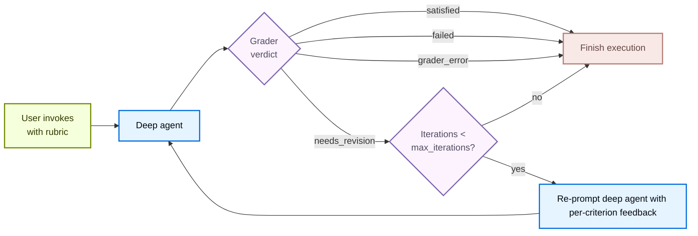

# 评分细则


> 法学硕士作为法官对代理人进行评分，迭代一个标题直到完成


`RubricMiddleware` 需要 `deepagents>=0.6.5`。它处于[**测试版**](https://docs.langchain.com/oss/python/versioning) 中； API 将来可能会发生变化。


一些代理任务有一个明确的“完成”定义，仅靠工作模型无法在第一次尝试中可靠地实现：正确音节模式的俳句、所有测试都通过的重构，或者满足每个所需部分的报告。 `RubricMiddleware` 允许您将“完成的内容”声明为评分标准，并让代理进行“自我评估和迭代”，直到满足评分标准，或者达到配置的最大迭代上限。


**LLM-as-a-judge** 是一种模式，其中一个语言模型根据定义的标准评估另一个模型的输出。在 [LangSmith 评估](https://docs.langchain.com/langsmith/evaluation-concepts#llm-as-judge) 中，LLM 作为评委的评估人员离线批量对申请输出进行评分。 `RubricMiddleware` 在运行时应用相同的模式：深度智能体生成输出后，专用的评分器模型会根据您的评分标准审查成绩单并驱动修订，直到每个标准通过（或达到配置的迭代上限）。


当深度智能体完成推理时，LLM 作为法官评分者子智能体会审查输出并返回裁决。如果它返回 `needs_revision`，则每个标准的反馈将被注入回对话中，并且代理会再次运行。循环在 `satisfied`、`max_iterations_reached`、`failed` 或 `grader_error` 处终止。





## 配置中间件


调用 `create_deep_agent` 时，将 `RubricMiddleware` 添加到 `middleware` 列表中：


```python
from deepagents import RubricMiddleware, create_deep_agent
from langgraph.checkpoint.memory import InMemorySaver

agent = create_deep_agent(
    model="google_genai:gemini-3.6-flash",
    middleware=[
        RubricMiddleware(
            model="anthropic:claude-haiku-4-5",
            max_iterations=3,
        ),
    ],
    checkpointer=InMemorySaver(),
)
```


```python
from deepagents import RubricMiddleware, create_deep_agent
from langgraph.checkpoint.memory import InMemorySaver

agent = create_deep_agent(
    model="openai:gpt-5.5",
    middleware=[
        RubricMiddleware(
            model="anthropic:claude-haiku-4-5",
            max_iterations=3,
        ),
    ],
    checkpointer=InMemorySaver(),
)
```


```python
from deepagents import RubricMiddleware, create_deep_agent
from langgraph.checkpoint.memory import InMemorySaver

agent = create_deep_agent(
    model="anthropic:claude-sonnet-4-6",
    middleware=[
        RubricMiddleware(
            model="anthropic:claude-haiku-4-5",
            max_iterations=3,
        ),
    ],
    checkpointer=InMemorySaver(),
)
```


```python
from deepagents import RubricMiddleware, create_deep_agent
from langgraph.checkpoint.memory import InMemorySaver

agent = create_deep_agent(
    model="openrouter:z-ai/glm-5.2",
    middleware=[
        RubricMiddleware(
            model="anthropic:claude-haiku-4-5",
            max_iterations=3,
        ),
    ],
    checkpointer=InMemorySaver(),
)
```


```python
from deepagents import RubricMiddleware, create_deep_agent
from langgraph.checkpoint.memory import InMemorySaver

agent = create_deep_agent(
    model="fireworks:accounts/fireworks/models/glm-5p2",
    middleware=[
        RubricMiddleware(
            model="anthropic:claude-haiku-4-5",
            max_iterations=3,
        ),
    ],
    checkpointer=InMemorySaver(),
)
```


```python
from deepagents import RubricMiddleware, create_deep_agent
from langgraph.checkpoint.memory import InMemorySaver

agent = create_deep_agent(
    model="baseten:zai-org/GLM-5.2",
    middleware=[
        RubricMiddleware(
            model="anthropic:claude-haiku-4-5",
            max_iterations=3,
        ),
    ],
    checkpointer=InMemorySaver(),
)
```


```python
from deepagents import RubricMiddleware, create_deep_agent
from langgraph.checkpoint.memory import InMemorySaver

agent = create_deep_agent(
    model="ollama:north-mini-code-1.0",
    middleware=[
        RubricMiddleware(
            model="anthropic:claude-haiku-4-5",
            max_iterations=3,
        ),
    ],
    checkpointer=InMemorySaver(),
)
```


|争论|必需的|默认|描述|
| ---------------- | -------- | ---------------------- | -------------------------------------------------------------------------------------------------------------------------------------------------------------------------------------------------------------------- |
|`model`|是的|`None`|LLM 作为评委评分员子智能体使用的聊天模型。接受 `"provider:model-id"` 字符串或 `BaseChatModel` 实例。通常是比深度智能体的工作模型更小或更便宜的模型。|
|`system_prompt`|不|内置分级机提示|自定义分级说明。退回到默认系统提示，向评分者传授判决格式以及可以使用的工具。|
|`tools`|不|`None`|评分者在做出结论之前可以调用工具来收集证据（运行测试、计数标记、读取文件）。如果没有，评分者仅根据成绩单进行推理。|
|`max_iterations`|不|`3`|每个评分标准尝试的最大评分者迭代次数；必须是正整数。当达到上限但没有 `satisfied` 判决时，代理将以状态 `max_iterations_reached` 终止。|
|`on_evaluation`|不|`None`|每次评分迭代后，每个 `RubricEvaluation` 都会调用可选回调，无论您使用 `invoke()`、`stream()` 还是 `stream_events()`。对于日志记录、自定义指标、评估数据集或 UI 更新很有用。|


## 在调用时传递标题


在调用状态上传递 `rubric` 字符串以启动自评估循环。使用 `invoke()` 进行单个阻塞调用，或 [`stream_events(..., version="v3")`](https://docs.langchain.com/oss/python/langchain/event-streaming) 与 [`CustomTransformer`](https://docs.langchain.com/oss/python/langchain/event-streaming#custom-updates) 一起接收 `stream.custom` 上发生的评分事件：


  
**调用()**


```python
from langchain.messages import HumanMessage

config = {"configurable": {"thread_id": "my-rubric-thread"}}
result = agent.invoke(
    {
        "messages": [HumanMessage("Write a haiku about spring.")],
        "rubric": (
            "- The poem has three lines\n"
            "- Lines follow a 5-7-5 syllable pattern\n"
            "- The theme is spring"
        ),
    },
    config=config,
)
```


  


  

 **stream_events()**


```python
from langchain.messages import HumanMessage
from langgraph.stream import CustomTransformer

config = {"configurable": {"thread_id": "my-rubric-thread"}}
stream = agent.stream_events(
    {
        "messages": [HumanMessage("Write a haiku about spring.")],
        "rubric": (
            "- The poem has three lines\n"
            "- Lines follow a 5-7-5 syllable pattern\n"
            "- The theme is spring"
        ),
    },
    config=config,
    version="v3",
    transformers=[CustomTransformer],
)

for event in stream.custom:
    event_type = event.get("type")
    if event_type == "rubric_evaluation_start":
        print(
            f"Grading iteration {event['iteration']} "
            f"(run {event['grading_run_id']})"
        )
    elif event_type == "rubric_evaluation_end":
        print(f"Verdict: {event['result']} — {event.get('explanation', '')}")
```


 Rubric 评分在 `stream.custom` 上发出以下自定义事件：


|事件|被解雇时|有效负载字段|
    | ------------------------- | ----------------------------------------------------- | ----------------------------------------------------------------------------------------------------------------------------------------------------------------------------------------------------------------------------------------------------------------------------------------------------------------------------- |
|`rubric_evaluation_start`|在评分机运行之前。|<ul><li>`type`：事件名称</li><li>`grading_run_id`：在一次标题尝试中的所有事件之间共享</li><li>`iteration`：从零开始的索引当前分级运行的</li></ul>|
|`rubric_evaluation_end`|评分员返回后或评分员异常后。|<ul><li>`type`：事件名称</li><li>`grading_run_id`：在一次标题尝试中的所有事件之间共享</li><li>`iteration`：从零开始的索引当前评分者通行证的</li><li>`result`：此通行证的最终判决</li><li>`explanation`：来自Grader</li><li>`criteria`：每个标准的判决</li></ul>|


  

### 评分标准判决


当深度智能体完成推理并产生输出时，LLM 作为法官评分者子智能体会根据评分标准审查输出并产生以下判决之一：


|地位|意义|循环回来？|
| ------------------------ | -------------------------------------------------------------------------------------------------------------------------------------------- | ----------- |
|`satisfied`|标题中的每一个标准都通过了。|不|
|`needs_revision`|至少有一项标准不合格；评分者反馈被注入，代理再次运行。|是的|
|`max_iterations_reached`|Grader 仍希望修改，但 `max_iterations` 已受到打击。|不|
|`failed`|评分者判断标题格式错误或无法根据成绩单进行评估。|不|
|`grader_error`|法学硕士作为法官评分者子智能体本身提出了一个例外（提供者超时、缺少凭据、格式错误的结构化响应等）。|不|


## 观察迭代进度


`on_evaluation` 是在每次评分迭代后根据评分者的结论触发的回调，无论您调用 `invoke()` 还是 `stream_events()`。如果您没有从 `stream.custom`（使用 `CustomTransformer`）或[使用 LangSmith 跟踪运行]（/langsmith/trace-with-langgraph）读取评分细则事件，那么这是检查评分期间发生的情况的主要方法。


```python
from deepagents import RubricMiddleware, create_deep_agent
from deepagents.middleware.rubric import RubricEvaluation
from langchain.messages import HumanMessage
from langgraph.checkpoint.memory import InMemorySaver


def log_evaluation(ev: RubricEvaluation) -> None:
    print(f"iteration {ev['iteration']}: {ev['result']} — {ev['explanation']}")


agent = create_deep_agent(
    model="google_genai:gemini-3.6-flash",
    middleware=[
        RubricMiddleware(
            model="google_genai:gemini-3.6-flash",
            on_evaluation=log_evaluation,
        ),
    ],
    checkpointer=InMemorySaver(),
)

config = {"configurable": {"thread_id": "rubric-eval-session"}}
agent.invoke(
    {
        "messages": [HumanMessage("Write a one-sentence summary of photosynthesis.")],
        "rubric": (
            "- The answer is one sentence\n"
            "- The answer mentions light and chlorophyll"
        ),
    },
    config=config,
)
```


```python
from deepagents import RubricMiddleware, create_deep_agent
from deepagents.middleware.rubric import RubricEvaluation
from langchain.messages import HumanMessage
from langgraph.checkpoint.memory import InMemorySaver


def log_evaluation(ev: RubricEvaluation) -> None:
    print(f"iteration {ev['iteration']}: {ev['result']} — {ev['explanation']}")


agent = create_deep_agent(
    model="openai:gpt-5.5",
    middleware=[
        RubricMiddleware(
            model="openai:gpt-5.5",
            on_evaluation=log_evaluation,
        ),
    ],
    checkpointer=InMemorySaver(),
)

config = {"configurable": {"thread_id": "rubric-eval-session"}}
agent.invoke(
    {
        "messages": [HumanMessage("Write a one-sentence summary of photosynthesis.")],
        "rubric": (
            "- The answer is one sentence\n"
            "- The answer mentions light and chlorophyll"
        ),
    },
    config=config,
)
```


```python
from deepagents import RubricMiddleware, create_deep_agent
from deepagents.middleware.rubric import RubricEvaluation
from langchain.messages import HumanMessage
from langgraph.checkpoint.memory import InMemorySaver


def log_evaluation(ev: RubricEvaluation) -> None:
    print(f"iteration {ev['iteration']}: {ev['result']} — {ev['explanation']}")


agent = create_deep_agent(
    model="anthropic:claude-sonnet-4-6",
    middleware=[
        RubricMiddleware(
            model="anthropic:claude-sonnet-4-6",
            on_evaluation=log_evaluation,
        ),
    ],
    checkpointer=InMemorySaver(),
)

config = {"configurable": {"thread_id": "rubric-eval-session"}}
agent.invoke(
    {
        "messages": [HumanMessage("Write a one-sentence summary of photosynthesis.")],
        "rubric": (
            "- The answer is one sentence\n"
            "- The answer mentions light and chlorophyll"
        ),
    },
    config=config,
)
```


```python
from deepagents import RubricMiddleware, create_deep_agent
from deepagents.middleware.rubric import RubricEvaluation
from langchain.messages import HumanMessage
from langgraph.checkpoint.memory import InMemorySaver


def log_evaluation(ev: RubricEvaluation) -> None:
    print(f"iteration {ev['iteration']}: {ev['result']} — {ev['explanation']}")


agent = create_deep_agent(
    model="openrouter:z-ai/glm-5.2",
    middleware=[
        RubricMiddleware(
            model="openrouter:z-ai/glm-5.2",
            on_evaluation=log_evaluation,
        ),
    ],
    checkpointer=InMemorySaver(),
)

config = {"configurable": {"thread_id": "rubric-eval-session"}}
agent.invoke(
    {
        "messages": [HumanMessage("Write a one-sentence summary of photosynthesis.")],
        "rubric": (
            "- The answer is one sentence\n"
            "- The answer mentions light and chlorophyll"
        ),
    },
    config=config,
)
```


```python
from deepagents import RubricMiddleware, create_deep_agent
from deepagents.middleware.rubric import RubricEvaluation
from langchain.messages import HumanMessage
from langgraph.checkpoint.memory import InMemorySaver


def log_evaluation(ev: RubricEvaluation) -> None:
    print(f"iteration {ev['iteration']}: {ev['result']} — {ev['explanation']}")


agent = create_deep_agent(
    model="fireworks:accounts/fireworks/models/glm-5p2",
    middleware=[
        RubricMiddleware(
            model="fireworks:accounts/fireworks/models/glm-5p2",
            on_evaluation=log_evaluation,
        ),
    ],
    checkpointer=InMemorySaver(),
)

config = {"configurable": {"thread_id": "rubric-eval-session"}}
agent.invoke(
    {
        "messages": [HumanMessage("Write a one-sentence summary of photosynthesis.")],
        "rubric": (
            "- The answer is one sentence\n"
            "- The answer mentions light and chlorophyll"
        ),
    },
    config=config,
)
```


```python
from deepagents import RubricMiddleware, create_deep_agent
from deepagents.middleware.rubric import RubricEvaluation
from langchain.messages import HumanMessage
from langgraph.checkpoint.memory import InMemorySaver


def log_evaluation(ev: RubricEvaluation) -> None:
    print(f"iteration {ev['iteration']}: {ev['result']} — {ev['explanation']}")


agent = create_deep_agent(
    model="baseten:zai-org/GLM-5.2",
    middleware=[
        RubricMiddleware(
            model="baseten:zai-org/GLM-5.2",
            on_evaluation=log_evaluation,
        ),
    ],
    checkpointer=InMemorySaver(),
)

config = {"configurable": {"thread_id": "rubric-eval-session"}}
agent.invoke(
    {
        "messages": [HumanMessage("Write a one-sentence summary of photosynthesis.")],
        "rubric": (
            "- The answer is one sentence\n"
            "- The answer mentions light and chlorophyll"
        ),
    },
    config=config,
)
```


```python
from deepagents import RubricMiddleware, create_deep_agent
from deepagents.middleware.rubric import RubricEvaluation
from langchain.messages import HumanMessage
from langgraph.checkpoint.memory import InMemorySaver


def log_evaluation(ev: RubricEvaluation) -> None:
    print(f"iteration {ev['iteration']}: {ev['result']} — {ev['explanation']}")


agent = create_deep_agent(
    model="ollama:north-mini-code-1.0",
    middleware=[
        RubricMiddleware(
            model="ollama:north-mini-code-1.0",
            on_evaluation=log_evaluation,
        ),
    ],
    checkpointer=InMemorySaver(),
)

config = {"configurable": {"thread_id": "rubric-eval-session"}}
agent.invoke(
    {
        "messages": [HumanMessage("Write a one-sentence summary of photosynthesis.")],
        "rubric": (
            "- The answer is one sentence\n"
            "- The answer mentions light and chlorophyll"
        ),
    },
    config=config,
)
```


 中间件在每次 [grader pass](#grader-pass-events) 后使用 `RubricEvaluation` 字典调用您的函数。 `RubricEvaluation` 字典包含：


|场地|类型|描述|
| ---------------- | ------ | ------------------------------------------------------------------------------------------------------------------------------------------------------------------------------------------------- |
|`grading_run_id`|`str`|一次评估尝试中的每个评估共享的标识符。当调用者提供不同的 `rubric` 时，或者在最终判决后再次调用相同的 `rubric` 时，新的运行将开始。|
|`iteration`|`int`|当前评分者在该运行中通过的从零开始的索引。|
|`result`|`str`|此遍的评分者判定：`satisfied`、`needs_revision`、`failed` 或 `grader_error`。|
|`explanation`|`str`|评分者的自由形式摘要。对于基础设施故障，这包括异常类型和消息。|
|`criteria`|`list`|按标准做出的判决。每个条目都是 `{name, passed: true}` 或 `{name, passed: false, gap}`，其中 `gap` 是失败标准的可操作反馈。|


### 平地机通行证活动


|事件|描述|
| --------------------------- | ------------------------------------------------------------------------------------------------------------------------------------------------------------------------------------------------------------------------------------------------------------------------------------------------------------------------------------------------------------------------------------------------------------------------------------------------------------------------------------------------------------------------------------------------------------------------------------------- |
|**成功评分**|每次传递触发一次，包括中间 `needs_revision` 判决和最终 `satisfied` 或 `failed` 判决。 <br /><br /> 当评分者返回 `needs_revision` 但已达到 `max_iterations` 时，回调仍然收到 `result: "needs_revision"` （评分者的结论）。运行的终端状态在私有状态 `_rubric_status` 上为 `max_iterations_reached`，而不是在评估记录上。在 `invoke` 完成后检查 `_rubric_status`，或与 `_rubric_iterations` 一起读取 `_rubric_evaluations` 中的最后一个条目，以在上限耗尽时进行分支。|
|**评分者例外**|触发 `result: "grader_error"`、从异常派生的解释以及空的 `criteria` 列表。|
|**回调中的错误**|异常情况会被记录并抑制。评分循环继续进行。请勿使用 `on_evaluation` 强制控制流（例如，引发以停止代理）。|


## 在调用中保留规则


单个 `agent.invoke()` 或 `agent.stream_events()` 调用将运行标题循环直至完成，并以最终结论结束：`satisfied`、`failed` 或 `max_iterations_reached`。


要携带标题以进行后续调用，请附加一个 [检查指针](https://docs.langchain.com/oss/python/langgraph/checkpointers#checkpoints) 并在调用旁边传递相同的 `thread_id`。在这些情况下，相同的 `rubric` 会在未来的 `invoke()` 或 `stream_events()` 调用中持续存在，直到您传入新的调用。


中断（`KeyboardInterrupt`、`asyncio.CancelledError`）从 `agent.invoke()` 和 `agent.stream_events()` 传播出去，但未被捕获。在检查点线程上，具有相同评分标准的下一个调用将恢复正在进行的评分运行。


## 示例：生成经过审查的 Python 代码


以下示例构建了一个编写 `find_duplicates` 函数的深度智能体。它定义 `RubricMiddleware` 一次，将其附加到代理，然后在调用时传递 `rubric` 字符串。


该示例没有要求评分者抽象地推理正确性，而是为其提供了一个 `run_test_suite` 工具来直接验证行为。评分者在做出结论之前调用此工具获取更多信息，并在没有提供工具时从成绩单中进行推理。


  
**定义Rubric中间件**


该中间件在基本代理之上添加了一个 LLM 作为法官评分器循环。配置评分器模型、可选的自定义提示、证据收集工具和最大迭代上限。


    


```python
from deepagents import RubricMiddleware
from langchain.tools import tool


@tool
def run_test_suite(code: str) -> dict:
    """Run the find_duplicates test suite against Python source code."""
    namespace: dict = {"__builtins__": __builtins__}
    try:
        exec(code, namespace)
    except Exception as exc:
        return {"ok": False, "failures": [f"Failed to execute code: {exc}"]}

    find_duplicates = namespace.get("find_duplicates")
    if find_duplicates is None:
        return {"ok": False, "failures": ["Function find_duplicates is not defined"]}

    tests = [
        ("test_basic", [1, 2, 2, 3, 1], [2, 1]),
        ("test_empty", [], []),
        ("test_no_duplicates", [1, 2, 3], []),
        ("test_unhashable", [[1], [1], 2], [[1]]),
    ]
    failures: list[str] = []
    for name, args, expected in tests:
        try:
            actual = find_duplicates(args)
            if actual != expected:
                failures.append(f"{name}: expected {expected}, got {actual}")
        except Exception as exc:
            failures.append(f"{name}: {exc}")

    return {"ok": not failures, "failures": failures}


rubric_middleware = RubricMiddleware(
    model="google_genai:gemini-3.6-flash",
    system_prompt="You are a code reviewer grading generated code against a rubric.",
    tools=[run_test_suite],
    max_iterations=5,
)
```


```python
from deepagents import RubricMiddleware
from langchain.tools import tool


@tool
def run_test_suite(code: str) -> dict:
    """Run the find_duplicates test suite against Python source code."""
    namespace: dict = {"__builtins__": __builtins__}
    try:
        exec(code, namespace)
    except Exception as exc:
        return {"ok": False, "failures": [f"Failed to execute code: {exc}"]}

    find_duplicates = namespace.get("find_duplicates")
    if find_duplicates is None:
        return {"ok": False, "failures": ["Function find_duplicates is not defined"]}

    tests = [
        ("test_basic", [1, 2, 2, 3, 1], [2, 1]),
        ("test_empty", [], []),
        ("test_no_duplicates", [1, 2, 3], []),
        ("test_unhashable", [[1], [1], 2], [[1]]),
    ]
    failures: list[str] = []
    for name, args, expected in tests:
        try:
            actual = find_duplicates(args)
            if actual != expected:
                failures.append(f"{name}: expected {expected}, got {actual}")
        except Exception as exc:
            failures.append(f"{name}: {exc}")

    return {"ok": not failures, "failures": failures}


rubric_middleware = RubricMiddleware(
    model="openai:gpt-5.5",
    system_prompt="You are a code reviewer grading generated code against a rubric.",
    tools=[run_test_suite],
    max_iterations=5,
)
```


```python
from deepagents import RubricMiddleware
from langchain.tools import tool


@tool
def run_test_suite(code: str) -> dict:
    """Run the find_duplicates test suite against Python source code."""
    namespace: dict = {"__builtins__": __builtins__}
    try:
        exec(code, namespace)
    except Exception as exc:
        return {"ok": False, "failures": [f"Failed to execute code: {exc}"]}

    find_duplicates = namespace.get("find_duplicates")
    if find_duplicates is None:
        return {"ok": False, "failures": ["Function find_duplicates is not defined"]}

    tests = [
        ("test_basic", [1, 2, 2, 3, 1], [2, 1]),
        ("test_empty", [], []),
        ("test_no_duplicates", [1, 2, 3], []),
        ("test_unhashable", [[1], [1], 2], [[1]]),
    ]
    failures: list[str] = []
    for name, args, expected in tests:
        try:
            actual = find_duplicates(args)
            if actual != expected:
                failures.append(f"{name}: expected {expected}, got {actual}")
        except Exception as exc:
            failures.append(f"{name}: {exc}")

    return {"ok": not failures, "failures": failures}


rubric_middleware = RubricMiddleware(
    model="anthropic:claude-sonnet-4-6",
    system_prompt="You are a code reviewer grading generated code against a rubric.",
    tools=[run_test_suite],
    max_iterations=5,
)
```


```python
from deepagents import RubricMiddleware
from langchain.tools import tool


@tool
def run_test_suite(code: str) -> dict:
    """Run the find_duplicates test suite against Python source code."""
    namespace: dict = {"__builtins__": __builtins__}
    try:
        exec(code, namespace)
    except Exception as exc:
        return {"ok": False, "failures": [f"Failed to execute code: {exc}"]}

    find_duplicates = namespace.get("find_duplicates")
    if find_duplicates is None:
        return {"ok": False, "failures": ["Function find_duplicates is not defined"]}

    tests = [
        ("test_basic", [1, 2, 2, 3, 1], [2, 1]),
        ("test_empty", [], []),
        ("test_no_duplicates", [1, 2, 3], []),
        ("test_unhashable", [[1], [1], 2], [[1]]),
    ]
    failures: list[str] = []
    for name, args, expected in tests:
        try:
            actual = find_duplicates(args)
            if actual != expected:
                failures.append(f"{name}: expected {expected}, got {actual}")
        except Exception as exc:
            failures.append(f"{name}: {exc}")

    return {"ok": not failures, "failures": failures}


rubric_middleware = RubricMiddleware(
    model="openrouter:z-ai/glm-5.2",
    system_prompt="You are a code reviewer grading generated code against a rubric.",
    tools=[run_test_suite],
    max_iterations=5,
)
```


```python
from deepagents import RubricMiddleware
from langchain.tools import tool


@tool
def run_test_suite(code: str) -> dict:
    """Run the find_duplicates test suite against Python source code."""
    namespace: dict = {"__builtins__": __builtins__}
    try:
        exec(code, namespace)
    except Exception as exc:
        return {"ok": False, "failures": [f"Failed to execute code: {exc}"]}

    find_duplicates = namespace.get("find_duplicates")
    if find_duplicates is None:
        return {"ok": False, "failures": ["Function find_duplicates is not defined"]}

    tests = [
        ("test_basic", [1, 2, 2, 3, 1], [2, 1]),
        ("test_empty", [], []),
        ("test_no_duplicates", [1, 2, 3], []),
        ("test_unhashable", [[1], [1], 2], [[1]]),
    ]
    failures: list[str] = []
    for name, args, expected in tests:
        try:
            actual = find_duplicates(args)
            if actual != expected:
                failures.append(f"{name}: expected {expected}, got {actual}")
        except Exception as exc:
            failures.append(f"{name}: {exc}")

    return {"ok": not failures, "failures": failures}


rubric_middleware = RubricMiddleware(
    model="fireworks:accounts/fireworks/models/glm-5p2",
    system_prompt="You are a code reviewer grading generated code against a rubric.",
    tools=[run_test_suite],
    max_iterations=5,
)
```


```python
from deepagents import RubricMiddleware
from langchain.tools import tool


@tool
def run_test_suite(code: str) -> dict:
    """Run the find_duplicates test suite against Python source code."""
    namespace: dict = {"__builtins__": __builtins__}
    try:
        exec(code, namespace)
    except Exception as exc:
        return {"ok": False, "failures": [f"Failed to execute code: {exc}"]}

    find_duplicates = namespace.get("find_duplicates")
    if find_duplicates is None:
        return {"ok": False, "failures": ["Function find_duplicates is not defined"]}

    tests = [
        ("test_basic", [1, 2, 2, 3, 1], [2, 1]),
        ("test_empty", [], []),
        ("test_no_duplicates", [1, 2, 3], []),
        ("test_unhashable", [[1], [1], 2], [[1]]),
    ]
    failures: list[str] = []
    for name, args, expected in tests:
        try:
            actual = find_duplicates(args)
            if actual != expected:
                failures.append(f"{name}: expected {expected}, got {actual}")
        except Exception as exc:
            failures.append(f"{name}: {exc}")

    return {"ok": not failures, "failures": failures}


rubric_middleware = RubricMiddleware(
    model="baseten:zai-org/GLM-5.2",
    system_prompt="You are a code reviewer grading generated code against a rubric.",
    tools=[run_test_suite],
    max_iterations=5,
)
```


```python
from deepagents import RubricMiddleware
from langchain.tools import tool


@tool
def run_test_suite(code: str) -> dict:
    """Run the find_duplicates test suite against Python source code."""
    namespace: dict = {"__builtins__": __builtins__}
    try:
        exec(code, namespace)
    except Exception as exc:
        return {"ok": False, "failures": [f"Failed to execute code: {exc}"]}

    find_duplicates = namespace.get("find_duplicates")
    if find_duplicates is None:
        return {"ok": False, "failures": ["Function find_duplicates is not defined"]}

    tests = [
        ("test_basic", [1, 2, 2, 3, 1], [2, 1]),
        ("test_empty", [], []),
        ("test_no_duplicates", [1, 2, 3], []),
        ("test_unhashable", [[1], [1], 2], [[1]]),
    ]
    failures: list[str] = []
    for name, args, expected in tests:
        try:
            actual = find_duplicates(args)
            if actual != expected:
                failures.append(f"{name}: expected {expected}, got {actual}")
        except Exception as exc:
            failures.append(f"{name}: {exc}")

    return {"ok": not failures, "failures": failures}


rubric_middleware = RubricMiddleware(
    model="ollama:north-mini-code-1.0",
    system_prompt="You are a code reviewer grading generated code against a rubric.",
    tools=[run_test_suite],
    max_iterations=5,
)
```


    

  


  

 **将其传递给深度智能体**


代理的 `system_prompt` 告诉它如何完成工作，而标题则告诉评分者如何判断工作。


    


```python
from deepagents import create_deep_agent
from langgraph.checkpoint.memory import InMemorySaver

agent = create_deep_agent(
    model="google_genai:gemini-3.6-flash",
    system_prompt=(
        "You are a careful Python engineer. Write correct, readable code. "
        "Follow the user's instructions exactly."
    ),
    middleware=[rubric_middleware],
    checkpointer=InMemorySaver(),
)
```


```python
from deepagents import create_deep_agent
from langgraph.checkpoint.memory import InMemorySaver

agent = create_deep_agent(
    model="openai:gpt-5.5",
    system_prompt=(
        "You are a careful Python engineer. Write correct, readable code. "
        "Follow the user's instructions exactly."
    ),
    middleware=[rubric_middleware],
    checkpointer=InMemorySaver(),
)
```


```python
from deepagents import create_deep_agent
from langgraph.checkpoint.memory import InMemorySaver

agent = create_deep_agent(
    model="anthropic:claude-sonnet-4-6",
    system_prompt=(
        "You are a careful Python engineer. Write correct, readable code. "
        "Follow the user's instructions exactly."
    ),
    middleware=[rubric_middleware],
    checkpointer=InMemorySaver(),
)
```


```python
from deepagents import create_deep_agent
from langgraph.checkpoint.memory import InMemorySaver

agent = create_deep_agent(
    model="openrouter:z-ai/glm-5.2",
    system_prompt=(
        "You are a careful Python engineer. Write correct, readable code. "
        "Follow the user's instructions exactly."
    ),
    middleware=[rubric_middleware],
    checkpointer=InMemorySaver(),
)
```


```python
from deepagents import create_deep_agent
from langgraph.checkpoint.memory import InMemorySaver

agent = create_deep_agent(
    model="fireworks:accounts/fireworks/models/glm-5p2",
    system_prompt=(
        "You are a careful Python engineer. Write correct, readable code. "
        "Follow the user's instructions exactly."
    ),
    middleware=[rubric_middleware],
    checkpointer=InMemorySaver(),
)
```


```python
from deepagents import create_deep_agent
from langgraph.checkpoint.memory import InMemorySaver

agent = create_deep_agent(
    model="baseten:zai-org/GLM-5.2",
    system_prompt=(
        "You are a careful Python engineer. Write correct, readable code. "
        "Follow the user's instructions exactly."
    ),
    middleware=[rubric_middleware],
    checkpointer=InMemorySaver(),
)
```


```python
from deepagents import create_deep_agent
from langgraph.checkpoint.memory import InMemorySaver

agent = create_deep_agent(
    model="ollama:north-mini-code-1.0",
    system_prompt=(
        "You are a careful Python engineer. Write correct, readable code. "
        "Follow the user's instructions exactly."
    ),
    middleware=[rubric_middleware],
    checkpointer=InMemorySaver(),
)
```


    

  


  

 **使用人工消息和标题进行调用**


在调用时，在 `messages` 中提供用户请求，并在 `rubric` 中提供换行符分隔的检查表，评分者必须将其标记为满足。当输入状态上未提供 `rubric` 时，中间件不会运行。


```python
from langchain.messages import HumanMessage

result = agent.invoke(
    {
        "messages": [
            HumanMessage(
                content=(
                    "Write a Python function `find_duplicates(lst)` that returns a list of "
                    "all elements that appear more than once in the input list, in the order "
                    "they first appear."
                )
            )
        ],
        "rubric": (
            "- All tests pass in run_test_suite\n"
            "- The function is named `find_duplicates` and accepts a single list argument\n"
        ),
    },
    config={"configurable": {"thread_id": "code-generation-session"}},
)
print(result["messages"][-1].text)
```


  


 代理生成输出后，分级器接管并检查每个标准的输出：例如，当输入包含不可散列的类型时，`test_unhashable` 会失败并显示 `TypeError`。如果存在任何问题，评分者会提供此反馈，然后代理会修改其实施并将其返回给评分者。


***


<div className="source-links">


  

[将这些文档](https://docs.langchain.com/use-these-docs) 通过 MCP 连接到 Claude、VSCode 等以获得实时答案。

  


  

[在 GitHub 上编辑此页面](https://github.com/langchain-ai/docs/edit/main/src/oss/deepagents/rubric.mdx) 或 [提交问题](https://github.com/langchain-ai/docs/issues/new/choose)。

  

</div>

