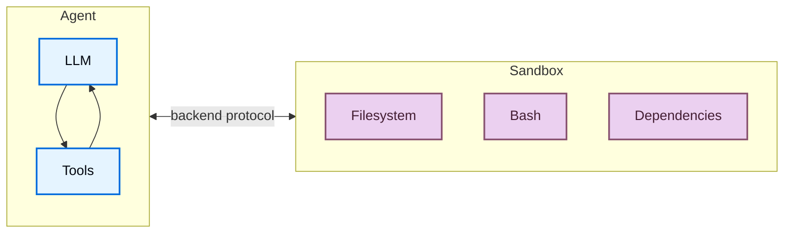
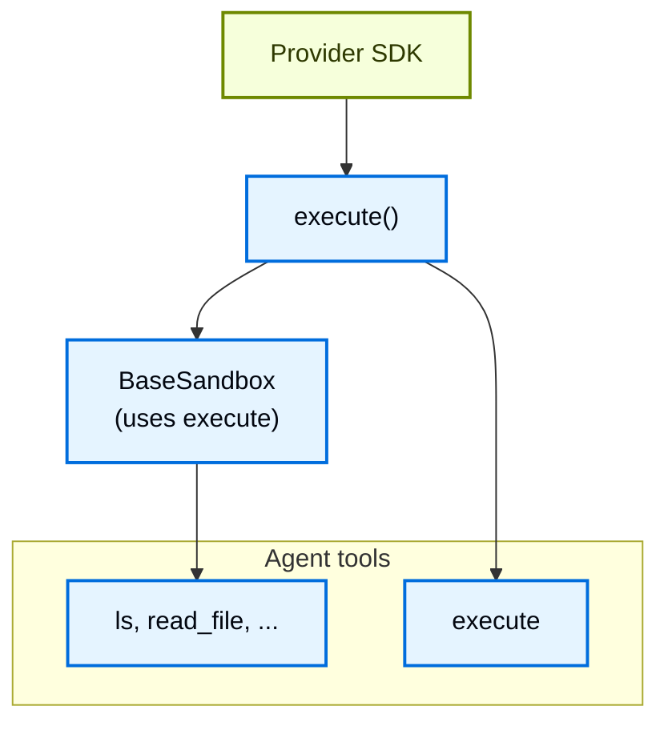
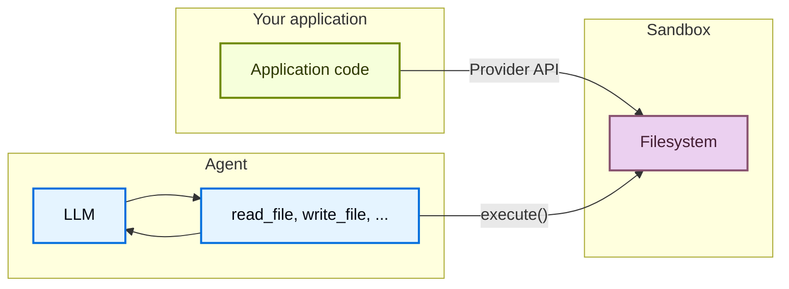

# 沙箱


> 在具有沙箱后端的隔离环境中执行代码


代理生成代码、与文件系统交互并运行 shell 命令。由于您无法预测代理可能会做什么，因此隔离其环境非常重要，这样它就无法访问凭据、文件或网络。沙箱通过在代理的执行环境和主机系统之间创建边界来提供这种隔离。


在 Deep Agents 中，**沙箱是定义代理运行环境的[后端](backends.md)**。与仅公开文件操作的其他后端（状态、文件系统、存储）不同，沙箱后端还为代理提供了用于运行 shell 命令的 `execute` 工具。当您配置沙箱后端时，代理将获取：


* 所有标准文件系统工具（`ls`、`read_file`、`write_file`、`edit_file`、`delete`、`glob`、`grep`）


* 用于在沙箱中运行任意 shell 命令的 `execute` 工具


* 保护您的主机系统的安全边界





## 为什么要使用沙箱？


沙箱用于安全性。它们允许代理执行任意代码、访问文件和使用网络，而不会损害您的凭据、本地文件或主机系统。当代理自主运行时，这种隔离至关重要。


沙箱特别适用于：


* 编程智能体：自主运行的代理可以使用 shell、git、克隆存储库（许多提供商提供本机 git API，例如 [Daytona 的 git 操作](https://www.daytona.io/docs/en/git-operations/)），并运行 Docker-in-Docker 来构建和测试管道
* 数据分析代理：在安全、隔离的环境中加载文件、安装数据分析库（pandas、numpy 等）、运行统计计算以及创建 PowerPoint 演示文稿等输出


**使用 Deep Agents Code？** Deep Agents Code 通过 `--sandbox` 标志具有内置沙箱支持。请参阅[使用远程沙箱](https://docs.langchain.com/oss/deepagents/code/remote-sandboxes)，了解 Deep Agent 代码特定的设置、标志（`--sandbox-id`、`--sandbox-setup`）和示例。


**如果您正在寻找 LangSmith 沙箱：** LangSmith 提供第一方托管沙箱，您可以直接从 LangSmith UI 或 SDK 使用，无需第三方帐户。有关托管沙箱资源、快照、服务 URL 和身份验证代理，请参阅 [LangSmith 沙箱](https://docs.langchain.com/langsmith/sandboxes)。


## 基本用法


这些示例假设您已经使用提供商的 SDK 创建了沙箱/开发箱并设置了凭据。有关注册、身份验证和特定于提供商的生命周期详细信息，请参阅[可用提供商](#available-providers)。


  
**朗史密斯**


    


```bash
pip install "langsmith[sandbox]"
```


```bash
uv add "langsmith[sandbox]"
```


    


    


```python
from deepagents import create_deep_agent
from deepagents.backends import LangSmithSandbox
from langchain_anthropic import ChatAnthropic
from langsmith.sandbox import SandboxClient

client = SandboxClient()
ls_sandbox = client.create_sandbox()
backend = LangSmithSandbox(sandbox=ls_sandbox)

agent = create_deep_agent(
    model=ChatAnthropic(model="google_genai:gemini-3.6-flash"),
    system_prompt="You are a Python coding assistant with sandbox access.",
    backend=backend,
)
try:
    result = agent.invoke(
        {
            "messages": [
                {
                    "role": "user",
                    "content": "Create a small Python package and run pytest",
                }
            ]
        }
    )
finally:
    client.delete_sandbox(ls_sandbox.name)
```


```python
from deepagents import create_deep_agent
from deepagents.backends import LangSmithSandbox
from langchain_anthropic import ChatAnthropic
from langsmith.sandbox import SandboxClient

client = SandboxClient()
ls_sandbox = client.create_sandbox()
backend = LangSmithSandbox(sandbox=ls_sandbox)

agent = create_deep_agent(
    model=ChatAnthropic(model="openai:gpt-5.5"),
    system_prompt="You are a Python coding assistant with sandbox access.",
    backend=backend,
)
try:
    result = agent.invoke(
        {
            "messages": [
                {
                    "role": "user",
                    "content": "Create a small Python package and run pytest",
                }
            ]
        }
    )
finally:
    client.delete_sandbox(ls_sandbox.name)
```


```python
from deepagents import create_deep_agent
from deepagents.backends import LangSmithSandbox
from langchain_anthropic import ChatAnthropic
from langsmith.sandbox import SandboxClient

client = SandboxClient()
ls_sandbox = client.create_sandbox()
backend = LangSmithSandbox(sandbox=ls_sandbox)

agent = create_deep_agent(
    model=ChatAnthropic(model="anthropic:claude-sonnet-4-6"),
    system_prompt="You are a Python coding assistant with sandbox access.",
    backend=backend,
)
try:
    result = agent.invoke(
        {
            "messages": [
                {
                    "role": "user",
                    "content": "Create a small Python package and run pytest",
                }
            ]
        }
    )
finally:
    client.delete_sandbox(ls_sandbox.name)
```


```python
from deepagents import create_deep_agent
from deepagents.backends import LangSmithSandbox
from langchain_anthropic import ChatAnthropic
from langsmith.sandbox import SandboxClient

client = SandboxClient()
ls_sandbox = client.create_sandbox()
backend = LangSmithSandbox(sandbox=ls_sandbox)

agent = create_deep_agent(
    model=ChatAnthropic(model="openrouter:z-ai/glm-5.2"),
    system_prompt="You are a Python coding assistant with sandbox access.",
    backend=backend,
)
try:
    result = agent.invoke(
        {
            "messages": [
                {
                    "role": "user",
                    "content": "Create a small Python package and run pytest",
                }
            ]
        }
    )
finally:
    client.delete_sandbox(ls_sandbox.name)
```


```python
from deepagents import create_deep_agent
from deepagents.backends import LangSmithSandbox
from langchain_anthropic import ChatAnthropic
from langsmith.sandbox import SandboxClient

client = SandboxClient()
ls_sandbox = client.create_sandbox()
backend = LangSmithSandbox(sandbox=ls_sandbox)

agent = create_deep_agent(
    model=ChatAnthropic(model="fireworks:accounts/fireworks/models/glm-5p2"),
    system_prompt="You are a Python coding assistant with sandbox access.",
    backend=backend,
)
try:
    result = agent.invoke(
        {
            "messages": [
                {
                    "role": "user",
                    "content": "Create a small Python package and run pytest",
                }
            ]
        }
    )
finally:
    client.delete_sandbox(ls_sandbox.name)
```


```python
from deepagents import create_deep_agent
from deepagents.backends import LangSmithSandbox
from langchain_anthropic import ChatAnthropic
from langsmith.sandbox import SandboxClient

client = SandboxClient()
ls_sandbox = client.create_sandbox()
backend = LangSmithSandbox(sandbox=ls_sandbox)

agent = create_deep_agent(
    model=ChatAnthropic(model="baseten:zai-org/GLM-5.2"),
    system_prompt="You are a Python coding assistant with sandbox access.",
    backend=backend,
)
try:
    result = agent.invoke(
        {
            "messages": [
                {
                    "role": "user",
                    "content": "Create a small Python package and run pytest",
                }
            ]
        }
    )
finally:
    client.delete_sandbox(ls_sandbox.name)
```


```python
from deepagents import create_deep_agent
from deepagents.backends import LangSmithSandbox
from langchain_anthropic import ChatAnthropic
from langsmith.sandbox import SandboxClient

client = SandboxClient()
ls_sandbox = client.create_sandbox()
backend = LangSmithSandbox(sandbox=ls_sandbox)

agent = create_deep_agent(
    model=ChatAnthropic(model="ollama:north-mini-code-1.0"),
    system_prompt="You are a Python coding assistant with sandbox access.",
    backend=backend,
)
try:
    result = agent.invoke(
        {
            "messages": [
                {
                    "role": "user",
                    "content": "Create a small Python package and run pytest",
                }
            ]
        }
    )
finally:
    client.delete_sandbox(ls_sandbox.name)
```


    

  


  

 **代托纳**


    


```bash
pip install langchain-daytona
```


```bash
uv add langchain-daytona
```


    


    


```python
from daytona import Daytona
from deepagents import create_deep_agent
from langchain_anthropic import ChatAnthropic
from langchain_daytona import DaytonaSandbox

sandbox = Daytona().create()
backend = DaytonaSandbox(sandbox=sandbox)

agent = create_deep_agent(
    model=ChatAnthropic(model="google_genai:gemini-3.6-flash"),
    system_prompt="You are a Python coding assistant with sandbox access.",
    backend=backend,
)

try:
    result = agent.invoke(
        {
            "messages": [
                {
                    "role": "user",
                    "content": "Create a small Python package and run pytest",
                }
            ]
        }
    )
finally:
    sandbox.stop()
```


```python
from daytona import Daytona
from deepagents import create_deep_agent
from langchain_anthropic import ChatAnthropic
from langchain_daytona import DaytonaSandbox

sandbox = Daytona().create()
backend = DaytonaSandbox(sandbox=sandbox)

agent = create_deep_agent(
    model=ChatAnthropic(model="openai:gpt-5.5"),
    system_prompt="You are a Python coding assistant with sandbox access.",
    backend=backend,
)

try:
    result = agent.invoke(
        {
            "messages": [
                {
                    "role": "user",
                    "content": "Create a small Python package and run pytest",
                }
            ]
        }
    )
finally:
    sandbox.stop()
```


```python
from daytona import Daytona
from deepagents import create_deep_agent
from langchain_anthropic import ChatAnthropic
from langchain_daytona import DaytonaSandbox

sandbox = Daytona().create()
backend = DaytonaSandbox(sandbox=sandbox)

agent = create_deep_agent(
    model=ChatAnthropic(model="anthropic:claude-sonnet-4-6"),
    system_prompt="You are a Python coding assistant with sandbox access.",
    backend=backend,
)

try:
    result = agent.invoke(
        {
            "messages": [
                {
                    "role": "user",
                    "content": "Create a small Python package and run pytest",
                }
            ]
        }
    )
finally:
    sandbox.stop()
```


```python
from daytona import Daytona
from deepagents import create_deep_agent
from langchain_anthropic import ChatAnthropic
from langchain_daytona import DaytonaSandbox

sandbox = Daytona().create()
backend = DaytonaSandbox(sandbox=sandbox)

agent = create_deep_agent(
    model=ChatAnthropic(model="openrouter:z-ai/glm-5.2"),
    system_prompt="You are a Python coding assistant with sandbox access.",
    backend=backend,
)

try:
    result = agent.invoke(
        {
            "messages": [
                {
                    "role": "user",
                    "content": "Create a small Python package and run pytest",
                }
            ]
        }
    )
finally:
    sandbox.stop()
```


```python
from daytona import Daytona
from deepagents import create_deep_agent
from langchain_anthropic import ChatAnthropic
from langchain_daytona import DaytonaSandbox

sandbox = Daytona().create()
backend = DaytonaSandbox(sandbox=sandbox)

agent = create_deep_agent(
    model=ChatAnthropic(model="fireworks:accounts/fireworks/models/glm-5p2"),
    system_prompt="You are a Python coding assistant with sandbox access.",
    backend=backend,
)

try:
    result = agent.invoke(
        {
            "messages": [
                {
                    "role": "user",
                    "content": "Create a small Python package and run pytest",
                }
            ]
        }
    )
finally:
    sandbox.stop()
```


```python
from daytona import Daytona
from deepagents import create_deep_agent
from langchain_anthropic import ChatAnthropic
from langchain_daytona import DaytonaSandbox

sandbox = Daytona().create()
backend = DaytonaSandbox(sandbox=sandbox)

agent = create_deep_agent(
    model=ChatAnthropic(model="baseten:zai-org/GLM-5.2"),
    system_prompt="You are a Python coding assistant with sandbox access.",
    backend=backend,
)

try:
    result = agent.invoke(
        {
            "messages": [
                {
                    "role": "user",
                    "content": "Create a small Python package and run pytest",
                }
            ]
        }
    )
finally:
    sandbox.stop()
```


```python
from daytona import Daytona
from deepagents import create_deep_agent
from langchain_anthropic import ChatAnthropic
from langchain_daytona import DaytonaSandbox

sandbox = Daytona().create()
backend = DaytonaSandbox(sandbox=sandbox)

agent = create_deep_agent(
    model=ChatAnthropic(model="ollama:north-mini-code-1.0"),
    system_prompt="You are a Python coding assistant with sandbox access.",
    backend=backend,
)

try:
    result = agent.invoke(
        {
            "messages": [
                {
                    "role": "user",
                    "content": "Create a small Python package and run pytest",
                }
            ]
        }
    )
finally:
    sandbox.stop()
```


    

  


  

 **E2B**


    


```bash
pip install langchain-e2b
```


```bash
uv add langchain-e2b
```


    


```python
from e2b import Sandbox
from deepagents import create_deep_agent
from langchain_anthropic import ChatAnthropic
from langchain_e2b import E2BSandbox

e2b_sandbox = Sandbox.create()
backend = E2BSandbox(sandbox=e2b_sandbox)

agent = create_deep_agent(
    model=ChatAnthropic(model="claude-sonnet-4-6"),
    system_prompt="You are a Python coding assistant with sandbox access.",
    backend=backend,
)

try:
    result = agent.invoke(
        {
            "messages": [
                {
                    "role": "user",
                    "content": "Create a small Python package and run pytest",
                }
            ]
        }
    )
finally:
    e2b_sandbox.kill()
```


  


  

 **莫代尔**


    


```bash
pip install langchain-modal
```


```bash
uv add langchain-modal
```


    


```python
import modal
from deepagents import create_deep_agent
from langchain_anthropic import ChatAnthropic
from langchain_modal import ModalSandbox

app = modal.App.lookup("your-app")
modal_sandbox = modal.Sandbox.create(app=app)
backend = ModalSandbox(sandbox=modal_sandbox)

agent = create_deep_agent(
    model=ChatAnthropic(model="claude-sonnet-4-6"),
    system_prompt="You are a Python coding assistant with sandbox access.",
    backend=backend,
)
try:
    result = agent.invoke(
        {
            "messages": [
                {
                    "role": "user",
                    "content": "Create a small Python package and run pytest",
                }
            ]
        }
    )
finally:
    modal_sandbox.terminate()
```


  


  

 **运行循环**


    


```bash
pip install langchain-runloop
```


```bash
uv add langchain-runloop
```


    


```python
import os

from deepagents import create_deep_agent
from langchain_anthropic import ChatAnthropic
from langchain_runloop import RunloopSandbox
from runloop_api_client import RunloopSDK

client = RunloopSDK(bearer_token=os.environ["RUNLOOP_API_KEY"])

devbox = client.devbox.create()
backend = RunloopSandbox(devbox=devbox)

agent = create_deep_agent(
    model=ChatAnthropic(model="claude-sonnet-4-6"),
    system_prompt="You are a Python coding assistant with sandbox access.",
    backend=backend,
)

try:
    result = agent.invoke(
        {
            "messages": [
                {
                    "role": "user",
                    "content": "Create a small Python package and run pytest",
                }
            ]
        }
    )
finally:
    devbox.shutdown()
```


  


  

 **韦尔塞尔**


    


```bash
pip install langchain-vercel-sandbox
```


```bash
uv add langchain-vercel-sandbox
```


    


```python
from deepagents import create_deep_agent
from langchain_anthropic import ChatAnthropic
from langchain_vercel_sandbox import VercelSandbox
from vercel.sandbox import Sandbox

sandbox = Sandbox.create(runtime="python3.13")
backend = VercelSandbox(sandbox=sandbox)

agent = create_deep_agent(
    model=ChatAnthropic(model="claude-sonnet-4-6"),
    system_prompt="You are a Python coding assistant with sandbox access.",
    backend=backend,
)

try:
    result = agent.invoke(
        {
            "messages": [
                {
                    "role": "user",
                    "content": "Create a small Python package and run pytest",
                }
            ]
        }
    )
finally:
    sandbox.stop()
```


  


 [LangSmith](https://smith.langchain.com?utm_source=docs\&utm_medium=cta\&utm_campaign=langsmith-signup\&utm_content=oss-deepagents-sandboxes) 跟踪显示沙箱内运行了哪些 shell 命令以及代理如何使用文件系统工具。按照[可观测性快速入门](https://docs.langchain.com/langsmith/observability-quickstart) 进行设置。对于托管沙箱托管，请参阅 [LangSmith 沙箱](https://docs.langchain.com/langsmith/sandboxes)。


我们建议您还设置 [LangSmith Engine](https://docs.langchain.com/langsmith/engine)，它会监视您的痕迹、检测问题并提出修复建议。


## 可用的提供商


有关特定于提供商的设置、身份验证和生命周期详细信息，请参阅[沙箱集成](https://docs.langchain.com/oss/python/integrations/sandboxes)。


## 生命周期和范围


大多数应用程序选择为每个[线程](https://docs.langchain.com/langsmith/use-threads) 使用一个沙箱（线程范围），或者为同一[助理](https://docs.langchain.com/langsmith/assistants) 上的每个线程选择一个共享沙箱（助理范围）。


沙箱会消耗资源并耗费金钱，直到它们被关闭为止。确保在不再使用沙箱后将其关闭。


有关完整的生命周期表、异步[图工厂](https://docs.langchain.com/langsmith/graph-rebuild)注释、TTL 行为、LangGraph 部署连接和客户端示例，请参阅进入生产中的[沙盒生命周期](going-to-production.md#lifecycle)。


### 线程范围（默认）


每个对话都有自己的沙箱。第一次运行会创建它；后续打开同一个线程重用它。当线程结束或沙箱 TTL 到期时，环境就会消失。使用沙箱名称或元数据存储映射，如下例所示，以便每次运行解析到相同的沙箱。


当用户可以在空闲时间后返回时，在沙箱上配置 TTL，以便提供商自动删除或存档空闲环境。


```python
from deepagents import create_deep_agent
from deepagents.backends.langsmith import LangSmithSandbox
from langchain_core.runnables import RunnableConfig
from langsmith.sandbox import SandboxClient

client = SandboxClient()


async def agent(config: RunnableConfig):
    thread_id = config["configurable"]["thread_id"]  # [!code highlight]
    sandbox_name = f"thread-{thread_id}"
    existing = [
        sb
        for sb in client.list_sandboxes()
        if getattr(sb, "name", None) == sandbox_name
    ]
    if existing:
        ls_sandbox = existing[0]
    else:
        ls_sandbox = client.create_sandbox(
            name=sandbox_name,
            idle_ttl_seconds=3600,  # TTL: clean up when idle
        )
    return create_deep_agent(
        model="google_genai:gemini-3.6-flash",
        backend=LangSmithSandbox(sandbox=ls_sandbox),
    )
```


```python
from deepagents import create_deep_agent
from deepagents.backends.langsmith import LangSmithSandbox
from langchain_core.runnables import RunnableConfig
from langsmith.sandbox import SandboxClient

client = SandboxClient()


async def agent(config: RunnableConfig):
    thread_id = config["configurable"]["thread_id"]  # [!code highlight]
    sandbox_name = f"thread-{thread_id}"
    existing = [
        sb
        for sb in client.list_sandboxes()
        if getattr(sb, "name", None) == sandbox_name
    ]
    if existing:
        ls_sandbox = existing[0]
    else:
        ls_sandbox = client.create_sandbox(
            name=sandbox_name,
            idle_ttl_seconds=3600,  # TTL: clean up when idle
        )
    return create_deep_agent(
        model="openai:gpt-5.5",
        backend=LangSmithSandbox(sandbox=ls_sandbox),
    )
```


```python
from deepagents import create_deep_agent
from deepagents.backends.langsmith import LangSmithSandbox
from langchain_core.runnables import RunnableConfig
from langsmith.sandbox import SandboxClient

client = SandboxClient()


async def agent(config: RunnableConfig):
    thread_id = config["configurable"]["thread_id"]  # [!code highlight]
    sandbox_name = f"thread-{thread_id}"
    existing = [
        sb
        for sb in client.list_sandboxes()
        if getattr(sb, "name", None) == sandbox_name
    ]
    if existing:
        ls_sandbox = existing[0]
    else:
        ls_sandbox = client.create_sandbox(
            name=sandbox_name,
            idle_ttl_seconds=3600,  # TTL: clean up when idle
        )
    return create_deep_agent(
        model="anthropic:claude-sonnet-4-6",
        backend=LangSmithSandbox(sandbox=ls_sandbox),
    )
```


```python
from deepagents import create_deep_agent
from deepagents.backends.langsmith import LangSmithSandbox
from langchain_core.runnables import RunnableConfig
from langsmith.sandbox import SandboxClient

client = SandboxClient()


async def agent(config: RunnableConfig):
    thread_id = config["configurable"]["thread_id"]  # [!code highlight]
    sandbox_name = f"thread-{thread_id}"
    existing = [
        sb
        for sb in client.list_sandboxes()
        if getattr(sb, "name", None) == sandbox_name
    ]
    if existing:
        ls_sandbox = existing[0]
    else:
        ls_sandbox = client.create_sandbox(
            name=sandbox_name,
            idle_ttl_seconds=3600,  # TTL: clean up when idle
        )
    return create_deep_agent(
        model="openrouter:z-ai/glm-5.2",
        backend=LangSmithSandbox(sandbox=ls_sandbox),
    )
```


```python
from deepagents import create_deep_agent
from deepagents.backends.langsmith import LangSmithSandbox
from langchain_core.runnables import RunnableConfig
from langsmith.sandbox import SandboxClient

client = SandboxClient()


async def agent(config: RunnableConfig):
    thread_id = config["configurable"]["thread_id"]  # [!code highlight]
    sandbox_name = f"thread-{thread_id}"
    existing = [
        sb
        for sb in client.list_sandboxes()
        if getattr(sb, "name", None) == sandbox_name
    ]
    if existing:
        ls_sandbox = existing[0]
    else:
        ls_sandbox = client.create_sandbox(
            name=sandbox_name,
            idle_ttl_seconds=3600,  # TTL: clean up when idle
        )
    return create_deep_agent(
        model="fireworks:accounts/fireworks/models/glm-5p2",
        backend=LangSmithSandbox(sandbox=ls_sandbox),
    )
```


```python
from deepagents import create_deep_agent
from deepagents.backends.langsmith import LangSmithSandbox
from langchain_core.runnables import RunnableConfig
from langsmith.sandbox import SandboxClient

client = SandboxClient()


async def agent(config: RunnableConfig):
    thread_id = config["configurable"]["thread_id"]  # [!code highlight]
    sandbox_name = f"thread-{thread_id}"
    existing = [
        sb
        for sb in client.list_sandboxes()
        if getattr(sb, "name", None) == sandbox_name
    ]
    if existing:
        ls_sandbox = existing[0]
    else:
        ls_sandbox = client.create_sandbox(
            name=sandbox_name,
            idle_ttl_seconds=3600,  # TTL: clean up when idle
        )
    return create_deep_agent(
        model="baseten:zai-org/GLM-5.2",
        backend=LangSmithSandbox(sandbox=ls_sandbox),
    )
```


```python
from deepagents import create_deep_agent
from deepagents.backends.langsmith import LangSmithSandbox
from langchain_core.runnables import RunnableConfig
from langsmith.sandbox import SandboxClient

client = SandboxClient()


async def agent(config: RunnableConfig):
    thread_id = config["configurable"]["thread_id"]  # [!code highlight]
    sandbox_name = f"thread-{thread_id}"
    existing = [
        sb
        for sb in client.list_sandboxes()
        if getattr(sb, "name", None) == sandbox_name
    ]
    if existing:
        ls_sandbox = existing[0]
    else:
        ls_sandbox = client.create_sandbox(
            name=sandbox_name,
            idle_ttl_seconds=3600,  # TTL: clean up when idle
        )
    return create_deep_agent(
        model="ollama:north-mini-code-1.0",
        backend=LangSmithSandbox(sandbox=ls_sandbox),
    )
```


### 助理范围


同一助手上的每个线程都重复使用一个沙箱。文件、已安装的包和克隆的存储库在对话中保留。


随着时间的推移，助理范围的沙箱会积累沙箱内的状态。使用沙箱提供程序配置 TTL、使用快照定期重置或实施清理逻辑，以便磁盘和内存不会无限制地增长。


```python
from deepagents import create_deep_agent
from deepagents.backends.langsmith import LangSmithSandbox
from langchain_core.runnables import RunnableConfig
from langsmith.sandbox import SandboxClient

client = SandboxClient()


async def agent(config: RunnableConfig):
    assistant_id = config["configurable"]["assistant_id"]  # [!code highlight]
    sandbox_name = f"assistant-{assistant_id}"
    existing = [
        sb
        for sb in client.list_sandboxes()
        if getattr(sb, "name", None) == sandbox_name
    ]
    if existing:
        ls_sandbox = existing[0]
    else:
        ls_sandbox = client.create_sandbox(name=sandbox_name)
    return create_deep_agent(
        model="google_genai:gemini-3.6-flash",
        backend=LangSmithSandbox(sandbox=ls_sandbox),
    )
```


```python
from deepagents import create_deep_agent
from deepagents.backends.langsmith import LangSmithSandbox
from langchain_core.runnables import RunnableConfig
from langsmith.sandbox import SandboxClient

client = SandboxClient()


async def agent(config: RunnableConfig):
    assistant_id = config["configurable"]["assistant_id"]  # [!code highlight]
    sandbox_name = f"assistant-{assistant_id}"
    existing = [
        sb
        for sb in client.list_sandboxes()
        if getattr(sb, "name", None) == sandbox_name
    ]
    if existing:
        ls_sandbox = existing[0]
    else:
        ls_sandbox = client.create_sandbox(name=sandbox_name)
    return create_deep_agent(
        model="openai:gpt-5.5",
        backend=LangSmithSandbox(sandbox=ls_sandbox),
    )
```


```python
from deepagents import create_deep_agent
from deepagents.backends.langsmith import LangSmithSandbox
from langchain_core.runnables import RunnableConfig
from langsmith.sandbox import SandboxClient

client = SandboxClient()


async def agent(config: RunnableConfig):
    assistant_id = config["configurable"]["assistant_id"]  # [!code highlight]
    sandbox_name = f"assistant-{assistant_id}"
    existing = [
        sb
        for sb in client.list_sandboxes()
        if getattr(sb, "name", None) == sandbox_name
    ]
    if existing:
        ls_sandbox = existing[0]
    else:
        ls_sandbox = client.create_sandbox(name=sandbox_name)
    return create_deep_agent(
        model="anthropic:claude-sonnet-4-6",
        backend=LangSmithSandbox(sandbox=ls_sandbox),
    )
```


```python
from deepagents import create_deep_agent
from deepagents.backends.langsmith import LangSmithSandbox
from langchain_core.runnables import RunnableConfig
from langsmith.sandbox import SandboxClient

client = SandboxClient()


async def agent(config: RunnableConfig):
    assistant_id = config["configurable"]["assistant_id"]  # [!code highlight]
    sandbox_name = f"assistant-{assistant_id}"
    existing = [
        sb
        for sb in client.list_sandboxes()
        if getattr(sb, "name", None) == sandbox_name
    ]
    if existing:
        ls_sandbox = existing[0]
    else:
        ls_sandbox = client.create_sandbox(name=sandbox_name)
    return create_deep_agent(
        model="openrouter:z-ai/glm-5.2",
        backend=LangSmithSandbox(sandbox=ls_sandbox),
    )
```


```python
from deepagents import create_deep_agent
from deepagents.backends.langsmith import LangSmithSandbox
from langchain_core.runnables import RunnableConfig
from langsmith.sandbox import SandboxClient

client = SandboxClient()


async def agent(config: RunnableConfig):
    assistant_id = config["configurable"]["assistant_id"]  # [!code highlight]
    sandbox_name = f"assistant-{assistant_id}"
    existing = [
        sb
        for sb in client.list_sandboxes()
        if getattr(sb, "name", None) == sandbox_name
    ]
    if existing:
        ls_sandbox = existing[0]
    else:
        ls_sandbox = client.create_sandbox(name=sandbox_name)
    return create_deep_agent(
        model="fireworks:accounts/fireworks/models/glm-5p2",
        backend=LangSmithSandbox(sandbox=ls_sandbox),
    )
```


```python
from deepagents import create_deep_agent
from deepagents.backends.langsmith import LangSmithSandbox
from langchain_core.runnables import RunnableConfig
from langsmith.sandbox import SandboxClient

client = SandboxClient()


async def agent(config: RunnableConfig):
    assistant_id = config["configurable"]["assistant_id"]  # [!code highlight]
    sandbox_name = f"assistant-{assistant_id}"
    existing = [
        sb
        for sb in client.list_sandboxes()
        if getattr(sb, "name", None) == sandbox_name
    ]
    if existing:
        ls_sandbox = existing[0]
    else:
        ls_sandbox = client.create_sandbox(name=sandbox_name)
    return create_deep_agent(
        model="baseten:zai-org/GLM-5.2",
        backend=LangSmithSandbox(sandbox=ls_sandbox),
    )
```


```python
from deepagents import create_deep_agent
from deepagents.backends.langsmith import LangSmithSandbox
from langchain_core.runnables import RunnableConfig
from langsmith.sandbox import SandboxClient

client = SandboxClient()


async def agent(config: RunnableConfig):
    assistant_id = config["configurable"]["assistant_id"]  # [!code highlight]
    sandbox_name = f"assistant-{assistant_id}"
    existing = [
        sb
        for sb in client.list_sandboxes()
        if getattr(sb, "name", None) == sandbox_name
    ]
    if existing:
        ls_sandbox = existing[0]
    else:
        ls_sandbox = client.create_sandbox(name=sandbox_name)
    return create_deep_agent(
        model="ollama:north-mini-code-1.0",
        backend=LangSmithSandbox(sandbox=ls_sandbox),
    )
```


 有关在图工厂外部手动创建、执行和拆卸的信息，请参阅[基本用法](#basic-usage) 和[沙箱集成](https://docs.langchain.com/oss/python/integrations/sandboxes) 以了解特定于提供者的 API。


## 整合模式


根据代理运行的位置，有两种将代理与沙箱集成的架构模式。


### 沙盒模式中的代理


该代理在沙箱内运行，您通过网络与其进行通信。您可以构建预安装代理框架的 Docker 或 VM 映像，在沙箱内运行它，然后从外部连接以发送消息。


好处：


* ✅ 密切反映当地发展。
* ✅ 代理与环境之间的紧密耦合。


权衡：


* 🔴 API 密钥必须位于沙箱内（安全风险）。
* 🔴 更新需要重建镜像。
* 🔴 需要通信基础设施（WebSocket 或 HTTP 层）。


要在沙箱中运行代理，请构建映像并在其上安装 deepagents。


```dockerfile
FROM python:3.11
RUN pip install deepagents-code
```


 然后在沙箱内运行代理。要在沙箱内使用代理，您必须添加额外的基础设施来处理应用程序与沙箱内的代理之间的通信。


### 沙箱作为工具模式


代理在您的计算机或服务器上运行。当需要执行代码时，它会调用沙箱工具（例如 `execute`、`read_file` 或 `write_file`），这些工具调用提供程序的 API 以在远程沙箱中运行操作。


好处：


* ✅ 立即更新代理代码，无需重建镜像。
* ✅ 代理状态和执行之间更清晰的分离。
  * API 密钥保留在沙箱之外。
  * 沙箱失败不会丢失代理状态。
  * 在多个沙箱中并行运行任务的选项。
* ✅ 只需按执行时间付费。


权衡：


* 🔴 每次执行调用的网络延迟。


```python
from deepagents import create_deep_agent
from deepagents.backends.langsmith import LangSmithSandbox
from langsmith.sandbox import SandboxClient

client = SandboxClient()
ls_sandbox = client.create_sandbox()
backend = LangSmithSandbox(sandbox=ls_sandbox)

agent = create_deep_agent(
    model="google_genai:gemini-3.6-flash",
    backend=backend,
    system_prompt="You are a coding assistant with sandbox access. You can create and run code in the sandbox.",
)

try:
    result = agent.invoke(
        {
            "messages": [
                {
                    "role": "user",
                    "content": "Create a hello world Python script and run it",
                }
            ]
        }
    )
    print(result["messages"][-1].content)
finally:
    client.delete_sandbox(ls_sandbox.name)
```


```python
from deepagents import create_deep_agent
from deepagents.backends.langsmith import LangSmithSandbox
from langsmith.sandbox import SandboxClient

client = SandboxClient()
ls_sandbox = client.create_sandbox()
backend = LangSmithSandbox(sandbox=ls_sandbox)

agent = create_deep_agent(
    model="openai:gpt-5.5",
    backend=backend,
    system_prompt="You are a coding assistant with sandbox access. You can create and run code in the sandbox.",
)

try:
    result = agent.invoke(
        {
            "messages": [
                {
                    "role": "user",
                    "content": "Create a hello world Python script and run it",
                }
            ]
        }
    )
    print(result["messages"][-1].content)
finally:
    client.delete_sandbox(ls_sandbox.name)
```


```python
from deepagents import create_deep_agent
from deepagents.backends.langsmith import LangSmithSandbox
from langsmith.sandbox import SandboxClient

client = SandboxClient()
ls_sandbox = client.create_sandbox()
backend = LangSmithSandbox(sandbox=ls_sandbox)

agent = create_deep_agent(
    model="anthropic:claude-sonnet-4-6",
    backend=backend,
    system_prompt="You are a coding assistant with sandbox access. You can create and run code in the sandbox.",
)

try:
    result = agent.invoke(
        {
            "messages": [
                {
                    "role": "user",
                    "content": "Create a hello world Python script and run it",
                }
            ]
        }
    )
    print(result["messages"][-1].content)
finally:
    client.delete_sandbox(ls_sandbox.name)
```


```python
from deepagents import create_deep_agent
from deepagents.backends.langsmith import LangSmithSandbox
from langsmith.sandbox import SandboxClient

client = SandboxClient()
ls_sandbox = client.create_sandbox()
backend = LangSmithSandbox(sandbox=ls_sandbox)

agent = create_deep_agent(
    model="openrouter:z-ai/glm-5.2",
    backend=backend,
    system_prompt="You are a coding assistant with sandbox access. You can create and run code in the sandbox.",
)

try:
    result = agent.invoke(
        {
            "messages": [
                {
                    "role": "user",
                    "content": "Create a hello world Python script and run it",
                }
            ]
        }
    )
    print(result["messages"][-1].content)
finally:
    client.delete_sandbox(ls_sandbox.name)
```


```python
from deepagents import create_deep_agent
from deepagents.backends.langsmith import LangSmithSandbox
from langsmith.sandbox import SandboxClient

client = SandboxClient()
ls_sandbox = client.create_sandbox()
backend = LangSmithSandbox(sandbox=ls_sandbox)

agent = create_deep_agent(
    model="fireworks:accounts/fireworks/models/glm-5p2",
    backend=backend,
    system_prompt="You are a coding assistant with sandbox access. You can create and run code in the sandbox.",
)

try:
    result = agent.invoke(
        {
            "messages": [
                {
                    "role": "user",
                    "content": "Create a hello world Python script and run it",
                }
            ]
        }
    )
    print(result["messages"][-1].content)
finally:
    client.delete_sandbox(ls_sandbox.name)
```


```python
from deepagents import create_deep_agent
from deepagents.backends.langsmith import LangSmithSandbox
from langsmith.sandbox import SandboxClient

client = SandboxClient()
ls_sandbox = client.create_sandbox()
backend = LangSmithSandbox(sandbox=ls_sandbox)

agent = create_deep_agent(
    model="baseten:zai-org/GLM-5.2",
    backend=backend,
    system_prompt="You are a coding assistant with sandbox access. You can create and run code in the sandbox.",
)

try:
    result = agent.invoke(
        {
            "messages": [
                {
                    "role": "user",
                    "content": "Create a hello world Python script and run it",
                }
            ]
        }
    )
    print(result["messages"][-1].content)
finally:
    client.delete_sandbox(ls_sandbox.name)
```


```python
from deepagents import create_deep_agent
from deepagents.backends.langsmith import LangSmithSandbox
from langsmith.sandbox import SandboxClient

client = SandboxClient()
ls_sandbox = client.create_sandbox()
backend = LangSmithSandbox(sandbox=ls_sandbox)

agent = create_deep_agent(
    model="ollama:north-mini-code-1.0",
    backend=backend,
    system_prompt="You are a coding assistant with sandbox access. You can create and run code in the sandbox.",
)

try:
    result = agent.invoke(
        {
            "messages": [
                {
                    "role": "user",
                    "content": "Create a hello world Python script and run it",
                }
            ]
        }
    )
    print(result["messages"][-1].content)
finally:
    client.delete_sandbox(ls_sandbox.name)
```


 本文档中的示例使用沙箱作为工具模式。当您的提供商的 SDK 处理通信层并且您希望生产能够反映本地开发时，请选择沙箱模式中的代理。当您需要快速迭代代理逻辑、将 API 密钥保留在沙箱之外或希望更清晰地分离关注点时，请选择沙箱作为工具模式。


## 沙箱如何工作


### 隔离边界


所有沙箱提供程序都会保护您的主机系统免受代理文件系统和 shell 操作的影响。代理无法读取您的本地文件、访问计算机上的环境变量或干扰其他进程。然而，沙箱本身**不能**防止：


* **上下文注入**：控制代理部分输入的攻击者可以指示其在沙箱内运行任意命令。沙箱是隔离的，但代理在其中拥有完全控制权。
* **网络渗透**：除非网络访问被阻止，否则上下文注入代理可以通过 HTTP 或 DNS 将数据发送到沙箱之外。一些提供商支持阻止网络访问（例如 Modal 上的 `blockNetwork: true`）。


请参阅[安全注意事项](#security-considerations)，了解如何处理机密并减轻这些风险。


### `execute` 方法


沙箱后端具有简单的架构：提供者必须实现的唯一方法是 `execute()`，它运行 shell 命令并返回其输出。


所有其他文件系统操作（`read`、`write`、`edit`、`delete`、`ls`、`glob`、`grep`）均构建在 `execute()` 之上[`BaseSandbox`](https://reference.langchain.com/python/deepagents/backends/sandbox/BaseSandbox) 基类，它构造脚本并通过 `execute()` 在沙箱内运行它们。





 这个设计的意思是：


* **添加新的提供程序非常简单。** 实现 `execute()` — 基类处理其他所有事情。
* **`execute` 工具有条件可用。** 在每次模型调用时，线束都会检查后端是否实现 [`SandboxBackendProtocol`](https://reference.langchain.com/python/deepagents/backends/protocol/SandboxBackendProtocol)。如果不是，该工具将被过滤掉，代理永远不会看到它。


当代理调用 `execute` 工具时，它会提供 `command` 字符串，并返回组合的 stdout/stderr、退出代码以及输出太大时的截断通知。


您还可以直接在应用程序代码中调用后端 `execute()` 方法。


  
**朗史密斯**


```python
from deepagents.backends.langsmith import LangSmithSandbox
from langsmith.sandbox import SandboxClient

client = SandboxClient()
ls_sandbox = client.create_sandbox()
backend = LangSmithSandbox(sandbox=ls_sandbox)

result = backend.execute("python --version")
print(result.output)
```


  


  

 **代理核心**


    


```bash
pip install langchain-agentcore-codeinterpreter
```


```bash
uv add langchain-agentcore-codeinterpreter
```


    


```python
from bedrock_agentcore.tools.code_interpreter_client import CodeInterpreter

from langchain_agentcore_codeinterpreter import AgentCoreSandbox

interpreter = CodeInterpreter(region="us-west-2")
interpreter.start()

backend = AgentCoreSandbox(interpreter=interpreter)

try:
    result = backend.execute("python3 --version")
    print(result.output)
finally:
    interpreter.stop()
```


  


  

 **代托纳**


    


```bash
pip install langchain-daytona
```


```bash
uv add langchain-daytona
```


    


```python
from daytona import Daytona

from langchain_daytona import DaytonaSandbox

sandbox = Daytona().create()
backend = DaytonaSandbox(sandbox=sandbox)

result = backend.execute("python --version")
print(result.output)
```


  


  

 **E2B**


    


```bash
pip install langchain-e2b
```


```bash
uv add langchain-e2b
```


    


```python
from e2b import Sandbox
from langchain_e2b import E2BSandbox

e2b_sandbox = Sandbox.create()
sandbox = E2BSandbox(sandbox=e2b_sandbox)

try:
    result = sandbox.execute("python --version")
    print(result.output)
finally:
    e2b_sandbox.kill()
```


  


  

 **莫代尔**


```python
import modal

from langchain_modal import ModalSandbox

app = modal.App.lookup("your-app")
modal_sandbox = modal.Sandbox.create(app=app)
backend = ModalSandbox(sandbox=modal_sandbox)

result = backend.execute("python --version")
print(result.output)
```


  


  

 **NVIDIA OpenShell**


    


```bash
pip install langchain-nvidia-openshell
```


```bash
uv add langchain-nvidia-openshell
```


    


```python
import openshell

from langchain_nvidia_openshell import OpenShellSandbox

with openshell.Sandbox(delete_on_exit=True) as sandbox:
    backend = OpenShellSandbox(sandbox=sandbox)

    result = backend.execute("python3 --version")
    print(result.output)
```


  


  

 **运行循环**


    


```bash
pip install langchain-runloop
```


```bash
uv add langchain-runloop
```


    


```python
from runloop_api_client import RunloopSDK

from langchain_runloop import RunloopSandbox

api_key = "..."
client = RunloopSDK(bearer_token=api_key)

devbox = client.devbox.create()
backend = RunloopSandbox(devbox=devbox)

try:
    result = backend.execute("python --version")
    print(result.output)
finally:
    devbox.shutdown()
```


  


  

 **韦尔塞尔**


    


```bash
pip install langchain-vercel-sandbox
```


```bash
uv add langchain-vercel-sandbox
```


    


```python
from vercel.sandbox import Sandbox

from langchain_vercel_sandbox import VercelSandbox

sandbox = Sandbox.create(runtime="python3.13")
backend = VercelSandbox(sandbox=sandbox)

try:
    result = backend.execute("python --version")
    print(result.output)
finally:
    sandbox.stop()
```


  


 例如：


```
4
[Command succeeded with exit code 0]
```


```
bash: foobar: command not found
[Command failed with exit code 127]
```


 如果命令产生非常大的输出，结果会自动保存到文件中，并指示代理使用 `read_file` 增量访问它。这可以防止上下文窗口溢出。


### 文件访问的两个平面


文件移入和移出沙箱有两种不同的方式，了解何时使用每种方式非常重要：


**代理文件系统工具**：`read_file`、`write_file`、`edit_file`、`delete`、`ls`、`glob`、`grep`、`execute`是LLM在执行期间调用的工具。这些通过沙箱内的 `execute()` 进行。代理使用它们来读取代码、写入文件和运行命令作为其任务的一部分。


**文件传输 API**：您的应用程序代码调用的 `uploadFiles()` 和 `downloadFiles()` 方法。它们使用提供商的本机文件传输 API（不是 shell 命令），旨在在主机环境和沙箱之间移动文件。使用它们可以：


* **在代理运行之前使用源代码、配置或数据为沙箱播种**
* **代理完成后检索工件**（生成的代码、构建输出、报告）
* **预填充代理所需的依赖项**





## 处理文件


deepagents 沙箱后端支持文件传输 API，用于在应用程序和沙箱之间移动文件。


### 沙箱播种


在代理运行之前使用 `upload_files()` 填充沙箱。路径必须是绝对路径，内容为 `bytes`：


  
**朗史密斯**


```python
from deepagents.backends.langsmith import LangSmithSandbox
from langsmith.sandbox import SandboxClient

client = SandboxClient()
ls_sandbox = client.create_sandbox()
backend = LangSmithSandbox(sandbox=ls_sandbox)

backend.upload_files(
    [
        ("/src/index.py", b"print('Hello')\n"),
        ("/pyproject.toml", b"[project]\nname = 'my-app'\n"),
    ]
)
```


  


  

 **代理核心**


    


```bash
pip install langchain-agentcore-codeinterpreter
```


```bash
uv add langchain-agentcore-codeinterpreter
```


    


```python
from bedrock_agentcore.tools.code_interpreter_client import CodeInterpreter

from langchain_agentcore_codeinterpreter import AgentCoreSandbox

interpreter = CodeInterpreter(region="us-west-2")
interpreter.start()

backend = AgentCoreSandbox(interpreter=interpreter)

backend.upload_files(
    [
        ("hello.py", b"print('Hello')\n"),
        ("data.csv", b"name,value\na,1\nb,2\n"),
    ]
)
```


  


  

 **代托纳**


    


```bash
pip install langchain-daytona
```


```bash
uv add langchain-daytona
```


    


```python
from daytona import Daytona

from langchain_daytona import DaytonaSandbox

sandbox = Daytona().create()
backend = DaytonaSandbox(sandbox=sandbox)

backend.upload_files(
    [
        ("/src/index.py", b"print('Hello')\n"),
        ("/pyproject.toml", b"[project]\nname = 'my-app'\n"),
    ]
)
```


  


  

 **E2B**


    


```bash
pip install langchain-e2b
```


```bash
uv add langchain-e2b
```


    


```python
from e2b import Sandbox
from langchain_e2b import E2BSandbox

e2b_sandbox = Sandbox.create()
sandbox = E2BSandbox(sandbox=e2b_sandbox)

try:
    sandbox.upload_files(
        [
            ("/src/index.py", b"print('Hello')\n"),
            ("/pyproject.toml", b"[project]\nname = 'my-app'\n"),
        ]
    )
finally:
    e2b_sandbox.kill()
```


  


  

 **莫代尔**


```python
import modal

from langchain_modal import ModalSandbox

app = modal.App.lookup("your-app")
modal_sandbox = modal.Sandbox.create(app=app)
backend = ModalSandbox(sandbox=modal_sandbox)

backend.upload_files(
    [
        ("/src/index.py", b"print('Hello')\n"),
        ("/pyproject.toml", b"[project]\nname = 'my-app'\n"),
    ]
)
```


  


  

 **运行循环**


    


```bash
pip install langchain-runloop
```


```bash
uv add langchain-runloop
```


    


```python
from runloop_api_client import RunloopSDK

from langchain_runloop import RunloopSandbox

api_key = "..."
client = RunloopSDK(bearer_token=api_key)

devbox = client.devbox.create()
backend = RunloopSandbox(devbox=devbox)

backend.upload_files(
    [
        ("/src/index.py", b"print('Hello')\n"),
        ("/pyproject.toml", b"[project]\nname = 'my-app'\n"),
    ]
)
```


  


  

 **韦尔塞尔**


    


```bash
pip install langchain-vercel-sandbox
```


```bash
uv add langchain-vercel-sandbox
```


    


```python
from vercel.sandbox import Sandbox

from langchain_vercel_sandbox import VercelSandbox

sandbox = Sandbox.create(runtime="python3.13")
backend = VercelSandbox(sandbox=sandbox)

backend.upload_files(
    [
        ("/src/index.py", b"print('Hello')\n"),
        ("/pyproject.toml", b"[project]\nname = 'my-app'\n"),
    ]
)
```


  


### 检索文物


代理完成后，使用 `download_files()` 从沙箱中检索文件：


  
**朗史密斯**


```python
from deepagents.backends.langsmith import LangSmithSandbox
from langsmith.sandbox import SandboxClient

client = SandboxClient()
ls_sandbox = client.create_sandbox()
backend = LangSmithSandbox(sandbox=ls_sandbox)


results = backend.download_files(["/src/index.py", "/output.txt"])
for result in results:
    if result.content is not None:
        print(f"{result.path}: {result.content.decode()}")
    else:
        print(f"Failed to download {result.path}: {result.error}")
```


  


  

 **代理核心**


    


```bash
pip install langchain-agentcore-codeinterpreter
```


```bash
uv add langchain-agentcore-codeinterpreter
```


    


```python
from bedrock_agentcore.tools.code_interpreter_client import CodeInterpreter

from langchain_agentcore_codeinterpreter import AgentCoreSandbox

interpreter = CodeInterpreter(region="us-west-2")
interpreter.start()

backend = AgentCoreSandbox(interpreter=interpreter)

results = backend.download_files(["hello.py"])
for result in results:
    if result.content is not None:
        print(f"{result.path}: {result.content.decode()}")
    else:
        print(f"Failed to download {result.path}: {result.error}")

interpreter.stop()
```


  


  

 **代托纳**


    


```bash
pip install langchain-daytona
```


```bash
uv add langchain-daytona
```


    


```python
from daytona import Daytona

from langchain_daytona import DaytonaSandbox

sandbox = Daytona().create()
backend = DaytonaSandbox(sandbox=sandbox)

results = backend.download_files(["/src/index.py", "/output.txt"])
for result in results:
    if result.content is not None:
        print(f"{result.path}: {result.content.decode()}")
    else:
        print(f"Failed to download {result.path}: {result.error}")
```


  


  

 **E2B**


    


```bash
pip install langchain-e2b
```


```bash
uv add langchain-e2b
```


    


```python
from e2b import Sandbox
from langchain_e2b import E2BSandbox

e2b_sandbox = Sandbox.create()
sandbox = E2BSandbox(sandbox=e2b_sandbox)

try:
    results = sandbox.download_files(["/src/index.py", "/output.txt"])
    for result in results:
        if result.content is not None:
            print(f"{result.path}: {result.content.decode()}")
        else:
            print(f"Failed to download {result.path}: {result.error}")
finally:
    e2b_sandbox.kill()
```


  


  

 **莫代尔**


```python
import modal

from langchain_modal import ModalSandbox

app = modal.App.lookup("your-app")
modal_sandbox = modal.Sandbox.create(app=app)
backend = ModalSandbox(sandbox=modal_sandbox)

results = backend.download_files(["/src/index.py", "/output.txt"])
for result in results:
    if result.content is not None:
        print(f"{result.path}: {result.content.decode()}")
    else:
        print(f"Failed to download {result.path}: {result.error}")
```


  


  

 **运行循环**


    


```bash
pip install langchain-runloop
```


```bash
uv add langchain-runloop
```


    


```python
from runloop_api_client import RunloopSDK

from langchain_runloop import RunloopSandbox

api_key = "..."
client = RunloopSDK(bearer_token=api_key)

devbox = client.devbox.create()
backend = RunloopSandbox(devbox=devbox)

results = backend.download_files(["/src/index.py", "/output.txt"])
for result in results:
    if result.content is not None:
        print(f"{result.path}: {result.content.decode()}")
    else:
        print(f"Failed to download {result.path}: {result.error}")
```


  


  

 **韦尔塞尔**


    


```bash
pip install langchain-vercel-sandbox
```


```bash
uv add langchain-vercel-sandbox
```


    


```python
from vercel.sandbox import Sandbox

from langchain_vercel_sandbox import VercelSandbox

sandbox = Sandbox.create(runtime="python3.13")
backend = VercelSandbox(sandbox=sandbox)

results = backend.download_files(["/src/index.py", "/output.txt"])
for result in results:
    if result.content is not None:
        print(f"{result.path}: {result.content.decode()}")
    else:
        print(f"Failed to download {result.path}: {result.error}")
```


  


 在沙箱内，代理使用文件系统工具（`read_file`、`write_file`）。 `upload_files` 和 `download_files` 方法供您的应用程序代码跨主机和沙箱之间的边界移动文件。


## 安全考虑


沙箱将代码执行与主机系统隔离，但它们不能防止**上下文注入**。控制代理部分输入的攻击者可以指示其读取文件、运行命令或从沙箱内窃取数据。这使得沙箱内的凭证特别危险。


**切勿将机密放入沙箱中。** API 密钥、令牌、数据库凭据以及注入沙箱的其他机密（通过环境变量、挂载文件或 `secrets` 选项）可以由上下文注入代理读取和泄露。这甚至适用于短期或有范围的凭证——如果代理可以访问它们，那么攻击者也可以。


### 安全处理秘密


如果您的代理需要调用经过身份验证的 API 或访问受保护的资源，您有两种选择：


1. **在沙箱外部的工具中保守秘密。**定义在主机环境（而不是沙箱内部）中运行的工具并在那里处理身份验证。代理通过名称调用这些工具，但从未看到凭据。这是推荐的方法。


2. **使用注入凭据的网络代理。** 某些沙箱提供程序支持代理拦截来自沙箱的传出 HTTP 请求并在转发凭据之前附加凭据（例如 `Authorization` 标头）。代理永远不会看到秘密——它只是向 URL 发出简单的请求。这种方法尚未在提供商之间广泛使用。


如果必须将机密注入沙箱（不推荐），请采取以下预防措施：


  * 对**所有**工具调用启用[人机交互](human-in-the-loop.md) 批准，而不仅仅是敏感的工具调用
  * 阻止或限制沙箱的网络访问以限制渗透路径
  * 使用尽可能窄的凭证范围和尽可能短的生命周期
  * 监控沙箱网络流量以发现意外的出站请求


即使有这些保护措施，这仍然是一个不安全的解决方法。足够有创意的上下文注入攻击可以绕过输出过滤和 HITL 审查。


### 一般最佳实践


* 在应用程序中对沙箱输出进行操作之前先检查它们
* 不需要时阻止沙箱网络访问
* 使用[中间件](https://docs.langchain.com/oss/python/langchain/middleware) 过滤或编辑工具输出中的敏感模式
* 将沙箱内产生的所有内容视为不受信任的输入


***


<div className="source-links">


  

[将这些文档](https://docs.langchain.com/use-these-docs) 通过 MCP 连接到 Claude、VSCode 等以获得实时答案。

  


  

[在 GitHub 上编辑此页面](https://github.com/langchain-ai/docs/edit/main/src/oss/deepagents/sandboxes.mdx) 或 [提交问题](https://github.com/langchain-ai/docs/issues/new/choose)。

  

</div>

