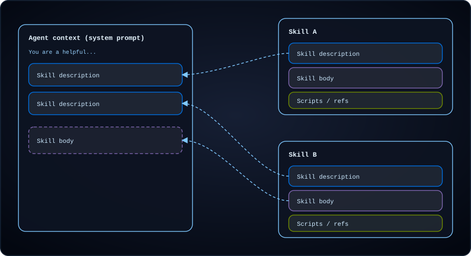
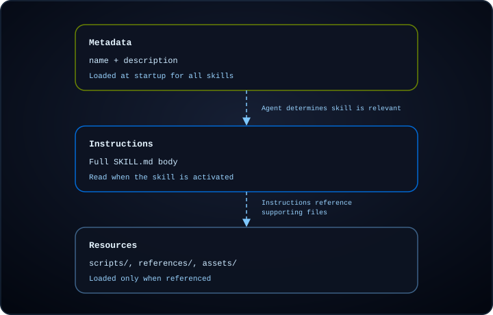

# 技能


> 了解如何通过技能扩展深度智能体的能力


技能将工作流程、最佳实践、脚本、参考文档和模板等领域专业知识打包到可重用的目录中。代理在启动时获取内容摘要，并仅在相关时发现和读取所包含的文件。


技能通过在启动时仅加载摘要并在任务需要时阅读完整说明来帮助您避免上下文膨胀。您可以跨代理和项目共享技能，并在单个代理中组合多种技能，以便每项技能都涵盖不同的功能。


有关可提高代理在 LangChain 生态系统任务中的性能的即用型技能，请参阅 [LangChain 技能](https://github.com/langchain-ai/langchain-skills) 存储库。


## 用法


  
**创建顶级技能目录**


创建一个目录来保存项目的所有技能，例如在后端根目录下的 `skills/`。

  


  
**在你的技能目录中为你的技能创建一个子目录**


每个技能都是一个包含 `SKILL.md` 文件的目录：一个包含 YAML [frontmatter](#frontmatter-fields)（`name` 和 `description`）的 Markdown 文件，后跟激活技能时代理遵循的说明。技能目录还可以选择包含支持文件，例如脚本、参考文档和模板。


    

      
**技能**


        
**langgraph-文档**


          
**技能.md**


          
**脚本**


            
**fetch_docs.py**


          


          
**参考**


            
**api-patterns.md**


            
**风格指南.md**


          


          
**资产**


            
**报告模板.md**


            
**架构.json**


          

        

      

    


深度智能体技能遵循【代理技能规范】(https://agentskills.io/specification)。

  


  
**添加包含 YAML frontmatter 和说明的 `SKILL.md` 文件。**


`SKILL.md` 以 YAML [frontmatter](#frontmatter-fields) 开头，后跟 markdown 指令：


```md
---
name: langgraph-docs
description: Use this skill for requests related to LangGraph in order to fetch relevant documentation to provide accurate, up-to-date guidance.
---

# langgraph-docs

## Overview

This skill explains how to access LangGraph documentation to help answer questions and guide implementation.

## Instructions

### 1. Fetch the documentation index

Use the fetch_url tool to read the following URL:
https://docs.langchain.com/llms.txt

This provides a structured list of all available documentation with descriptions.

### 2. Select relevant documentation

Based on the question, identify 2-4 most relevant documentation URLs from the index. Prioritize:

- Specific how-to guides for implementation questions
- Core concept pages for understanding questions
- Tutorials for end-to-end examples
- Reference docs for API details

### 3. Fetch and synthesize

Use the fetch_url tool to read the selected documentation URLs, then answer the user's question. Give a direct answer first, include the minimum necessary context, and link to the source pages rather than quoting long passages.
```


    


 参考 `SKILL.md` 中的任何[支持资源](#add-supporting-resources)，并说明每个文件包含的内容以及何时使用它。代理通过技能说明中的引用发现这些文件。

    

  


  
**创建代理时传递技能路径**


创建代理时，在 `skills` 参数中传递顶级技能目录的路径：


```python
from deepagents import create_deep_agent
from deepagents.backends.filesystem import FilesystemBackend

backend = FilesystemBackend(root_dir="./my-project")

agent = create_deep_agent(
    model="anthropic:claude-sonnet-4-6",
    backend=backend,
    skills=["./my-project/skills/"],
)
```


 此示例使用 `FilesystemBackend` 从磁盘加载技能。有关其他存储选项，包括从远程源加载技能，请参阅[后端和远程技能加载](#backends-and-remote-skill-loading)。


将每个源路径指向包含技能目录的目录。不加载直接指向 `SKILL.md` 技能目录的路径。


    

技能来源路径列表。


路径必须使用正斜杠指定，并且相对于后端的根目录。


      * 如果省略，则不会加载任何技能。
      * 使用`StateBackend`（默认）时，提供`invoke(files={...})`的技能文件。使用`deepagents.backends.utils`中的`create_file_data()`格式化文件内容；不支持原始字符串。
      * 使用`FilesystemBackend`和`StoreBackend`，创建后端，调用`backend.upload_files()`添加技能文件，然后将后端传递给`create_deep_agent`。对于 `FilesystemBackend`，使用 `virtual_mode=True` 将 `root_dir` 下的路径沙箱化。技能已在 `root_dir` 加载下的磁盘上，无需上传。


对于具有相同名称的技能，较晚的来源会覆盖较早的来源（最后一个获胜）。


      

当多个技能源包含同名技能时，`skills` 数组中后面列出的源中的技能优先（最后一个获胜）。这使您可以对来自不同来源的技能进行分层，例如被特定于项目的版本覆盖的基本技能。

      

    

  


  
**调用代理**


使用 `invoke()` 将任务发送给代理。启动时，代理会将每个技能的 [`name`](#frontmatter-fields) 和 [`description`](#frontmatter-fields) 从 [frontmatter](#frontmatter-fields) 加载到系统提示符中。当您的任务与技能的描述匹配时，代理会读取该技能的 `SKILL.md` 并遵循其说明。


```python
result = agent.invoke(
    {"messages": [{"role": "user", "content": "What is LangGraph?"}]},
    config={"configurable": {"thread_id": "1"}},
)
```


  


## 技能如何发挥作用


随着代理承担更复杂的任务，他们需要的上下文也随之增长。将所有指令加载到系统提示中会在与当前任务无关的信息上浪费令牌，并且跨会话手动提供相同的指导无法扩展。


技能使用**渐进式披露**：代理分层加载技能信息，而不是一次性加载全部技能信息。启动时，它只会看到每个技能的名称和描述。当调用技能时，它会读取完整的 `SKILL.md` 指令。仅当指令需要时，才会加载支持文件。


技能负载分为三个级别。每个级别仅在任务需要时添加更多细节：


|等级|加载什么|什么时候|
| ------------------- | ------------------------------------------------------------------------------------------------------------------------- | ---------------------------------------------------------------- |
|**1.元数据**|[`name`](#frontmatter-fields) 和 [`description`](#frontmatter-fields) 来自 `SKILL.md` [frontmatter](#frontmatter-fields)|代理启动，针对每个配置的技能|
|**2.指示**|`SKILL.md`全机身|当技能被调用时|
|**3.资源**|[支持文件](#add-supporting-resources) `scripts/`、`references/` 和 `assets/`|调用后根据需要，当指令引用它们时|


下图显示了给定时刻代理上下文中出现的内容。启动时，每个技能的 1 级元数据都在系统提示中。当调用技能时，2 级指令会加入上下文。 3 级文件保留在后端，直到代理在调用后读取它们。


<div className="skills-composition-diagram">
  
</div>


当代理完成任务时，它会分层加载技能信息：


<div className="skills-composition-diagram">
  
</div>


在 Deep Agents 中，[`SkillsMiddleware`](https://reference.langchain.com/python/deepagents/middleware/skills/SkillsMiddleware)（当您通过 `skills` 时，是 [Deep Agents 堆栈](customization.md#deep-agents-stack) 的一部分）处理前两个级别，第三个级别由 LLM 处理：


1. **发现**（级别 1）：在代理启动时，中间件扫描配置的技能路径，解析每个 `SKILL.md` [frontmatter](#frontmatter-fields)，并将 [`name`](#frontmatter-fields) 和 [`description`](#frontmatter-fields) 字段注入到系统提示。
2. **读取**（级别 2）：当代理调用技能时，它会通过 `read_file` 读取完整的 `SKILL.md` 内容。
3. **执行**（级别 3）：调用后，代理遵循技能的指示，仅根据指示要求读取支持文件（脚本、参考、资产）。


## 何时使用技能


如果您发现自己向客服人员发出类似的指示，特别是如果这些指示很详细且包含多个步骤，请考虑将针对客服人员的指示编成文字。这样，将来当你想要完成类似的任务时，代理就已经知道该怎么做了。


您还可以要求您的代理为您与代理一起完成的任务编写技能。


技能对于编码特别有帮助：


* **分步工作流程**：跨越多个步骤的工作流程，类似于菜谱。
* **特定领域的知识**：指导代理如何使用工作流程工具。例如，包括有关从何处提取信息的信息，包括该技能可以访问的其他参考信息或脚本。
* **带有可执行代码的指令**：将程序与代理可以运行的脚本或模块捆绑在一起，因此它遵循经过测试的逻辑，而不是每次都从指令重新生成。参见【执行代码技巧】(#execute-code-with-skills)。
* **指南**：向代理提供有关要遵守的护栏的支持说明。例如，遵循特定的格式或风格指南，或者指定始终将测试作为工作流程的一部分运行。


## 写出有效的技能


[代理技能规范](https://agentskills.io/specification) 包括有关构建可靠发现和激活技能的指南。以下建议建立在该基础上，并提供了深度智能体的实用模式。


**保持 [frontmatter](#frontmatter-fields) 简洁**并将 `SKILL.md` 正文保持在 5,000 个令牌以下。每个技能的前言都会被添加到[发现](#how-skills-work)的系统提示中，而全文只有在激活时才会被读取。保持两个层都较小意味着您可以加载许多技能，而不会拥挤上下文窗口。


**编写具体描述。** 在[发现](#how-skills-work) 期间，[`description`](#frontmatter-fields) 字段是客服人员看到的每个技能的唯一信息。良好的描述可以告诉代理该技能的作用以及何时激活它，并使用代理可以匹配的特定关键字：


```yaml
# Good: specific about what and when
description: >-
  Extract text and tables from PDF files, fill PDF forms, and merge
  multiple PDFs. Use when working with PDF documents or when the user
  mentions PDFs, forms, or document extraction.

# Poor: too vague for reliable matching
description: Helps with PDFs.
```


 当您在相关领域拥有多种技能时，请清楚地区分它们的描述。重叠的描述会导致代理激活错误的技能或在选项之间犹豫不决。如果两项技能具有相似的用途，请将它们合并为一项。


**保持指令集中。** 代理技能规范建议将 `SKILL.md` 保持在 500 行以下。当指令变长时，将详细的参考资料移动到[支持资源文件](#add-supporting-resources)中，并从主`SKILL.md`中引用它们：


  
**技能**


    
**数据管道**


      
**技能.md**


      
**参考**


        
**架构参考.md**


        
**错误代码.md**


      

    

  

代理仅在指令需要时才加载参考文件，从而保持渐进公开的每一层的大小适当。将文件引用保持在距离 `SKILL.md` 深一层的位置，并避免深度嵌套的引用链，这会迫使代理通过多次读取来获取所需的信息。


**代理的结构说明。** 将您的 `SKILL.md` 正文写为代理可以遵循的明确说明：


* **多步骤工作流程的分步程序**
* **选择方法的决策标准**
* **预期输入和输出的示例**，以便代理知道成功是什么样子
* **边缘情况** 代理应处理或标记给用户


**管理技能数量。** 较少的范围明确的技能胜过许多重叠的技能。随着具有相似描述的技能数量的增加，代理选择正确技能的能力就会下降。如果您发现自己拥有许多相关技能，请考虑：


* 将相关功能整合为一项技能，其中包含每个子任务的部分
* 使用参考文件保持主要 `SKILL.md` 简洁，同时涵盖多个子任务


使用 [`skills-ref` 验证工具](https://github.com/agentskills/agentskills/tree/main/skills-ref) 检查您的 `SKILL.md` [frontmatter](#frontmatter-fields) 是否遵循代理技能规范命名和格式约定。


## 添加支持资源


除了 `SKILL.md` 之外，技能目录还可以包含任何其他文件或目录。 [代理技能规范](https://agentskills.io/specification) 为常见资源类型定义了三个可选目录。 Deep Agents 在发现或激活时不会加载这些文件。仅当您的 `SKILL.md` 指令要求时，代理才会读取或执行它们。


### `scripts/`


`scripts/` 目录保存代理可以运行的可执行代码，例如 API 客户端、数据转换或验证检查。脚本应该：


* 是独立的或清楚地记录依赖关系
* 包含有用的错误消息
* 优雅地处理边缘情况


支持的语言取决于您的代理设置。常见选项包括 Python、Bash 和 JavaScript 或 TypeScript。要执行脚本而不仅仅是读取脚本，请参阅[使用技巧执行代码](#execute-code-with-skills)。当代理需要 shell 时，请使用 [沙箱脚本](#sandbox-scripts)。


### `references/`


`references/` 目录包含代理按需阅读的补充文档。将其用于对于 `SKILL.md` 来说过于详细但仍特定于任务的材料，例如：


* `REFERENCE.md` 详细技术参考
* `FORMS.md` 适用于表单模板或结构化数据格式
* 特定领域的指南（`finance.md`、`legal.md` 等）


保持各个参考文件的重点。代理仅在需要时加载它们，因此较小的文件使用较少的上下文。


### `assets/`


`assets/` 目录保存代理使用的静态资源，但不需要作为指令读取，例如：


* 文档或配置模板
* 图像（图表、示例）
* 数据文件（查找表、模式）


在 `SKILL.md` 中描述代理应何时打开或复制每个资产。


### 参考文件来自 `SKILL.md`


当您引用支持文件时，请使用相对于技能根的路径：


```md
For API details, see the [reference guide](references/api-patterns.md).

To extract tables from a PDF, run:
scripts/extract.py
```


 对于您引用的每个文件，请说明其包含的内容以及代理应何时使用它。将引用保留在 `SKILL.md` 的深一层。避免深度嵌套的引用链，这会迫使代理通过多次读取来获取所需的信息。


## 后端和远程技能加载


Deep Agents 支持不同的后端，具体取决于您想要如何存储和管理技能文件：


* `StateBackend`：将文件存储在当前线程的LangGraph代理状态中。
* `StoreBackend`：将文件存储在 LangGraph 存储中，以实现持久的跨线程存储。
* `FilesystemBackend`：在可配置的 `root_dir` 下从磁盘读取和写入技能文件。


  
**状态后端**


    


```python
from urllib.request import urlopen
from deepagents import create_deep_agent
from deepagents.backends import StateBackend
from deepagents.backends.utils import create_file_data
from langgraph.checkpoint.memory import MemorySaver

checkpointer = MemorySaver()
backend = StateBackend()

skill_url = "https://raw.githubusercontent.com/langchain-ai/deepagents/refs/heads/main/libs/code/examples/skills/langgraph-docs/SKILL.md"
with urlopen(skill_url) as response:
    skill_content = response.read().decode('utf-8')

skills_files = {
    "/skills/langgraph-docs/SKILL.md": create_file_data(skill_content),
}

agent = create_deep_agent(
    model="google_genai:gemini-3.6-flash",
    backend=backend,
    skills=["/skills/"],
    checkpointer=checkpointer,
)

result = agent.invoke(
    {
        "messages": [{"role": "user", "content": "What is langgraph?"}],
        # Seed the default StateBackend's in-state filesystem (virtual paths must start with "/").
        "files": skills_files,
    },
    config={"configurable": {"thread_id": "12345"}},
)
```


```python
from urllib.request import urlopen
from deepagents import create_deep_agent
from deepagents.backends import StateBackend
from deepagents.backends.utils import create_file_data
from langgraph.checkpoint.memory import MemorySaver

checkpointer = MemorySaver()
backend = StateBackend()

skill_url = "https://raw.githubusercontent.com/langchain-ai/deepagents/refs/heads/main/libs/code/examples/skills/langgraph-docs/SKILL.md"
with urlopen(skill_url) as response:
    skill_content = response.read().decode('utf-8')

skills_files = {
    "/skills/langgraph-docs/SKILL.md": create_file_data(skill_content),
}

agent = create_deep_agent(
    model="openai:gpt-5.5",
    backend=backend,
    skills=["/skills/"],
    checkpointer=checkpointer,
)

result = agent.invoke(
    {
        "messages": [{"role": "user", "content": "What is langgraph?"}],
        # Seed the default StateBackend's in-state filesystem (virtual paths must start with "/").
        "files": skills_files,
    },
    config={"configurable": {"thread_id": "12345"}},
)
```


```python
from urllib.request import urlopen
from deepagents import create_deep_agent
from deepagents.backends import StateBackend
from deepagents.backends.utils import create_file_data
from langgraph.checkpoint.memory import MemorySaver

checkpointer = MemorySaver()
backend = StateBackend()

skill_url = "https://raw.githubusercontent.com/langchain-ai/deepagents/refs/heads/main/libs/code/examples/skills/langgraph-docs/SKILL.md"
with urlopen(skill_url) as response:
    skill_content = response.read().decode('utf-8')

skills_files = {
    "/skills/langgraph-docs/SKILL.md": create_file_data(skill_content),
}

agent = create_deep_agent(
    model="anthropic:claude-sonnet-4-6",
    backend=backend,
    skills=["/skills/"],
    checkpointer=checkpointer,
)

result = agent.invoke(
    {
        "messages": [{"role": "user", "content": "What is langgraph?"}],
        # Seed the default StateBackend's in-state filesystem (virtual paths must start with "/").
        "files": skills_files,
    },
    config={"configurable": {"thread_id": "12345"}},
)
```


```python
from urllib.request import urlopen
from deepagents import create_deep_agent
from deepagents.backends import StateBackend
from deepagents.backends.utils import create_file_data
from langgraph.checkpoint.memory import MemorySaver

checkpointer = MemorySaver()
backend = StateBackend()

skill_url = "https://raw.githubusercontent.com/langchain-ai/deepagents/refs/heads/main/libs/code/examples/skills/langgraph-docs/SKILL.md"
with urlopen(skill_url) as response:
    skill_content = response.read().decode('utf-8')

skills_files = {
    "/skills/langgraph-docs/SKILL.md": create_file_data(skill_content),
}

agent = create_deep_agent(
    model="openrouter:z-ai/glm-5.2",
    backend=backend,
    skills=["/skills/"],
    checkpointer=checkpointer,
)

result = agent.invoke(
    {
        "messages": [{"role": "user", "content": "What is langgraph?"}],
        # Seed the default StateBackend's in-state filesystem (virtual paths must start with "/").
        "files": skills_files,
    },
    config={"configurable": {"thread_id": "12345"}},
)
```


```python
from urllib.request import urlopen
from deepagents import create_deep_agent
from deepagents.backends import StateBackend
from deepagents.backends.utils import create_file_data
from langgraph.checkpoint.memory import MemorySaver

checkpointer = MemorySaver()
backend = StateBackend()

skill_url = "https://raw.githubusercontent.com/langchain-ai/deepagents/refs/heads/main/libs/code/examples/skills/langgraph-docs/SKILL.md"
with urlopen(skill_url) as response:
    skill_content = response.read().decode('utf-8')

skills_files = {
    "/skills/langgraph-docs/SKILL.md": create_file_data(skill_content),
}

agent = create_deep_agent(
    model="fireworks:accounts/fireworks/models/glm-5p2",
    backend=backend,
    skills=["/skills/"],
    checkpointer=checkpointer,
)

result = agent.invoke(
    {
        "messages": [{"role": "user", "content": "What is langgraph?"}],
        # Seed the default StateBackend's in-state filesystem (virtual paths must start with "/").
        "files": skills_files,
    },
    config={"configurable": {"thread_id": "12345"}},
)
```


```python
from urllib.request import urlopen
from deepagents import create_deep_agent
from deepagents.backends import StateBackend
from deepagents.backends.utils import create_file_data
from langgraph.checkpoint.memory import MemorySaver

checkpointer = MemorySaver()
backend = StateBackend()

skill_url = "https://raw.githubusercontent.com/langchain-ai/deepagents/refs/heads/main/libs/code/examples/skills/langgraph-docs/SKILL.md"
with urlopen(skill_url) as response:
    skill_content = response.read().decode('utf-8')

skills_files = {
    "/skills/langgraph-docs/SKILL.md": create_file_data(skill_content),
}

agent = create_deep_agent(
    model="baseten:zai-org/GLM-5.2",
    backend=backend,
    skills=["/skills/"],
    checkpointer=checkpointer,
)

result = agent.invoke(
    {
        "messages": [{"role": "user", "content": "What is langgraph?"}],
        # Seed the default StateBackend's in-state filesystem (virtual paths must start with "/").
        "files": skills_files,
    },
    config={"configurable": {"thread_id": "12345"}},
)
```


```python
from urllib.request import urlopen
from deepagents import create_deep_agent
from deepagents.backends import StateBackend
from deepagents.backends.utils import create_file_data
from langgraph.checkpoint.memory import MemorySaver

checkpointer = MemorySaver()
backend = StateBackend()

skill_url = "https://raw.githubusercontent.com/langchain-ai/deepagents/refs/heads/main/libs/code/examples/skills/langgraph-docs/SKILL.md"
with urlopen(skill_url) as response:
    skill_content = response.read().decode('utf-8')

skills_files = {
    "/skills/langgraph-docs/SKILL.md": create_file_data(skill_content),
}

agent = create_deep_agent(
    model="ollama:north-mini-code-1.0",
    backend=backend,
    skills=["/skills/"],
    checkpointer=checkpointer,
)

result = agent.invoke(
    {
        "messages": [{"role": "user", "content": "What is langgraph?"}],
        # Seed the default StateBackend's in-state filesystem (virtual paths must start with "/").
        "files": skills_files,
    },
    config={"configurable": {"thread_id": "12345"}},
)
```


    

  


  

 **商店后端**


```python
from urllib.request import urlopen
from deepagents import create_deep_agent
from deepagents.backends import StoreBackend
from langgraph.store.memory import InMemoryStore

store = InMemoryStore()
backend = StoreBackend(
    namespace=lambda _rt: ("filesystem",),
    store=store,
)

skill_url = "https://raw.githubusercontent.com/langchain-ai/deepagents/refs/heads/main/libs/code/examples/skills/langgraph-docs/SKILL.md"
with urlopen(skill_url) as response:
    skill_content = response.read().decode('utf-8')

backend.upload_files(
    [("/skills/langgraph-docs/SKILL.md", skill_content.encode("utf-8"))]
)

agent = create_deep_agent(
    model="google_genai:gemini-3.6-flash",
    backend=backend,
    store=store,
    skills=["/skills/"],
)

result = agent.invoke(
    {"messages": [{"role": "user", "content": "What is langgraph?"}]},
    config={"configurable": {"thread_id": "12345"}},
)
```


  


  

 **文件系统后端**


```python
from urllib.request import urlopen
from deepagents import create_deep_agent
from deepagents.backends.filesystem import FilesystemBackend
from langgraph.checkpoint.memory import MemorySaver

# Checkpointer is REQUIRED for human-in-the-loop
checkpointer = MemorySaver()

skill_url = "https://raw.githubusercontent.com/langchain-ai/deepagents/refs/heads/main/libs/code/examples/skills/langgraph-docs/SKILL.md"
with urlopen(skill_url) as response:
    skill_content = response.read().decode('utf-8')

backend = FilesystemBackend(root_dir="/Users/user/{project}", virtual_mode=True)
backend.upload_files(
    [("/skills/langgraph-docs/SKILL.md", skill_content.encode("utf-8"))]
)

agent = create_deep_agent(
    model="google_genai:gemini-3.6-flash",
    backend=backend,
    skills=["/skills/"],
    interrupt_on={
        "write_file": True,
        "read_file": False,
        "edit_file": True,
    },
    checkpointer=checkpointer,  # Required for filesystem operations!
)

result = agent.invoke(
    {"messages": [{"role": "user", "content": "What is langgraph?"}]},
    config={"configurable": {"thread_id": "12345"}},
)
```


  


## 运行时加载技能


当您拥有大量技能但只有一小部分与给定运行相关时，请根据运行时上下文（例如用户角色、租户或请求类型）选择要加载的技能。主要有两种方法：


### 动态技能列表


最简单的方法是在创建代理之前构建 `skills` 数组。根据您拥有的运行时上下文选择要包含的技能路径：


```python
from deepagents import create_deep_agent

# Each role path is a container with one subdirectory per skill:
# /skills/
# ├── engineering/
# │   ├── code-review/SKILL.md
# │   └── testing/SKILL.md
# ├── data/
# │   └── sql-analysis/SKILL.md
# └── support/
#     └── ticket-triage/SKILL.md
SKILLS_BY_ROLE = {
    "engineering": ["/skills/engineering/"],
    "data": ["/skills/data/"],
    "support": ["/skills/support/"],
}


def create_agent_for_user(user_role: str):
    return create_deep_agent(
        model="anthropic:claude-sonnet-4-6",
        skills=SKILLS_BY_ROLE.get(user_role, []),
    )
```


 当技能存在于磁盘或共享后端并且您只需要控制代理看到哪些技能时，这种方法效果很好。技能本身并不重复——您保留一份副本并改变每次运行的传递路径。


SDK仅加载您在`skills`中传递的源。它不会自动扫描 CLI 目录，例如 `~/.deepagents/...` 或 `~/.agents/...`。


有关 CLI 存储约定，请参阅[应用程序数据](https://docs.langchain.com/oss/deepagents/code/configuration#data-locations)。


  
**在 SDK 中模拟 CLI 源顺序**


如果您希望在 SDK 代码中进行 CLI 样式分层，请按照从低到高的优先顺序显式传递所有所需的源：


```text
[
"<user-home>/.deepagents/{agent}/skills/",
"<user-home>/.agents/skills/",
"<project-root>/.deepagents/skills/",
"<project-root>/.agents/skills/",
]
```


 然后在创建代理时将该有序列表作为 `skills` 传递。

  

### 命名空间技能


对于独立管理每个用户技能集的多租户应用程序，请将 `/skills/` 路由到具有命名空间工厂的 [StoreBackend](https://reference.langchain.com/python/deepagents/backends/store/StoreBackend)。仅使用用户应有权访问的技能填充每个命名空间，并且中间件在运行时解析为正确的设置：


```python
from deepagents import create_deep_agent
from deepagents.backends import CompositeBackend, StateBackend, StoreBackend

agent = create_deep_agent(
    model="anthropic:claude-sonnet-4-6",
    skills=["/skills/"],
    backend=CompositeBackend(
        default=StateBackend(),
        routes={
            "/skills/": StoreBackend(
                namespace=lambda rt: (
                    rt.server_info.assistant_id,
                    rt.server_info.user.identity,
                ),
            ),
        },
    ),
)
```


 当不同的用户或租户需要可以单独更新的完全独立的技能库时，此模式非常有用。有关开箱即用地处理技能访问、共享和工作区级别可见性的托管解决方案，请参阅[队列技能](https://docs.langchain.com/langsmith/fleet/skills)。


## 子智能体的技能


当您使用[子智能体](subagents.md)时，您可以配置每种类型可以访问哪些技能：


* **通用子智能体**：当您将`skills`传递给`create_deep_agent`时，自动继承主代理的技能。无需额外配置。
* **自定义子智能体**：不继承主代理的技能。将 `skills` 参数添加到每个子智能体定义以及该子智能体的技能源路径。


技能状态完全隔离：主代理的技能对子智能体不可见，子智能体的技能对主代理不可见。


```python
from deepagents import create_deep_agent

# Each path is a container with one subdirectory per skill:
# /skills/main/
# └── overview/SKILL.md
# /skills/researcher/
# ├── research/SKILL.md
# └── web-search/SKILL.md
research_subagent = {
    "name": "researcher",
    "description": "Research assistant with specialized skills",
    "system_prompt": "You are a researcher.",
    "tools": [web_search],
    "skills": ["/skills/researcher/"],  # Subagent-specific skills
}

agent = create_deep_agent(
    model="google_genai:gemini-3.6-flash",
    skills=["/skills/main/"],  # Main agent and GP subagent get these
    subagents=[research_subagent],  # Researcher gets only its own skills
)
```


 有关子智能体配置和技能继承的更多信息，请参阅[子智能体](subagents.md)。


## 技能权限


生产部署通常需要控制三件事：每个用户可以看到哪些技能、代理是否可以修改技能文件以及写入是否需要人工批准。您可以使用 `skills` 参数和 [后端路由](#backends-and-remote-skill-loading) 控制可见性，使用 [文件系统权限](permissions.md) 控制访问，并使用 [`interrupt_on`](human-in-the-loop.md) 进行批准或使用 `mode="interrupt"` 的权限规则。


### 跨用户分享技能


要让每个用户都能访问同一个精选库，请将 `/skills/` 路由到共享的 [StoreBackend](https://reference.langchain.com/python/deepagents/backends/store/StoreBackend) 并从应用程序代码或管理工作流程中为其播种。使用组织范围的命名空间，以便该组织中的所有代理解析到同一商店：


* 按组织 ID 命名空间以获取工作区范围的技能（请参阅[强制执行只读技能](#enforce-read-only-skills)）。
* 当每个用户需要一个独立的库时按用户ID命名空间（[命名空间技能](#namespaced-skills)）。


使用 `/company-policies/SKILL.md` 之类的键以及包含 `content` 和 `encoding` 字段的值来为商店播种。从存储读取记录之前，`/skills/` 路由前缀将被删除。


有关处理技能访问、共享和工作区级可见性的托管解决方案，请参阅[队列技能](https://docs.langchain.com/langsmith/fleet/skills)。


您还可以组合共享库和个人库：将 `/skills/shared/` 路由到组织范围的 `StoreBackend`，将 `/skills/personal/` 路由到用户范围的后端，并在 `skills` 中传递两个路径。请参见[允许客服人员编辑个人技能](#allow-agents-to-edit-personal-skills)。


### 通过用户上下文限制技能


并非每个用户都应该看到所有技能。根据角色、租户或其他请求上下文控制运行时加载哪些技能。主要有两种方法：


* **[动态技能列表](#dynamic-skill-lists)** — 在创建代理之前构建 `skills` 数组。为不同的角色或请求类型传递不同的路径列表。当技能位于共享后端并且您按路径进行过滤时有效。
* **[命名空间技能](#namespaced-skills)** — 将 `/skills/` 路由到 `StoreBackend`，其中命名空间工厂以用户或租户 ID 为键。仅使用身份应访问的技能填充每个命名空间。


这些模式与下面的读取和写入控件一起工作。例如，您可以为管理员提供比工程师更多的技能，同时将两个库保持为只读。


### 强制执行只读技能


要共享技能而不让代理修改它们，请将 `/skills/` 路由到共享存储，并使用 [文件系统权限](permissions.md) 拒绝 `/skills/**` 下的写入操作。代理可以发现和读取技能；只有您的应用程序代码或管理工作流程会更新商店。


```python
from deepagents import FilesystemPermission, create_deep_agent
from deepagents.backends import CompositeBackend, StateBackend, StoreBackend
from langgraph.store.memory import InMemoryStore

store = InMemoryStore()  # Good for local dev; omit for LangSmith Deployment

agent = create_deep_agent(
    model="google_genai:gemini-3.6-flash",
    backend=CompositeBackend(
        default=StateBackend(),
        routes={
            "/skills/": StoreBackend(
                namespace=lambda rt: ("curated-skills", rt.context.org_id),
            ),
        },
    ),
    skills=["/skills/"],
    permissions=[
        FilesystemPermission(
            operations=["write"],
            paths=["/skills/**"],
            mode="deny",
        ),
    ],
    store=store,
)
```


```python
from deepagents import FilesystemPermission, create_deep_agent
from deepagents.backends import CompositeBackend, StateBackend, StoreBackend
from langgraph.store.memory import InMemoryStore

store = InMemoryStore()  # Good for local dev; omit for LangSmith Deployment

agent = create_deep_agent(
    model="openai:gpt-5.5",
    backend=CompositeBackend(
        default=StateBackend(),
        routes={
            "/skills/": StoreBackend(
                namespace=lambda rt: ("curated-skills", rt.context.org_id),
            ),
        },
    ),
    skills=["/skills/"],
    permissions=[
        FilesystemPermission(
            operations=["write"],
            paths=["/skills/**"],
            mode="deny",
        ),
    ],
    store=store,
)
```


```python
from deepagents import FilesystemPermission, create_deep_agent
from deepagents.backends import CompositeBackend, StateBackend, StoreBackend
from langgraph.store.memory import InMemoryStore

store = InMemoryStore()  # Good for local dev; omit for LangSmith Deployment

agent = create_deep_agent(
    model="anthropic:claude-sonnet-4-6",
    backend=CompositeBackend(
        default=StateBackend(),
        routes={
            "/skills/": StoreBackend(
                namespace=lambda rt: ("curated-skills", rt.context.org_id),
            ),
        },
    ),
    skills=["/skills/"],
    permissions=[
        FilesystemPermission(
            operations=["write"],
            paths=["/skills/**"],
            mode="deny",
        ),
    ],
    store=store,
)
```


```python
from deepagents import FilesystemPermission, create_deep_agent
from deepagents.backends import CompositeBackend, StateBackend, StoreBackend
from langgraph.store.memory import InMemoryStore

store = InMemoryStore()  # Good for local dev; omit for LangSmith Deployment

agent = create_deep_agent(
    model="openrouter:z-ai/glm-5.2",
    backend=CompositeBackend(
        default=StateBackend(),
        routes={
            "/skills/": StoreBackend(
                namespace=lambda rt: ("curated-skills", rt.context.org_id),
            ),
        },
    ),
    skills=["/skills/"],
    permissions=[
        FilesystemPermission(
            operations=["write"],
            paths=["/skills/**"],
            mode="deny",
        ),
    ],
    store=store,
)
```


```python
from deepagents import FilesystemPermission, create_deep_agent
from deepagents.backends import CompositeBackend, StateBackend, StoreBackend
from langgraph.store.memory import InMemoryStore

store = InMemoryStore()  # Good for local dev; omit for LangSmith Deployment

agent = create_deep_agent(
    model="fireworks:accounts/fireworks/models/glm-5p2",
    backend=CompositeBackend(
        default=StateBackend(),
        routes={
            "/skills/": StoreBackend(
                namespace=lambda rt: ("curated-skills", rt.context.org_id),
            ),
        },
    ),
    skills=["/skills/"],
    permissions=[
        FilesystemPermission(
            operations=["write"],
            paths=["/skills/**"],
            mode="deny",
        ),
    ],
    store=store,
)
```


```python
from deepagents import FilesystemPermission, create_deep_agent
from deepagents.backends import CompositeBackend, StateBackend, StoreBackend
from langgraph.store.memory import InMemoryStore

store = InMemoryStore()  # Good for local dev; omit for LangSmith Deployment

agent = create_deep_agent(
    model="baseten:zai-org/GLM-5.2",
    backend=CompositeBackend(
        default=StateBackend(),
        routes={
            "/skills/": StoreBackend(
                namespace=lambda rt: ("curated-skills", rt.context.org_id),
            ),
        },
    ),
    skills=["/skills/"],
    permissions=[
        FilesystemPermission(
            operations=["write"],
            paths=["/skills/**"],
            mode="deny",
        ),
    ],
    store=store,
)
```


```python
from deepagents import FilesystemPermission, create_deep_agent
from deepagents.backends import CompositeBackend, StateBackend, StoreBackend
from langgraph.store.memory import InMemoryStore

store = InMemoryStore()  # Good for local dev; omit for LangSmith Deployment

agent = create_deep_agent(
    model="ollama:north-mini-code-1.0",
    backend=CompositeBackend(
        default=StateBackend(),
        routes={
            "/skills/": StoreBackend(
                namespace=lambda rt: ("curated-skills", rt.context.org_id),
            ),
        },
    ),
    skills=["/skills/"],
    permissions=[
        FilesystemPermission(
            operations=["write"],
            paths=["/skills/**"],
            mode="deny",
        ),
    ],
    store=store,
)
```


 将此用于企业知识库、批准的工具说明或共享技能包，其中代理应从集中管理的上下文中受益，但不应重写事实来源。


### 需要批准技能写入


如果客服人员可以写入技能文件，但您希望首先有人参与循环，请使用 [`interrupt_on`](human-in-the-loop.md) 或 `mode="interrupt"` 的权限规则。两者都在 `write_file` 或 `edit_file` 运行之前暂停并使用相同的恢复流程。


```python
from deepagents import FilesystemPermission, create_deep_agent
from langgraph.checkpoint.memory import MemorySaver

agent = create_deep_agent(
    model="anthropic:claude-sonnet-4-6",
    skills=["/skills/personal/"],
    permissions=[
        FilesystemPermission(
            operations=["write"],
            paths=["/skills/**"],
            mode="interrupt",
        ),
    ],
    checkpointer=MemorySaver(),  # Required to pause and resume
)
```


 或者，将 `interrupt_on={"write_file": True, "edit_file": True}` 配置为需要批准所有文件系统写入，而不仅仅是技能路径。有关处理和恢复中断的信息，请参阅[人机交互](human-in-the-loop.md)。


文件系统权限中断需要 `deepagents>=0.6.8`。


### 允许代理编辑个人技能


默认情况下，如果后端允许并且没有权限规则阻止路径，代理可以写入技能文件。让代理在不接触共享库的情况下创建或完善技能：


1. 将可写路径（例如 `/skills/personal/`）路由到用户范围的 `StoreBackend`。
2. 在 `skills` 中传递该路径（以及任何共享路径）。
3. 不要为可写路径添加 `deny` 规则。如果混合共享路径和个人路径，请将更具体的规则放在更广泛的拒绝规则之前（[规则排序](permissions.md#rule-ordering)）。


```python
from deepagents import FilesystemPermission, create_deep_agent
from deepagents.backends import CompositeBackend, StateBackend, StoreBackend

agent = create_deep_agent(
    model="anthropic:claude-sonnet-4-6",
    backend=CompositeBackend(
        default=StateBackend(),
        routes={
            "/skills/shared/": StoreBackend(
                namespace=lambda rt: ("curated-skills", rt.context.org_id),
            ),
            "/skills/personal/": StoreBackend(
                namespace=lambda rt: (
                    "user-skills",
                    rt.server_info.user.identity,
                ),
            ),
        },
    ),
    skills=["/skills/shared/", "/skills/personal/"],
    permissions=[
        FilesystemPermission(
            operations=["write"],
            paths=["/skills/shared/**"],
            mode="deny",
        ),
    ],
)
```


 代理使用 `write_file` 和 `edit_file` 在可写路径下创建或更新 `SKILL.md` 和支持文件。要捕获技能格式之外的一般学习内容，请将单独的路径（例如 `/memories/`）路由到另一个可写后端。有关路由和存储设置，请参阅[后端](backends.md)。


## 用技巧执行代码


如果没有代码执行，技能就是被动的：代理读取指令并使用可用的工具遵循它们。代码执行将技能转化为主动能力。技能可以发送经过测试的脚本，该脚本调用 API、转换数据、验证输出或运行管道，并且代理确定性地执行它，而不是每次都根据指令重新生成逻辑。这对于需要精确行为（数据转换、API 集成、合规性检查）或依赖于代理无法单独通过工具调用使用的库的工作流程尤其有价值。


技能通过[沙箱脚本](#sandbox-scripts)执行代码：代理在需要安装依赖项、运行测试、调用 CLI 或使用操作系统文件系统时运行捆绑脚本。


### 沙箱脚本


技能可以包括 `SKILL.md` 文件旁边的脚本。在 `SKILL.md` 中引用脚本，以便代理知道它们存在以及何时运行它们：


  
**技能**


    
**arxiv-搜索**


      
**技能.md**


      
**脚本**


        
**搜索.py**


      

    

  


```md
---
name: arxiv-search
description: Search the arXiv preprint repository for research papers. Use when the user asks about academic papers, recent research, or scientific literature.
---

# arxiv-search

Search arXiv for papers matching the user's query.

## Instructions

1. Run `scripts/search.py` with the user's query as an argument.
2. Parse the results and present them with title, authors, abstract summary, and link.
3. If the user asks for more detail on a specific paper, fetch the full abstract.
```


 代理可以从任何后端“读取”脚本，但要“执行”它们，代理需要访问 shell，而只有 [沙箱后端](sandboxes.md) 提供该 shell。


[沙盒后端](sandboxes.md) 在隔离的容器中运行。存储在沙箱外部的技能文件在沙箱内部不可用，这意味着代理无法执行技能脚本或访问技能资源，除非先将它们转移进来。使用[自定义中间件](https://docs.langchain.com/oss/python/langchain/middleware/custom)来处理此传输：


* **`before_agent`**：从后端读取技能文件并将其上传到沙箱中，以便代理可以从头开始执行脚本。
* **`after_agent`**：从沙箱下载任何更新或新创建的技能文件并将它们写回后端，以便更改在运行中持续存在。


```python
import asyncio
from pathlib import Path
from typing import Any

from deepagents import create_deep_agent
from deepagents.backends import CompositeBackend, StoreBackend
from deepagents.backends.langsmith import LangSmithSandbox
from deepagents.backends.utils import create_file_data
from langchain.agents.middleware import AgentMiddleware, AgentState

from langgraph.runtime import Runtime
from langgraph.store.memory import InMemoryStore
from langsmith.sandbox import SandboxClient

# Identical skill bundles for every user: one shared store namespace.
SKILLS_SHARED_NAMESPACE = ("skills", "builtin")


class SkillSandboxSyncMiddleware(AgentMiddleware[AgentState, Any, Any]):
    """Copy shared skill files from the store into the sandbox before each agent run."""

    def __init__(self, backend: CompositeBackend) -> None:
        super().__init__()
        self.backend = backend

    async def abefore_agent(self, state: AgentState, runtime: Runtime[Any]) -> None:
        store = runtime.store

        files: list[tuple[str, bytes]] = []
        for item in await store.asearch(SKILLS_SHARED_NAMESPACE):
            key = str(item.key)
            if ".." in key or any(c in key for c in ("*", "?")):
                msg = f"Invalid key: {key}"
                raise ValueError(msg)
            normalized = key if key.startswith("/") else f"/{key}"
            # CompositeBackend routes paths and batches uploads to the right backend.
            files.append((f"/skills{normalized}", item.value["content"].encode()))

        if files:
            await self.backend.aupload_files(files)


async def seed_skill_store(store: InMemoryStore) -> None:
    """Load canonical skill files from disk into the shared store namespace (run once at deploy).
    You can retrieve skills from any source (local filesystem, remote URL, etc.).
    """
    skills_dir = Path(__file__).resolve().parent / "skills"
    for file_path in sorted(p for p in skills_dir.rglob("*") if p.is_file()):
        rel = file_path.relative_to(skills_dir).as_posix()
        key = f"/{rel}"
        await store.aput(
            SKILLS_SHARED_NAMESPACE,
            key,
            create_file_data(file_path.read_text(encoding="utf-8")),
        )


async def main() -> None:
    store = InMemoryStore()
    await seed_skill_store(store)

    client = SandboxClient()
    ls_sandbox = client.create_sandbox()
    sandbox_backend = LangSmithSandbox(sandbox=ls_sandbox)

    backend = CompositeBackend(
        default=sandbox_backend,
        routes={
            "/skills/": StoreBackend(
                store=store,
                namespace=lambda _rt: SKILLS_SHARED_NAMESPACE,
            ),
        },
    )

    try:
        agent = create_deep_agent(
            model="google_genai:gemini-3.6-flash",
            backend=backend,
            skills=["/skills/"],
            store=store,
            middleware=[SkillSandboxSyncMiddleware(backend)],
        )

    finally:
        client.delete_sandbox(ls_sandbox.name)


if __name__ == "__main__":
    asyncio.run(main())
```


```python
import asyncio
from pathlib import Path
from typing import Any

from deepagents import create_deep_agent
from deepagents.backends import CompositeBackend, StoreBackend
from deepagents.backends.langsmith import LangSmithSandbox
from deepagents.backends.utils import create_file_data
from langchain.agents.middleware import AgentMiddleware, AgentState

from langgraph.runtime import Runtime
from langgraph.store.memory import InMemoryStore
from langsmith.sandbox import SandboxClient

# Identical skill bundles for every user: one shared store namespace.
SKILLS_SHARED_NAMESPACE = ("skills", "builtin")


class SkillSandboxSyncMiddleware(AgentMiddleware[AgentState, Any, Any]):
    """Copy shared skill files from the store into the sandbox before each agent run."""

    def __init__(self, backend: CompositeBackend) -> None:
        super().__init__()
        self.backend = backend

    async def abefore_agent(self, state: AgentState, runtime: Runtime[Any]) -> None:
        store = runtime.store

        files: list[tuple[str, bytes]] = []
        for item in await store.asearch(SKILLS_SHARED_NAMESPACE):
            key = str(item.key)
            if ".." in key or any(c in key for c in ("*", "?")):
                msg = f"Invalid key: {key}"
                raise ValueError(msg)
            normalized = key if key.startswith("/") else f"/{key}"
            # CompositeBackend routes paths and batches uploads to the right backend.
            files.append((f"/skills{normalized}", item.value["content"].encode()))

        if files:
            await self.backend.aupload_files(files)


async def seed_skill_store(store: InMemoryStore) -> None:
    """Load canonical skill files from disk into the shared store namespace (run once at deploy).
    You can retrieve skills from any source (local filesystem, remote URL, etc.).
    """
    skills_dir = Path(__file__).resolve().parent / "skills"
    for file_path in sorted(p for p in skills_dir.rglob("*") if p.is_file()):
        rel = file_path.relative_to(skills_dir).as_posix()
        key = f"/{rel}"
        await store.aput(
            SKILLS_SHARED_NAMESPACE,
            key,
            create_file_data(file_path.read_text(encoding="utf-8")),
        )


async def main() -> None:
    store = InMemoryStore()
    await seed_skill_store(store)

    client = SandboxClient()
    ls_sandbox = client.create_sandbox()
    sandbox_backend = LangSmithSandbox(sandbox=ls_sandbox)

    backend = CompositeBackend(
        default=sandbox_backend,
        routes={
            "/skills/": StoreBackend(
                store=store,
                namespace=lambda _rt: SKILLS_SHARED_NAMESPACE,
            ),
        },
    )

    try:
        agent = create_deep_agent(
            model="openai:gpt-5.5",
            backend=backend,
            skills=["/skills/"],
            store=store,
            middleware=[SkillSandboxSyncMiddleware(backend)],
        )

    finally:
        client.delete_sandbox(ls_sandbox.name)


if __name__ == "__main__":
    asyncio.run(main())
```


```python
import asyncio
from pathlib import Path
from typing import Any

from deepagents import create_deep_agent
from deepagents.backends import CompositeBackend, StoreBackend
from deepagents.backends.langsmith import LangSmithSandbox
from deepagents.backends.utils import create_file_data
from langchain.agents.middleware import AgentMiddleware, AgentState

from langgraph.runtime import Runtime
from langgraph.store.memory import InMemoryStore
from langsmith.sandbox import SandboxClient

# Identical skill bundles for every user: one shared store namespace.
SKILLS_SHARED_NAMESPACE = ("skills", "builtin")


class SkillSandboxSyncMiddleware(AgentMiddleware[AgentState, Any, Any]):
    """Copy shared skill files from the store into the sandbox before each agent run."""

    def __init__(self, backend: CompositeBackend) -> None:
        super().__init__()
        self.backend = backend

    async def abefore_agent(self, state: AgentState, runtime: Runtime[Any]) -> None:
        store = runtime.store

        files: list[tuple[str, bytes]] = []
        for item in await store.asearch(SKILLS_SHARED_NAMESPACE):
            key = str(item.key)
            if ".." in key or any(c in key for c in ("*", "?")):
                msg = f"Invalid key: {key}"
                raise ValueError(msg)
            normalized = key if key.startswith("/") else f"/{key}"
            # CompositeBackend routes paths and batches uploads to the right backend.
            files.append((f"/skills{normalized}", item.value["content"].encode()))

        if files:
            await self.backend.aupload_files(files)


async def seed_skill_store(store: InMemoryStore) -> None:
    """Load canonical skill files from disk into the shared store namespace (run once at deploy).
    You can retrieve skills from any source (local filesystem, remote URL, etc.).
    """
    skills_dir = Path(__file__).resolve().parent / "skills"
    for file_path in sorted(p for p in skills_dir.rglob("*") if p.is_file()):
        rel = file_path.relative_to(skills_dir).as_posix()
        key = f"/{rel}"
        await store.aput(
            SKILLS_SHARED_NAMESPACE,
            key,
            create_file_data(file_path.read_text(encoding="utf-8")),
        )


async def main() -> None:
    store = InMemoryStore()
    await seed_skill_store(store)

    client = SandboxClient()
    ls_sandbox = client.create_sandbox()
    sandbox_backend = LangSmithSandbox(sandbox=ls_sandbox)

    backend = CompositeBackend(
        default=sandbox_backend,
        routes={
            "/skills/": StoreBackend(
                store=store,
                namespace=lambda _rt: SKILLS_SHARED_NAMESPACE,
            ),
        },
    )

    try:
        agent = create_deep_agent(
            model="anthropic:claude-sonnet-4-6",
            backend=backend,
            skills=["/skills/"],
            store=store,
            middleware=[SkillSandboxSyncMiddleware(backend)],
        )

    finally:
        client.delete_sandbox(ls_sandbox.name)


if __name__ == "__main__":
    asyncio.run(main())
```


```python
import asyncio
from pathlib import Path
from typing import Any

from deepagents import create_deep_agent
from deepagents.backends import CompositeBackend, StoreBackend
from deepagents.backends.langsmith import LangSmithSandbox
from deepagents.backends.utils import create_file_data
from langchain.agents.middleware import AgentMiddleware, AgentState

from langgraph.runtime import Runtime
from langgraph.store.memory import InMemoryStore
from langsmith.sandbox import SandboxClient

# Identical skill bundles for every user: one shared store namespace.
SKILLS_SHARED_NAMESPACE = ("skills", "builtin")


class SkillSandboxSyncMiddleware(AgentMiddleware[AgentState, Any, Any]):
    """Copy shared skill files from the store into the sandbox before each agent run."""

    def __init__(self, backend: CompositeBackend) -> None:
        super().__init__()
        self.backend = backend

    async def abefore_agent(self, state: AgentState, runtime: Runtime[Any]) -> None:
        store = runtime.store

        files: list[tuple[str, bytes]] = []
        for item in await store.asearch(SKILLS_SHARED_NAMESPACE):
            key = str(item.key)
            if ".." in key or any(c in key for c in ("*", "?")):
                msg = f"Invalid key: {key}"
                raise ValueError(msg)
            normalized = key if key.startswith("/") else f"/{key}"
            # CompositeBackend routes paths and batches uploads to the right backend.
            files.append((f"/skills{normalized}", item.value["content"].encode()))

        if files:
            await self.backend.aupload_files(files)


async def seed_skill_store(store: InMemoryStore) -> None:
    """Load canonical skill files from disk into the shared store namespace (run once at deploy).
    You can retrieve skills from any source (local filesystem, remote URL, etc.).
    """
    skills_dir = Path(__file__).resolve().parent / "skills"
    for file_path in sorted(p for p in skills_dir.rglob("*") if p.is_file()):
        rel = file_path.relative_to(skills_dir).as_posix()
        key = f"/{rel}"
        await store.aput(
            SKILLS_SHARED_NAMESPACE,
            key,
            create_file_data(file_path.read_text(encoding="utf-8")),
        )


async def main() -> None:
    store = InMemoryStore()
    await seed_skill_store(store)

    client = SandboxClient()
    ls_sandbox = client.create_sandbox()
    sandbox_backend = LangSmithSandbox(sandbox=ls_sandbox)

    backend = CompositeBackend(
        default=sandbox_backend,
        routes={
            "/skills/": StoreBackend(
                store=store,
                namespace=lambda _rt: SKILLS_SHARED_NAMESPACE,
            ),
        },
    )

    try:
        agent = create_deep_agent(
            model="openrouter:z-ai/glm-5.2",
            backend=backend,
            skills=["/skills/"],
            store=store,
            middleware=[SkillSandboxSyncMiddleware(backend)],
        )

    finally:
        client.delete_sandbox(ls_sandbox.name)


if __name__ == "__main__":
    asyncio.run(main())
```


```python
import asyncio
from pathlib import Path
from typing import Any

from deepagents import create_deep_agent
from deepagents.backends import CompositeBackend, StoreBackend
from deepagents.backends.langsmith import LangSmithSandbox
from deepagents.backends.utils import create_file_data
from langchain.agents.middleware import AgentMiddleware, AgentState

from langgraph.runtime import Runtime
from langgraph.store.memory import InMemoryStore
from langsmith.sandbox import SandboxClient

# Identical skill bundles for every user: one shared store namespace.
SKILLS_SHARED_NAMESPACE = ("skills", "builtin")


class SkillSandboxSyncMiddleware(AgentMiddleware[AgentState, Any, Any]):
    """Copy shared skill files from the store into the sandbox before each agent run."""

    def __init__(self, backend: CompositeBackend) -> None:
        super().__init__()
        self.backend = backend

    async def abefore_agent(self, state: AgentState, runtime: Runtime[Any]) -> None:
        store = runtime.store

        files: list[tuple[str, bytes]] = []
        for item in await store.asearch(SKILLS_SHARED_NAMESPACE):
            key = str(item.key)
            if ".." in key or any(c in key for c in ("*", "?")):
                msg = f"Invalid key: {key}"
                raise ValueError(msg)
            normalized = key if key.startswith("/") else f"/{key}"
            # CompositeBackend routes paths and batches uploads to the right backend.
            files.append((f"/skills{normalized}", item.value["content"].encode()))

        if files:
            await self.backend.aupload_files(files)


async def seed_skill_store(store: InMemoryStore) -> None:
    """Load canonical skill files from disk into the shared store namespace (run once at deploy).
    You can retrieve skills from any source (local filesystem, remote URL, etc.).
    """
    skills_dir = Path(__file__).resolve().parent / "skills"
    for file_path in sorted(p for p in skills_dir.rglob("*") if p.is_file()):
        rel = file_path.relative_to(skills_dir).as_posix()
        key = f"/{rel}"
        await store.aput(
            SKILLS_SHARED_NAMESPACE,
            key,
            create_file_data(file_path.read_text(encoding="utf-8")),
        )


async def main() -> None:
    store = InMemoryStore()
    await seed_skill_store(store)

    client = SandboxClient()
    ls_sandbox = client.create_sandbox()
    sandbox_backend = LangSmithSandbox(sandbox=ls_sandbox)

    backend = CompositeBackend(
        default=sandbox_backend,
        routes={
            "/skills/": StoreBackend(
                store=store,
                namespace=lambda _rt: SKILLS_SHARED_NAMESPACE,
            ),
        },
    )

    try:
        agent = create_deep_agent(
            model="fireworks:accounts/fireworks/models/glm-5p2",
            backend=backend,
            skills=["/skills/"],
            store=store,
            middleware=[SkillSandboxSyncMiddleware(backend)],
        )

    finally:
        client.delete_sandbox(ls_sandbox.name)


if __name__ == "__main__":
    asyncio.run(main())
```


```python
import asyncio
from pathlib import Path
from typing import Any

from deepagents import create_deep_agent
from deepagents.backends import CompositeBackend, StoreBackend
from deepagents.backends.langsmith import LangSmithSandbox
from deepagents.backends.utils import create_file_data
from langchain.agents.middleware import AgentMiddleware, AgentState

from langgraph.runtime import Runtime
from langgraph.store.memory import InMemoryStore
from langsmith.sandbox import SandboxClient

# Identical skill bundles for every user: one shared store namespace.
SKILLS_SHARED_NAMESPACE = ("skills", "builtin")


class SkillSandboxSyncMiddleware(AgentMiddleware[AgentState, Any, Any]):
    """Copy shared skill files from the store into the sandbox before each agent run."""

    def __init__(self, backend: CompositeBackend) -> None:
        super().__init__()
        self.backend = backend

    async def abefore_agent(self, state: AgentState, runtime: Runtime[Any]) -> None:
        store = runtime.store

        files: list[tuple[str, bytes]] = []
        for item in await store.asearch(SKILLS_SHARED_NAMESPACE):
            key = str(item.key)
            if ".." in key or any(c in key for c in ("*", "?")):
                msg = f"Invalid key: {key}"
                raise ValueError(msg)
            normalized = key if key.startswith("/") else f"/{key}"
            # CompositeBackend routes paths and batches uploads to the right backend.
            files.append((f"/skills{normalized}", item.value["content"].encode()))

        if files:
            await self.backend.aupload_files(files)


async def seed_skill_store(store: InMemoryStore) -> None:
    """Load canonical skill files from disk into the shared store namespace (run once at deploy).
    You can retrieve skills from any source (local filesystem, remote URL, etc.).
    """
    skills_dir = Path(__file__).resolve().parent / "skills"
    for file_path in sorted(p for p in skills_dir.rglob("*") if p.is_file()):
        rel = file_path.relative_to(skills_dir).as_posix()
        key = f"/{rel}"
        await store.aput(
            SKILLS_SHARED_NAMESPACE,
            key,
            create_file_data(file_path.read_text(encoding="utf-8")),
        )


async def main() -> None:
    store = InMemoryStore()
    await seed_skill_store(store)

    client = SandboxClient()
    ls_sandbox = client.create_sandbox()
    sandbox_backend = LangSmithSandbox(sandbox=ls_sandbox)

    backend = CompositeBackend(
        default=sandbox_backend,
        routes={
            "/skills/": StoreBackend(
                store=store,
                namespace=lambda _rt: SKILLS_SHARED_NAMESPACE,
            ),
        },
    )

    try:
        agent = create_deep_agent(
            model="baseten:zai-org/GLM-5.2",
            backend=backend,
            skills=["/skills/"],
            store=store,
            middleware=[SkillSandboxSyncMiddleware(backend)],
        )

    finally:
        client.delete_sandbox(ls_sandbox.name)


if __name__ == "__main__":
    asyncio.run(main())
```


```python
import asyncio
from pathlib import Path
from typing import Any

from deepagents import create_deep_agent
from deepagents.backends import CompositeBackend, StoreBackend
from deepagents.backends.langsmith import LangSmithSandbox
from deepagents.backends.utils import create_file_data
from langchain.agents.middleware import AgentMiddleware, AgentState

from langgraph.runtime import Runtime
from langgraph.store.memory import InMemoryStore
from langsmith.sandbox import SandboxClient

# Identical skill bundles for every user: one shared store namespace.
SKILLS_SHARED_NAMESPACE = ("skills", "builtin")


class SkillSandboxSyncMiddleware(AgentMiddleware[AgentState, Any, Any]):
    """Copy shared skill files from the store into the sandbox before each agent run."""

    def __init__(self, backend: CompositeBackend) -> None:
        super().__init__()
        self.backend = backend

    async def abefore_agent(self, state: AgentState, runtime: Runtime[Any]) -> None:
        store = runtime.store

        files: list[tuple[str, bytes]] = []
        for item in await store.asearch(SKILLS_SHARED_NAMESPACE):
            key = str(item.key)
            if ".." in key or any(c in key for c in ("*", "?")):
                msg = f"Invalid key: {key}"
                raise ValueError(msg)
            normalized = key if key.startswith("/") else f"/{key}"
            # CompositeBackend routes paths and batches uploads to the right backend.
            files.append((f"/skills{normalized}", item.value["content"].encode()))

        if files:
            await self.backend.aupload_files(files)


async def seed_skill_store(store: InMemoryStore) -> None:
    """Load canonical skill files from disk into the shared store namespace (run once at deploy).
    You can retrieve skills from any source (local filesystem, remote URL, etc.).
    """
    skills_dir = Path(__file__).resolve().parent / "skills"
    for file_path in sorted(p for p in skills_dir.rglob("*") if p.is_file()):
        rel = file_path.relative_to(skills_dir).as_posix()
        key = f"/{rel}"
        await store.aput(
            SKILLS_SHARED_NAMESPACE,
            key,
            create_file_data(file_path.read_text(encoding="utf-8")),
        )


async def main() -> None:
    store = InMemoryStore()
    await seed_skill_store(store)

    client = SandboxClient()
    ls_sandbox = client.create_sandbox()
    sandbox_backend = LangSmithSandbox(sandbox=ls_sandbox)

    backend = CompositeBackend(
        default=sandbox_backend,
        routes={
            "/skills/": StoreBackend(
                store=store,
                namespace=lambda _rt: SKILLS_SHARED_NAMESPACE,
            ),
        },
    )

    try:
        agent = create_deep_agent(
            model="ollama:north-mini-code-1.0",
            backend=backend,
            skills=["/skills/"],
            store=store,
            middleware=[SkillSandboxSyncMiddleware(backend)],
        )

    finally:
        client.delete_sandbox(ls_sandbox.name)


if __name__ == "__main__":
    asyncio.run(main())
```


 有关在执行前播种技能和记忆并在执行后同步回来的完整示例，请参阅[使用自定义中间件同步技能和记忆](going-to-production.md#example-syncing-skills-and-memories-with-custom-middleware)。


## 故障排除


使用[LangSmith](https://smith.langchain.com?utm_source=docs\&utm_medium=cta\&utm_campaign=langsmith-signup\&utm_content=oss-deepagents-skills)跟踪来调试技能发现，`read_file`调用`SKILL.md`，并支持资源访问。按照[跟踪快速入门](https://docs.langchain.com/langsmith/observability-quickstart) 进行设置。我们建议您还设置 [LangSmith Engine](https://docs.langchain.com/langsmith/engine)，它会监视您的痕迹、检测问题并提出修复建议。


### 技能未激活


**问题**：代理在未读取技能的 `SKILL.md` 的情况下处理任务。


**解决方案**：


1. **使描述更具体。** 代理在 [发现](#how-skills-work) 处单独从 [`description`](#frontmatter-fields) 字段中选择技能。包括技能的用途、何时使用它以及代理可以匹配的关键字：


```yaml
# Good
description: >-
  Search the arXiv preprint repository for research papers. Use when the
  user asks about academic papers, recent research, or scientific literature.

# Poor
description: Helps with research.
```


2. **减少技能之间的重叠。**如果多个技能具有相似的描述，代理可能会跳过正确的一项或选择错误的一项。区分描述或【巩固相关技能】(#write-effective-skills)。


3. **确认技能位于 `skills` 数组中。** 技能仅从您在创建代理时传递的路径或特定于子智能体的 `skills` 参数加载。


### 启动时缺少技能


**问题**：代理未在其系统提示中列出技能，或者 `SKILL.md` 上的 `read_file` 失败。


**解决方案**：


1. **检查技能路径。** 路径必须使用正斜杠并且相对于后端根。对于 `FilesystemBackend`，路径是相对于 `root_dir` 的。使用`StateBackend`，使用`create_file_data()`传递`invoke(files={...})`中的技能文件。


2. **检查路径级别。** `skills` 中的每个条目都是包含技能目录的源目录。通过技能目录本身不会发现任何内容，也不会引发任何错误，因为源目录存在，并且仅在其子目录中搜索 `SKILL.md`。


3. **验证`SKILL.md` [frontmatter](#frontmatter-fields)。** [`name`](#frontmatter-fields) 必须与父目录名称匹配并遵循[代理技能规范](https://agentskills.io/specification)。使用[`skills-ref`验证工具](https://github.com/agentskills/agentskills/tree/main/skills-ref)检查格式。


4. **检查文件大小。** Deep Agent 在发现过程中会跳过超过 10 MB 的 `SKILL.md` 文件。


5. **检查分层来源。** 当相同的技能名称出现在多个来源中时，[最后一个来源获胜](#usage)。较晚的路径中的旧技能或空技能可能会覆盖您期望的技能。


### 未找到支持文件


**问题**：代理读取 `SKILL.md` 但无法访问脚本、引用或资产。


**解决方案**：


1. **来自 `SKILL.md` 的参考文件。** 代理不会自动发现支持文件。说明每个文件包含的内容以及何时使用它。使用技能根目录中的[相对路径](#reference-files-from-skill-md)。


2. **将路径保留在技能目录中。** 文件路径根据后端进行解析。确认支持文件存在于您的说明引用的路径中。


3. **将技能同步到沙箱中。** 如果您使用[沙箱后端](sandboxes.md)，容器外部的技能文件将不可用，直到您将其复制进去。请参阅[沙箱脚本](#sandbox-scripts)和[使用自定义中间件同步技能和记忆](going-to-production.md#example-syncing-skills-and-memories-with-custom-middleware)。


### 脚本无法运行


**问题**：代理读取脚本但无法运行它。


**解决方案**：代理可以从任何后端读取脚本，但运行它们需要[沙箱后端](sandboxes.md)。参见【执行代码技巧】(#execute-code-with-skills)。


### 子智能体无法访问技能


**问题**：自定义子智能体看不到主代理使用的技能。


**解决方案**：自定义子智能体不会继承主代理的技能。使用该子智能体的技能源路径将 `skills` 参数添加到每个[子智能体定义](#skills-for-subagents)。通用子智能体自动继承 `create_deep_agent` 的技能。


## 参考


### 技能、记忆力和工具


技能、[内存](memory.md)（`AGENTS.md` 文件）和工具都为代理提供上下文或功能。下表总结了何时达到每个目标：


||技能|记忆|工具|
| ------------ | ---------------------------------------------------------------- | ------------------------------------------------------------- | --------------------------------------------------------------------------------- |
|**目的**|通过渐进式披露发现的按需功能|启动时加载的持久上下文|代理可以调用​​的编程操作|
|**加载中**|仅当代理确定相关性时才读取|在代理启动时加载|每回合可用|
|**格式**|命名目录中的 `SKILL.md`|`AGENTS.md` 文件|与代理绑定的功能|
|**分层**|用户，然后项目（最后获胜）|用户，然后项目（组合）|在创建代理时定义|
|**使用时**|指令是特定于任务的并且可能很大|上下文始终相关（项目惯例、偏好）|代理需要编程操作，或者无权访问文件系统|


这些是指导方针，而不是硬性界限。在实践中，技能和记忆力是有一定范围的。代理可以在工作时更新自己的技能，随着时间的推移捕捉新的程序并完善指令。通过这种方式，技能可以作为渐进式公开记忆的一种形式发挥作用：代理根据需要构建和检索上下文，而不是在每个提示上加载。


### 前沿领域


[代理技能规范](https://agentskills.io/specification) 定义了以下 frontmatter 字段：


|场地|必需的|描述|
| --------------- | -------- | ------------------------------------------------------------------------------------------- |
|`name`|是的|带连字符的小写字母数字，1-64 个字符。必须与父目录名称匹配。|
|`description`|是的|该技能的作用是什么以及何时使用它。最多 1,024 个字符。|
|`license`|不|许可证名称或对捆绑许可证文件的引用。|
|`compatibility`|不|环境要求（系统包、网络访问）。最多 500 个字符。|
|`metadata`|不|附加属性的任意键值对。|
|`allowed-tools`|不|该技能可以使用的预先批准的工具的空格分隔列表。实验性的。|


```md
---
name: langgraph-docs
description: Use this skill for requests related to LangGraph in order to fetch relevant documentation to provide accurate, up-to-date guidance.
license: MIT
compatibility: Requires internet access for fetching documentation URLs
metadata:
  author: langchain
  version: "1.0"
allowed-tools: fetch_url
---

# langgraph-docs

Instructions for the agent go here. See [Usage](#usage) for a complete example of skill instructions.
```


 有关详细约束和验证规则，请参阅完整的[代理技能规范](https://agentskills.io/specification)。在 Deep Agents 中，`SKILL.md` 文件必须小于 10 MB。超过此限制的文件在技能加载期间将被跳过。


更多示例技能请参见[深度智能体示例技能](https://github.com/langchain-ai/deepagents/tree/main/libs/code/examples/skills)。


***


<div className="source-links">


  

[将这些文档](https://docs.langchain.com/use-these-docs) 通过 MCP 连接到 Claude、VSCode 等以获得实时答案。

  


  

[在 GitHub 上编辑此页面](https://github.com/langchain-ai/docs/edit/main/src/oss/deepagents/skills.mdx) 或 [提交问题](https://github.com/langchain-ai/docs/issues/new/choose)。

  

</div>

