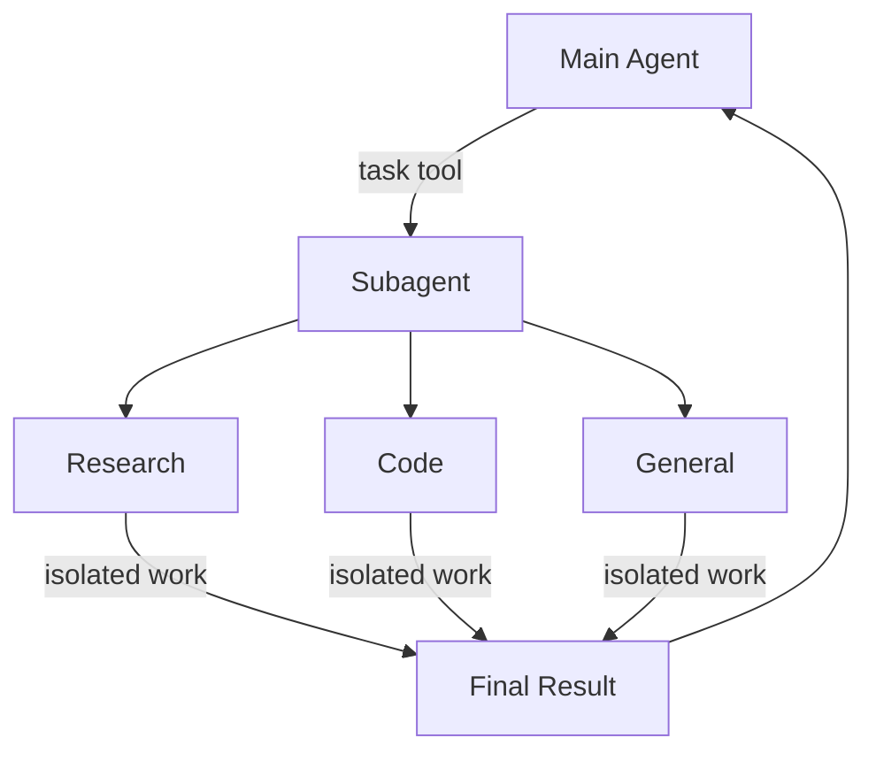
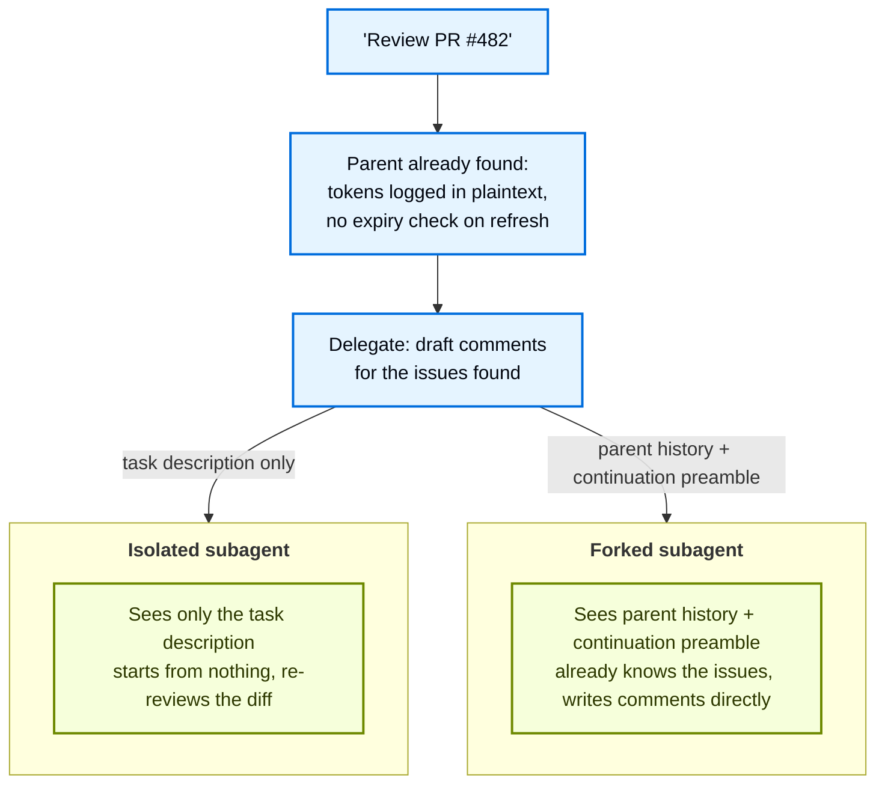
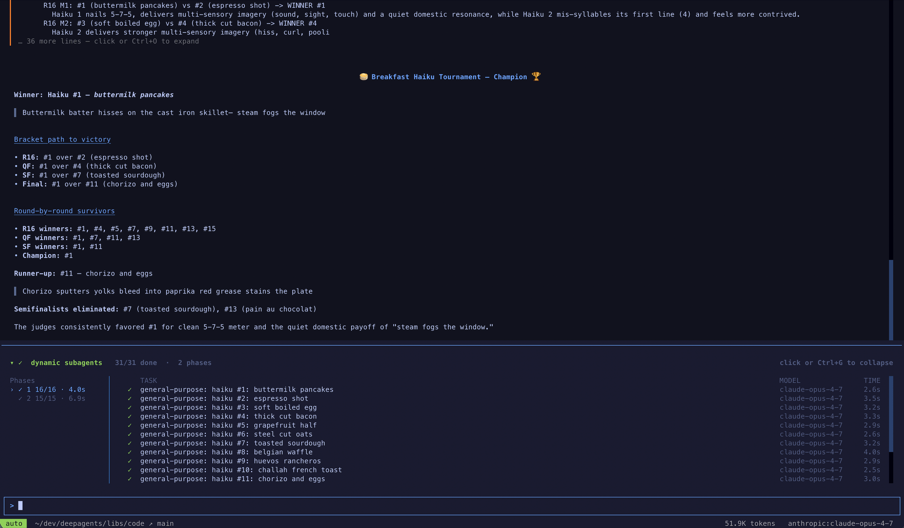
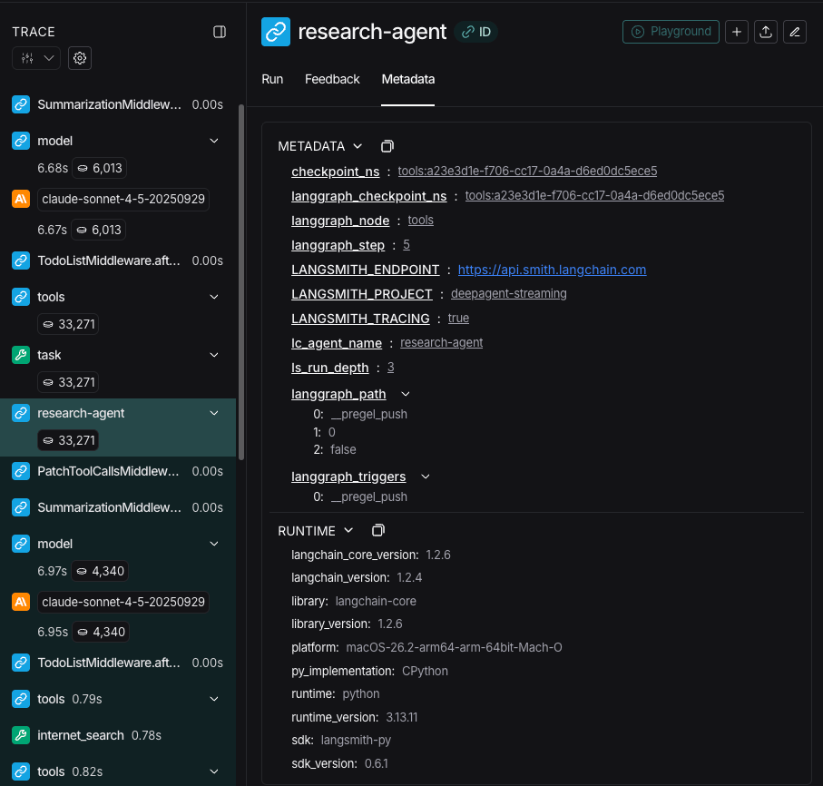
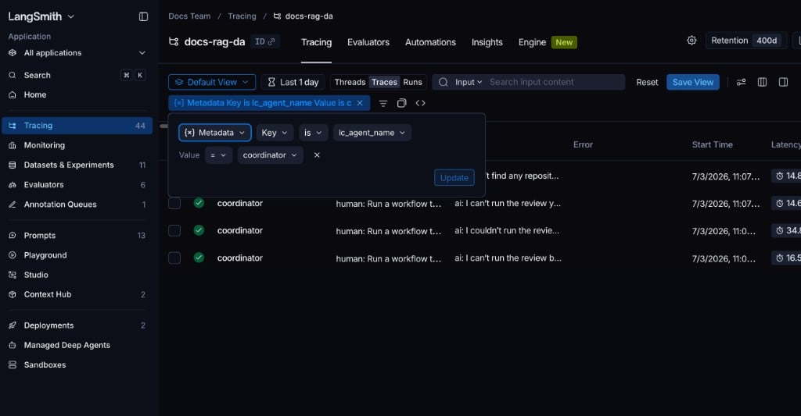

# 子智能体


> 了解如何使用子智能体来委派工作并保持上下文干净


深度智能体可以创建子智能体来委派工作。您可以在 `subagents` 参数中指定自定义子智能体。子智能体对于[上下文隔离](https://www.dbreunig.com/2025/06/26/how-to-fix-your-context.html#context-quarantine)（保持主代理的上下文干净）和提供专门指令很有用。


本页介绍**同步**子智能体，其中主管程序会阻塞，直到子智能体完成。对于长时间运行的任务、并行工作流或需要中途引导和取消的情况，请参阅[异步子智能体](async-subagents.md)。





## 为什么要使用子智能体？


子智能体解决了**上下文膨胀问题**。当代理使用具有大量输出的工具（网络搜索、文件读取、数据库查询）时，上下文窗口很快就会被中间结果填满。子智能体隔离了这些详细的工作——主代理仅接收最终结果，而不是产生该结果的数十个工具调用。


**何时使用子智能体：**


* ✅ 多步骤任务会扰乱主要代理的上下文
* ✅ 需要自定义说明或工具的专业领域
* ✅ 需要不同模型能力的任务
* ✅ 当你想让主要代理人专注于高层协调时


**何时不使用子智能体：**


* ❌ 简单的单步任务
* ❌ 当你需要维护中间上下文时
* ❌ 当开销超过收益时


## 配置


`subagents` 应该是字典或 [`CompiledSubAgent`](https://reference.langchain.com/python/deepagents/middleware/subagents/CompiledSubAgent) 对象的列表。有两种类型：


### 默认子智能体


Deep Agents 会自动添加同步 `general-purpose` 子智能体，除非您已提供具有该名称的同步子智能体。


`general-purpose` 子智能体默认具有文件系统工具，并且可以使用其他工具/中间件进行自定义。


* 要替换它，请传递您自己的名为 `general-purpose` 的子智能体。
* 要重命名或重新提示自动添加的版本，请在活动的 [线束配置文件](profiles.md#harness-profiles) 上设置 `general_purpose_subagent=GeneralPurposeSubagentProfile(...)`。
* 要禁用它，请参阅下面的[在没有子智能体的情况下运行](#running-without-subagents)。


### 在没有子智能体的情况下运行


要在没有 `task` 工具的情况下运行代理，请执行以下两项操作：


1. 在活动的[线束配置文件](profiles.md#harness-profiles) 上设置 `general_purpose_subagent=GeneralPurposeSubagentProfile(enabled=False)`。
2. 在 `create_deep_agent` 上不通过 `subagents=` 传递同步子智能体。


当至少存在一个同步子智能体时，深度智能体仅附加 [`SubAgentMiddleware`](https://reference.langchain.com/python/deepagents/middleware/subagents/SubAgentMiddleware)（和 `task` 工具）。无论是默认代理还是调用者提供的代理，代理都可以在没有委派的情况下运行。


异步子智能体不受影响 - 它们通过自己的中间件和工具流动，如[异步子智能体](async-subagents.md)中所述。


不要在这里获取 `excluded_middleware` - `SubAgentMiddleware` 是必需的脚手架，并且列出它会引发 `ValueError`。 `general_purpose_subagent.enabled = False` 旋钮是受支持的路径。


## 自定义子智能体


您可以使用 `subagents` 参数使用特定工具定义专用子智能体。例如，担任代码审查员、网络研究员或测试运行员。


对于大多数用例，使用 [SubAgent dictionaries](#subagent-dictionary-based) 将子智能体定义为字典。对于复杂的工作流程，请使用 [`CompiledSubAgent`](#compiledsubagent)：


### 子智能体（基于字典）


将子智能体定义为与 [`SubAgent`](https://reference.langchain.com/python/deepagents/middleware/subagents/SubAgent) 规范匹配的字典，其中包含以下字段：


|场地|类型|描述|
| ----------------- | -------------------------------------- | ------------------------------------------------------------------------------------------------------------------------------------------------------------------------------------------------------------------------------------------------------------------------------------------------------------------------------------------------------------------------------------------------------------------------------------------------------------------------------------------------------------------------------------------------------------------------------------------------------------------------------------------------------------------------------------------------------------------------------------------------------------------------------------------------------------------------------------------------------------------------------------------------------------------------------------------------------------------------------------ |
|`name`|`str`|必需的。子智能体的唯一标识符。主代理在调用 `task()` 工具时使用此名称。子智能体名称成为 `AIMessage` 和流式传输的元数据，这有助于区分代理。|
|`description`|`str`|必需的。描述该子智能体的作用。具体并以行动为导向。主代理使用它来决定何时进行委托。|
|`system_prompt`|`str`|`mode: "isolated"` 是必需的（默认值）。子智能体的说明。自定义隔离子智能体必须定义自己的。包括工具使用指导和输出格式要求。<br />不继承自主代理。对于 `mode: "fork"`，请忽略此字段，除非您需要仅分叉附录。请参阅[分叉子智能体](#forked-subagents)。|
|`mode`|`"isolated"` \|`"fork"`|选修的。上下文模式。默认为 `"isolated"`，其中子智能体仅看到委派的任务。设置为 `"fork"` 以继承父级的对话和系统提示。请参阅[分叉子智能体](#forked-subagents)。|
|`tools`|`list[Callable]`|选修的。子智能体可以使用的工具。保持最小化并仅包含需要的内容。<br /> 默认情况下继承自主代理。指定后，将完全覆盖继承的工具。|
|`model`|`str` \|`BaseChatModel`|选修的。覆盖主要代理的模型。省略使用主代理的模型。<br /> 默认继承主代理。您可以传递模型标识符字符串，如 `'openai:gpt-5.5'`（使用 `'provider:model'` 格式）或 LangChain 聊天模型对象（`init_chat_model("gpt-5.5")` 或 `ChatOpenAI(model="gpt-5.5")`）。|
|`middleware`|`list[Middleware]`|选修的。用于自定义行为、日志记录或速率限制的附加中间件。<br />不从主代理继承。合并到[同步子智能体堆栈](customization.md#synchronous-subagent-stack)：`.name` 与默认值匹配的实例将其替换到位，其他任何内容都会在最后一个核心中间件条目之后、配置文件、提示缓存和内存之前落地。请参阅[覆盖默认中间件实例](customization.md#override-a-default-middleware-instance)。例如，在此处包含带有 `tools` 白名单的 [`FilesystemMiddleware`](https://reference.langchain.com/python/deepagents/middleware/filesystem/FilesystemMiddleware) 实例，以独立于主代理限制子智能体的文件系统工具。有关详细信息，请参阅[虚拟文件系统访问](overview.md#virtual-filesystem-access) 下的“限制文件系统工具”部分。|
|`interrupt_on`|`dict[str, bool \| InterruptOnConfig]`|选修的。为特定工具配置[人机交互](human-in-the-loop.md)。选项：`True`、`False` 或 `InterruptOnConfig` 与 `allowed_decisions`。需要checkpointer。<br />默认继承自主代理。子智能体值覆盖默认值。|
|`skills`|`list[str]`|选修的。 [技巧](skills.md)源码路径。指定后，子智能体会从这些目录加载技能（例如，`["/skills/researcher/"]`，其子目录是技能的容器）。这允许子智能体具有与主代理不同的技能集。<br />不从主代理继承。只有通用子智能体才能继承主代理的技能。当子智能体拥有技能时，它会运行自己独立的 [`SkillsMiddleware`](https://reference.langchain.com/python/deepagents/middleware/skills/SkillsMiddleware) 实例。技能状态是完全隔离的 - 子智能体加载的技能对父代理不可见，反之亦然。|
|`response_format`|`ResponseFormat`|选修的。 [结构化输出](https://docs.langchain.com/oss/python/langchain/structured-output) 子智能体的架构。设置后，父代理会收到 JSON 格式的子智能体结果，而不是自由格式的文本。接受 Pydantic 模型、`ToolStrategy(...)`、`ProviderStrategy(...)` 或原始架构类型。参见[结构化输出](#structured-output)。|
|`permissions`|`list[FilesystemPermission]`|选修的。子智能体的[文件系统权限规则](permissions.md)。设置后，**完全替换**父代理的权限。<br /> 默认继承自主代理。|


### 编译子智能体


对于复杂的工作流程，请使用预构建的 LangGraph 图作为 [`CompiledSubAgent`](https://reference.langchain.com/python/deepagents/middleware/subagents/CompiledSubAgent)：


|场地|类型|描述|
| ------------- | ------------------------ | -------------------------------------------------------------------------------------------------------------------------------------------------------------------------------------------------- |
|`name`|`str`|必需的。子智能体的唯一标识符。子智能体名称成为 `AIMessage` 和流式传输的元数据，这有助于区分代理。|
|`description`|`str`|必需的。该子智能体的作用。|
|`runnable`|`Runnable`|必需的。编译好的 LangGraph 图（必须首先调用 `.compile()`）。|
|`mode`|`"isolated"` \|`"fork"`|选修的。默认为 `"isolated"`。设置为 `"fork"` 以继承父级的消息历史记录。无论哪种方式，编译的图形都会保持其自己的系统提示。请参阅[分叉子智能体](#forked-subagents)。|


## 使用子智能体


```python
import os
from typing import Literal

from deepagents import create_deep_agent
from tavily import TavilyClient

tavily_client = TavilyClient(api_key=os.environ["TAVILY_API_KEY"])


def internet_search(
    query: str,
    max_results: int = 5,
    topic: Literal["general", "news", "finance"] = "general",
    include_raw_content: bool = False,
):
    """Run a web search"""
    return tavily_client.search(
        query,
        max_results=max_results,
        include_raw_content=include_raw_content,
        topic=topic,
    )


research_subagent = {
    "name": "research-agent",
    "description": "Used to research more in depth questions",
    "system_prompt": "You are a great researcher",
    "tools": [internet_search],
    "model": "openai:gpt-5.5",  # Optional override, defaults to main agent model
}
subagents = [research_subagent]

agent = create_deep_agent(
    model="google_genai:gemini-3.6-flash",
    subagents=subagents,
)
```


## 使用 CompiledSubAgent


对于更复杂的用例，您可以为自定义子智能体提供 [`CompiledSubAgent`](https://reference.langchain.com/python/deepagents/middleware/subagents/CompiledSubAgent)。您可以使用 LangChain 的 [`create_agent`](https://reference.langchain.com/python/langchain/agents/factory/create_agent) 创建自定义子智能体，或者使用 [graph API](https://docs.langchain.com/oss/python/langgraph/graph-api) 创建自定义 LangGraph 图形。


如果您要创建自定义 LangGraph 图，请确保该图具有 [名为 `"messages"` 的状态键](https://docs.langchain.com/oss/python/langgraph/quickstart#2-define-state)：


```python
from deepagents import CompiledSubAgent, create_deep_agent
from langchain.agents import create_agent


def internet_search(query: str) -> str:
    """Run a web search."""
    return f"search results for {query}"


research_instructions = "You are a research coordinator."
your_model = "openai:gpt-5.5"
specialized_tools: list = []

# Create a custom agent graph
custom_graph = create_agent(
    model=your_model,
    tools=specialized_tools,
    system_prompt="You are a specialized agent for data analysis...",
)

# Use it as a custom subagent
custom_subagent = CompiledSubAgent(
    name="data-analyzer",
    description="Specialized agent for complex data analysis tasks",
    runnable=custom_graph,
)

subagents = [custom_subagent]

agent = create_deep_agent(
    model="google_genai:gemini-3.6-flash",
    tools=[internet_search],
    system_prompt=research_instructions,
    subagents=subagents,
)
```


```python
from deepagents import CompiledSubAgent, create_deep_agent
from langchain.agents import create_agent


def internet_search(query: str) -> str:
    """Run a web search."""
    return f"search results for {query}"


research_instructions = "You are a research coordinator."
your_model = "openai:gpt-5.5"
specialized_tools: list = []

# Create a custom agent graph
custom_graph = create_agent(
    model=your_model,
    tools=specialized_tools,
    system_prompt="You are a specialized agent for data analysis...",
)

# Use it as a custom subagent
custom_subagent = CompiledSubAgent(
    name="data-analyzer",
    description="Specialized agent for complex data analysis tasks",
    runnable=custom_graph,
)

subagents = [custom_subagent]

agent = create_deep_agent(
    model="openai:gpt-5.5",
    tools=[internet_search],
    system_prompt=research_instructions,
    subagents=subagents,
)
```


```python
from deepagents import CompiledSubAgent, create_deep_agent
from langchain.agents import create_agent


def internet_search(query: str) -> str:
    """Run a web search."""
    return f"search results for {query}"


research_instructions = "You are a research coordinator."
your_model = "openai:gpt-5.5"
specialized_tools: list = []

# Create a custom agent graph
custom_graph = create_agent(
    model=your_model,
    tools=specialized_tools,
    system_prompt="You are a specialized agent for data analysis...",
)

# Use it as a custom subagent
custom_subagent = CompiledSubAgent(
    name="data-analyzer",
    description="Specialized agent for complex data analysis tasks",
    runnable=custom_graph,
)

subagents = [custom_subagent]

agent = create_deep_agent(
    model="anthropic:claude-sonnet-4-6",
    tools=[internet_search],
    system_prompt=research_instructions,
    subagents=subagents,
)
```


```python
from deepagents import CompiledSubAgent, create_deep_agent
from langchain.agents import create_agent


def internet_search(query: str) -> str:
    """Run a web search."""
    return f"search results for {query}"


research_instructions = "You are a research coordinator."
your_model = "openai:gpt-5.5"
specialized_tools: list = []

# Create a custom agent graph
custom_graph = create_agent(
    model=your_model,
    tools=specialized_tools,
    system_prompt="You are a specialized agent for data analysis...",
)

# Use it as a custom subagent
custom_subagent = CompiledSubAgent(
    name="data-analyzer",
    description="Specialized agent for complex data analysis tasks",
    runnable=custom_graph,
)

subagents = [custom_subagent]

agent = create_deep_agent(
    model="openrouter:z-ai/glm-5.2",
    tools=[internet_search],
    system_prompt=research_instructions,
    subagents=subagents,
)
```


```python
from deepagents import CompiledSubAgent, create_deep_agent
from langchain.agents import create_agent


def internet_search(query: str) -> str:
    """Run a web search."""
    return f"search results for {query}"


research_instructions = "You are a research coordinator."
your_model = "openai:gpt-5.5"
specialized_tools: list = []

# Create a custom agent graph
custom_graph = create_agent(
    model=your_model,
    tools=specialized_tools,
    system_prompt="You are a specialized agent for data analysis...",
)

# Use it as a custom subagent
custom_subagent = CompiledSubAgent(
    name="data-analyzer",
    description="Specialized agent for complex data analysis tasks",
    runnable=custom_graph,
)

subagents = [custom_subagent]

agent = create_deep_agent(
    model="fireworks:accounts/fireworks/models/glm-5p2",
    tools=[internet_search],
    system_prompt=research_instructions,
    subagents=subagents,
)
```


```python
from deepagents import CompiledSubAgent, create_deep_agent
from langchain.agents import create_agent


def internet_search(query: str) -> str:
    """Run a web search."""
    return f"search results for {query}"


research_instructions = "You are a research coordinator."
your_model = "openai:gpt-5.5"
specialized_tools: list = []

# Create a custom agent graph
custom_graph = create_agent(
    model=your_model,
    tools=specialized_tools,
    system_prompt="You are a specialized agent for data analysis...",
)

# Use it as a custom subagent
custom_subagent = CompiledSubAgent(
    name="data-analyzer",
    description="Specialized agent for complex data analysis tasks",
    runnable=custom_graph,
)

subagents = [custom_subagent]

agent = create_deep_agent(
    model="baseten:zai-org/GLM-5.2",
    tools=[internet_search],
    system_prompt=research_instructions,
    subagents=subagents,
)
```


```python
from deepagents import CompiledSubAgent, create_deep_agent
from langchain.agents import create_agent


def internet_search(query: str) -> str:
    """Run a web search."""
    return f"search results for {query}"


research_instructions = "You are a research coordinator."
your_model = "openai:gpt-5.5"
specialized_tools: list = []

# Create a custom agent graph
custom_graph = create_agent(
    model=your_model,
    tools=specialized_tools,
    system_prompt="You are a specialized agent for data analysis...",
)

# Use it as a custom subagent
custom_subagent = CompiledSubAgent(
    name="data-analyzer",
    description="Specialized agent for complex data analysis tasks",
    runnable=custom_graph,
)

subagents = [custom_subagent]

agent = create_deep_agent(
    model="ollama:north-mini-code-1.0",
    tools=[internet_search],
    system_prompt=research_instructions,
    subagents=subagents,
)
```


## 分叉子智能体


默认情况下，子智能体以 `mode: "isolated"` 运行：它只看到您提供的任务描述，并且不记得导致委派的对话。 **分叉子智能体** (`mode: "fork"`) 继承了父代理的完整对话历史记录和确切的系统提示。


当子智能体的任务是继续父代理已开始的工作时，请使用分叉子智能体，例如工作代理拾取父代理已诊断的修复，或为事件调查起草事后分析的子智能体。由于分叉是您在子智能体本身上设置的模式，因此这是您在定义它时做出的决定。





 子智能体分叉需要 `deepagents>=0.7.13`。它处于[**测试版**](https://docs.langchain.com/oss/python/versioning)； API 和行为可能会在版本之间发生变化。


### 配置分叉子智能体


在 [`SubAgent`](https://reference.langchain.com/python/deepagents/middleware/subagents/SubAgent) 上设置 `mode: "fork"`（默认为 `mode: "isolated"`）。所有 [`SubAgent`](https://reference.langchain.com/python/deepagents/middleware/subagents/SubAgent) 字段均可用：`name`、`description`、`tools`、`model`、`middleware`、`interrupt_on`、`permissions` 和`response_format`。


如果提供 `skills`，则会被拒绝。 `system_prompt` 是允许的，并作为附录附加到父级继承的提示符中，但这样做通常会破坏提示符缓存，因此除非您对仅 fork 指令有特定需要，否则请将其保留为未设置。


```python
from deepagents import create_deep_agent


def read_diff(path: str) -> str:
    """Read a file's diff."""
    return f"diff for {path}"


comment_writer = {
    "name": "comment-writer",
    "description": "Continues an in-progress PR review and drafts review comments",
    "mode": "fork",
    "tools": [read_diff],
}

agent = create_deep_agent(
    model="google_genai:gemini-3.7-flash",
    tools=[read_diff],
    subagents=[comment_writer],
)

result = agent.invoke(
    {
        "messages": [
            {
                "role": "user",
                "content": "Review PR #482 and hand it off to comment-writer to draft comments for the issues found",
            }
        ]
    }
)
```


### 它是如何运作的


分叉不会获得新的任务描述。它获取父级自己的对话，但有一个更改：委托给它的尾随调用被删除，并替换为一个简短的前导码，将上面的消息标记为延续，而不是新的请求。当 fork 完成时，它的答案会作为正常的工具结果返回，并且父级会从它停止的地方继续。


```python
# What the parent has, right before delegating
[
    HumanMessage("Review the changes in PR #482"),
    AIMessage("", tool_calls=[{"name": "read_diff", "args": {"path": "src/auth/session.py"}}]),
    ToolMessage("- session tokens are logged in plaintext\n- no expiry check on refresh", tool_call_id="1"),
    AIMessage("Found two issues: session tokens are logged in plaintext, and there's no expiry check on refresh."),
    HumanMessage("Good catch. Draft review comments for those."),
    AIMessage("", tool_calls=[{"name": "task", "args": {"subagent_type": "comment-writer", "description": "Draft review comments for the two issues found above."}}]),
]

# What the fork actually sees
[
    HumanMessage("Review the changes in PR #482"),
    AIMessage("", tool_calls=[{"name": "read_diff", "args": {"path": "src/auth/session.py"}}]),
    ToolMessage("- session tokens are logged in plaintext\n- no expiry check on refresh", tool_call_id="1"),
    AIMessage("Found two issues: session tokens are logged in plaintext, and there's no expiry check on refresh."),
    HumanMessage("Good catch. Draft review comments for those."),
    HumanMessage("Continuing as the subagent that was just invoked. Draft review comments for the two issues found above."),
]
```


 重用父级的确切前缀还意味着 fork 可以重用父级的提示缓存，而不是冷启动，尽管与父级不同的工具使用仍然会错过。


[`CompiledSubAgent`](https://reference.langchain.com/python/deepagents/middleware/subagents/CompiledSubAgent) 也支持 `mode: "fork"`，尽管它保留自己的系统提示，因为图形已经构建。


### 何时使用分叉


沿着这些维度比较隔离模式和分叉模式：


|方面|隔离（默认）|叉状|
| ---------------------------- | -------------------------------------------- | -------------------------------------------------------------------------------------------------- |
|**语境**|仅您传入的任务描述|家长完整的通话记录和系统提示|
|**系统提示及技巧**|您将它们设置在子智能体上|技能不可设置；系统提示符附加到父级提示符（破坏缓存，因此通常未设置）|
|**呼叫其他子智能体**|可以使用`task`工具|不能使用`task`；必须自己完成工作|
|**最适合**|不需要事先背景的重点工作|家长已经开始继续调查|


## 动态子智能体


默认情况下，主代理通过 `task` 工具调用委托给子智能体（它可以一次性发出多个子智能体以并行运行它们）。连接了[解释器](interpreters.md)后，代理可以**从代码**分派子智能体——使用循环、分支和并行批处理来跨多个项目展开工作并以编程方式合成结果。这称为[动态子智能体](dynamic-subagents.md)。


当工作跨越多个独立单元（查看目录中的每个文件、对一批工单进行分类）、需要多个视角或从递归分析中受益时，可以使用动态子智能体。


动态子智能体使用解释器运行时，该运行时位于 [**beta**](https://docs.langchain.com/oss/python/versioning) 中。 API 和生命周期行为可能会在版本之间发生变化。


### 启用动态子智能体


一旦代理同时拥有子智能体和解释器中间件，动态子智能体就变得可用。安装 QuickJS 解释器包，然后将 `CodeInterpreterMiddleware` 添加到您的代理。


```bash
pip install -U "deepagents[quickjs]"
```


```bash
uv add "deepagents[quickjs]"
```


```python
from deepagents import create_deep_agent
from langchain_quickjs import CodeInterpreterMiddleware

agent = create_deep_agent(
    model="google_genai:gemini-3.6-flash",
    subagents=[{
        "name": "reviewer",
        "description": "Reviews code for security issues, citing lines and severity",
        "system_prompt": "You are a security-focused code reviewer. Report issues with line numbers and severity.",
    }],
    middleware=[CodeInterpreterMiddleware()],
)
```


```python
from deepagents import create_deep_agent
from langchain_quickjs import CodeInterpreterMiddleware

agent = create_deep_agent(
    model="openai:gpt-5.5",
    subagents=[{
        "name": "reviewer",
        "description": "Reviews code for security issues, citing lines and severity",
        "system_prompt": "You are a security-focused code reviewer. Report issues with line numbers and severity.",
    }],
    middleware=[CodeInterpreterMiddleware()],
)
```


```python
from deepagents import create_deep_agent
from langchain_quickjs import CodeInterpreterMiddleware

agent = create_deep_agent(
    model="anthropic:claude-sonnet-4-6",
    subagents=[{
        "name": "reviewer",
        "description": "Reviews code for security issues, citing lines and severity",
        "system_prompt": "You are a security-focused code reviewer. Report issues with line numbers and severity.",
    }],
    middleware=[CodeInterpreterMiddleware()],
)
```


```python
from deepagents import create_deep_agent
from langchain_quickjs import CodeInterpreterMiddleware

agent = create_deep_agent(
    model="openrouter:z-ai/glm-5.2",
    subagents=[{
        "name": "reviewer",
        "description": "Reviews code for security issues, citing lines and severity",
        "system_prompt": "You are a security-focused code reviewer. Report issues with line numbers and severity.",
    }],
    middleware=[CodeInterpreterMiddleware()],
)
```


```python
from deepagents import create_deep_agent
from langchain_quickjs import CodeInterpreterMiddleware

agent = create_deep_agent(
    model="fireworks:accounts/fireworks/models/glm-5p2",
    subagents=[{
        "name": "reviewer",
        "description": "Reviews code for security issues, citing lines and severity",
        "system_prompt": "You are a security-focused code reviewer. Report issues with line numbers and severity.",
    }],
    middleware=[CodeInterpreterMiddleware()],
)
```


```python
from deepagents import create_deep_agent
from langchain_quickjs import CodeInterpreterMiddleware

agent = create_deep_agent(
    model="baseten:zai-org/GLM-5.2",
    subagents=[{
        "name": "reviewer",
        "description": "Reviews code for security issues, citing lines and severity",
        "system_prompt": "You are a security-focused code reviewer. Report issues with line numbers and severity.",
    }],
    middleware=[CodeInterpreterMiddleware()],
)
```


```python
from deepagents import create_deep_agent
from langchain_quickjs import CodeInterpreterMiddleware

agent = create_deep_agent(
    model="ollama:north-mini-code-1.0",
    subagents=[{
        "name": "reviewer",
        "description": "Reviews code for security issues, citing lines and severity",
        "system_prompt": "You are a security-focused code reviewer. Report issues with line numbers and severity.",
    }],
    middleware=[CodeInterpreterMiddleware()],
)
```


 只要代理具有子智能体和解释器中间件，动态子智能体调度就会默认启用。通过`CodeInterpreterMiddleware(subagents=False)`要求通过正常的`task`刀具路径调度。解释器需要 `langchain-quickjs>=0.2.0` 和 Python `>=3.11`。


### 触发动态编排


动态调度是隐式的：代理决定根据任务的形状（而不是每次调用标志）从代码中分散工作。


**“工作流”一词是一个有用的触发器。** 内置解释器系统提示将“工作流”视为通过解释器组织工作的信号 - 从代码中调度带有 `task()` 的子智能体。将请求表述为“工作流”是一个有意的杠杆，您可以选择动态编排：当您希望代理从代码中展开工作时，请包含它。对于单一的直接授权，请清楚地表达请求。


例如，将请求表述为“工作流”，选择从代码中进行扇出：


```python
result = agent.invoke({
    "messages": [{"role": "user", "content": "Run a workflow that reviews every file in src/routes/ and summarizes the top risks."}]
})
```


 有关配置、高级编排模式和安全注意事项，请参阅[动态子智能体](dynamic-subagents.md)。


### 与编码剂一起使用


尝试动态子智能体的最快方法是使用 `dcode`，这是基于深度智能体构建的 LangChain 终端编程智能体。它附带启用的代码解释器，因此动态子智能体开箱即用，无需连接任何东西。


安装`dcode`：


```bash
curl -LsSf https://langch.in/dcode | bash
```


 运行它：


```bash
dcode
```


 要触发动态子智能体，请要求“工作流程”。该代理不会编写工作本身或通过其本机 `task` 工具管理扇出，而是编写一个编排脚本来调用内置的 `task()` 全局并在代码解释器中运行它。例如：“运行工作流来检查 src/ 中的每个文件以进行 SQL 注入。”


当子智能体生成时，`dcode` 在动态子智能体面板中实时显示它们，并按调度分组为阶段。


  


`dcode` 是尝试此操作的最快方法，但您也可以在您选择的编程智能体中使用动态子智能体而不是 [ACP](acp.md)（例如，Zed）。


## 流媒体


深度智能体支持来自协调器和每个委派子智能体的流式更新。


使用 [`stream_events`](event-streaming.md) 获取类型化投影（子智能体、消息、工具调用和值的单独迭代器），以便您可以独立使用每个投影。


### 流式传输子智能体进度


最简单的模式是迭代 `stream.subagents` 来跟踪每个委派任务的启动、运行和完成。每个子智能体句柄公开 `.name`、`.messages`、`.tool_calls` 和 `.output`。


```python
from deepagents import (
    create_deep_agent
)

agent = create_deep_agent(
    model="google_genai:gemini-3.6-flash",
    system_prompt=(
        "You are a project coordinator with no research knowledge. "
        "For every user request, you must call the task() tool with "
        "subagent_type set to research-agent. Never answer research "
        "questions yourself."
    ),
    subagents=[
        {
            "name": "research-agent",
            "description": (
                "Delegate research to this subagent. Give one topic at a time."
            ),
            "system_prompt": (
                "You are a great researcher. Return a brief summary."
            ),
        },
    ],
    name="main-agent",
)

if __name__ == "__main__":
    stream = agent.stream_events(
        {
            "messages": [
                {
                    "role": "user",
                    "content": "Research one recent advance in quantum computing.",
                }
            ]
        },
        version="v3",
    )

    coordinator_messages: list[str] = []
    subagent_handles = []

    for name, item in stream.interleave("messages", "subagents"):
        if name == "messages":
            print("[coordinator]", item.text)
            coordinator_messages.append(item.text)
        else:
            print(f"[{item.name}] started")
            subagent_handles.append(item)
            for message in item.messages:
                print(f"[{item.name}]", message.text)
            print(f"[{item.name}] status: {item.status}")
```


```python
from deepagents import (
    create_deep_agent
)

agent = create_deep_agent(
    model="openai:gpt-5.5",
    system_prompt=(
        "You are a project coordinator with no research knowledge. "
        "For every user request, you must call the task() tool with "
        "subagent_type set to research-agent. Never answer research "
        "questions yourself."
    ),
    subagents=[
        {
            "name": "research-agent",
            "description": (
                "Delegate research to this subagent. Give one topic at a time."
            ),
            "system_prompt": (
                "You are a great researcher. Return a brief summary."
            ),
        },
    ],
    name="main-agent",
)

if __name__ == "__main__":
    stream = agent.stream_events(
        {
            "messages": [
                {
                    "role": "user",
                    "content": "Research one recent advance in quantum computing.",
                }
            ]
        },
        version="v3",
    )

    coordinator_messages: list[str] = []
    subagent_handles = []

    for name, item in stream.interleave("messages", "subagents"):
        if name == "messages":
            print("[coordinator]", item.text)
            coordinator_messages.append(item.text)
        else:
            print(f"[{item.name}] started")
            subagent_handles.append(item)
            for message in item.messages:
                print(f"[{item.name}]", message.text)
            print(f"[{item.name}] status: {item.status}")
```


```python
from deepagents import (
    create_deep_agent
)

agent = create_deep_agent(
    model="anthropic:claude-sonnet-4-6",
    system_prompt=(
        "You are a project coordinator with no research knowledge. "
        "For every user request, you must call the task() tool with "
        "subagent_type set to research-agent. Never answer research "
        "questions yourself."
    ),
    subagents=[
        {
            "name": "research-agent",
            "description": (
                "Delegate research to this subagent. Give one topic at a time."
            ),
            "system_prompt": (
                "You are a great researcher. Return a brief summary."
            ),
        },
    ],
    name="main-agent",
)

if __name__ == "__main__":
    stream = agent.stream_events(
        {
            "messages": [
                {
                    "role": "user",
                    "content": "Research one recent advance in quantum computing.",
                }
            ]
        },
        version="v3",
    )

    coordinator_messages: list[str] = []
    subagent_handles = []

    for name, item in stream.interleave("messages", "subagents"):
        if name == "messages":
            print("[coordinator]", item.text)
            coordinator_messages.append(item.text)
        else:
            print(f"[{item.name}] started")
            subagent_handles.append(item)
            for message in item.messages:
                print(f"[{item.name}]", message.text)
            print(f"[{item.name}] status: {item.status}")
```


```python
from deepagents import (
    create_deep_agent
)

agent = create_deep_agent(
    model="openrouter:z-ai/glm-5.2",
    system_prompt=(
        "You are a project coordinator with no research knowledge. "
        "For every user request, you must call the task() tool with "
        "subagent_type set to research-agent. Never answer research "
        "questions yourself."
    ),
    subagents=[
        {
            "name": "research-agent",
            "description": (
                "Delegate research to this subagent. Give one topic at a time."
            ),
            "system_prompt": (
                "You are a great researcher. Return a brief summary."
            ),
        },
    ],
    name="main-agent",
)

if __name__ == "__main__":
    stream = agent.stream_events(
        {
            "messages": [
                {
                    "role": "user",
                    "content": "Research one recent advance in quantum computing.",
                }
            ]
        },
        version="v3",
    )

    coordinator_messages: list[str] = []
    subagent_handles = []

    for name, item in stream.interleave("messages", "subagents"):
        if name == "messages":
            print("[coordinator]", item.text)
            coordinator_messages.append(item.text)
        else:
            print(f"[{item.name}] started")
            subagent_handles.append(item)
            for message in item.messages:
                print(f"[{item.name}]", message.text)
            print(f"[{item.name}] status: {item.status}")
```


```python
from deepagents import (
    create_deep_agent
)

agent = create_deep_agent(
    model="fireworks:accounts/fireworks/models/glm-5p2",
    system_prompt=(
        "You are a project coordinator with no research knowledge. "
        "For every user request, you must call the task() tool with "
        "subagent_type set to research-agent. Never answer research "
        "questions yourself."
    ),
    subagents=[
        {
            "name": "research-agent",
            "description": (
                "Delegate research to this subagent. Give one topic at a time."
            ),
            "system_prompt": (
                "You are a great researcher. Return a brief summary."
            ),
        },
    ],
    name="main-agent",
)

if __name__ == "__main__":
    stream = agent.stream_events(
        {
            "messages": [
                {
                    "role": "user",
                    "content": "Research one recent advance in quantum computing.",
                }
            ]
        },
        version="v3",
    )

    coordinator_messages: list[str] = []
    subagent_handles = []

    for name, item in stream.interleave("messages", "subagents"):
        if name == "messages":
            print("[coordinator]", item.text)
            coordinator_messages.append(item.text)
        else:
            print(f"[{item.name}] started")
            subagent_handles.append(item)
            for message in item.messages:
                print(f"[{item.name}]", message.text)
            print(f"[{item.name}] status: {item.status}")
```


```python
from deepagents import (
    create_deep_agent
)

agent = create_deep_agent(
    model="baseten:zai-org/GLM-5.2",
    system_prompt=(
        "You are a project coordinator with no research knowledge. "
        "For every user request, you must call the task() tool with "
        "subagent_type set to research-agent. Never answer research "
        "questions yourself."
    ),
    subagents=[
        {
            "name": "research-agent",
            "description": (
                "Delegate research to this subagent. Give one topic at a time."
            ),
            "system_prompt": (
                "You are a great researcher. Return a brief summary."
            ),
        },
    ],
    name="main-agent",
)

if __name__ == "__main__":
    stream = agent.stream_events(
        {
            "messages": [
                {
                    "role": "user",
                    "content": "Research one recent advance in quantum computing.",
                }
            ]
        },
        version="v3",
    )

    coordinator_messages: list[str] = []
    subagent_handles = []

    for name, item in stream.interleave("messages", "subagents"):
        if name == "messages":
            print("[coordinator]", item.text)
            coordinator_messages.append(item.text)
        else:
            print(f"[{item.name}] started")
            subagent_handles.append(item)
            for message in item.messages:
                print(f"[{item.name}]", message.text)
            print(f"[{item.name}] status: {item.status}")
```


```python
from deepagents import (
    create_deep_agent
)

agent = create_deep_agent(
    model="ollama:north-mini-code-1.0",
    system_prompt=(
        "You are a project coordinator with no research knowledge. "
        "For every user request, you must call the task() tool with "
        "subagent_type set to research-agent. Never answer research "
        "questions yourself."
    ),
    subagents=[
        {
            "name": "research-agent",
            "description": (
                "Delegate research to this subagent. Give one topic at a time."
            ),
            "system_prompt": (
                "You are a great researcher. Return a brief summary."
            ),
        },
    ],
    name="main-agent",
)

if __name__ == "__main__":
    stream = agent.stream_events(
        {
            "messages": [
                {
                    "role": "user",
                    "content": "Research one recent advance in quantum computing.",
                }
            ]
        },
        version="v3",
    )

    coordinator_messages: list[str] = []
    subagent_handles = []

    for name, item in stream.interleave("messages", "subagents"):
        if name == "messages":
            print("[coordinator]", item.text)
            coordinator_messages.append(item.text)
        else:
            print(f"[{item.name}] started")
            subagent_handles.append(item)
            for message in item.messages:
                print(f"[{item.name}]", message.text)
            print(f"[{item.name}] status: {item.status}")
```


### 兰史密斯追踪


当您的深度智能体运行时，子智能体或协调器执行的所有运行都将在 `lc_agent_name` 键下的元数据中包含代理名称，例如 `{'lc_agent_name': 'research-agent'}`。这使您可以在 LangSmith 中通过子智能体来识别和过滤运行。





在 [LangSmith](https://smith.langchain.com?utm_source=docs\&utm_medium=cta\&utm_campaign=langsmith-signup\&utm_content=oss-deepagents-subagents) 中打开运行，将协调器跟踪与每个子智能体运行进行比较。按照[可观测性快速入门](https://docs.langchain.com/langsmith/observability-quickstart) 进行设置。我们建议您还设置 [LangSmith Engine](https://docs.langchain.com/langsmith/engine)，它可以监视您的痕迹、检测问题并提出修复建议。


## 按 LangSmith 中的子智能体过滤


由于每个子智能体的 `name` 都会在其生成的每次运行中写入 `lc_agent_name` 元数据键，因此您可以使用 LangSmith 的元数据过滤将所有运行与特定子智能体隔离，这对于调试、监控或比较子智能体随时间的行为非常有用。


### LangSmith UI 中的过滤器


1. 在 [LangSmith](https://smith.langchain.com?utm_source=docs\&utm_medium=cta\&utm_campaign=langsmith-signup\&utm_content=oss-deepagents-subagents) 中打开您的跟踪项目。
2. 将跟踪项目页面上的视图切换到 **Runs** 以查看各个跨度。
3. 单击“**添加过滤器**”并选择“**元数据**”。
4. 将 **Key** 设置为 `lc_agent_name`，将 **Value** 设置为子智能体名称，例如 `coordinator`。





这仅显示该子智能体生成的运行。您可以将过滤器保存为命名视图以供重复使用。有关过滤选项的完整参考，请参阅[过滤跟踪](https://docs.langchain.com/langsmith/filter-traces-in-application)。


### 使用 SDK 以编程方式过滤


使用 LangSmith 过滤器查询语言中的 `has` 比较器来按元数据键值对匹配运行：


```python
from langsmith import Client

client = Client()

runs = client.list_runs(
    project_name="<your-project>",
    filter='has(metadata, \'{"lc_agent_name": "research-agent"}\')',
)

for run in runs:
    print(run.name, run.start_time, run.status)
```


 要从*任何*命名的子智能体（不包括主代理）获取运行，请过滤根本具有 `lc_agent_name` 键的运行：


```python
runs = client.list_runs(
    project_name="<your-project>",
    filter="has(metadata, 'lc_agent_name')",
)
```


 有关完整的过滤器查询语言参考，请参阅[跟踪查询语法](https://docs.langchain.com/langsmith/trace-query-syntax)。


## 结构化输出


子智能体支持[结构化输出](https://docs.langchain.com/oss/python/langchain/structured-output)，因此父代理接收可预测、可解析的 JSON，而不是自由格式的文本。


子智能体的结构化输出需要 `deepagents>=0.5.3`。


在子智能体配置上传递 `response_format`。当子智能体完成时，其结构化响应将被 JSON 序列化并作为 `ToolMessage` 内容返回到父代理。该模式接受 [`create_agent`](https://reference.langchain.com/python/langchain/agents/factory/create_agent) 支持的任何内容：Pydantic 模型、`ToolStrategy(...)`、`ProviderStrategy(...)` 或原始模式类型。


```python
import asyncio

from pydantic import BaseModel, Field

from deepagents import create_deep_agent


def web_search(query: str) -> str:
    """Search the web."""
    return f"web results for {query}"


class ResearchFindings(BaseModel):
    """Structured findings from a research task."""

    summary: str = Field(description="Summary of findings")
    confidence: float = Field(description="Confidence score from 0 to 1")
    sources: list[str] = Field(description="List of source URLs")


research_subagent = {
    "name": "researcher",
    "description": "Researches topics and returns structured findings",
    "system_prompt": "Research the given topic thoroughly. Return your findings.",
    "tools": [web_search],
    "response_format": ResearchFindings,
}

agent = create_deep_agent(
    model="google_genai:gemini-3.6-flash",
    subagents=[research_subagent],
)

async def main():
    result = await agent.ainvoke(
        {"messages": [{"role": "user", "content": "Research recent advances in quantum computing"}]}
    )
    return result

result = asyncio.run(main())

# The parent's ToolMessage contains JSON-serialized structured data:
# '{"summary": "...", "confidence": 0.87, "sources": ["https://..."]}'
```


```python
import asyncio

from pydantic import BaseModel, Field

from deepagents import create_deep_agent


def web_search(query: str) -> str:
    """Search the web."""
    return f"web results for {query}"


class ResearchFindings(BaseModel):
    """Structured findings from a research task."""

    summary: str = Field(description="Summary of findings")
    confidence: float = Field(description="Confidence score from 0 to 1")
    sources: list[str] = Field(description="List of source URLs")


research_subagent = {
    "name": "researcher",
    "description": "Researches topics and returns structured findings",
    "system_prompt": "Research the given topic thoroughly. Return your findings.",
    "tools": [web_search],
    "response_format": ResearchFindings,
}

agent = create_deep_agent(
    model="openai:gpt-5.5",
    subagents=[research_subagent],
)

async def main():
    result = await agent.ainvoke(
        {"messages": [{"role": "user", "content": "Research recent advances in quantum computing"}]}
    )
    return result

result = asyncio.run(main())

# The parent's ToolMessage contains JSON-serialized structured data:
# '{"summary": "...", "confidence": 0.87, "sources": ["https://..."]}'
```


```python
import asyncio

from pydantic import BaseModel, Field

from deepagents import create_deep_agent


def web_search(query: str) -> str:
    """Search the web."""
    return f"web results for {query}"


class ResearchFindings(BaseModel):
    """Structured findings from a research task."""

    summary: str = Field(description="Summary of findings")
    confidence: float = Field(description="Confidence score from 0 to 1")
    sources: list[str] = Field(description="List of source URLs")


research_subagent = {
    "name": "researcher",
    "description": "Researches topics and returns structured findings",
    "system_prompt": "Research the given topic thoroughly. Return your findings.",
    "tools": [web_search],
    "response_format": ResearchFindings,
}

agent = create_deep_agent(
    model="anthropic:claude-sonnet-4-6",
    subagents=[research_subagent],
)

async def main():
    result = await agent.ainvoke(
        {"messages": [{"role": "user", "content": "Research recent advances in quantum computing"}]}
    )
    return result

result = asyncio.run(main())

# The parent's ToolMessage contains JSON-serialized structured data:
# '{"summary": "...", "confidence": 0.87, "sources": ["https://..."]}'
```


```python
import asyncio

from pydantic import BaseModel, Field

from deepagents import create_deep_agent


def web_search(query: str) -> str:
    """Search the web."""
    return f"web results for {query}"


class ResearchFindings(BaseModel):
    """Structured findings from a research task."""

    summary: str = Field(description="Summary of findings")
    confidence: float = Field(description="Confidence score from 0 to 1")
    sources: list[str] = Field(description="List of source URLs")


research_subagent = {
    "name": "researcher",
    "description": "Researches topics and returns structured findings",
    "system_prompt": "Research the given topic thoroughly. Return your findings.",
    "tools": [web_search],
    "response_format": ResearchFindings,
}

agent = create_deep_agent(
    model="openrouter:z-ai/glm-5.2",
    subagents=[research_subagent],
)

async def main():
    result = await agent.ainvoke(
        {"messages": [{"role": "user", "content": "Research recent advances in quantum computing"}]}
    )
    return result

result = asyncio.run(main())

# The parent's ToolMessage contains JSON-serialized structured data:
# '{"summary": "...", "confidence": 0.87, "sources": ["https://..."]}'
```


```python
import asyncio

from pydantic import BaseModel, Field

from deepagents import create_deep_agent


def web_search(query: str) -> str:
    """Search the web."""
    return f"web results for {query}"


class ResearchFindings(BaseModel):
    """Structured findings from a research task."""

    summary: str = Field(description="Summary of findings")
    confidence: float = Field(description="Confidence score from 0 to 1")
    sources: list[str] = Field(description="List of source URLs")


research_subagent = {
    "name": "researcher",
    "description": "Researches topics and returns structured findings",
    "system_prompt": "Research the given topic thoroughly. Return your findings.",
    "tools": [web_search],
    "response_format": ResearchFindings,
}

agent = create_deep_agent(
    model="fireworks:accounts/fireworks/models/glm-5p2",
    subagents=[research_subagent],
)

async def main():
    result = await agent.ainvoke(
        {"messages": [{"role": "user", "content": "Research recent advances in quantum computing"}]}
    )
    return result

result = asyncio.run(main())

# The parent's ToolMessage contains JSON-serialized structured data:
# '{"summary": "...", "confidence": 0.87, "sources": ["https://..."]}'
```


```python
import asyncio

from pydantic import BaseModel, Field

from deepagents import create_deep_agent


def web_search(query: str) -> str:
    """Search the web."""
    return f"web results for {query}"


class ResearchFindings(BaseModel):
    """Structured findings from a research task."""

    summary: str = Field(description="Summary of findings")
    confidence: float = Field(description="Confidence score from 0 to 1")
    sources: list[str] = Field(description="List of source URLs")


research_subagent = {
    "name": "researcher",
    "description": "Researches topics and returns structured findings",
    "system_prompt": "Research the given topic thoroughly. Return your findings.",
    "tools": [web_search],
    "response_format": ResearchFindings,
}

agent = create_deep_agent(
    model="baseten:zai-org/GLM-5.2",
    subagents=[research_subagent],
)

async def main():
    result = await agent.ainvoke(
        {"messages": [{"role": "user", "content": "Research recent advances in quantum computing"}]}
    )
    return result

result = asyncio.run(main())

# The parent's ToolMessage contains JSON-serialized structured data:
# '{"summary": "...", "confidence": 0.87, "sources": ["https://..."]}'
```


```python
import asyncio

from pydantic import BaseModel, Field

from deepagents import create_deep_agent


def web_search(query: str) -> str:
    """Search the web."""
    return f"web results for {query}"


class ResearchFindings(BaseModel):
    """Structured findings from a research task."""

    summary: str = Field(description="Summary of findings")
    confidence: float = Field(description="Confidence score from 0 to 1")
    sources: list[str] = Field(description="List of source URLs")


research_subagent = {
    "name": "researcher",
    "description": "Researches topics and returns structured findings",
    "system_prompt": "Research the given topic thoroughly. Return your findings.",
    "tools": [web_search],
    "response_format": ResearchFindings,
}

agent = create_deep_agent(
    model="ollama:north-mini-code-1.0",
    subagents=[research_subagent],
)

async def main():
    result = await agent.ainvoke(
        {"messages": [{"role": "user", "content": "Research recent advances in quantum computing"}]}
    )
    return result

result = asyncio.run(main())

# The parent's ToolMessage contains JSON-serialized structured data:
# '{"summary": "...", "confidence": 0.87, "sources": ["https://..."]}'
```


 如果没有 `response_format`，父代理将按原样接收子智能体的最后一条消息文本。有了它，父级始终会获得与架构匹配的有效 JSON，这在父级需要以编程方式处理结果或将其传递给下游工具时非常有用。


有关架构类型和策略（工具调用与提供者本机）的完整详细信息，请参阅[结构化输出](https://docs.langchain.com/oss/python/langchain/structured-output)。


## 通用子智能体


除了任何用户定义的子智能体之外，每个深度智能体都可以随时访问 `general-purpose` 子智能体。该子智能体：


* 使用自己的[应用配置文件覆盖的默认系统提示](customization.md#system-prompt)
* 可以访问所有相同的工具
* 使用相同的模型（除非被覆盖）
* 继承主代理的技能（配置技能时）


### 覆盖通用子智能体


在 `subagents` 列表中包含带有 `name="general-purpose"` 的子智能体以替换默认值。使用它可以为通用子智能体配置不同的模型、工具或系统提示：


```python
from deepagents import create_deep_agent


def internet_search(query: str) -> str:
    """Run a web search."""
    return f"search results for {query}"


# Main agent uses Gemini; general-purpose subagent uses GPT
agent = create_deep_agent(
    model="google_genai:gemini-3.6-flash",
    tools=[internet_search],
    subagents=[
        {
            "name": "general-purpose",
            "description": "General-purpose agent for research and multi-step tasks",
            "system_prompt": "You are a general-purpose assistant.",
            "tools": [internet_search],
            "model": "openai:gpt-5.5",  # Different model for delegated tasks
        },
    ],
)
```


```python
from deepagents import create_deep_agent


def internet_search(query: str) -> str:
    """Run a web search."""
    return f"search results for {query}"


# Main agent uses Gemini; general-purpose subagent uses GPT
agent = create_deep_agent(
    model="openai:gpt-5.5",
    tools=[internet_search],
    subagents=[
        {
            "name": "general-purpose",
            "description": "General-purpose agent for research and multi-step tasks",
            "system_prompt": "You are a general-purpose assistant.",
            "tools": [internet_search],
            "model": "openai:gpt-5.5",  # Different model for delegated tasks
        },
    ],
)
```


```python
from deepagents import create_deep_agent


def internet_search(query: str) -> str:
    """Run a web search."""
    return f"search results for {query}"


# Main agent uses Gemini; general-purpose subagent uses GPT
agent = create_deep_agent(
    model="anthropic:claude-sonnet-4-6",
    tools=[internet_search],
    subagents=[
        {
            "name": "general-purpose",
            "description": "General-purpose agent for research and multi-step tasks",
            "system_prompt": "You are a general-purpose assistant.",
            "tools": [internet_search],
            "model": "openai:gpt-5.5",  # Different model for delegated tasks
        },
    ],
)
```


```python
from deepagents import create_deep_agent


def internet_search(query: str) -> str:
    """Run a web search."""
    return f"search results for {query}"


# Main agent uses Gemini; general-purpose subagent uses GPT
agent = create_deep_agent(
    model="openrouter:z-ai/glm-5.2",
    tools=[internet_search],
    subagents=[
        {
            "name": "general-purpose",
            "description": "General-purpose agent for research and multi-step tasks",
            "system_prompt": "You are a general-purpose assistant.",
            "tools": [internet_search],
            "model": "openai:gpt-5.5",  # Different model for delegated tasks
        },
    ],
)
```


```python
from deepagents import create_deep_agent


def internet_search(query: str) -> str:
    """Run a web search."""
    return f"search results for {query}"


# Main agent uses Gemini; general-purpose subagent uses GPT
agent = create_deep_agent(
    model="fireworks:accounts/fireworks/models/glm-5p2",
    tools=[internet_search],
    subagents=[
        {
            "name": "general-purpose",
            "description": "General-purpose agent for research and multi-step tasks",
            "system_prompt": "You are a general-purpose assistant.",
            "tools": [internet_search],
            "model": "openai:gpt-5.5",  # Different model for delegated tasks
        },
    ],
)
```


```python
from deepagents import create_deep_agent


def internet_search(query: str) -> str:
    """Run a web search."""
    return f"search results for {query}"


# Main agent uses Gemini; general-purpose subagent uses GPT
agent = create_deep_agent(
    model="baseten:zai-org/GLM-5.2",
    tools=[internet_search],
    subagents=[
        {
            "name": "general-purpose",
            "description": "General-purpose agent for research and multi-step tasks",
            "system_prompt": "You are a general-purpose assistant.",
            "tools": [internet_search],
            "model": "openai:gpt-5.5",  # Different model for delegated tasks
        },
    ],
)
```


```python
from deepagents import create_deep_agent


def internet_search(query: str) -> str:
    """Run a web search."""
    return f"search results for {query}"


# Main agent uses Gemini; general-purpose subagent uses GPT
agent = create_deep_agent(
    model="ollama:north-mini-code-1.0",
    tools=[internet_search],
    subagents=[
        {
            "name": "general-purpose",
            "description": "General-purpose agent for research and multi-step tasks",
            "system_prompt": "You are a general-purpose assistant.",
            "tools": [internet_search],
            "model": "openai:gpt-5.5",  # Different model for delegated tasks
        },
    ],
)
```


 当您为子智能体提供通用名称时，不会添加默认的通用子智能体。您的规格完全取代了它。


要完全删除内置通用子智能体而不是替换它，请将活动线束配置文件的通用子智能体 `enabled` 标志设置为 `False`。


### 何时使用它


通用子智能体非常适合上下文隔离，无需专门的行为。主代理可以将复杂的多步骤任务委托给该子智能体，并返回简洁的结果，而不会因中间工具调用而导致臃肿。


**例子**


它不是由主代理进行 10 次网络搜索并用结果填充其上下文，而是委托给通用子智能体：`task(name="general-purpose", task="Research quantum computing trends")`。子智能体在内部执行所有搜索并仅返回摘要。


### 技能传承


当使用`create_deep_agent`配置[技能](skills.md)时：


* **通用子智能体**：自动继承主代理的技能
* **自定义子智能体**：默认情况下不继承技能 - 使用 `skills` 参数赋予它们自己的技能


只有配置了技能的子智能体才能获得 `SkillsMiddleware` 实例，而没有 `skills` 参数的自定义子智能体则不会。当存在时，技能状态在两个方向上完全隔离：父级的技能对子级不可见，并且子级的技能不会传播回父级。


```python
from deepagents import create_deep_agent

# Each path is a container with one subdirectory per skill:
# /skills/main/
# └── overview/SKILL.md
# /skills/researcher/
# ├── research/SKILL.md
# └── web-search/SKILL.md
research_subagent = {
    "name": "researcher",
    "description": "Research assistant with specialized skills",
    "system_prompt": "You are a researcher.",
    "tools": [web_search],
    "skills": ["/skills/researcher/"],  # Subagent-specific skills
}

agent = create_deep_agent(
    model="google_genai:gemini-3.6-flash",
    skills=["/skills/main/"],  # Main agent and GP subagent get these
    subagents=[research_subagent],  # Researcher gets only its own skills
)
```


## 最佳实践


### 写出清晰的描述


主代理使用描述来决定调用哪个子智能体。具体一点：


✅ **好：** `"Analyzes financial data and generates investment insights with confidence scores"`


❌ **坏：** `"Does finance stuff"`


### 保持系统提示详细


包括有关如何使用工具和格式化输出的具体指南：


```python
research_subagent = {
    "name": "research-agent",
    "description": "Conducts in-depth research using web search and synthesizes findings",
    "system_prompt": """You are a thorough researcher. Your job is to:

    1. Break down the research question into searchable queries
    2. Use internet_search to find relevant information
    3. Synthesize findings into a comprehensive but concise summary
    4. Cite sources when making claims

    Output format:
    - Summary (2-3 paragraphs)
    - Key findings (bullet points)
    - Sources (with URLs)

    Keep your response under 500 words to maintain clean context.""",
    "tools": [internet_search],
}
```


### 最小化工具集


只为子智能体提供他们需要的工具。这可以提高注意力和安全性：


```python
# ✅ Good: Focused tool set
email_agent = {
    "name": "email-sender",
    "tools": [send_email, validate_email],  # Only email-related
}
```


```python
# ❌ Bad: Too many tools
email_agent = {
    "name": "email-sender",
    "tools": [send_email, web_search_tool, database_query, format_document],  # Unfocused
}
```


### 按任务选择模型


不同的模型擅长不同的任务：


```python
subagents = [
    {
        "name": "contract-reviewer",
        "description": "Reviews legal documents and contracts",
        "system_prompt": "You are an expert legal reviewer...",
        "tools": [read_document, analyze_contract],
        "model": "google_genai:gemini-3.6-flash",  # Large context for long documents
    },
    {
        "name": "financial-analyst",
        "description": "Analyzes financial data and market trends",
        "system_prompt": "You are an expert financial analyst...",
        "tools": [get_stock_price, analyze_fundamentals],
        "model": "openai:gpt-5.5",  # Better for numerical analysis
    },
]
```


### 返回简洁的结果


指示子智能体返回摘要，而不是原始数据：


```python
data_analyst = {
    "system_prompt": """Analyze the data and return:
    1. Key insights (3-5 bullet points)
    2. Overall confidence score
    3. Recommended next actions

    Do NOT include:
    - Raw data
    - Intermediate calculations
    - Detailed tool outputs

    Keep response under 300 words."""
}
```


## 常见模式


### 多个专业子智能体


为不同的域创建专门的子智能体：


```python
from deepagents import create_deep_agent

subagents = [
    {
        "name": "data-collector",
        "description": "Gathers raw data from various sources",
        "system_prompt": "Collect comprehensive data on the topic",
        "tools": [web_search_tool, api_call, database_query],
    },
    {
        "name": "data-analyzer",
        "description": "Analyzes collected data for insights",
        "system_prompt": "Analyze data and extract key insights",
        "tools": [statistical_analysis],
    },
    {
        "name": "report-writer",
        "description": "Writes polished reports from analysis",
        "system_prompt": "Create professional reports from insights",
        "tools": [format_document],
    },
]

agent = create_deep_agent(
    model="google_genai:gemini-3.6-flash",
    system_prompt="You coordinate data analysis and reporting. Use subagents for specialized tasks.",
    subagents=subagents,
)
```


```python
from deepagents import create_deep_agent

subagents = [
    {
        "name": "data-collector",
        "description": "Gathers raw data from various sources",
        "system_prompt": "Collect comprehensive data on the topic",
        "tools": [web_search_tool, api_call, database_query],
    },
    {
        "name": "data-analyzer",
        "description": "Analyzes collected data for insights",
        "system_prompt": "Analyze data and extract key insights",
        "tools": [statistical_analysis],
    },
    {
        "name": "report-writer",
        "description": "Writes polished reports from analysis",
        "system_prompt": "Create professional reports from insights",
        "tools": [format_document],
    },
]

agent = create_deep_agent(
    model="openai:gpt-5.5",
    system_prompt="You coordinate data analysis and reporting. Use subagents for specialized tasks.",
    subagents=subagents,
)
```


```python
from deepagents import create_deep_agent

subagents = [
    {
        "name": "data-collector",
        "description": "Gathers raw data from various sources",
        "system_prompt": "Collect comprehensive data on the topic",
        "tools": [web_search_tool, api_call, database_query],
    },
    {
        "name": "data-analyzer",
        "description": "Analyzes collected data for insights",
        "system_prompt": "Analyze data and extract key insights",
        "tools": [statistical_analysis],
    },
    {
        "name": "report-writer",
        "description": "Writes polished reports from analysis",
        "system_prompt": "Create professional reports from insights",
        "tools": [format_document],
    },
]

agent = create_deep_agent(
    model="anthropic:claude-sonnet-4-6",
    system_prompt="You coordinate data analysis and reporting. Use subagents for specialized tasks.",
    subagents=subagents,
)
```


```python
from deepagents import create_deep_agent

subagents = [
    {
        "name": "data-collector",
        "description": "Gathers raw data from various sources",
        "system_prompt": "Collect comprehensive data on the topic",
        "tools": [web_search_tool, api_call, database_query],
    },
    {
        "name": "data-analyzer",
        "description": "Analyzes collected data for insights",
        "system_prompt": "Analyze data and extract key insights",
        "tools": [statistical_analysis],
    },
    {
        "name": "report-writer",
        "description": "Writes polished reports from analysis",
        "system_prompt": "Create professional reports from insights",
        "tools": [format_document],
    },
]

agent = create_deep_agent(
    model="openrouter:z-ai/glm-5.2",
    system_prompt="You coordinate data analysis and reporting. Use subagents for specialized tasks.",
    subagents=subagents,
)
```


```python
from deepagents import create_deep_agent

subagents = [
    {
        "name": "data-collector",
        "description": "Gathers raw data from various sources",
        "system_prompt": "Collect comprehensive data on the topic",
        "tools": [web_search_tool, api_call, database_query],
    },
    {
        "name": "data-analyzer",
        "description": "Analyzes collected data for insights",
        "system_prompt": "Analyze data and extract key insights",
        "tools": [statistical_analysis],
    },
    {
        "name": "report-writer",
        "description": "Writes polished reports from analysis",
        "system_prompt": "Create professional reports from insights",
        "tools": [format_document],
    },
]

agent = create_deep_agent(
    model="fireworks:accounts/fireworks/models/glm-5p2",
    system_prompt="You coordinate data analysis and reporting. Use subagents for specialized tasks.",
    subagents=subagents,
)
```


```python
from deepagents import create_deep_agent

subagents = [
    {
        "name": "data-collector",
        "description": "Gathers raw data from various sources",
        "system_prompt": "Collect comprehensive data on the topic",
        "tools": [web_search_tool, api_call, database_query],
    },
    {
        "name": "data-analyzer",
        "description": "Analyzes collected data for insights",
        "system_prompt": "Analyze data and extract key insights",
        "tools": [statistical_analysis],
    },
    {
        "name": "report-writer",
        "description": "Writes polished reports from analysis",
        "system_prompt": "Create professional reports from insights",
        "tools": [format_document],
    },
]

agent = create_deep_agent(
    model="baseten:zai-org/GLM-5.2",
    system_prompt="You coordinate data analysis and reporting. Use subagents for specialized tasks.",
    subagents=subagents,
)
```


```python
from deepagents import create_deep_agent

subagents = [
    {
        "name": "data-collector",
        "description": "Gathers raw data from various sources",
        "system_prompt": "Collect comprehensive data on the topic",
        "tools": [web_search_tool, api_call, database_query],
    },
    {
        "name": "data-analyzer",
        "description": "Analyzes collected data for insights",
        "system_prompt": "Analyze data and extract key insights",
        "tools": [statistical_analysis],
    },
    {
        "name": "report-writer",
        "description": "Writes polished reports from analysis",
        "system_prompt": "Create professional reports from insights",
        "tools": [format_document],
    },
]

agent = create_deep_agent(
    model="ollama:north-mini-code-1.0",
    system_prompt="You coordinate data analysis and reporting. Use subagents for specialized tasks.",
    subagents=subagents,
)
```


 **工作流程：**


1. 主代理人制定高层计划
2. 将数据收集委托给数据收集者
3. 将结果传递给数据分析器
4. 向报告撰写者发送见解
5. 编译最终输出


每个子智能体都在干净的上下文中工作，仅专注于其任务。


## 上下文管理


当您使用[运行时上下文](https://docs.langchain.com/oss/python/langchain/runtime) 调用父代理时，该上下文会自动传播到所有子智能体。每个子智能体运行都会接收您在父 `invoke` / `ainvoke` 调用中传递的相同运行时上下文。


这意味着在任何子智能体内运行的工具都可以访问您提供给父​​代理的相同上下文值：


```python
from dataclasses import dataclass

from deepagents import create_deep_agent
from langchain.messages import HumanMessage
from langchain.tools import ToolRuntime, tool


@dataclass
class Context:
    user_id: str
    session_id: str


@tool
def get_user_data(query: str, runtime: ToolRuntime[Context]) -> str:
    """Fetch data for the current user."""
    user_id = runtime.context.user_id
    return f"Data for user {user_id}: {query}"


research_subagent = {
    "name": "researcher",
    "description": "Conducts research for the current user",
    "system_prompt": "You are a research assistant.",
    "tools": [get_user_data],
}

agent = create_deep_agent(
    model="google_genai:gemini-3.6-flash",
    subagents=[research_subagent],
    context_schema=Context,
)

# Context flows to the researcher subagent and its tools automatically
result = agent.invoke(
    {"messages": [HumanMessage("Look up my recent activity")]},
    context=Context(user_id="user-123", session_id="abc"),
)
```


```python
from dataclasses import dataclass

from deepagents import create_deep_agent
from langchain.messages import HumanMessage
from langchain.tools import ToolRuntime, tool


@dataclass
class Context:
    user_id: str
    session_id: str


@tool
def get_user_data(query: str, runtime: ToolRuntime[Context]) -> str:
    """Fetch data for the current user."""
    user_id = runtime.context.user_id
    return f"Data for user {user_id}: {query}"


research_subagent = {
    "name": "researcher",
    "description": "Conducts research for the current user",
    "system_prompt": "You are a research assistant.",
    "tools": [get_user_data],
}

agent = create_deep_agent(
    model="openai:gpt-5.5",
    subagents=[research_subagent],
    context_schema=Context,
)

# Context flows to the researcher subagent and its tools automatically
result = agent.invoke(
    {"messages": [HumanMessage("Look up my recent activity")]},
    context=Context(user_id="user-123", session_id="abc"),
)
```


```python
from dataclasses import dataclass

from deepagents import create_deep_agent
from langchain.messages import HumanMessage
from langchain.tools import ToolRuntime, tool


@dataclass
class Context:
    user_id: str
    session_id: str


@tool
def get_user_data(query: str, runtime: ToolRuntime[Context]) -> str:
    """Fetch data for the current user."""
    user_id = runtime.context.user_id
    return f"Data for user {user_id}: {query}"


research_subagent = {
    "name": "researcher",
    "description": "Conducts research for the current user",
    "system_prompt": "You are a research assistant.",
    "tools": [get_user_data],
}

agent = create_deep_agent(
    model="anthropic:claude-sonnet-4-6",
    subagents=[research_subagent],
    context_schema=Context,
)

# Context flows to the researcher subagent and its tools automatically
result = agent.invoke(
    {"messages": [HumanMessage("Look up my recent activity")]},
    context=Context(user_id="user-123", session_id="abc"),
)
```


```python
from dataclasses import dataclass

from deepagents import create_deep_agent
from langchain.messages import HumanMessage
from langchain.tools import ToolRuntime, tool


@dataclass
class Context:
    user_id: str
    session_id: str


@tool
def get_user_data(query: str, runtime: ToolRuntime[Context]) -> str:
    """Fetch data for the current user."""
    user_id = runtime.context.user_id
    return f"Data for user {user_id}: {query}"


research_subagent = {
    "name": "researcher",
    "description": "Conducts research for the current user",
    "system_prompt": "You are a research assistant.",
    "tools": [get_user_data],
}

agent = create_deep_agent(
    model="openrouter:z-ai/glm-5.2",
    subagents=[research_subagent],
    context_schema=Context,
)

# Context flows to the researcher subagent and its tools automatically
result = agent.invoke(
    {"messages": [HumanMessage("Look up my recent activity")]},
    context=Context(user_id="user-123", session_id="abc"),
)
```


```python
from dataclasses import dataclass

from deepagents import create_deep_agent
from langchain.messages import HumanMessage
from langchain.tools import ToolRuntime, tool


@dataclass
class Context:
    user_id: str
    session_id: str


@tool
def get_user_data(query: str, runtime: ToolRuntime[Context]) -> str:
    """Fetch data for the current user."""
    user_id = runtime.context.user_id
    return f"Data for user {user_id}: {query}"


research_subagent = {
    "name": "researcher",
    "description": "Conducts research for the current user",
    "system_prompt": "You are a research assistant.",
    "tools": [get_user_data],
}

agent = create_deep_agent(
    model="fireworks:accounts/fireworks/models/glm-5p2",
    subagents=[research_subagent],
    context_schema=Context,
)

# Context flows to the researcher subagent and its tools automatically
result = agent.invoke(
    {"messages": [HumanMessage("Look up my recent activity")]},
    context=Context(user_id="user-123", session_id="abc"),
)
```


```python
from dataclasses import dataclass

from deepagents import create_deep_agent
from langchain.messages import HumanMessage
from langchain.tools import ToolRuntime, tool


@dataclass
class Context:
    user_id: str
    session_id: str


@tool
def get_user_data(query: str, runtime: ToolRuntime[Context]) -> str:
    """Fetch data for the current user."""
    user_id = runtime.context.user_id
    return f"Data for user {user_id}: {query}"


research_subagent = {
    "name": "researcher",
    "description": "Conducts research for the current user",
    "system_prompt": "You are a research assistant.",
    "tools": [get_user_data],
}

agent = create_deep_agent(
    model="baseten:zai-org/GLM-5.2",
    subagents=[research_subagent],
    context_schema=Context,
)

# Context flows to the researcher subagent and its tools automatically
result = agent.invoke(
    {"messages": [HumanMessage("Look up my recent activity")]},
    context=Context(user_id="user-123", session_id="abc"),
)
```


```python
from dataclasses import dataclass

from deepagents import create_deep_agent
from langchain.messages import HumanMessage
from langchain.tools import ToolRuntime, tool


@dataclass
class Context:
    user_id: str
    session_id: str


@tool
def get_user_data(query: str, runtime: ToolRuntime[Context]) -> str:
    """Fetch data for the current user."""
    user_id = runtime.context.user_id
    return f"Data for user {user_id}: {query}"


research_subagent = {
    "name": "researcher",
    "description": "Conducts research for the current user",
    "system_prompt": "You are a research assistant.",
    "tools": [get_user_data],
}

agent = create_deep_agent(
    model="ollama:north-mini-code-1.0",
    subagents=[research_subagent],
    context_schema=Context,
)

# Context flows to the researcher subagent and its tools automatically
result = agent.invoke(
    {"messages": [HumanMessage("Look up my recent activity")]},
    context=Context(user_id="user-123", session_id="abc"),
)
```


### 每个子智能体上下文


所有子智能体都接收相同的父上下文。要传递特定于特定子智能体的配置，请在平面 `context` 映射中使用**命名空间键**（带有子智能体名称的前缀键，例如 `researcher:max_depth`），**或**将这些设置建模为上下文类型上的单独字段：


```python
from dataclasses import dataclass

from deepagents import create_deep_agent
from langchain.messages import HumanMessage
from langchain.tools import ToolRuntime, tool


@dataclass
class Context:
    user_id: str
    researcher_max_depth: int | None = None
    fact_checker_strict_mode: bool | None = None


@tool
def verify_claim(claim: str, runtime: ToolRuntime[Context]) -> str:
    """Verify a factual claim."""
    strict_mode = runtime.context.fact_checker_strict_mode or False
    if strict_mode:
        return strict_verification(claim)
    return basic_verification(claim)


agent = create_deep_agent(
    model="google_genai:gemini-3.6-flash",
    subagents=[
        {
            "name": "fact-checker",
            "description": "Verifies factual claims",
            "system_prompt": "You verify claims carefully.",
            "tools": [verify_claim],
        },
    ],
    context_schema=Context,
)

result = agent.invoke(
    {"messages": [HumanMessage("Research this and verify the claims")]},
    context=Context(
        user_id="user-123",
        researcher_max_depth=3,
        fact_checker_strict_mode=True,
    ),
)
```


```python
from dataclasses import dataclass

from deepagents import create_deep_agent
from langchain.messages import HumanMessage
from langchain.tools import ToolRuntime, tool


@dataclass
class Context:
    user_id: str
    researcher_max_depth: int | None = None
    fact_checker_strict_mode: bool | None = None


@tool
def verify_claim(claim: str, runtime: ToolRuntime[Context]) -> str:
    """Verify a factual claim."""
    strict_mode = runtime.context.fact_checker_strict_mode or False
    if strict_mode:
        return strict_verification(claim)
    return basic_verification(claim)


agent = create_deep_agent(
    model="openai:gpt-5.5",
    subagents=[
        {
            "name": "fact-checker",
            "description": "Verifies factual claims",
            "system_prompt": "You verify claims carefully.",
            "tools": [verify_claim],
        },
    ],
    context_schema=Context,
)

result = agent.invoke(
    {"messages": [HumanMessage("Research this and verify the claims")]},
    context=Context(
        user_id="user-123",
        researcher_max_depth=3,
        fact_checker_strict_mode=True,
    ),
)
```


```python
from dataclasses import dataclass

from deepagents import create_deep_agent
from langchain.messages import HumanMessage
from langchain.tools import ToolRuntime, tool


@dataclass
class Context:
    user_id: str
    researcher_max_depth: int | None = None
    fact_checker_strict_mode: bool | None = None


@tool
def verify_claim(claim: str, runtime: ToolRuntime[Context]) -> str:
    """Verify a factual claim."""
    strict_mode = runtime.context.fact_checker_strict_mode or False
    if strict_mode:
        return strict_verification(claim)
    return basic_verification(claim)


agent = create_deep_agent(
    model="anthropic:claude-sonnet-4-6",
    subagents=[
        {
            "name": "fact-checker",
            "description": "Verifies factual claims",
            "system_prompt": "You verify claims carefully.",
            "tools": [verify_claim],
        },
    ],
    context_schema=Context,
)

result = agent.invoke(
    {"messages": [HumanMessage("Research this and verify the claims")]},
    context=Context(
        user_id="user-123",
        researcher_max_depth=3,
        fact_checker_strict_mode=True,
    ),
)
```


```python
from dataclasses import dataclass

from deepagents import create_deep_agent
from langchain.messages import HumanMessage
from langchain.tools import ToolRuntime, tool


@dataclass
class Context:
    user_id: str
    researcher_max_depth: int | None = None
    fact_checker_strict_mode: bool | None = None


@tool
def verify_claim(claim: str, runtime: ToolRuntime[Context]) -> str:
    """Verify a factual claim."""
    strict_mode = runtime.context.fact_checker_strict_mode or False
    if strict_mode:
        return strict_verification(claim)
    return basic_verification(claim)


agent = create_deep_agent(
    model="openrouter:z-ai/glm-5.2",
    subagents=[
        {
            "name": "fact-checker",
            "description": "Verifies factual claims",
            "system_prompt": "You verify claims carefully.",
            "tools": [verify_claim],
        },
    ],
    context_schema=Context,
)

result = agent.invoke(
    {"messages": [HumanMessage("Research this and verify the claims")]},
    context=Context(
        user_id="user-123",
        researcher_max_depth=3,
        fact_checker_strict_mode=True,
    ),
)
```


```python
from dataclasses import dataclass

from deepagents import create_deep_agent
from langchain.messages import HumanMessage
from langchain.tools import ToolRuntime, tool


@dataclass
class Context:
    user_id: str
    researcher_max_depth: int | None = None
    fact_checker_strict_mode: bool | None = None


@tool
def verify_claim(claim: str, runtime: ToolRuntime[Context]) -> str:
    """Verify a factual claim."""
    strict_mode = runtime.context.fact_checker_strict_mode or False
    if strict_mode:
        return strict_verification(claim)
    return basic_verification(claim)


agent = create_deep_agent(
    model="fireworks:accounts/fireworks/models/glm-5p2",
    subagents=[
        {
            "name": "fact-checker",
            "description": "Verifies factual claims",
            "system_prompt": "You verify claims carefully.",
            "tools": [verify_claim],
        },
    ],
    context_schema=Context,
)

result = agent.invoke(
    {"messages": [HumanMessage("Research this and verify the claims")]},
    context=Context(
        user_id="user-123",
        researcher_max_depth=3,
        fact_checker_strict_mode=True,
    ),
)
```


```python
from dataclasses import dataclass

from deepagents import create_deep_agent
from langchain.messages import HumanMessage
from langchain.tools import ToolRuntime, tool


@dataclass
class Context:
    user_id: str
    researcher_max_depth: int | None = None
    fact_checker_strict_mode: bool | None = None


@tool
def verify_claim(claim: str, runtime: ToolRuntime[Context]) -> str:
    """Verify a factual claim."""
    strict_mode = runtime.context.fact_checker_strict_mode or False
    if strict_mode:
        return strict_verification(claim)
    return basic_verification(claim)


agent = create_deep_agent(
    model="baseten:zai-org/GLM-5.2",
    subagents=[
        {
            "name": "fact-checker",
            "description": "Verifies factual claims",
            "system_prompt": "You verify claims carefully.",
            "tools": [verify_claim],
        },
    ],
    context_schema=Context,
)

result = agent.invoke(
    {"messages": [HumanMessage("Research this and verify the claims")]},
    context=Context(
        user_id="user-123",
        researcher_max_depth=3,
        fact_checker_strict_mode=True,
    ),
)
```


```python
from dataclasses import dataclass

from deepagents import create_deep_agent
from langchain.messages import HumanMessage
from langchain.tools import ToolRuntime, tool


@dataclass
class Context:
    user_id: str
    researcher_max_depth: int | None = None
    fact_checker_strict_mode: bool | None = None


@tool
def verify_claim(claim: str, runtime: ToolRuntime[Context]) -> str:
    """Verify a factual claim."""
    strict_mode = runtime.context.fact_checker_strict_mode or False
    if strict_mode:
        return strict_verification(claim)
    return basic_verification(claim)


agent = create_deep_agent(
    model="ollama:north-mini-code-1.0",
    subagents=[
        {
            "name": "fact-checker",
            "description": "Verifies factual claims",
            "system_prompt": "You verify claims carefully.",
            "tools": [verify_claim],
        },
    ],
    context_schema=Context,
)

result = agent.invoke(
    {"messages": [HumanMessage("Research this and verify the claims")]},
    context=Context(
        user_id="user-123",
        researcher_max_depth=3,
        fact_checker_strict_mode=True,
    ),
)
```


### 识别哪个子智能体调用了工具


当父代理和多个子智能体之间共享同一工具时，您可以使用 `lc_agent_name` 元数据（与 [streaming](#streaming) 中使用的值相同）来确定哪个代理发起了呼叫：


```python

# :snippet-start: subagents-shared-lookup-py
from langchain.tools import ToolRuntime, tool


@tool
def shared_lookup(query: str, runtime: ToolRuntime) -> str:
    """Look up information."""
    agent_name = runtime.config.get("metadata", {}).get("lc_agent_name")
    if agent_name == "fact-checker":
        return strict_lookup(query)
    return general_lookup(query)
```


 您可以组合这两种模式 - 在分支工具行为时从 `runtime.context` 读取代理特定设置并从 `runtime.config` 元数据读取 `lc_agent_name`。


```python
from dataclasses import dataclass

from langchain.tools import ToolRuntime, tool


@dataclass
class Context:
    user_id: str
    researcher_max_depth: int | None = None
    fact_checker_strict_mode: bool | None = None


@tool
def flexible_search(query: str, runtime: ToolRuntime[Context]) -> str:
    """Search with agent-specific settings."""
    agent_name = runtime.config.get("metadata", {}).get("lc_agent_name", "unknown")
    ctx = runtime.context
    if agent_name == "researcher":
        max_results = ctx.researcher_max_depth or 5
    else:
        max_results = 5
    include_raw = False

    return perform_search(query, max_results=max_results, include_raw=include_raw)
```


## 故障排除


### 子智能体未被调用


**问题**：主代理尝试自己完成工作而不是委派工作。


**解决方案**：


1. **使描述更具体：**


```python
# ✅ Good
good_subagent = {
    "name": "research-specialist",
    "description": "Conducts in-depth research on specific topics using web search. Use when you need detailed information that requires multiple searches.",
}
```


```python
# ❌ Bad
bad_subagent = {
    "name": "helper",
    "description": "helps with stuff",
}
```


2. **指示主代理进行委托：**


   


```python
from deepagents import create_deep_agent

agent = create_deep_agent(
    model="google_genai:gemini-3.6-flash",
    system_prompt="""...your instructions...

    IMPORTANT: For complex tasks, delegate to your subagents using the task() tool.
    This keeps your context clean and improves results.""",
    subagents=[
        {
            "name": "research-agent",
            "description": "Conducts research",
            "system_prompt": "You are a researcher.",
        },
    ],
)
```


```python
from deepagents import create_deep_agent

agent = create_deep_agent(
    model="openai:gpt-5.5",
    system_prompt="""...your instructions...

    IMPORTANT: For complex tasks, delegate to your subagents using the task() tool.
    This keeps your context clean and improves results.""",
    subagents=[
        {
            "name": "research-agent",
            "description": "Conducts research",
            "system_prompt": "You are a researcher.",
        },
    ],
)
```


```python
from deepagents import create_deep_agent

agent = create_deep_agent(
    model="anthropic:claude-sonnet-4-6",
    system_prompt="""...your instructions...

    IMPORTANT: For complex tasks, delegate to your subagents using the task() tool.
    This keeps your context clean and improves results.""",
    subagents=[
        {
            "name": "research-agent",
            "description": "Conducts research",
            "system_prompt": "You are a researcher.",
        },
    ],
)
```


```python
from deepagents import create_deep_agent

agent = create_deep_agent(
    model="openrouter:z-ai/glm-5.2",
    system_prompt="""...your instructions...

    IMPORTANT: For complex tasks, delegate to your subagents using the task() tool.
    This keeps your context clean and improves results.""",
    subagents=[
        {
            "name": "research-agent",
            "description": "Conducts research",
            "system_prompt": "You are a researcher.",
        },
    ],
)
```


```python
from deepagents import create_deep_agent

agent = create_deep_agent(
    model="fireworks:accounts/fireworks/models/glm-5p2",
    system_prompt="""...your instructions...

    IMPORTANT: For complex tasks, delegate to your subagents using the task() tool.
    This keeps your context clean and improves results.""",
    subagents=[
        {
            "name": "research-agent",
            "description": "Conducts research",
            "system_prompt": "You are a researcher.",
        },
    ],
)
```


```python
from deepagents import create_deep_agent

agent = create_deep_agent(
    model="baseten:zai-org/GLM-5.2",
    system_prompt="""...your instructions...

    IMPORTANT: For complex tasks, delegate to your subagents using the task() tool.
    This keeps your context clean and improves results.""",
    subagents=[
        {
            "name": "research-agent",
            "description": "Conducts research",
            "system_prompt": "You are a researcher.",
        },
    ],
)
```


```python
from deepagents import create_deep_agent

agent = create_deep_agent(
    model="ollama:north-mini-code-1.0",
    system_prompt="""...your instructions...

    IMPORTANT: For complex tasks, delegate to your subagents using the task() tool.
    This keeps your context clean and improves results.""",
    subagents=[
        {
            "name": "research-agent",
            "description": "Conducts research",
            "system_prompt": "You are a researcher.",
        },
    ],
)
```


   


### 上下文仍然变得臃肿


**问题**：尽管使用了子智能体，上下文仍被填满。


**解决方案**：


1. **指示子智能体返回简洁的结果：**


```python
system_prompt = """...

IMPORTANT: Return only the essential summary.
Do NOT include raw data, intermediate search results, or detailed tool outputs.
Your response should be under 500 words."""
```


2. **使用文件系统处理大数据：**


```python
system_prompt = """When you gather large amounts of data:
1. Save raw data to /data/raw_results.txt
2. Process and analyze the data
3. Return only the analysis summary

This keeps context clean."""
```


### 选择了错误的子智能体


**问题**：主代理为任务调用不适当的子智能体。


**解决方案**：在描述中清楚地区分子智能体：


```python
subagents = [
    {
        "name": "quick-researcher",
        "description": "For simple, quick research questions that need 1-2 searches. Use when you need basic facts or definitions.",
        "system_prompt": "You are the quick-researcher subagent.",
    },
    {
        "name": "deep-researcher",
        "description": "For complex, in-depth research requiring multiple searches, synthesis, and analysis. Use for comprehensive reports.",
        "system_prompt": "You are the deep-researcher subagent.",
    },
]
```


 ***


<div className="source-links">


  

[将这些文档](https://docs.langchain.com/use-these-docs) 通过 MCP 连接到 Claude、VSCode 等以获得实时答案。

  


  

[在 GitHub 上编辑此页面](https://github.com/langchain-ai/docs/edit/main/src/oss/deepagents/subagents.mdx) 或 [提交问题](https://github.com/langchain-ai/docs/issues/new/choose)。

  

</div>

